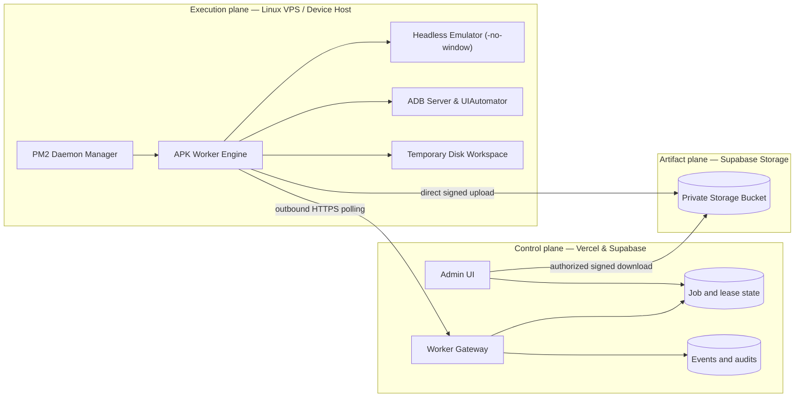

# AppRelay (`app-relay`) — Automated APK Acquisition & Play Store Scraper

[](https://www.typescriptlang.org/)
[](https://developer.android.com/studio)

**AppRelay** là hệ thống tự động hóa cào dữ liệu Google Play (Listing, Metadata, Icon, Screenshots) và kéo bộ file APK (`base.apk` + `split_config.*.apk`) từ Android Emulator / Thiết bị thật về máy local hoặc lưu trữ đám mây Supabase Private Storage.

---

## 🌟 Tính Năng Nổi Bật

- **Play Store Listing Scraper:** Tự động trích xuất Title, Developer, Rating, Description (Markdown), Icon và toàn bộ ảnh chụp màn hình (Screenshots) từ Google Play HTML.
- **Headless Emulator Lifecycle:** Tự động khởi chạy Android Emulator (`chpay` AVD) ngầm dưới dạng Headless (`-no-window -no-audio -no-boot-anim -gpu off`) khi thiết bị chưa sẵn sàng.
- **Play Store UI Automation:** Tự động gửi intent `market://details?id=...`, dump XML giao diện qua `uiautomator`, tự nhấp nút **Install / Cài đặt** và poll trạng thái cài đặt thành công.
- **Tách Split APKs & Metadata:** Kéo `base.apk`, tất cả các `split_config.*.apk`, tạo file kiểm tra tính toàn vẹn SHA-256 (`PULL_MANIFEST.txt`), `package-info.txt` và `device-dir.listing`.
- **Worker Service 24/7 (Daemon):** Daemon chạy ngầm (`workers/app-relay-worker`) nhận job từ Dashboard queue qua API Gateway, tự động đóng gói ZIP artifact và upload lên Supabase Private Storage.
- **Công cụ CLI độc lập:** Cung cấp script chạy nhanh qua CLI mà không cần phụ thuộc vào web server.

---

## 🏗️ Kiến Trúc Hệ Thống (System Architecture)

### 1. Sơ Đồ Kiến Trúc Tổng Thể 7 Lớp (Complete 7-Layer Integration Architecture)

```mermaid
flowchart TB
    subgraph ClientLayer["Layer 1 — Client & Admin UI (Browser)"]
        Admin(("Admin operator"))
        ApkPage["Release Ops APK Pull page (/dash/release-ops/apk-pull)"]
        JobPage["Job timeline & artifact download page (/dash/release-ops/apk-pull/[jobId])"]
        Admin -->|"submits Play Store URL"| ApkPage
        Admin -->|"monitors progress & downloads ZIP"| JobPage
    end

    subgraph VercelLayer["Layer 2 — Vercel Control Plane (Next.js 16)"]
        Middleware["Next.js middleware (Session & Route Guard)"]
        Actions["Server Actions (release-ops.actions.ts: verifyCSRF & requireAdmin)"]
        Service["Release Ops service (release-ops.service.ts)"]
        Repos["Release Ops repositories (Job, Worker, Event, Artifact repos)"]
        Gateway["Worker Gateway API (/api/release-ops/worker/v1)"]
        TokenGuard["Token & Scope Guard (SHA-256 Token Verification)"]
        Cron["Artifact cleanup & retention cron (/api/release-ops/cleanup)"]

        Middleware --> Actions
        Actions --> Service
        Service --> Repos
        Gateway --> TokenGuard
    end

    subgraph SupabaseLayer["Layer 3 — Supabase Data Plane (PostgreSQL & Storage)"]
        Auth["Supabase Auth (Identity Provider)"]
        DB[("Supabase PostgreSQL DB (jobs, workers, events, artifacts, audits)")]
        RPCs["Supabase RPCs (claim_release_ops_job, heartbeat, event_append)"]
        Realtime["Supabase Realtime (Publication broadcast)"]
        Storage[("Private Storage Bucket (release-ops/artifacts/*.zip)")]

        DB --> RPCs
        DB -.->|"publication events"| Realtime
    end

    subgraph WorkerLayer["Layer 4 — Detached APK Worker (Linux VPS Daemon / PM2)"]
        PM2["PM2 Daemon Manager (ecosystem.config.js)"]
        Engine["WorkerEngine Runtime (worker-engine.ts)"]
        SlotMgr["DeviceSlotManager (slot-manager.ts)"]
        GatewayClient["GatewayClient (gateway-client.ts)"]
        Pipeline["APK Acquisition Pipeline (apk-acquisition-pipeline.ts)"]
        Uploader["Direct Artifact Uploader (uploader.ts)"]
        TempDisk["Temporary Workspace (workspace/job_<id>/)"]

        PM2 --> Engine
        Engine --> SlotMgr
        Engine --> GatewayClient
        Engine --> Pipeline
        Pipeline --> TempDisk
        Pipeline --> Uploader
    end

    subgraph CliLayer["Layer 5 — Standalone Manual CLI & Testing Suite"]
        PullCli["Manual Pull CLI (scripts/pull-from-play.ts)"]
        HeadlessTest["Headless Test Script (scripts/test-headless-pull.ts)"]
        OneOffScraper["One-Off Listing Engine (tests/helpers/play-scrape-oneoff.ts)"]
        EnvDiag["Android Env Diagnostics (tests/check-android-env.ts)"]
        MasterTest["Master Test Matrix (scripts/run-all-tests.ts)"]

        PullCli --> OneOffScraper
        HeadlessTest --> OneOffScraper
    end

    subgraph DeviceLayer["Layer 6 — Android Execution Plane (ADB & Headless AVD)"]
        HostADB["Host ADB Server (tools/android-sdk/platform-tools/adb.exe)"]
        Launcher["Emulator Launcher (emulator-launcher.ts: ensureEmulatorRunning)"]
        Emulator["Android Emulator AVD chpay (Headless: -no-window -no-audio -no-boot-anim -gpu off)"]
        ScreenUnlock["Screen Wake & Unlock (KEYCODE_WAKEUP + 82 + swipe)"]
        PlayApp["Google Play Store Application (com.android.vending)"]
        UiAutomator["UIAutomator Parser (play-ui-automator.ts: Multi-language regex)"]
        InstalledPkg["Installed Base & Split APKs (pm path, dumpsys package, device-dir.listing)"]

        Launcher -->|"spawns ngầm"| Emulator
        HostADB --> Emulator
        Emulator --> ScreenUnlock
        Emulator --> PlayApp
        PlayApp --> UiAutomator
        Emulator --> InstalledPkg
    end

    subgraph ExternalLayer["Layer 7 — External Sources"]
        PlayWeb["Google Play Web Listing (play.google.com/store/apps/details?id=...)"]
        PlayMedia["CDN Media (Icon og:image & high-res Screenshots)"]
        PlayWeb --> PlayMedia
    end

    %% Inter-layer Connections
    ApkPage -->|"HTTPS POST"| Middleware
    JobPage -->|"HTTPS GET"| Middleware
    Middleware -->|"validate session"| Auth
    Repos -->|"SQL / RPC"| DB
    Realtime -.->|"websocket live updates"| JobPage

    Engine -->|"outbound claim & heartbeat"| Gateway
    TokenGuard -->|"service-role DB queries"| DB
    Pipeline -->|"log events & status"| Gateway
    OneOffScraper -->|"desktop HTTP GET"| PlayWeb
    Pipeline -->|"listing fetch"| PlayWeb
    Pipeline -->|"ADB commands"| HostADB
    HeadlessTest -->|"ADB commands"| HostADB
    Uploader -->|"PUT signed upload"| Storage
    Gateway -->|"issue upload contract & verify object"| Storage
    Cron -->|"expire metadata & delete object"| DB
    Cron -->|"delete expired storage ZIP"| Storage

    %% Styling Classes
    classDef existing fill:#172033,stroke:#75a7ff,color:#fff
    classDef proposed fill:#1d2a1a,stroke:#4ad98a,color:#fff
    classDef external fill:#2a1d33,stroke:#e0aaff,color:#fff
    classDef data fill:#2a2a1a,stroke:#ffd166,color:#fff

    class Middleware,Actions,Service,Repos,Auth,DB existing
    class Gateway,TokenGuard,Cron,PM2,Engine,SlotMgr,GatewayClient,Pipeline,Uploader,TempDisk,PullCli,HeadlessTest,OneOffScraper,EnvDiag,MasterTest,HostADB,Launcher,Emulator,ScreenUnlock,PlayApp,UiAutomator,InstalledPkg proposed
    class PlayWeb,PlayMedia external
    class Realtime,Storage data
```



---

### 2. Phân Định Ranh Giới (Control Plane vs. Execution Plane)



---

## 📁 Cấu Trúc Dự Án

```text
app-relay/
├── dashboard/                      # Web Control Plane (Next.js Dashboard)
├── workers/app-relay-worker/       # Production Background Worker Daemon
│   ├── src/
│   │   ├── adapters/android/       # ADB Client, Emulator Launcher, Play UI Automator
│   │   ├── config/                 # Environment & Worker Config (HEADLESS support)
│   │   ├── pipeline/               # APK Acquisition Pipeline
│   │   └── runtime/                # Worker Engine & Polling Loops
│   └── ecosystem.config.js         # Cấu hình deployment PM2 cho Linux VPS
├── scripts/                        # Các công cụ CLI tự động hóa
│   ├── pull-from-play.ts           # Lệnh pull nhanh APK + Listing từ URL Play Store
│   ├── test-headless-pull.ts       # Script thử nghiệm kích hoạt Emulator Headless ngầm
│   ├── check-android-env.ts        # Chẩn đoán môi trường Android SDK & ADB
│   └── run-all-tests.ts            # Master Test Runner (12 Phase Integration Tests)
├── tests/                          # Integration & Unit Tests
│   └── helpers/play-scrape-oneoff.ts # Play Store HTML Scraper Engine
├── docs/                           # Tài liệu kiến trúc & nghiệm thu (UAT Signoff)
└── work/apks/<packageId>/          # Thư mục chứa sản phẩm APK & Metadata thu được
```

---

## 🚀 Hướng Dẫn Sử Dụng Nhanh (Quick Start)

### 1. Kiểm tra môi trường Android SDK & ADB

Chạy script chẩn đoán môi trường local:
```bash
npx tsx tests/check-android-env.ts
```

### 2. Kéo APK + Play Listing qua CLI (Chế độ thủ công)

Truyền URL Play Store bất kỳ để tự động cào thông tin và pull APK:
```bash
npx tsx scripts/pull-from-play.ts "https://play.google.com/store/apps/details?id=colorwidgets.ios.widget.topwidgets&hl=en"
```

### 3. Chạy thử nghiệm Headless Emulator Auto-Spawn ngầm

Nếu Emulator chưa bật, script này sẽ **tự động bật Emulator ngầm (-no-window)**, tự động mở khóa màn hình, cài ứng dụng và kéo APK về:
```bash
npx tsx scripts/test-headless-pull.ts "https://play.google.com/store/apps/details?id=com.facemoji.lite"
```

### 4. Chạy toàn bộ bộ kiểm thử hệ thống (Master Test Matrix)

Chạy 11 bộ test suite (Phase 1 → Phase 12):
```bash
npx tsx scripts/run-all-tests.ts
```

---

## 📊 Cấu Trúc Sản Phẩm Đầu Ra (`work/apks/<packageId>/`)

Mỗi lần chạy thành công sẽ sinh ra cấu trúc thư mục chuẩn tại `work/apks/<packageId>/`:

```text
work/apks/<packageId>/
├── base.apk                         # File APK cốt lõi (chứa Manifest & DEX code)
├── split_config.arm64_v8a.apk       # Split APK bổ trợ CPU
├── split_config.xxhdpi.apk          # Split APK bổ trợ màn hình
├── PULL_MANIFEST.txt                # Metadata, ISO timestamp & SHA-256 Checksums
├── package-info.txt                 # Chi tiết dumpsys package từ thiết bị
├── device-dir.listing               # Danh sách file /data/app/ trên thiết bị
└── playstore/
    ├── description.md               # Nội dung mô tả ứng dụng dạng Markdown
    ├── listing.json                 # Metadata chi tiết cấu trúc JSON
    ├── icon.png                     # Icon ứng dụng gốc
    ├── page.html                    # HTML thô của trang Play Store (debug)
    └── screenshots/                 # Toàn bộ ảnh chụp màn hình của ứng dụng
        ├── screenshot_01.png
        └── ...
```

---

## 🌐 Triển Khai Chạy Ngầm 24/7 trên Linux VPS (PM2 Deployment)

Để triển khai Worker chạy ngầm 24/7 trên Linux VPS mà không cần màn hình giao diện (Headless 100%):

1. **Build Worker:**
   ```bash
   cd workers/app-relay-worker
   npm run build
   ```

2. **Khởi chạy ngầm với PM2:**
   ```bash
   pm2 start ecosystem.config.js
   pm2 save
   pm2 startup
   ```

3. **Xem log hoạt động ngầm:**
   ```bash
   pm2 logs app-relay-worker
   ```

---

## 📜 Tài Liệu Tham Khảo

- 📄 [Tài liệu Kiến trúc AS-IS](file:///d:/super-tools/app-relay/docs/08-operations-and-evolution/as-is/ARCHITECTURE_APP_REPLAY_V1.md)
- 📄 [Tài liệu Đặc tả Quy trình Pull APK](file:///d:/super-tools/app-relay/pull-from-play%20%283%29.md)
- 📄 [Báo cáo Nghiệm thu UAT Signoff](file:///d:/super-tools/app-relay/docs/07-acceptance-handover/uat-signoff/UAT_PULL_PLAY_STORE_APK_SUCCESS.md)
- 📄 [Kế hoạch Nâng cấp Backend](file:///C:/Users/CONG%20HIEU/.gemini/antigravity-ide/brain/3c91ab7f-b981-47a0-a3a2-144a8d926009/implementation_plan.md)

---

*Hệ thống được phát triển và kiểm thử tự động 100% thành công.*
