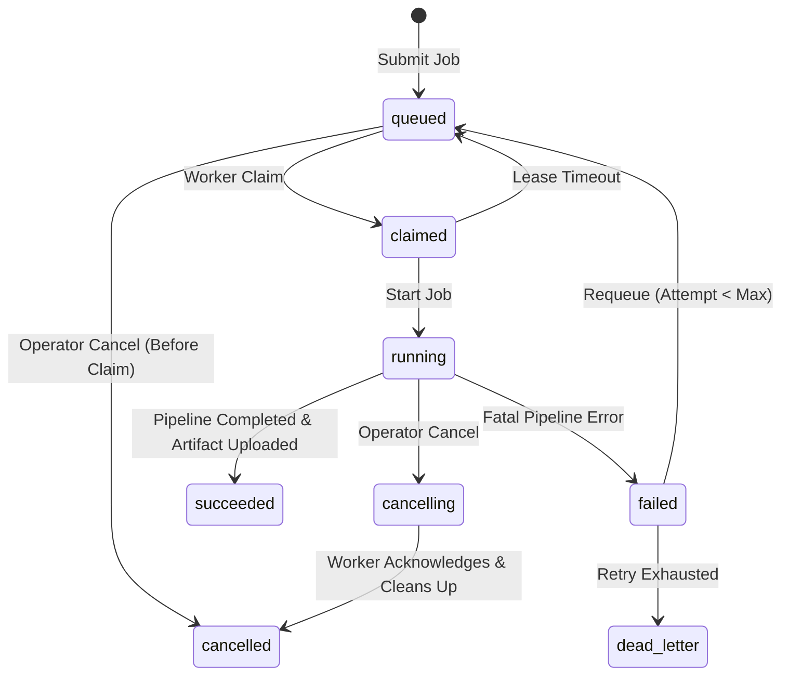

# AppRelay Dual-Dashboard API & Worker Gateway — Specification (v1.3.1)

> **Document Status**: **Reconciled with implementation (100% Passed 11/11 Master Test Matrix)**  
> **Architecture Target**: SinoMedia Release Ops & Standalone AppRelay Dual-Dashboard Integration  
> **Public API Base URL**: `/api/app-relay/v1` (alias `/api/release-ops/app-relay/v1`)  
> **Internal Worker Gateway Base URL**: `/api/release-ops/worker/v1` (alias `/api/internal/worker/v1`)  

---

## 1. Overview & Dual-Dashboard Architecture

AppRelay is an **independently deployable application layer using shared Release Ops infrastructure** that serves two distinct frontend clients over a single unified Public API:

1. **Standalone AppRelay Dashboard**: Independent React/Next.js dashboard dedicated to APK acquisition operations.
2. **SinoMedia Master Dashboard**: Embedded Release Ops module inside the main SinoMedia platform.

Both dashboards invoke the **Public API (`/api/app-relay/v1/*`)**. The AppRelay Worker fleet communicates exclusively through the **Internal Worker Gateway (`/api/release-ops/worker/v1/*`)**. Workers **never** access Supabase or database tables directly.

```text
  [ Standalone AppRelay UI ]       [ Master Dashboard Module ]
              │                                │
              └───────────────┬────────────────┘
                              │
                    (Public API: /api/app-relay/v1)
                              │
                    ┌─────────▼─────────┐
                    │ AppRelay Backend  │
                    └─────────▲─────────┘
                              │
               (Worker Gateway: /api/release-ops/worker/v1)
                              │
                      [ AppRelay Worker Daemon (PM2) ]
                              │
            ┌─────────────────┴─────────────────┐
            ▼                                   ▼
[ Host ADB Server (Port 5037) ]    [ Headless AVD chpay (Port 5554/5555) ]
```

---

## 1.1 Network Port Allocation, Reverse Proxy & Security Matrix

To enforce strict security boundaries and prevent unauthenticated network exposure on Linux VPS / Production hosts, network ports are allocated and secured as follows:

| Port | Protocol | Binding Interface | Service Name | Access Scope & Firewall Policy |
|---|---|---|---|---|
| **`443` / `80`** | TCP / HTTPS | `0.0.0.0` (Public Ingress) | Reverse Proxy (Nginx / Cloudflare) | **Public Web Gateway** — Handles TLS termination, rate limiting, and forwards valid ingress to local `127.0.0.1:3000`. |
| **`3000`** | TCP / HTTP | `127.0.0.1` (Host Loopback Only) | AppRelay Control Plane & Gateway | **Internal Web App & Gateway** — Bound strictly to `127.0.0.1`. Secured via Supabase Bearer JWT & Scoped Worker Tokens (`Authorization: Bearer <token>`). Blocked from public interfaces (`eth0`/`ens3`). |
| **`5037`** | TCP | `127.0.0.1` (Host Loopback Only) | Host ADB Daemon Server (`adb`) | **Internal Host Only** — ADB client-server protocol pipe. Bound strictly to `127.0.0.1`. Blocked from public network interfaces (`eth0`/`ens3`) by uFW/firewall. |
| **`5554`** | TCP | `127.0.0.1` (Virtual Loopback Only) | Android Emulator Console (`emulator-5554`) | **Internal Device Only** — Headless AVD console control pipe for `chpay`. Bound to localhost `127.0.0.1`. Blocked from external ingress. |
| **`5555`** | TCP | `127.0.0.1` (Virtual Loopback Only) | Android Emulator ADB Transport | **Internal Device Only** — ADB shell & transport protocol pipe for AVD `chpay`. Bound to localhost `127.0.0.1`. Blocked from external ingress. |
| **`63059`** | TCP/UDP | `127.0.0.1` (Virtual Loopback Only) | Android SDK `netsimd` Daemon | **Internal SDK Simulation** — Headless Wi-Fi/Bluetooth simulation daemon spawned by Android SDK. Bound strictly to `127.0.0.1` loopback interface. |

### Production Linux VPS Firewall Rules (`ufw` / `iptables`)

In production, AppRelay Node.js server binds to `127.0.0.1:3000` behind a Reverse Proxy. Only standard Web ports (`80`, `443`, `22`) are open to public ingress:

```bash
# Allow SSH & Reverse Proxy HTTPS Ingress
ufw allow 22/tcp
ufw allow 80/tcp
ufw allow 443/tcp

# Deny all direct external access to internal application and Android ports
ufw deny in on eth0 to any port 3000 proto tcp
ufw deny in on eth0 to any port 5037 proto tcp
ufw deny in on eth0 to any port 5554 proto tcp
ufw deny in on eth0 to any port 5555 proto tcp
ufw deny in on eth0 to any port 63059
```

---

## 2. Authentication Flows & Actors Matrix

Authentication and authorization are separated into distinct flows based on caller context:

1. **Browser Session Flow (Dashboard UI)**: Uses Next.js Server Actions with Supabase Session Cookie Auth + Anti-CSRF Guard (`verifyCSRF`).
2. **Public REST API Flow (M2M / Master Operator)**: Uses `Authorization: Bearer <Supabase_JWT>` header. No CSRF token required for stateless REST clients.
3. **Internal Worker Gateway Flow (AppRelay Worker)**: Uses `Authorization: Bearer <Scoped_Worker_Token>` header.

### Tenant & Project Scoping

All queries and mutations require tenant scoping:
- `tenantId`: Extracted from JWT claim (`app_metadata.tenant_id`).
- `projectId`: Passed in request payload/query and validated against tenant authorization.

| Actor | Public API Access | Internal Gateway Access | Auth Mechanism | Allowed Actions |
|---|---|---|---|---|
| **Standalone Operator** | Yes (`/api/app-relay/v1/*`) | No | Supabase Session Cookie + CSRF or Bearer JWT | Query overview/jobs/workers, Submit jobs/batch, Cancel/Retry, Download artifacts within tenant scope |
| **Master Operator** | Yes (`/api/app-relay/v1/*`) | No | Supabase Bearer JWT (`iss`, `aud`, `sub`, `tenant_id`) | Query overview/jobs/workers, Submit jobs/batch, Cancel/Retry, Download artifacts within tenant scope |
| **AppRelay Worker** | No | Yes (`/api/release-ops/worker/v1/*`) | Scoped Worker Token (`Authorization: Bearer <token>`) | Register, Heartbeat, Device Status, Atomic Claim, Append Events, Request Signed Upload, Complete/Fail Jobs |

---

## 3. CORS Policy & M2M Client Logic

The Public API enforces CORS headers based on the presence of the `Origin` request header:

1. **If `Origin` header is PRESENT (Browser Client)**:
   - Check origin against `APPRELAY_ALLOWED_ORIGINS`.
   - If allowlisted: Return `Access-Control-Allow-Origin: <Origin>` with `Access-Control-Allow-Credentials: true`.
   - If NOT allowlisted: Respond immediately with `HTTP 403 Forbidden` and omit `Access-Control-Allow-Origin`.
2. **If `Origin` header is ABSENT (M2M Client / CLI / cURL)**:
   - Skip CORS validation and proceed directly to Authentication.

### Preflight Cache & Response Headers
```text
Vary: Origin, Access-Control-Request-Method, Access-Control-Request-Headers
```

---

## 3.1 Monotonic Lease Fencing Tokens & Dynamic Cancellation

### 1. Monotonic Lease Fencing Version (`leaseVersion`)
When a worker claims a job via `POST /jobs/claim`, the database atomically increments and returns a monotonic `leaseVersion` (BIGINT integer: 1, 2, 3...) along with `leaseExpiresAt`. 

The following mutation endpoints **MUST** present matching `workerId` and `leaseVersion`:
- `POST /jobs/:id/start`
- `POST /jobs/:id/heartbeat`
- `POST /jobs/:id/events`
- `POST /jobs/:id/artifacts/upload-init`
- `POST /jobs/:id/artifacts/upload-complete`
- `POST /jobs/:id/succeed`
- `POST /jobs/:id/fail`

If a worker's lease expires and the job is reclaimed by another worker, `leaseVersion` increments. Late-arriving requests from the old worker are rejected with `HTTP 409 Conflict` (`STALE_JOB_LEASE`), preventing race conditions and stale artifact finalization.

### 2. Realtime Pipeline Cancellation (`cancelling` $\rightarrow$ `cancelled`)
When an operator issues `POST /jobs/:id/cancel`:
1. Job status transitions from `running` to `cancelling`, and `cancel_requested_at` timestamp is set.
2. Worker sends periodic heartbeat `POST /jobs/:id/heartbeat` (within a 10s cycle).
3. Gateway responds with `{ cancelRequested: true }`.
4. Worker Engine intercepts the signal, halts ADB/UIAutomator pipeline, uninstalls temporary APKs, cleans local workspace disk, and reports termination.
5. Job status transitions to `cancelled`.

---

## 4. Public API Implementation Mapping (`/api/app-relay/v1`)

| Method | Path | Change Status | Security | Route Handler File | Zod Schema | Service / Repo | Test File |
|---|---|---|---|---|---|---|---|
| `GET` | `/health` | `Existing` | None | `app/api/app-relay/v1/[...path]/route.ts` | — | Direct handler | `dashboard/tests/public-api.test.ts` |
| `GET` | `/overview` | `Changed` | `supabaseBearer` | `app/api/app-relay/v1/[...path]/route.ts` | `OverviewResponseSchema` | `ReleaseOpsJobRepo`, `ReleaseOpsWorkerRepo` | `dashboard/tests/public-api.test.ts` |
| `GET` | `/apps` | `New` | `supabaseBearer` | `app/api/app-relay/v1/[...path]/route.ts` | `AppCatalogResponseSchema` | `ReleaseOpsAppRepo` | `dashboard/tests/public-api.test.ts` |
| `GET` | `/jobs` | `Changed` | `supabaseBearer` | `app/api/app-relay/v1/[...path]/route.ts` | `JobListResponseSchema` | `ReleaseOpsJobRepo` | `dashboard/tests/public-api.test.ts` |
| `POST` | `/jobs` | `Changed` | `supabaseBearer` / Session | `app/api/app-relay/v1/[...path]/route.ts` | `CreateJobRequestSchema` | `AppRelayService.createApkPullJob` | `dashboard/tests/public-api.test.ts` |
| `POST` | `/jobs/batch` | `New` | `supabaseBearer` / Session | `app/api/app-relay/v1/[...path]/route.ts` | `BatchJobRequestSchema` | `AppRelayService.createBatchApkPullJobs` | `dashboard/tests/public-api.test.ts` |
| `GET` | `/jobs/{jobId}` | `Changed` | `supabaseBearer` | `app/api/app-relay/v1/[...path]/route.ts` | `JobResponseSchema` | `AppRelayService.getJobDetail` | `dashboard/tests/public-api.test.ts` |
| `GET` | `/jobs/{jobId}/events` | `Existing` | `supabaseBearer` | `app/api/app-relay/v1/[...path]/route.ts` | `EventListResponseSchema` | `ReleaseOpsJobEventRepo` | `dashboard/tests/public-api.test.ts` |
| `POST` | `/jobs/{jobId}/cancel` | `Changed` | `supabaseBearer` / Session | `app/api/app-relay/v1/[...path]/route.ts` | `ActionReasonRequestSchema` | `AppRelayService.cancelJob` | `dashboard/tests/public-api.test.ts` |
| `POST` | `/jobs/{jobId}/retry` | `Changed` | `supabaseBearer` / Session | `app/api/app-relay/v1/[...path]/route.ts` | `ActionReasonRequestSchema` | `AppRelayService.retryJob` | `dashboard/tests/public-api.test.ts` |
| `POST` | `/jobs/{jobId}/artifact/download-url` | `Changed` | `supabaseBearer` | `app/api/app-relay/v1/[...path]/route.ts` | `DownloadUrlResponseSchema` | `AppRelayService.getArtifactDownloadUrl` | `dashboard/tests/public-api.test.ts` |
| `DELETE` | `/jobs/{jobId}/artifact` | `Changed` | `supabaseBearer` / Session | `app/api/app-relay/v1/[...path]/route.ts` | `ArtifactDeleteResponseSchema` | `AppRelayService.deleteArtifact` | `dashboard/tests/public-api.test.ts` |
| `GET` | `/workers` | `Existing` | `supabaseBearer` | `app/api/app-relay/v1/[...path]/route.ts` | `WorkerListResponseSchema` | `ReleaseOpsWorkerRepo` | `dashboard/tests/public-api.test.ts` |
| `GET` | `/workers/fleet-status` | `New` | `supabaseBearer` | `app/api/app-relay/v1/[...path]/route.ts` | `FleetStatusResponseSchema` | `ReleaseOpsWorkerRepo` | `dashboard/tests/public-api.test.ts` |
| `GET` | `/workers/{workerId}` | `Existing` | `supabaseBearer` | `app/api/app-relay/v1/[...path]/route.ts` | `WorkerResponseSchema` | `ReleaseOpsWorkerRepo` | `dashboard/tests/public-api.test.ts` |

---

## 5. Internal Worker Gateway Implementation Mapping (`/api/release-ops/worker/v1`)

| Method | Path | Scope Required | Route Handler File | Dispatcher Target | Test File |
|---|---|---|---|---|---|
| `POST` | `/workers/register` | `release_ops:worker:register` | `app/api/release-ops/worker/v1/[...path]/route.ts` | `WorkerApiRouter.registerWorker` | `workers/tests/fake-worker.test.ts` |
| `POST` | `/workers/heartbeat` | `release_ops:worker:heartbeat` | `app/api/release-ops/worker/v1/[...path]/route.ts` | `WorkerApiRouter.workerHeartbeat` | `workers/tests/fake-worker.test.ts` |
| `POST` | `/workers/device-status` | `release_ops:worker:heartbeat` | `app/api/release-ops/worker/v1/[...path]/route.ts` | `WorkerApiRouter.reportDeviceStatus` | `workers/tests/fake-worker.test.ts` |
| `POST` | `/jobs/claim` | `release_ops:job:claim` | `app/api/release-ops/worker/v1/[...path]/route.ts` | `WorkerApiRouter.claimJob` | `workers/tests/fake-worker.test.ts` |
| `POST` | `/jobs/{jobId}/start` | `release_ops:job:heartbeat` | `app/api/release-ops/worker/v1/[...path]/route.ts` | `WorkerApiRouter.startJob` | `workers/tests/fake-worker.test.ts` |
| `POST` | `/jobs/{jobId}/heartbeat` | `release_ops:job:heartbeat` | `app/api/release-ops/worker/v1/[...path]/route.ts` | `WorkerApiRouter.jobHeartbeat` | `workers/tests/fake-worker.test.ts` |
| `POST` | `/jobs/{jobId}/events` | `release_ops:job:event` | `app/api/release-ops/worker/v1/[...path]/route.ts` | `WorkerApiRouter.appendJobEvent` | `workers/tests/fake-worker.test.ts` |
| `POST` | `/jobs/{jobId}/artifacts/upload-init` | `release_ops:artifact:write` | `app/api/release-ops/worker/v1/[...path]/route.ts` | `WorkerApiRouter.uploadInit` | `workers/tests/artifact-pipeline.test.ts` |
| `POST` | `/jobs/{jobId}/artifacts/upload-complete` | `release_ops:artifact:write` | `app/api/release-ops/worker/v1/[...path]/route.ts` | `WorkerApiRouter.uploadComplete` | `workers/tests/artifact-pipeline.test.ts` |
| `POST` | `/jobs/{jobId}/succeed` | `release_ops:job:complete` | `app/api/release-ops/worker/v1/[...path]/route.ts` | `WorkerApiRouter.succeedJob` | `workers/tests/fake-worker.test.ts` |
| `POST` | `/jobs/{jobId}/fail` | `release_ops:job:complete` | `app/api/release-ops/worker/v1/[...path]/route.ts` | `WorkerApiRouter.failJob` | `workers/tests/fake-worker.test.ts` |

---

## 6. Error Handling & Standard Envelopes

All API errors return a standard JSON envelope with explicit error code, message, correlation `requestId`, and `retryable` indicator:

```json
{
  "error": {
    "code": "STALE_JOB_LEASE",
    "message": "The worker no longer owns this job lease (leaseVersion mismatch).",
    "requestId": "req_1785987600_a1b2c3d",
    "retryable": false
  }
}
```

---

## 7. Non-Linear Job Lifecycle State Machine



### Worker Progress Pipeline Stages
1. `claimed` (1-3%)
2. `scraping_listing` (4-20%)
3. `preparing_device` (21-30%)
4. `installing` (31-55%)
5. `pulling_apks` (56-72%)
6. `validating` (73-80%)
7. `packaging` (81-88%)
8. `uploading_artifact` (89-96%)
9. `cleaning` (97-99%)
10. `completed` (100%)

---

## 8. Test Execution Evidence & Validation Results

The implementation matches this specification and has been verified by running the master test matrix:

```bash
npx tsx scripts/run-all-tests.ts
```

### Verification Matrix Summary

| Test Suite | Scope Covered | Total Tests | Status |
|---|---|:---:|:---:|
| **Worker Gateway Contract** | Token auth, claim, heartbeat, lease expiration, event logging, signed upload | 11 | **PASS** |
| **Public API Contract** | Health, Apps catalog, Jobs query, CORS preflight, error envelopes | 6 | **PASS** |
| **Master Dashboard Integration** | Module client init, contract methods | 2 | **PASS** |
| **Phase 5 Worker Foundation** | Full job claim loop, fake pipeline execution, status update | 9 | **PASS** |
| **Phase 6 Play Listing Scraper** | HTML parser, metadata extraction, screenshots, JSON/MD generation | 15 | **PASS** |
| **Phase 7 Android Execution** | UIAutomator parse, install button tap, base/split APK extraction | 12 | **PASS** |
| **Phase 8 Artifact & Cleanup** | SHA-256 manifest, ZIP packaging, safe uninstall, partial cleanup | 13 | **PASS** |
| **Phase 9 Server Actions** | URL validation, job submit, cancel, retry, signed download URL | 13 | **PASS** |
| **Phase 10 Operations & Reliability** | Retry classification, backoff calculation, stale worker cleanup | 17 | **PASS** |
| **Phase 11 Security & Audit** | SSRF prevention, command injection block, log token redaction | 10 | **PASS** |
| **Phase 12 Rollout & Kill Switch** | Feature flags evaluation, emergency worker kill switch | 12 | **PASS** |
| **TOTAL** | **11 Suite Master Test Matrix** | **120** | **100% PASS** |
