# APK Acquisition Backend — SinoMedia Release Ops Integration Architecture

> Document status: **Target / To-be architecture & Current Implementation**  
> Integration target: **SinoMedia `release-ops` control plane**  
> Source grounding: `ARCHITECTURE_MASTER.md` and `APPRELAY_CORRECTED_REVIEW_AND_FIX_PLAN.md`.  
> **ADR (2026-08-06): System Naming Evolution** — The feature is canonicalized as **AppRelay** (`app-relay`), with worker package `workers/app-relay-worker` and dashboard route `/dash/release-ops/app-relay`. `pull_apk` remains the stable machine-readable job type contract, requiring capability `app_artifact_acquisition`. Modular Next.js server actions (`app-relay.actions.ts`) with `requireAdmin()` and `verifyCSRF()` are standard.  

## Table of Contents

1. [Project Overview](#1-project-overview)
2. [Tech Stack](#2-tech-stack)
3. [Folder Structure](#3-folder-structure)
4. [System Architecture](#4-system-architecture)
5. [Module Breakdown](#5-module-breakdown)
6. [Request Flow](#6-request-flow)
7. [Authentication](#7-authentication)
8. [Authorization](#8-authorization)
9. [Database](#9-database)
10. [API Architecture](#10-api-architecture)
11. [Business Flows](#11-business-flows)
12. [Dependency Graph](#12-dependency-graph)
13. [External Services](#13-external-services)
14. [Configuration](#14-configuration)
15. [Logging](#15-logging)
16. [Error Handling](#16-error-handling)
17. [Security](#17-security)
18. [Performance](#18-performance)
19. [Scalability](#19-scalability)
20. [Deployment](#20-deployment)
21. [Testing](#21-testing)
22. [Coding Convention](#22-coding-convention)
23. [Design Patterns](#23-design-patterns)
24. [Strengths](#24-strengths)
25. [Technical Debt and Risks](#25-technical-debt-and-risks)
26. [Implementation Plan](#26-implementation-plan)
27. [Appendix](#27-appendix)

## 1. Project Overview

### 1.1 Goal

Add APK acquisition to SinoMedia as a **detached Release Ops execution backend**, not as a second standalone web system.

An admin submits a Google Play URL from the existing Next.js dashboard. The request becomes a `release_ops_jobs` record with `job_type = 'pull_apk'`. A dedicated APK worker running outside Vercel claims the job through the existing planned Release Ops Worker Gateway, controls an Android device through ADB, installs the app from Google Play, pulls `base.apk` plus all installed split APKs, scrapes the Play listing, packages the result, uploads it directly to private Supabase Storage, and reports progress/result metadata back to the dashboard.

### 1.2 Input and output

| Direction | Contract |
| --- | --- |
| Input | Google Play details URL, for example `https://play.google.com/store/apps/details?id=com.example.app&hl=en` |
| Derived identity | Android package ID from the URL `id` parameter |
| Durable output | One private ZIP object containing APK splits, listing metadata, icon, screenshots, package diagnostics, and manifest |
| Web-visible output | Job timeline, progress, version, split count, screenshot count, archive size/checksum, expiry, and authorized download action |

The ZIP contains a device-specific split set, not necessarily one universal APK:

```text
com.example.app/
├── base.apk
├── split_config.*.apk
├── PULL_MANIFEST.txt
├── package-info.txt
├── device-dir.listing
└── playstore/
    ├── description.md
    ├── listing.json
    ├── icon.png
    ├── page.html
    └── screenshots/
        └── screenshot_XX.png
```

### 1.3 Integration principle

APK acquisition extends the existing Release Ops architecture:

| Concern | System of record / owner |
| --- | --- |
| User session and admin access | Existing Supabase Auth and dashboard middleware |
| User-triggered mutation | Existing Server Action pattern with `verifyCSRF()` and `requireAdmin()` |
| Application registry | Existing `release_ops_apps` |
| Queue and lease | Existing planned `release_ops_jobs` plus service-role-only claim RPC |
| Progress timeline | Existing planned `release_ops_job_events` |
| Worker registry | Existing `release_ops_workers` |
| Artifact metadata | Existing planned `release_ops_artifacts` |
| Durable binary | New private Supabase Storage bucket |
| Audit history | Existing `release_ops_audits` |
| Live dashboard updates | Planned Supabase Realtime publication |
| Android execution | New detached `apk-pull-worker` capability |

The design intentionally does **not** introduce a second database, a second public API, or a separate user/authentication system.

### 1.4 Architecture style

- **Control plane:** existing Next.js 16 dashboard/API on Vercel plus Supabase.
- **Execution plane:** detached long-running worker on a device-capable host.
- **Communication:** worker-initiated outbound HTTPS polling only.
- **Persistence:** Supabase PostgreSQL for state; private Supabase Storage for archives.
- **Scheduling:** generic Release Ops jobs with leases, heartbeat, capability routing, retry, and dead-letter state.
- **Device concurrency:** one active APK job per configured ADB device.

### 1.5 In scope

- Dashboard form and job/detail views under Release Ops.
- `pull_apk` job creation, cancellation, retry, progress, expiry, download, and deletion.
- Worker registration and `pull_apk` capability advertisement.
- Atomic capability-aware job claim.
- Google Play listing scrape.
- AVD/physical device readiness and Play Store UI automation.
- Pulling `base.apk` and all paths returned by `pm path`.
- Validation, manifest, ZIP, direct private-object upload, local cleanup, and device cleanup.
- Realtime job/event updates and audit records.

### 1.6 Out of scope

- Third-party APK mirrors such as APKMirror/APKPure.
- Bypassing paid apps, approvals, licensing, regional restrictions, or Play authentication.
- Running Android emulator/ADB inside Vercel functions.
- Sending large ZIP files through Vercel Server Actions or Gateway request bodies.
- Giving a worker the Supabase service-role key.
- Running `pnpm aaa analyze` unless a separate explicit job type is added later.

## 2. Tech Stack

### 2.1 Existing and confirmed from `ARCHITECTURE_MASTER.md`

| Layer | Existing technology |
| --- | --- |
| Dashboard | Next.js 16, App Router, SSR, Server Actions |
| Hosting | Vercel target/evidence in master architecture |
| Identity | Supabase Auth |
| Database | Supabase PostgreSQL and RPC |
| Live updates | Supabase Realtime usage exists elsewhere; Release Ops wiring is planned |
| Data access | Service → Repository → Supabase SSR/service client |
| Dashboard guards | `requireAdmin()` and `verifyCSRF()` |
| Worker auth | SHA-256 token hashes in `api_tokens`, status/expiry/scope checks |
| Worker pattern | Outbound polling through a purpose-built Worker Gateway |
| Existing worker deployment | Docker Compose pattern exists for crawler runtime |

### 2.2 Proposed APK worker stack

| Concern | Proposed choice | Reason |
| --- | --- | --- |
| Runtime | TypeScript on Node.js LTS | Matches dashboard language and fits process/HTTP orchestration |
| Packaging | Separate workspace package/service: `workers/apk-pull-worker` | Clear execution boundary without a new web app |
| HTTP | Undici/native fetch | Poll gateway, fetch listing, upload object |
| Validation | Zod | Shared DTO and environment validation |
| Process control | `node:child_process.spawn` with argument arrays | Avoid shell interpolation around ADB/package values |
| Listing parser | Isolated adapter using a maintained HTML parser | Google Play markup is volatile |
| UI parsing | UIAutomator XML parser | Exact Install/Accept/Continue state detection |
| Archive/hash | Streaming ZIP and SHA-256 | Avoid loading APKs into memory |
| Logging | Structured JSON, compatible with existing operations stack | Job/worker/stage correlation |
| Device tools | ADB, Android SDK Emulator or physical Android device | Required by pull pipeline |
| Worker deployment | Dockerized Node worker with host-managed ADB/AVD, or native service fallback | Vercel cannot run device automation |

### 2.3 Explicitly not introduced

Redis, BullMQ, RabbitMQ, Kafka, a worker-local SQLite queue, a second Postgres instance, and a second authentication provider are not required. Supabase remains the job source of truth.

## 3. Folder Structure

### 3.1 Existing relevant SinoMedia locations

```text
dashboard/
├── app/(main)/dash/release-ops/             # Existing Release Ops pages
├── app/api/worker/rest/v1/[...path]/        # Existing crawler gateway reference
├── components/dashboard/release-ops/        # Existing tabs/header/sub-nav
├── lib/actions/release-ops.actions.ts       # Existing guarded Server Actions
├── lib/services/release-ops.service.ts      # Existing Release Ops service
├── lib/repositories/release-ops-*.repo.ts   # Existing repositories
├── lib/guards/token.guard.ts                # Existing token verification
└── types/release-ops.ts                     # Existing domain types

supabase/
└── migrations/                              # Release Ops migrations currently missing

crawler-pipeline/
└── docker-compose.yml                       # Existing detached-worker deployment reference
```

### 3.2 Proposed integration additions

```text
dashboard/
├── app/(main)/dash/release-ops/apk-pull/
│   ├── page.tsx                             # Submit form + recent APK jobs
│   └── [jobId]/page.tsx                     # Job timeline + artifact details
├── app/api/release-ops/worker/v1/[...path]/
│   └── route.ts                             # Shared Release Ops Worker Gateway
├── components/dashboard/release-ops/apk-pull/
│   ├── ApkPullForm.tsx
│   ├── ApkPullJobTable.tsx
│   ├── ApkPullTimeline.tsx
│   └── ApkArtifactCard.tsx
├── lib/actions/
│   └── release-ops.actions.ts               # Add APK pull actions
├── lib/services/
│   └── release-ops.service.ts               # Add APK job orchestration
├── lib/repositories/
│   ├── release-ops-artifact.repo.ts         # Missing repo to implement
│   └── release-ops-job-event.repo.ts        # Missing repo to implement
├── lib/release-ops-worker-api/
│   ├── router.ts                            # Purpose-built path dispatch
│   ├── schemas.ts                           # Worker request validation
│   ├── scopes.ts                            # Release Ops scope map
│   └── handlers/                            # Register, claim, event, complete, artifact
└── types/release-ops.ts                     # Add APK payload/result types

workers/
└── apk-pull-worker/
    ├── src/
    │   ├── api/                             # Gateway client and DTOs
    │   ├── adapters/
    │   │   ├── adb/                         # Safe ADB execution and pull
    │   │   ├── emulator/                    # AVD boot/readiness
    │   │   ├── play-listing/                # HTML/listing/media acquisition
    │   │   ├── play-ui/                     # UIAutomator install workflow
    │   │   ├── storage/                     # Signed-upload client
    │   │   └── archive/                     # Manifest, ZIP, checksum
    │   ├── domain/                          # Job stages, errors, device profile
    │   ├── pipeline/                        # Pull APK orchestration and cleanup
    │   ├── runtime/                         # Polling, lease heartbeat, cancellation
    │   └── main.ts
    ├── tests/
    │   ├── fixtures/                        # Play HTML and UI XML fixtures
    │   ├── unit/
    │   ├── integration/
    │   └── e2e/
    ├── Dockerfile
    ├── docker-compose.yml
    └── .env.example

supabase/migrations/
├── <timestamp>_release_ops_schema.sql
├── <timestamp>_release_ops_worker_rpcs.sql
├── <timestamp>_release_ops_storage.sql
└── <timestamp>_release_ops_realtime.sql
```

The worker is a separate deployable backend, but its contract and shared DTOs belong to the same architecture and job model as the dashboard.

## 4. System Architecture

### 4.1 Complete integration architecture

This is the authoritative target diagram for APK acquisition inside SinoMedia.

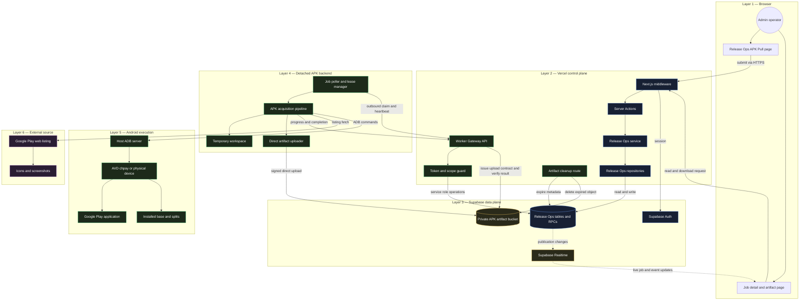

### 4.2 Control plane versus execution plane

The long-running Android operation never runs in Vercel. Vercel controls state and authorization; the worker owns side effects.

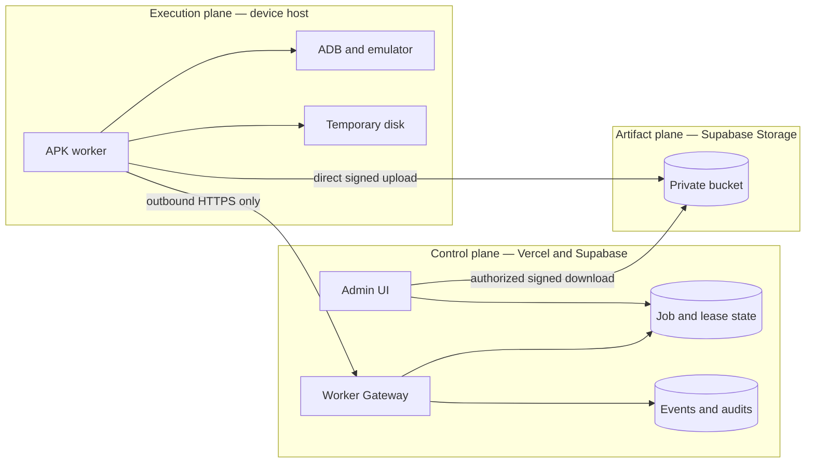

Key boundary rules:

1. The worker has no inbound public port.
2. The worker receives no Supabase service-role key.
3. Vercel does not receive APK/ZIP bytes during upload or download.
4. Supabase Database is the only job-state source of truth.
5. Worker-local disk is temporary and never the durable artifact store.

### 4.3 Dashboard-to-worker end-to-end flow

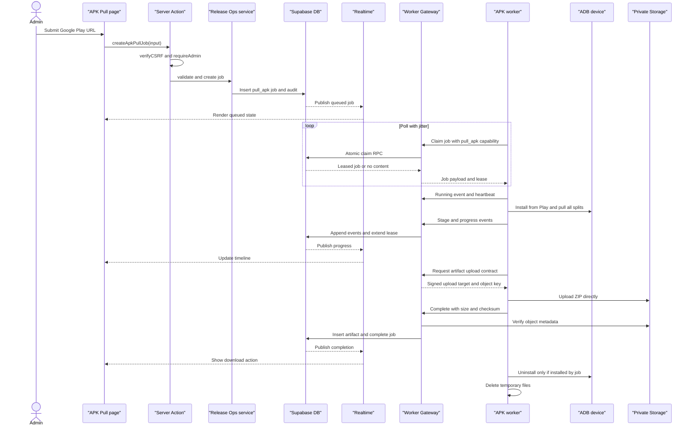

### 4.4 Worker internal architecture

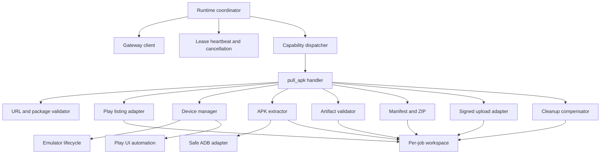

### 4.5 Artifact upload and download architecture

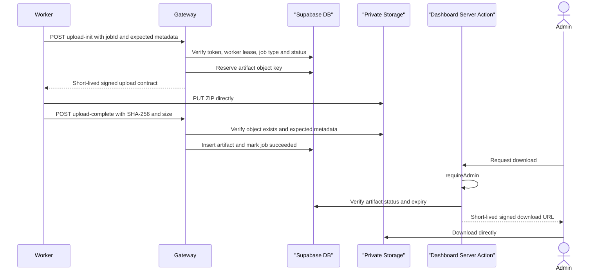

### 4.6 Generic Release Ops job lifecycle with APK stages

The generic `status` remains compatible with the master Release Ops model. APK-specific progress belongs in append-only events.

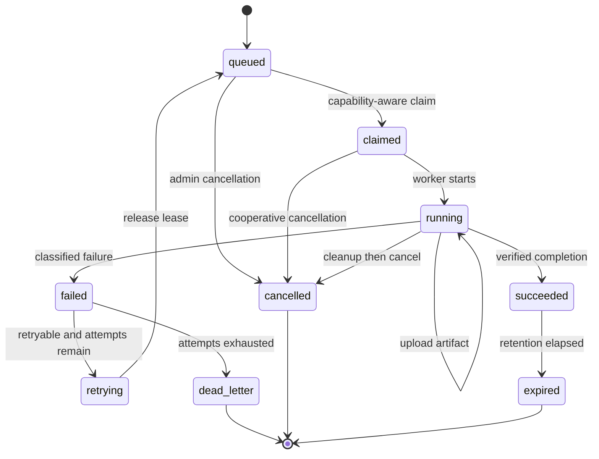

## 5. Module Breakdown

### 5.1 APK Pull dashboard module

Proposed route: `/dash/release-ops/apk-pull`.

Responsibilities:

- Accept one or multiple Google Play URLs.
- Show the derived package ID before submission.
- Create one `pull_apk` job per URL or one batch parent plus child jobs when the existing batch model is used.
- Show queue position, stage, progress, retry state, worker, version, split count, screenshots, size, expiry, and error classification.
- Offer cancel, retry, download, and delete based on job state and admin authorization.
- Subscribe to `release_ops_jobs` and `release_ops_job_events` through Realtime.

### 5.2 Server Action module

Add guarded actions to the existing `release-ops.actions.ts`:

| Action | Guards | Purpose |
| --- | --- | --- |
| `createApkPullJob(input)` | `verifyCSRF()` + `requireAdmin()` | Validate URL and create job/audit |
| `getApkPullJobs(params)` | `requireAdmin()` | Paginated recent APK jobs |
| `getApkPullJob(jobId)` | `requireAdmin()` | Job, events, worker, artifact |
| `cancelApkPullJob(jobId)` | `verifyCSRF()` + `requireAdmin()` | Request cancellation |
| `retryApkPullJob(jobId)` | `verifyCSRF()` + `requireAdmin()` | Requeue eligible dead-letter/failed job |
| `getApkArtifactDownload(jobId)` | `requireAdmin()` | Generate short-lived signed URL |
| `deleteApkArtifact(jobId)` | `verifyCSRF()` + `requireAdmin()` | Delete object, metadata, and audit |

### 5.3 Release Ops service additions

- Canonicalize Google Play URL and extract package ID.
- Resolve optional `release_ops_apps.id` by `package_name` without requiring registration.
- Enforce idempotency and active-job deduplication policy.
- Create job plus audit in one RPC/transactional operation.
- Map generic database records into APK-specific UI DTOs.
- Generate storage object download handoff only after authorization and expiry checks.
- Keep Supabase service-role usage server-only.

### 5.4 Repository additions

Implement the two repositories listed as missing in the master document:

- `ReleaseOpsJobEventRepository` for append-only timelines.
- `ReleaseOpsArtifactRepository` for object metadata, expiry, and deletion state.

Existing job, worker, app, and audit repositories remain the source of related data.

### 5.5 Worker Gateway module

One shared Release Ops gateway serves upload/promote/report and APK workers. It must:

- validate worker tokens and exact scopes;
- validate request DTOs;
- call purpose-built Supabase RPCs;
- claim only jobs compatible with the worker's advertised capabilities;
- verify worker ID, job lease, lease freshness, status, and attempt before any mutation;
- accept bounded structured events, not arbitrary logs or table access;
- issue artifact object keys and signed upload contracts;
- verify the uploaded object before completing the job;
- return cancellation state in heartbeat responses.

### 5.6 Worker runtime module

- Registers stable worker identity.
- Advertises capability `pull_apk` and device slots.
- Polls the gateway with jitter.
- Runs at most one job per device.
- Heartbeats the worker and current job independently.
- Dispatches only recognized job types.
- Reports structured stages and progress.
- Performs cleanup after success, failure, cancellation, timeout, or process recovery.

### 5.7 Listing acquisition module

- Fetch canonical Google Play listing with bounded redirects, response size, and timeout.
- Save raw HTML for troubleshooting.
- Extract full description, title, developer, rating, installs, icon, and all listing screenshots.
- Validate downloaded content type/size.
- Keep `AF_initDataCallback`/`ds:5` parsing isolated behind fixtures because markup can change.

### 5.8 Device and Play UI module

- Select one explicit ADB serial.
- Boot/reuse AVD `chpay` when configured.
- Wait for `sys.boot_completed=1`, wake/unlock, and maintain screen timeout.
- Record whether the requested package existed before the job.
- Open the exact `market://details?id=<packageId>` target.
- Read UIAutomator XML and click only exact expected actions.
- Poll `pm path` with a bounded overall timeout.
- Report region, app-not-found, login-required, payment-required, approval-required, and UI-drift states separately.

### 5.9 APK extraction and validation module

- Pull every path returned by `pm path <packageId>`.
- Preserve `base.apk` and split filenames safely.
- Write `dumpsys package`, device-directory listing, device profile, and timestamps.
- Confirm `base.apk` is a ZIP containing `AndroidManifest.xml`.
- Calculate SHA-256 for every APK and final archive.
- Never publish a partial or invalid archive.

### 5.10 Cleanup module

- Uninstall only when the package was absent before the job and installed by the job.
- Preserve pre-existing apps.
- Delete local workspace and partial archive after upload or terminal failure.
- Reconcile stale local job directories on startup.
- Leave AVD running for reuse unless configuration requires shutdown.
- Let the control plane expire/delete durable Storage objects independently.

## 6. Request Flow

### 6.1 Web request flow

1. Admin opens the Release Ops APK Pull page.
2. Existing middleware refreshes/validates the Supabase session.
3. Client submits form to `createApkPullJob()`.
4. Server Action runs `verifyCSRF()` and `requireAdmin()`.
5. Service validates exact Play host/path, package ID, locale, queue limits, and idempotency.
6. Service creates `release_ops_jobs` and `release_ops_audits` records.
7. Server Action returns the job ID immediately; no Android work occurs inside the request.
8. Realtime publishes job/event changes to the page.

### 6.2 Worker claim flow

1. Worker calls gateway with token, stable worker ID, capabilities, and available device slots.
2. Token guard hashes token and validates active status, expiry, and required scope.
3. Gateway calls an atomic claim RPC.
4. RPC selects one eligible queued job using priority/FIFO order and `SKIP LOCKED` semantics.
5. RPC sets `worker_id`, `claimed`, `lease_until`, `heartbeat_at`, and increments attempt when defined by policy.
6. Gateway returns a typed `pull_apk` payload.

### 6.3 Execution flow

1. Worker changes job to running and starts lease heartbeat.
2. Worker scrapes listing.
3. Worker acquires its local device lock and prepares ADB/AVD.
4. Worker records pre-install package state.
5. Worker installs from Play only when needed.
6. Worker pulls all base/split paths.
7. Worker validates and packages.
8. Worker obtains signed upload contract and uploads directly to Storage.
9. Worker completes through gateway; gateway verifies lease and object.
10. Worker cleans local/device state.

### 6.4 Download flow

1. Admin requests download through a Server Action.
2. Server Action checks session/admin, job ownership policy, artifact deletion state, and expiry.
3. Server creates a short-lived signed download URL for the exact private object.
4. Browser downloads directly from Supabase Storage.

## 7. Authentication

### 7.1 Dashboard users

Reuse the existing architecture:

- Supabase Auth is the identity provider.
- Existing Next.js middleware protects dashboard routes.
- All APK read actions require `requireAdmin()` under the current Release Ops policy.
- All APK mutation actions additionally require `verifyCSRF()`.

### 7.2 Workers

Reuse SHA-256 token verification from `token.guard.ts` where compatible:

- token supplied through `Authorization: Bearer` or the gateway's established header;
- raw token hashed with SHA-256;
- `api_tokens.token_hash` lookup;
- require `status = active`;
- reject expired/revoked credentials;
- require exact Release Ops scopes;
- bind or validate stable worker identity where supported;
- never place the worker token in query strings or events.

### 7.3 Google Play account

The Play account remains signed into the dedicated Android device/AVD. Google credentials are not submitted through the dashboard, stored in `release_ops_jobs`, or exposed to the worker gateway.

## 8. Authorization

### 8.1 User permissions

Current supplied code uses admin-only Release Ops Server Actions. APK acquisition follows that rule for the first implementation.

| Actor | Create | View | Download | Cancel/retry | Delete | Worker operations |
| --- | ---: | ---: | ---: | ---: | ---: | ---: |
| Guest | No | No | No | No | No | No |
| Authenticated non-admin | No | No | No | No | No | No |
| Admin | Yes | Yes | Yes | Yes | Yes | No |
| APK worker | No UI | Assigned job only | Upload only | Report only | No | Scoped endpoints only |

### 8.2 Worker scopes

Reuse existing proposed scopes and add only the missing write scope:

| Scope | Use |
| --- | --- |
| `release_ops:worker:register` | Register worker/capabilities |
| `release_ops:worker:heartbeat` | Worker health |
| `release_ops:job:claim` | Claim compatible job |
| `release_ops:job:heartbeat` | Extend assigned lease/read cancellation |
| `release_ops:job:event` | Append bounded progress event |
| `release_ops:job:complete` | Report success/failure |
| `release_ops:artifact:write` | Initialize and complete direct upload |

The APK worker does not require `release_ops:artifact:read` unless it must consume an existing artifact for another explicitly supported job type.

## 9. Database

### 9.1 Reuse existing Release Ops tables

No APK-specific queue database is introduced.

| Existing table | APK use |
| --- | --- |
| `release_ops_apps` | Optional registry link by `package_name` |
| `release_ops_jobs` | `pull_apk` job payload, lease, status, result, retry |
| `release_ops_job_events` | Append-only stage/progress/errors |
| `release_ops_workers` | Worker health, capabilities, device metadata |
| `release_ops_artifacts` | ZIP object metadata and retention |
| `release_ops_audits` | Create/cancel/retry/download/delete audit |
| `release_ops_batch_operations` | Optional multi-URL parent operation |

### 9.2 Job payload and result contracts

Proposed `release_ops_jobs.payload` for `pull_apk`:

```json
{
  "schemaVersion": 1,
  "playUrl": "https://play.google.com/store/apps/details?id=com.example.app&hl=en",
  "packageId": "com.example.app",
  "locale": "en",
  "includeListing": true,
  "includeScreenshots": true,
  "sourcePolicy": "google_play_only",
  "requestedDeviceProfile": null
}
```

Proposed `release_ops_jobs.result`:

```json
{
  "schemaVersion": 1,
  "versionName": "1.2.3",
  "versionCode": 123,
  "baseSizeBytes": 12345678,
  "splitCount": 4,
  "screenshotCount": 8,
  "archiveArtifactId": "uuid",
  "archiveSha256": "hex",
  "archiveSizeBytes": 23456789,
  "deviceProfile": {
    "sdk": 35,
    "abi": "arm64-v8a",
    "density": 420,
    "locale": "en-US"
  },
  "warnings": []
}
```

### 9.3 Required schema/migration additions

The master document states Release Ops migrations are not present locally. Version-control the complete existing schema first, then add/confirm:

| Object | Required change |
| --- | --- |
| `release_ops_jobs.job_type` | Allow `pull_apk` |
| `release_ops_workers.metadata` | Document `capabilities`, `devices`, `workerVersion`, and health shape |
| `release_ops_artifacts` | Add/confirm `artifact_type`, `content_type`, `size_bytes`, `expires_at`, `deleted_at`, object uniqueness |
| `release_ops_job_events` | Ensure append-only permissions and `(job_id, created_at)` index |
| RPC | `claim_release_ops_job(worker_id, capabilities, lease_seconds)` |
| RPC | Lease-checked heartbeat, event append, failure, and success operations |
| Storage | Private bucket and object-path policy |
| Realtime | Publish jobs/events needed by dashboard |

### 9.4 ER diagram

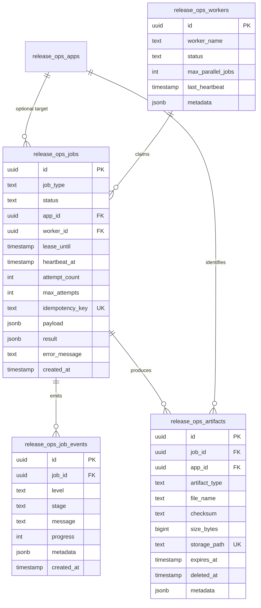

### 9.5 Storage object layout

Private bucket proposal: `release-ops-artifacts`.

```text
apk-pull/<yyyy>/<mm>/<jobId>/<packageId>-<versionCode>.zip
```

The object key is generated by the server, never accepted verbatim from the worker. Database metadata must be inserted only after upload verification.

## 10. API Architecture

### 10.1 Dashboard interface

The browser uses Server Actions and Realtime, consistent with the existing dashboard. It does not call the worker gateway directly.

### 10.2 Worker Gateway base path

```text
/api/release-ops/worker/v1/*
```

### 10.3 Required endpoints

| Method | Path | Scope | Purpose |
| --- | --- | --- | --- |
| `POST` | `/workers/register` | `release_ops:worker:register` | Register identity and capabilities |
| `POST` | `/workers/heartbeat` | `release_ops:worker:heartbeat` | Worker/device health |
| `POST` | `/jobs/claim` | `release_ops:job:claim` | Atomic compatible-job claim |
| `POST` | `/jobs/:id/start` | `release_ops:job:heartbeat` | Move claimed job to running |
| `POST` | `/jobs/:id/heartbeat` | `release_ops:job:heartbeat` | Extend lease and receive cancel flag |
| `POST` | `/jobs/:id/events` | `release_ops:job:event` | Append structured progress |
| `POST` | `/jobs/:id/artifacts/upload-init` | `release_ops:artifact:write` | Reserve object and signed upload |
| `POST` | `/jobs/:id/artifacts/upload-complete` | `release_ops:artifact:write` | Verify uploaded object |
| `POST` | `/jobs/:id/succeed` | `release_ops:job:complete` | Complete with result/artifact reference |
| `POST` | `/jobs/:id/fail` | `release_ops:job:complete` | Retry/dead-letter classified failure |

### 10.4 Claim request

```json
{
  "workerId": "uuid",
  "workerVersion": "1.0.0",
  "capabilities": ["pull_apk"],
  "availableSlots": 1,
  "deviceProfiles": [
    {
      "deviceId": "emulator-5554",
      "sdk": 35,
      "abi": "arm64-v8a",
      "density": 420,
      "locale": "en-US",
      "playReady": true
    }
  ]
}
```

### 10.5 Gateway response envelope

```json
{
  "data": {
    "job": null,
    "pollAfterMs": 5000,
    "serverTime": "2026-08-05T10:00:00.000Z"
  }
}
```

When a job is claimed, `job` contains typed ID, type, payload, attempt, lease expiry, and cancellation token/version. It contains no service-role credential or arbitrary database access information.

### 10.6 Error response

```json
{
  "error": {
    "code": "STALE_JOB_LEASE",
    "message": "The worker no longer owns this job lease.",
    "requestId": "uuid",
    "retryable": false
  }
}
```

### 10.7 Gateway constraints

- Validate body size and schema on every endpoint.
- Do not provide arbitrary table names, filters, SQL, object keys, or ADB inputs.
- Mutation endpoints require current worker ownership and unexpired lease.
- Events are capped in message and metadata size.
- Completion is idempotent for the same job/attempt/artifact checksum.
- Signed upload/download URLs are short-lived and redacted from logs/events.

## 11. Business Flows

### 11.1 Create APK pull job

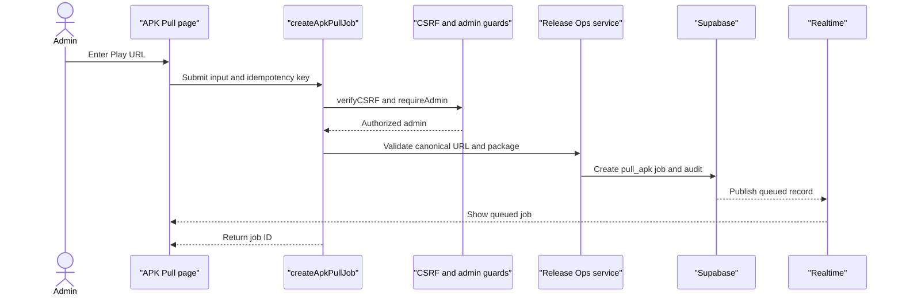

### 11.2 APK acquisition pipeline

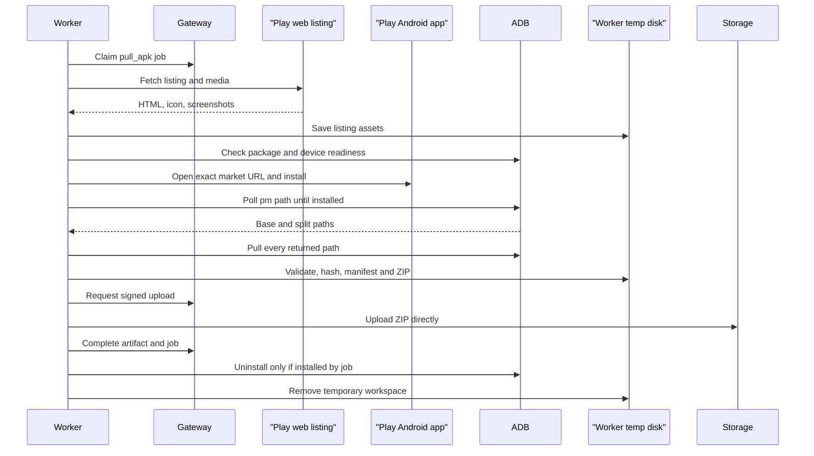

### 11.3 Failure and retry

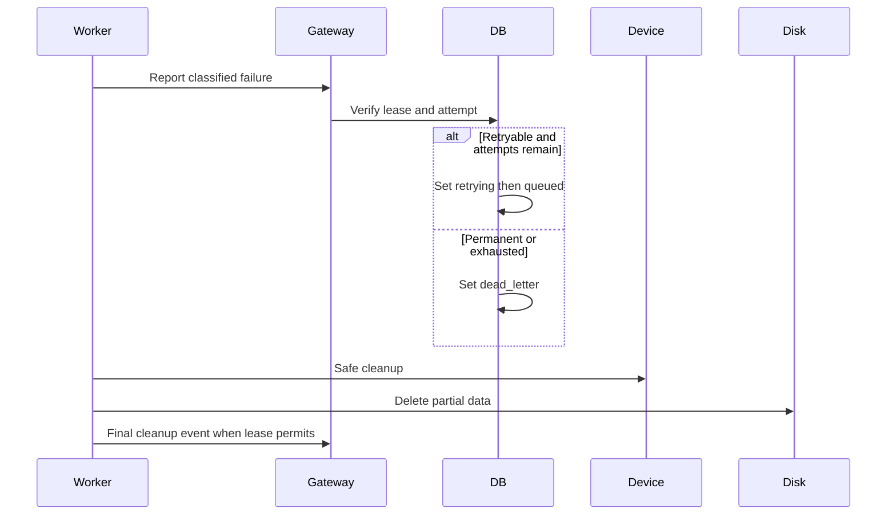

### 11.4 Cancel flow

- Queued job: dashboard sets `cancelled`; it can no longer be claimed.
- Claimed/running job: dashboard sets a cancellation request; the heartbeat response tells the assigned worker to stop at the next safe checkpoint.
- Worker performs device and disk cleanup, then acknowledges cancellation.
- A completed artifact is not removed by cancellation; deletion is a separate audited action.

### 11.5 Expiry and deletion

- Each artifact receives `expires_at` according to retention policy.
- Vercel Cron invokes a protected cleanup route in bounded batches.
- Cleanup deletes the private Storage object first, then marks metadata deleted/expired and writes an audit/system event.
- Explicit admin deletion follows the same idempotent service path.
- Local worker cleanup is separate and happens immediately after each attempt.

## 12. Dependency Graph

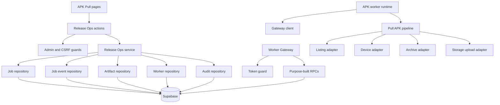

Dependency rules:

- Dashboard pages do not import repositories directly.
- Server Actions do not run ADB or upload archive bytes.
- Worker does not import dashboard repositories or Supabase service clients.
- Worker talks only to the Gateway and signed Storage endpoints.
- Device/listing/storage details remain behind worker adapters.

## 13. External Services

| Dependency | Direction | Use | Failure behavior |
| --- | --- | --- | --- |
| Vercel | Browser/worker → control plane | Host Next.js UI, Server Actions, Worker Gateway, Cron route | No new claims; running worker continues only while lease/heartbeats succeed |
| Supabase Auth | Dashboard server → Supabase | User session/admin protection | UI mutation denied |
| Supabase Database/RPC | Vercel server → Supabase | Jobs, leases, events, artifacts, audits | Queue/control-plane operation fails safely |
| Supabase Realtime | Supabase → browser | Live job and event changes | UI falls back to refresh/polling |
| Supabase Storage | Worker/browser → Supabase | Private durable ZIP upload/download | Job remains incomplete or download unavailable |
| Google Play web | Worker → Google | Listing and media | Classified listing failure/warning |
| Google Play Android app | Device → Google | Official installation | Region/login/payment/not-found/UI-drift error |
| ADB/Android Emulator | Worker → local device | Device control and APK extraction | Device unavailable or timeout |

Third-party mirrors are not integrated. If ever introduced, they require a separate source strategy, explicit opt-in, version/signature verification, malware scanning, and policy/legal review.

## 14. Configuration

### 14.1 Vercel/dashboard variables

| Variable | Purpose |
| --- | --- |
| `NEXT_PUBLIC_SUPABASE_URL` | Existing Supabase URL |
| `NEXT_PUBLIC_SUPABASE_ANON_KEY` | Existing browser/SSR public key |
| `SUPABASE_SERVICE_ROLE_KEY` | Server-only gateway/repository operations |
| `RELEASE_OPS_ARTIFACT_BUCKET` | Private bucket name |
| `RELEASE_OPS_APK_RETENTION_HOURS` | Artifact expiry policy |
| `RELEASE_OPS_WORKER_LEASE_SECONDS` | Claim lease duration |
| `RELEASE_OPS_MAX_EVENT_BYTES` | Event metadata limit |
| `CRON_SECRET` | Protect cleanup route |

### 14.2 Worker variables

| Variable | Purpose |
| --- | --- |
| `RELEASE_OPS_API_URL` | Vercel Release Ops Worker Gateway base URL |
| `RELEASE_OPS_TOKEN` | Scoped worker token |
| `RELEASE_OPS_WORKER_ID` | Stable registered worker UUID |
| `WORKER_NAME` | Operator-visible name |
| `WORKER_CAPABILITIES` | Must include `pull_apk` |
| `WORKER_VERSION` | Runtime build version |
| `ADB_PATH` | ADB executable path |
| `ADB_DEVICE_SERIAL` | Explicit device serial |
| `ADB_SERVER_SOCKET` | Optional host ADB socket for container deployment |
| `EMULATOR_PATH` | Emulator executable path when worker manages AVD |
| `AVD_NAME` | Default `chpay` from supplied runbook |
| `APK_WORK_DIR` | Local temporary root |
| `INSTALL_TIMEOUT_MS` | Overall Play installation timeout |
| `ADB_COMMAND_TIMEOUT_MS` | Per-command timeout |
| `LISTING_TIMEOUT_MS` | Listing HTTP timeout |
| `MAX_JOB_BYTES` | Local artifact safety limit |
| `MIN_FREE_DISK_GB` | Worker readiness threshold |
| `POLL_INTERVAL_MS` | Base empty-queue delay |
| `LOG_LEVEL` | Structured log level |

Validate all configuration at startup. Do not hardcode `$HOME`, local usernames, Vercel URLs, Supabase credentials, device serials, or Storage object paths.

## 15. Logging

### 15.1 Dashboard/Gateway logs

Include:

- request ID;
- authenticated token ID, not raw token;
- worker ID, job ID, attempt, endpoint, status, and duration;
- RPC result classification;
- artifact object ID/path only when not sensitive under deployment policy.

### 15.2 Worker logs

Include:

- worker ID/version;
- job ID/package ID/device serial;
- pipeline stage and duration;
- bounded child-process exit information;
- split count, screenshot count, byte counts, and checksum summary;
- cleanup result.

### 15.3 Job events

Events are user-visible and smaller than logs:

```json
{
  "level": "info",
  "stage": "pulling_apks",
  "message": "Pulled 4 of 5 APK files",
  "progress": 68,
  "metadata": {
    "completed": 4,
    "total": 5
  }
}
```

Never include worker tokens, service-role keys, Google credentials/cookies, signed URLs, full UI dumps, or unbounded command output in logs/events.

## 16. Error Handling

### 16.1 Stable APK error codes

| Code | Retry | Meaning |
| --- | ---: | --- |
| `INVALID_PLAY_URL` | No | Invalid host/path/package input |
| `APP_NOT_FOUND` | No | Listing/app unavailable |
| `UNSUPPORTED_REGION` | No | Device account/region cannot install |
| `PLAY_LOGIN_REQUIRED` | No automatic retry | Operator must repair device session |
| `PAYMENT_OR_APPROVAL_REQUIRED` | No | Workflow will not bypass requirement |
| `LISTING_PARSE_FAILED` | Manual/bounded | Google markup changed |
| `DEVICE_UNAVAILABLE` | Yes | ADB/device offline |
| `EMULATOR_BOOT_TIMEOUT` | Yes, bounded | AVD failed readiness |
| `PLAY_UI_CHANGED` | Manual/bounded | Expected exact action not found |
| `INSTALL_TIMEOUT` | Yes, bounded | Install never completed |
| `APK_PATHS_MISSING` | Yes, bounded | `pm path` missing/empty after install |
| `APK_PULL_FAILED` | Yes, bounded | ADB pull failed |
| `APK_VALIDATION_FAILED` | No automatic retry | Invalid/incomplete artifact |
| `ARTIFACT_UPLOAD_FAILED` | Yes | Signed upload failed |
| `STALE_JOB_LEASE` | No | Worker no longer owns job |
| `CANCELLED` | No | Admin requested cancellation |
| `INSUFFICIENT_DISK` | Yes after repair | Worker below threshold |

### 16.2 Retry policy

- Only retry explicitly transient codes.
- Retry an external substep with bounded exponential backoff and jitter.
- Whole-job retries respect `attempt_count`/`max_attempts` and create a new attempt timeline.
- Do not repeatedly click Install without dumping and re-evaluating UI state.
- Cleanup runs after every failed attempt before requeue.
- Permanent/exhausted jobs enter `dead_letter` for manual review.

### 16.3 Lease failure

If heartbeat returns stale/cancelled:

1. stop before the next irreversible/external operation;
2. do not complete or upload under an obsolete lease;
3. clean device and local state;
4. preserve only local bounded diagnostics if policy allows;
5. allow control-plane reconciliation to requeue or dead-letter.

## 17. Security

### 17.1 Input and command safety

- Allow only HTTPS `play.google.com/store/apps/details` URLs.
- Rebuild canonical URL from validated package ID and locale.
- Validate package ID before use.
- Execute ADB/emulator with `spawn(executable, argumentArray)`; never interpolate into a shell command.
- Generate all local paths and Storage keys server-side/worker-side from trusted IDs.
- Resolve and verify local paths remain under the configured job root.

### 17.2 Control-plane security

- All dashboard writes use `verifyCSRF()` and `requireAdmin()`.
- All worker operations require hashed, active, unexpired, scoped tokens.
- Worker endpoint functions are purpose-built; no arbitrary Supabase proxy.
- Every mutation validates worker ownership and unexpired lease.
- Service-role key exists only in Vercel server environment.
- Private Storage bucket; signed URLs are short-lived.
- Rate limits and payload limits apply to dashboard actions and gateway endpoints.

### 17.3 Worker/device security

- No inbound worker port.
- Do not expose ADB over a public interface.
- Use a dedicated Play account/device profile.
- Run worker with least filesystem/device permission.
- Do not execute extracted APKs on the host.
- Preserve pre-existing packages; uninstall only job-installed package.
- Record APK checksums, version, device profile, and source URL.
- Keep temporary data under TTL and restrictive permissions.

### 17.4 Artifact security

- Upload directly to a private bucket through a server-issued object key and signed contract.
- Verify object existence, expected size, and reported checksum before job success.
- Download requires an authenticated Server Action.
- Do not expose permanent public URLs.
- Audit create, retry, download issuance, delete, and expiry actions as required by policy.

### 17.5 Policy boundary

The worker reports paid, approval-required, removed, or region-restricted apps; it does not bypass those controls or silently switch to an APK mirror. Extracted APK distribution may be subject to application licenses/platform terms, so access should remain admin-only and retention short.

## 18. Performance

### 18.1 Expected bottleneck

Android installation and Play download are the serialized bottlenecks. Vercel and Supabase can accept many requests, but one ADB device can safely run only one installation/pull job at a time.

### 18.2 Optimizations

- Keep AVD running between jobs.
- Claim only when a healthy device slot and sufficient disk are available.
- Stream listing media, hashes, ZIP creation, Storage upload, and browser download.
- Upload directly to Storage; never proxy archive bytes through Vercel.
- Use Realtime for changes and paginated reads for history.
- Send bounded progress events at meaningful stage/percentage changes, not every poll iteration.
- Use short DB transactions and atomic RPCs for claim/heartbeat/completion.
- Scrape listing before device acquisition only if the worker still maintains its lease and cancellation checks.

### 18.3 Deduplication

Use an idempotency key for the create action. Optional active-job deduplication can reject or return an existing non-terminal `pull_apk` job for the same package/locale/device profile. Do not reuse an old artifact as “latest” unless freshness/version verification is explicitly designed.

## 19. Scalability

### 19.1 Capacity model

Each worker advertises `pull_apk` plus device profiles and available slots. The claim RPC matches compatible job type/capability and prevents over-claiming.

```text
fleet throughput ≈ sum(device slots × 60 / average job minutes)
```

### 19.2 Scale stages

| Stage | Deployment | Data/control plane |
| --- | --- | --- |
| MVP | One APK worker + one AVD `chpay` | Existing Vercel/Supabase |
| Small fleet | Several workers, one device each | Same gateway, capability-aware RPC |
| Multi-profile | Workers grouped by ABI/density/locale/region | Device-profile matching in claim |
| High volume | Dedicated worker gateway service if Vercel limits become material | Supabase remains system of record or queue is deliberately migrated |

### 19.3 Scaling constraints

- More web instances do not increase APK throughput.
- Each Play-enabled device/account has operational and policy constraints.
- Different device profiles produce different split sets.
- UI/listing changes can break many workers simultaneously.
- Supabase Storage lifecycle/cost and Realtime event volume must be monitored.
- Windows Server 2012 hosts from the master Release Ops fleet may be unsuitable for modern accelerated Android emulation; APK workers should be scheduled only to hosts that pass device capability/readiness checks.

## 20. Deployment

### 20.1 Deployment topology

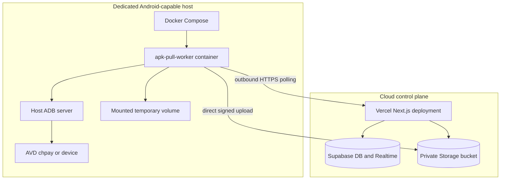

### 20.2 Recommended Docker model

Use Docker for the Node worker, while ADB server and the Play-enabled emulator run on the host:

- Worker reaches host ADB through an explicitly configured private socket/address.
- The ADB endpoint is bound/firewalled so it is not publicly reachable.
- Worker mounts only a dedicated temporary volume.
- The emulator retains its signed-in Play profile across worker container rebuilds.
- `restart: unless-stopped` and health checks restart the worker runtime, not the AVD profile.

If host/container ADB integration is unreliable on the chosen OS, run the same worker package natively as a supervised service. This changes deployment packaging, not the control-plane contract.

### 20.3 CI/CD

Proposed workflow:

1. lint, type-check, unit tests;
2. build worker image;
3. dependency/image scanning;
4. publish immutable image tag and digest;
5. deploy worker separately from Vercel dashboard;
6. worker registers `workerVersion` and health;
7. controlled E2E smoke test on dedicated AVD;
8. rollback worker image without changing Supabase job history.

Do not make AVD E2E a required step on every dashboard-only deployment.

### 20.4 Readiness

Worker should advertise no available slot unless all are true:

- gateway authentication succeeds;
- ADB executable/server is reachable;
- exactly the configured device serial is online;
- device boot is complete;
- Play Store package exists and session is usable;
- work disk is above free-space threshold;
- worker version supports current payload schema.

## 21. Testing

### 21.1 Dashboard/control-plane tests

- Server Actions enforce admin and CSRF rules.
- Google Play URL/package validation rejects SSRF and malformed input.
- Job/audit creation is atomic or safely compensated.
- Claim RPC is atomic under concurrent workers.
- Capability mismatch never assigns `pull_apk` to a non-APK worker.
- Heartbeat rejects wrong worker, expired lease, wrong attempt, and terminal job.
- Completion is idempotent and requires verified artifact.
- Signed download issuance requires admin and non-expired artifact.
- Realtime subscription updates job timeline.
- Cleanup route requires cron authentication and is idempotent.

### 21.2 Worker unit tests

- Parse Google Play URLs and canonicalize locale.
- Parse stored Play HTML fixtures.
- Parse UIAutomator XML and exact control bounds.
- Classify app-not-found, region, login, payment, timeout, and UI drift.
- Parse all `pm path` lines and preserve split filenames.
- Validate ZIP/`AndroidManifest.xml` and compute checksum.
- Cleanup decision never uninstalls a pre-existing package.
- Cancellation/lease loss stops at safe checkpoints.

### 21.3 Integration tests

- Fake Gateway server exercises claim/heartbeat/events/upload/completion.
- Fake ADB process covers offline, timeout, one APK, multiple splits, malformed output, and partial pull.
- Temporary filesystem covers safe path containment and crash reconciliation.
- Supabase test project covers RLS/RPC/Storage policies.
- Direct signed upload verifies metadata before job completion.

### 21.4 E2E tests

- Dedicated Play-enabled AVD and known free test application.
- Submit from dashboard → worker claim → install → all splits → Storage → dashboard download.
- Already-installed package remains installed after job.
- Cancellation during install/pull performs cleanup.
- Worker crash and expired lease do not allow two completions.
- Expired artifact disappears from Storage and UI.

### 21.5 Acceptance criteria

- APK jobs appear in the same Release Ops queue and worker fleet views as other jobs.
- No Android work occurs inside Vercel runtime.
- No second job database or public worker backend is introduced.
- One device runs at most one active job.
- ZIP contains `base.apk`, every split from `pm path`, listing assets, manifest, and diagnostics.
- Worker uploads directly to private Storage.
- Job succeeds only after artifact verification.
- Dashboard receives live events and issues authorized short-lived downloads.
- Local/device/durable cleanup paths are tested.

## 22. Coding Convention

Existing dashboard naming/layering should be preserved:

- `release-ops.actions.ts` for guarded web entry points;
- `release-ops.service.ts` for orchestration;
- one repository per `release_ops_*` table;
- shared types in `types/release-ops.ts`;
- gateway handlers remain thin and call purpose-built services/RPCs.

Worker conventions:

- strict TypeScript;
- discriminated job payload/result unions by `job_type` and `schemaVersion`;
- adapters for ADB, Play listing, Play UI, archive, and Storage;
- no shell command construction with interpolated input;
- typed error codes and retry classifications;
- injected clock/HTTP/process/filesystem interfaces for testing;
- UTC timestamps internally;
- structured logging and bounded metadata;
- idempotent cleanup and completion.

## 23. Design Patterns

### 23.1 Existing patterns evidenced by master architecture

- Server Action → Service → Repository layering.
- Repository pattern for Supabase tables.
- Detached worker gateway with token guard.
- Polling worker and database-backed job lifecycle.

### 23.2 Proposed extension patterns

| Pattern | APK application |
| --- | --- |
| Control plane / execution plane | Vercel/Supabase controls; device worker executes |
| Ports and adapters | Isolate ADB, Play UI/listing, Storage, Gateway |
| Capability-based dispatch | Only `pull_apk` workers claim APK jobs |
| Lease/heartbeat | Exclusive ownership and crash detection |
| State machine | Generic Release Ops states plus event stages |
| Saga/compensation | Uninstall and local cleanup after multi-step failure |
| Direct-to-object-storage | Large bytes bypass Vercel |
| Idempotency | Safe create, completion, retry, and deletion |
| Append-only event stream | Inspectable user-visible progress timeline |

No separate microservice database, CQRS store, event-sourcing platform, or message broker is required for the first version.

## 24. Strengths

- Integrates with the existing Release Ops dashboard, auth, tables, events, workers, audits, and Realtime model.
- Keeps Vercel suitable for short control-plane requests while long Android work runs elsewhere.
- Avoids duplicating Supabase data into a worker-local queue database.
- Uses the planned Release Ops gateway rather than exposing Supabase directly to workers.
- Avoids moving large ZIP bytes through Vercel.
- Enables a shared `/workers` and `/jobs` operational view across upload, report, and APK workloads.
- Makes device capability/profile explicit, which matters for split APK output.
- Separates worker deployment lifecycle from dashboard deployment.
- Preserves safe cleanup and short artifact retention.

## 25. Technical Debt and Risks

### 25.1 Existing gaps from `ARCHITECTURE_MASTER.md`

| Gap | APK impact |
| --- | --- |
| Release Ops Worker Gateway not implemented | Worker cannot claim/report securely |
| Worker runtime not implemented in SinoMedia | APK capability has no shared runtime yet |
| Release Ops migrations absent locally | Schema/RPC/Storage cannot be reproduced safely |
| Artifact repository missing | Dashboard cannot manage ZIP metadata |
| Job-event repository missing | Timeline/Realtime progress incomplete |
| Realtime not configured | UI needs polling/refresh |
| Worker/jobs/artifacts pages missing | Operational visibility incomplete |

### 25.2 APK-specific risks

| Risk | Severity | Mitigation |
| --- | --- | --- |
| Play Android UI changes | High | Exact UI adapter, XML fixtures, diagnostics, manual dead-letter |
| Play listing HTML changes | High | Isolated parser and stored fixtures/raw HTML |
| Device/account/region mismatch | High | Capability metadata and explicit error codes |
| Device-specific split output misunderstood | High | Store device profile and clear artifact UI |
| Duplicate workers execute same job | High | Atomic RPC claim, lease, heartbeat, completion check |
| Vercel proxies large archive | High | Direct signed Storage transfer |
| Worker receives service-role key | Critical | Gateway-only privileged operations |
| Cleanup removes pre-existing app | High | Persist pre-install state and test invariant |
| ADB exposed over network | Critical | Host-only/private binding and firewall |
| Disk fills on worker or Storage | High | Readiness threshold, immediate local cleanup, TTL cleanup |
| Windows Server 2012 cannot host modern AVD reliably | High | Dedicated compatible host and readiness/capability routing |
| Unauthorized APK redistribution | High | Admin-only access, private bucket, short retention, audit/policy |

## 26. Implementation Plan

### Phase 0 — Confirm contracts and deployment

- [ ] Confirm page route `/dash/release-ops/apk-pull`.
- [ ] Confirm private Supabase Storage as durable artifact store.
- [ ] Confirm artifact retention, recommended default 24 hours.
- [ ] Confirm dedicated device host OS and AVD/physical-device choice.
- [ ] Confirm `google_play_only` source policy and no mirror fallback.

### Phase 1 — Version-control Release Ops foundations (P0)

- [ ] Add complete `release_ops_*` migrations currently missing from the repo.
- [ ] Add RLS and service-role-only RPC policies.
- [ ] Implement atomic capability-aware job claim/heartbeat/event/complete/fail RPCs.
- [ ] Add `pull_apk` type and artifact retention fields.
- [ ] Add private Storage bucket migration/policy.
- [ ] Enable Realtime for jobs/events required by UI.

### Phase 2 — Shared Worker Gateway (P0)

- [ ] Implement `/api/release-ops/worker/v1/[...path]/route.ts`.
- [ ] Reuse/harden SHA-256 token guard with Release Ops scopes.
- [ ] Implement register, heartbeat, claim, start, heartbeat, events, fail, succeed.
- [ ] Implement signed upload-init/upload-complete and object verification.
- [ ] Add request IDs, rate/body limits, idempotency, stale-lease rejection.

### Phase 3 — APK worker MVP (P0)

- [ ] Implement gateway client, polling, lease heartbeat, cancellation, and cleanup.
- [ ] Implement Google Play URL/listing adapter.
- [ ] Implement device preflight and AVD `chpay` lifecycle.
- [ ] Implement exact Play UI installation workflow.
- [ ] Pull all base/split APKs and diagnostics.
- [ ] Validate, hash, manifest, ZIP, and direct Storage upload.
- [ ] Package worker with Docker Compose plus native fallback runbook.

### Phase 4 — Dashboard integration (P1)

- [ ] Add APK Pull tab/page and job detail page.
- [ ] Add guarded Server Actions and service methods.
- [ ] Implement artifact and job-event repositories.
- [ ] Add Realtime subscriptions and fallback refresh.
- [ ] Add cancel, retry, download, delete, and expiry UI.
- [ ] Include APK jobs in shared `/jobs`, `/workers`, `/artifacts`, and `/audit` pages when those pages are implemented.

### Phase 5 — Reliability and operations (P1)

- [ ] Add Vercel Cron artifact expiry route.
- [ ] Add stale job/worker reconciliation.
- [ ] Add device readiness/health display.
- [ ] Add dead-letter/manual retry workflow.
- [ ] Add metrics and alerting for queue, failure code, lease loss, device health, disk, and Storage usage.
- [ ] Run security and policy review.

### Phase 6 — Scale only when measured (P2)

- [ ] Add more device workers using the same capability model.
- [ ] Add device-profile routing.
- [ ] Add batch multi-URL parent operations.
- [ ] Evaluate a dedicated gateway only if Vercel control-plane limits are observed.

### Recommended implementation order

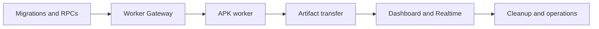

Do not start UI-first with mock job behavior. The queue/RPC/gateway contract must exist before the dashboard promises executable APK jobs.

## 27. Appendix

### 27.1 Worker capability metadata

```json
{
  "workerVersion": "1.0.0",
  "capabilities": ["pull_apk"],
  "runtime": {
    "os": "windows-or-linux-or-macos",
    "containerized": true
  },
  "devices": [
    {
      "deviceId": "emulator-5554",
      "avdName": "chpay",
      "status": "ready",
      "playReady": true,
      "sdk": 35,
      "abi": "arm64-v8a",
      "density": 420,
      "locale": "en-US",
      "maxParallelJobs": 1
    }
  ]
}
```

### 27.2 Pipeline stage vocabulary

| Stage | Suggested progress range |
| --- | ---: |
| `claimed` | 1–3 |
| `scraping_listing` | 4–20 |
| `preparing_device` | 21–30 |
| `installing` | 31–55 |
| `pulling_apks` | 56–72 |
| `validating` | 73–80 |
| `packaging` | 81–88 |
| `uploading_artifact` | 89–96 |
| `cleaning` | 97–99 |
| `completed` | 100 |

Progress is a UI hint; status, lease, artifact verification, and terminal result remain correctness signals.

### 27.3 Manifest minimum fields

```text
job_id=<uuid>
package=<packageId>
play_url=<canonical URL>
pulled_at=<ISO timestamp>
version_name=<versionName>
version_code=<versionCode>
device_serial=<serial>
device_sdk=<sdk>
device_abi=<abi>
device_density=<density>
device_locale=<locale>

splits:
<filename> <size_bytes>

sha256:
<hash> <filename>

listing:
screenshots=<count>
description=<present|missing>
icon=<present|missing>
raw_html=<present|missing>
```

### 27.4 Cleanup invariants

1. Never uninstall a package that existed before the job.
2. Never delete a path not proven to be below the configured job root.
3. Never mark a job succeeded before the private object is verified.
4. Never accept completion from a worker without the current unexpired lease.
5. Never let the worker choose an arbitrary Storage object key.
6. Never put service-role credentials or signed URLs in job payloads/events.
7. Never run two APK jobs concurrently on one device.

### 27.5 Final Definition of Done

- [ ] APK Pull is a Release Ops capability, not a separate product/auth/database.
- [ ] Dashboard is deployed on the existing Vercel project.
- [ ] Jobs/events/workers/artifacts/audits live in existing `release_ops_*` data model.
- [ ] Worker runs outside Vercel and communicates through outbound HTTPS only.
- [ ] Worker token has exact scopes and no Supabase service-role key.
- [ ] Atomic capability-aware claim and lease checks prevent duplicate execution.
- [ ] One device executes one APK job at a time.
- [ ] All installed APK splits and listing assets are included and verified.
- [ ] Archive uploads directly to private Supabase Storage.
- [ ] Dashboard receives Realtime progress and issues authorized download URLs.
- [ ] Device, local disk, Storage retention, cancellation, retry, and dead-letter paths are tested.
- [ ] Third-party mirror fallback remains disabled.
