# AppRelay V2 — Dual-Dashboard Deployable Architecture

> **Document status:** Target / To-be architecture — Proposed for approval  
> **Business placement:** AppRelay is a capability of SinoMedia Release Ops  
> **Deployment model:** One independently deployable AppRelay control plane serves the standalone AppRelay dashboard and the SinoMedia Master dashboard  
> **Baseline:** `ARCHITECTURE_APP_REPLAY_V1.md`, `ARCHITECTURE_MASTER.md`, and the supplied source-tree snapshot  
> **Important:** This document separates verified current evidence from proposed V2 design. A target component is not considered implemented until it is reconciled with executable code and tests.

---

## Table of Contents

1. [Project Overview](#1-project-overview)
2. [Tech Stack](#2-tech-stack)
3. [Folder Structure](#3-folder-structure)
4. [System Architecture](#4-system-architecture)
5. [Module Breakdown](#5-module-breakdown)
6. [Request Flow](#6-request-flow)
7. [Authentication](#7-authentication)
8. [Authorization](#8-authorization)
9. [Database](#9-database)
10. [API Architecture](#10-api-architecture)
11. [Business Flows](#11-business-flows)
12. [Dependency Graph](#12-dependency-graph)
13. [External Services](#13-external-services)
14. [Configuration](#14-configuration)
15. [Logging](#15-logging)
16. [Error Handling](#16-error-handling)
17. [Security](#17-security)
18. [Performance](#18-performance)
19. [Scalability](#19-scalability)
20. [Deployment](#20-deployment)
21. [Testing](#21-testing)
22. [Coding Convention](#22-coding-convention)
23. [Design Patterns](#23-design-patterns)
24. [Strengths](#24-strengths)
25. [Technical Debt and Risks](#25-technical-debt-and-risks)
26. [Implementation Plan](#26-implementation-plan)
27. [Appendix](#27-appendix)

---

## 1. Project Overview

### 1.1 Goal

AppRelay acquires an application package from the official Google Play flow by coordinating a remote device-capable Worker. An operator submits a Google Play URL, receives asynchronous progress, and downloads a private verified archive containing the installed APK set and listing metadata.

V2 adds a deployment requirement that V1 did not support:

- AppRelay must run with its own standalone dashboard.
- The SinoMedia Master dashboard must consume the same AppRelay backend.
- Both dashboards must produce identical jobs, permissions, events and artifacts.
- AppRelay remains a Release Ops capability rather than becoming a separate business system.

### 1.2 Architectural style

| Dimension | V2 decision |
|---|---|
| Product architecture | AppRelay is embedded in the Release Ops product domain |
| Deployment architecture | AppRelay control plane is independently deployable |
| Frontend architecture | Two clients: standalone dashboard and Master module |
| Backend architecture | One public API and one application/service implementation |
| Data architecture | Shared SinoMedia Supabase in V2; AppRelay owns `pull_apk` behavior, not every generic Release Ops table |
| Worker architecture | Detached execution plane using outbound HTTPS polling |
| Artifact architecture | Direct signed transfer to private Supabase Storage |
| Contract architecture | Design in `API_SPEC.md`; actual OpenAPI generated from runtime code after implementation |

### 1.3 Input and output

| Direction | Contract |
|---|---|
| Input | Google Play details URL such as `https://play.google.com/store/apps/details?id=com.example.app&hl=en` |
| Derived identity | Android package ID from the validated `id` parameter |
| Durable output | Private ZIP containing base APK, split APKs, listing data, media, diagnostics and manifest |
| Client output | Job, event timeline, progress, Worker/device profile, artifact metadata, expiry and authorized download action |

The archive is device-profile-specific and may include multiple split APKs:

```text
com.example.app/
├── base.apk
├── split_config.*.apk
├── PULL_MANIFEST.txt
├── package-info.txt
├── device-dir.listing
└── playstore/
    ├── description.md
    ├── listing.json
    ├── icon.png
    ├── page.html
    └── screenshots/
        └── screenshot_XX.png
```

### 1.4 Current evidence versus V2 target

The supplied tree and architecture documents provide the following evidence. File existence in a tree does not prove runtime behavior.

| Area | Current evidence | V2 target |
|---|---|---|
| Standalone AppRelay pages | AppRelay pages/components are listed in the project tree | Retain as standalone API client |
| AppRelay Server Actions | `app-relay.actions.ts` is listed | Keep only as thin adapters or migrate calls to public API |
| Worker Gateway | Route/module files are listed, while Master document calls Gateway planned | Audit behavior; retain as internal API |
| Runtime schemas | `app-relay-api.schemas.ts` is listed | Establish one runtime schema/route registry |
| Public AppRelay REST routes | > Not Found in the supplied tree | Implement `/api/release-ops/app-relay/v1/*` |
| OpenAPI | `API_SPEC.md`, `openapi.yaml`, and two generator locations are listed | One canonical generator; public/internal contracts separated |
| Supabase | Seven Release Ops migrations are listed in the tree | Preserve shared schema compatibility and audit applied state |
| Worker | AppRelay Worker source and tests are listed | Preserve pipeline and harden Gateway-only access |

### 1.5 Core architecture decision

AppRelay V2 uses **shared platform infrastructure with an independent service boundary**:

- shared Supabase Auth;
- shared `release_ops_*` data model and Storage platform;
- one independently deployable AppRelay control plane;
- one public API for both dashboards;
- one internal Worker Gateway;
- no second job database;
- no second identity provider;
- no duplicated AppRelay orchestration inside Master.

### 1.6 In scope

- Standalone dashboard and Master dashboard integration.
- Public AppRelay REST API.
- Supabase JWT validation and role enforcement.
- Explicit CORS for both dashboard origins.
- `pull_apk` create, list, detail, cancel, retry, events and artifact lifecycle.
- Internal Worker registration, claim, lease, events and completion.
- Google Play listing and device automation.
- Direct signed artifact upload and authorized download.
- Polling baseline and optional contracted Realtime acceleration.
- Generated public OpenAPI after implementation reconciliation.
- Independent staging/production deployment of the AppRelay control plane.

### 1.7 Out of scope

- A second authentication provider.
- A second job database for standalone mode.
- Direct browser use of Supabase service-role credentials.
- Direct Worker access to privileged Supabase APIs.
- Exposing Worker Gateway operations to dashboard clients.
- Running ADB/emulators in Vercel functions.
- Sending ZIP bytes through the AppRelay API or Server Actions.
- Third-party APK mirrors or bypass of regional, paid, approval or licensing controls.

---

## 2. Tech Stack

### 2.1 Current evidence

| Layer | Evidence |
|---|---|
| Language | TypeScript files are listed across dashboard and Worker |
| Standalone dashboard | Next.js App Router structure, React components and CSS tokens are listed |
| Data platform | Supabase migrations, repositories and generated types are listed |
| Auth pattern | Master architecture documents Supabase Auth, `requireAdmin()` and CSRF guards |
| Worker | Node/TypeScript package, Dockerfile and Docker Compose are listed |
| Validation | AppRelay and Worker schema modules are listed; library choice requires source audit |
| Testing | Dashboard and Worker test files are listed |
| OpenAPI | Generator scripts and `openapi.yaml` are listed; provenance requires audit |

### 2.2 V2 target additions

| Concern | Target choice | Status |
|---|---|---|
| Public API | Versioned REST over HTTPS | Proposed |
| Public auth | Supabase JWT bearer validation | Proposed |
| Cross-origin access | Explicit origin allowlist | Proposed |
| Runtime contract | One schema/route registry used by handlers and generator | Proposed |
| Frontend client | Generated or strongly typed client from public OpenAPI | Proposed |
| Realtime | Polling baseline; optional Supabase Realtime contract | Proposed |
| Observability | Structured logs, correlation IDs and operational metrics | Proposed |
| Contract CI | Generate, lint, test and diff OpenAPI | Proposed |

### 2.3 Explicitly not introduced

Redis, BullMQ, RabbitMQ, Kafka, a Worker-local queue, a second PostgreSQL database and a second authentication provider are not required for V2.

---

## 3. Folder Structure

### 3.1 Current relevant structure

```text
app-relay/
├── dashboard/
│   ├── app/(main)/dash/release-ops/app-relay/
│   ├── app/actions/app-relay.actions.ts
│   ├── app/api/release-ops/worker/v1/[...path]/route.ts
│   ├── lib/release-ops-worker-api/
│   ├── lib/repositories/
│   ├── lib/schemas/app-relay-api.schemas.ts
│   ├── lib/services/release-ops.service.ts
│   ├── scripts/generate-openapi.ts
│   └── tests/
├── docs/04-detailed-design/cdd-lld/api-spec/
│   ├── API_SPEC.md
│   └── openapi.yaml
├── scripts/generate-openapi.ts
├── supabase/migrations/
└── workers/app-relay-worker/
```

### 3.2 Target structure

```text
app-relay/
├── apps/
│   ├── dashboard/                         # Standalone UI client
│   └── control-plane/                     # Independently deployable backend
│       └── src/
│           ├── public-api/                # Dashboard-facing REST operations
│           ├── worker-gateway/            # Internal Worker operations
│           ├── application/               # AppRelay use cases
│           ├── domain/                    # State and business rules
│           ├── repositories/              # Shared Release Ops persistence adapters
│           ├── auth/                      # User JWT and Worker token validation
│           ├── storage/                   # Signed artifact transfer
│           └── observability/             # Logs, metrics and correlation
├── packages/
│   ├── app-relay-public-contract/         # Runtime schemas and route registry
│   └── release-ops-worker-contract/       # Gateway DTOs/client
├── workers/
│   └── app-relay-worker/                  # Existing execution plane
├── supabase/
│   └── migrations/                        # Shared Release Ops-compatible migrations
├── docs/
│   ├── 08-operations-and-evolution/
│   │   ├── as-is/ARCHITECTURE_APP_REPLAY_V1.md
│   │   └── to-be-v2/ARCHITECTURE_APPRELAY_V2.md
│   └── 04-detailed-design/cdd-lld/api-spec/
│       ├── API_SPEC.md
│       ├── openapi.public.yaml
│       └── openapi.internal.yaml          # Optional, Worker-only
└── scripts/
    ├── generate-openapi.ts                # One canonical entry point
    └── run-all-tests.ts
```

### 3.3 Transitional rule

The physical extraction to `apps/control-plane` is not required before public API work begins. The current Next.js application may host public routes and Worker Gateway temporarily, provided that application services and runtime contracts are UI-independent.

---

## 4. System Architecture

### 4.1 System context

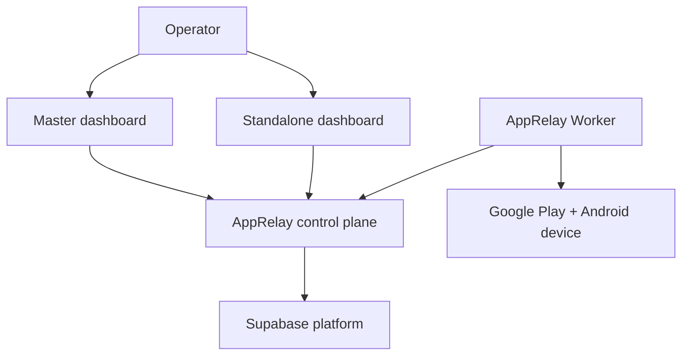

### 4.2 Complete target architecture

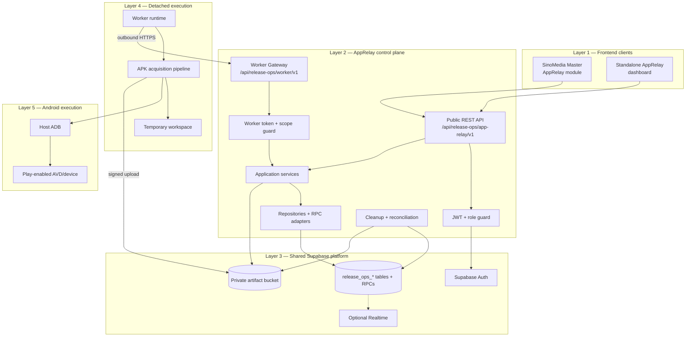

### 4.3 Boundary rules

1. Both dashboards call the same public API contract.
2. Dashboard clients never call the Worker Gateway.
3. Master does not duplicate `pull_apk` orchestration after cutover.
4. Standalone dashboard contains no privileged persistence logic.
5. Worker has no inbound public port.
6. Worker receives no Supabase service-role key.
7. API and Gateway do not proxy ZIP bytes.
8. Supabase remains the job-state source of truth.
9. Worker-local disk is temporary.
10. Public and internal OpenAPI artifacts are separated.

### 4.4 End-to-end dual-dashboard flow

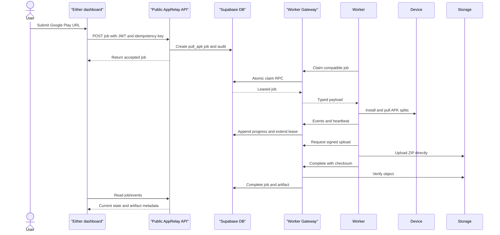

### 4.5 Artifact transfer

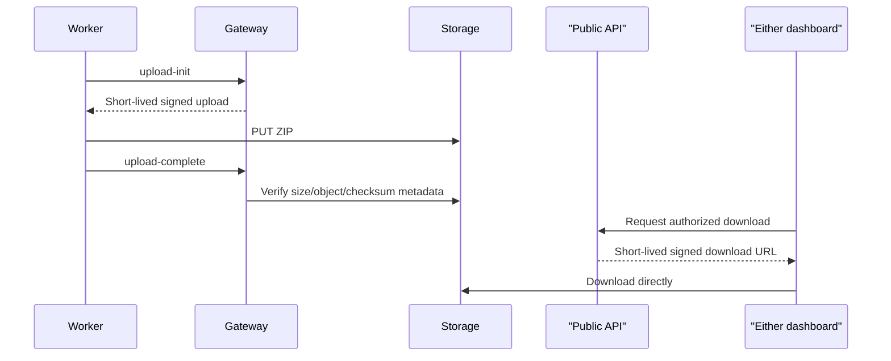

### 4.6 Deployment modes

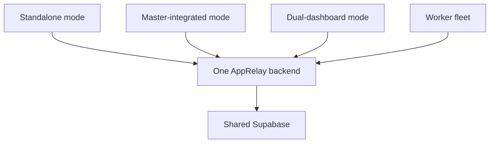

---

## 5. Module Breakdown

### 5.1 Public API module — Proposed

Responsibilities:

- accept authenticated dashboard requests;
- validate inputs and idempotency;
- enforce AppRelay operator authorization;
- call application use cases;
- return stable responses and errors;
- expose no Worker-only operation;
- provide the runtime source for public OpenAPI generation.

### 5.2 User authentication adapter — Proposed

- Validate Supabase JWT signature, issuer, audience and expiry.
- Resolve identity and role/permission context.
- Reject user-provided role claims not issued by the trusted identity provider.
- Support both approved browser origins.

### 5.3 AppRelay application services — Existing/Changed

Service behavior is listed in the supplied tree through `release-ops.service.ts`; exact implementation must be audited.

V2 responsibilities:

- canonicalize and validate Google Play URLs;
- create and query `pull_apk` jobs;
- enforce active-job deduplication policy;
- cancel and retry eligible jobs;
- assemble job/event/Worker/artifact views;
- authorize download and deletion;
- preserve generic Release Ops job compatibility.

### 5.4 Repository and RPC adapters — Existing/Changed

Repositories for jobs, events, workers, artifacts and audits are listed. V2 must confirm:

- table and RPC compatibility;
- atomic claim and completion behavior;
- pagination and index usage;
- artifact expiry/deletion state;
- append-only event and audit rules.

### 5.5 Worker Gateway — Existing evidence/Changed

Route and module files are listed, but runtime completeness is not verified.

Responsibilities remain:

- register and heartbeat Workers;
- capability-aware atomic claim;
- job start and lease heartbeat;
- cancellation observation;
- bounded progress events;
- signed upload initialization/completion;
- idempotent success/failure;
- Worker token and scope enforcement.

### 5.6 Standalone dashboard — Existing/Changed

- Remains deployable as an AppRelay user interface.
- Becomes a client of the public API.
- May retain thin Server Actions for framework concerns.
- Must not maintain separate business rules or privileged database access.

### 5.7 Master dashboard adapter — Proposed

- Adds Release Ops navigation and AppRelay pages.
- Uses a typed public API client.
- Uses direct bearer-token calls or a thin BFF proxy.
- Contains no AppRelay repositories, claim logic or artifact policy.

### 5.8 Worker runtime — Existing evidence/Changed

The supplied tree lists runtime, pipeline, gateway client and tests.

Responsibilities:

- register stable Worker identity;
- advertise `app_artifact_acquisition` and device slots;
- poll with jitter;
- heartbeat Worker and job leases;
- dispatch `pull_apk` only to compatible devices;
- stop safely on cancellation or stale lease;
- report structured progress and completion.

### 5.9 Listing acquisition — Existing evidence

- fetch canonical Play listing with bounded redirect/size/time;
- store raw HTML for diagnostics;
- parse metadata, icon and screenshots;
- isolate volatile markup parsing behind fixtures.

### 5.10 Device and Play UI — Existing evidence

- select explicit ADB serial;
- check device/Play readiness;
- preserve pre-existing package state;
- install through exact official Play UI flow;
- classify region, login, payment, approval and UI-drift outcomes;
- pull every path returned by `pm path`.

### 5.11 Artifact and cleanup — Existing evidence

- validate base and split APKs;
- create manifest and SHA-256 checksums;
- stream ZIP generation and upload;
- never mark success before object verification;
- uninstall only packages installed by the job;
- delete only paths proven below the job workspace;
- reconcile stale local workspaces.

### 5.12 Operations — Proposed/Partial

Files for retry, reconciliation, feature flags, kill switch and security audit are listed. V2 must connect them to deployment health, metrics, alerts and runbooks.

---

## 6. Request Flow

### 6.1 Public web request

1. User signs in through shared Supabase Auth.
2. Dashboard obtains an access token.
3. Dashboard calls the public AppRelay API.
4. CORS middleware verifies the request origin when applicable.
5. JWT middleware validates identity.
6. Authorization middleware checks AppRelay/Release Ops permission.
7. Runtime schema validates path, query, headers and body.
8. Route handler calls an application use case.
9. Use case calls repositories or purpose-built RPCs.
10. Response is mapped to the versioned public contract.
11. Correlation and audit metadata are recorded.

### 6.2 Worker claim

1. Worker sends token, identity, version, capabilities and available device profiles.
2. Gateway validates token status, expiry and scope.
3. Gateway validates the request schema.
4. Atomic RPC selects a compatible queued job using priority/FIFO and locking semantics.
5. RPC assigns Worker, attempt and lease.
6. Gateway returns typed job payload without privileged credentials.

### 6.3 Worker execution

1. Worker starts job and lease heartbeat.
2. Listing adapter fetches Play metadata.
3. Device manager checks ADB/device readiness.
4. Worker records pre-install package state.
5. Play UI installs the application when needed.
6. Extractor pulls every base/split APK path.
7. Validator and packager create the archive.
8. Worker obtains a signed upload contract.
9. Worker uploads directly to private Storage.
10. Gateway verifies lease and object before success.
11. Worker cleans device and local state.

### 6.4 Read and download

1. Either dashboard requests job or artifact state through public API.
2. API validates user and authorization.
3. API reads job, events, Worker summary and artifact metadata.
4. Download request verifies success, non-deleted state and expiry.
5. API issues a short-lived URL for the exact private object.
6. Browser downloads directly from Storage.

### 6.5 Refresh and Realtime

Polling is the portable V2 baseline. If Supabase Realtime is retained, its RLS, channels and event payloads become an explicit frontend contract. Polling remains the fallback.

---

## 7. Authentication

### 7.1 Dashboard users — Target

| Concern | Decision |
|---|---|
| Provider | Shared Supabase Auth |
| Client credential | Supabase access token |
| API transport | `Authorization: Bearer <token>` |
| Validation | Signature, issuer, audience, expiry and required claims |
| Session ownership | Each dashboard uses its own frontend session adapter |
| Cross-domain cookie dependency | Avoided; bearer token is preferred |

> Exact JWT validation library and current code path: **Not Found in the supplied source snapshot**. Confirm during implementation audit.

### 7.2 Workers — Retained from V1

- hashed bearer token;
- active, unexpired and revocable credential;
- exact Release Ops scopes;
- stable Worker identity binding where supported;
- token never appears in query strings, events or logs.

### 7.3 Google Play account

Google Play login remains on the dedicated Android profile. Credentials/cookies are not submitted through dashboards, stored in job payloads or returned by Gateway.

---

## 8. Authorization

### 8.1 Initial user matrix

V1 is admin-only. V2 retains that policy until a finer permission model is approved.

| Actor | Create | View | Download | Cancel/retry | Delete | Worker API |
|---|---:|---:|---:|---:|---:|---:|
| Guest | No | No | No | No | No | No |
| Authenticated non-admin | No | No | No | No | No | No |
| Release Ops/AppRelay admin | Yes | Yes | Yes | Yes | Yes | No |
| Worker | No UI | Assigned job only | Upload flow only | Report/cancel observation | No | Scoped only |

### 8.2 Worker scopes

| Scope | Purpose |
|---|---|
| `release_ops:worker:register` | Register identity and capabilities |
| `release_ops:worker:heartbeat` | Report Worker/device health |
| `release_ops:job:claim` | Claim compatible job |
| `release_ops:job:heartbeat` | Extend lease/read cancellation |
| `release_ops:job:event` | Append bounded progress event |
| `release_ops:job:complete` | Report success/failure |
| `release_ops:artifact:write` | Initialize and complete signed upload |

### 8.3 Shared-data authorization

AppRelay does not own all generic Release Ops rows. Authorization must restrict AppRelay operations to supported job types/resources and must not become a generic table proxy.

---

## 9. Database

### 9.1 Shared tables

| Table | AppRelay use |
|---|---|
| `release_ops_apps` | Optional app registry link by package name |
| `release_ops_jobs` | `pull_apk` payload, status, lease, retry and result |
| `release_ops_job_events` | Append-only progress and diagnostics |
| `release_ops_workers` | Worker health, capabilities and devices |
| `release_ops_artifacts` | ZIP metadata, object path and retention |
| `release_ops_audits` | User/system action audit |
| `release_ops_batch_operations` | Optional multi-URL parent operation |

The supplied tree lists Release Ops migrations, but applied database state and exact schema must be verified against the deployment.

### 9.2 `pull_apk` payload — Target contract

```json
{
  "schemaVersion": 1,
  "playUrl": "https://play.google.com/store/apps/details?id=com.example.app&hl=en",
  "packageId": "com.example.app",
  "locale": "en",
  "includeListing": true,
  "includeScreenshots": true,
  "sourcePolicy": "google_play_only",
  "requestedDeviceProfile": null
}
```

### 9.3 `pull_apk` result — Target contract

```json
{
  "schemaVersion": 1,
  "versionName": "1.2.3",
  "versionCode": 123,
  "splitCount": 4,
  "screenshotCount": 8,
  "archiveArtifactId": "uuid",
  "archiveSha256": "hex",
  "archiveSizeBytes": 23456789,
  "deviceProfile": {
    "sdk": 35,
    "abi": "arm64-v8a",
    "density": 420,
    "locale": "en-US"
  },
  "warnings": []
}
```

### 9.4 Required database guarantees

- `job_type` accepts `pull_apk`.
- Idempotency key uniqueness is defined for job creation.
- Claim is capability-aware and atomic.
- Lease heartbeat, event, success and failure enforce Worker ownership/attempt.
- Events are append-only and indexed by `(job_id, created_at)`.
- Artifact object paths are server-generated and unique.
- Artifact expiry/deletion state is explicit.
- Audit records identify user/system actor and request correlation.
- Shared-schema migrations remain compatible with other Release Ops job types.

### 9.5 ER diagram

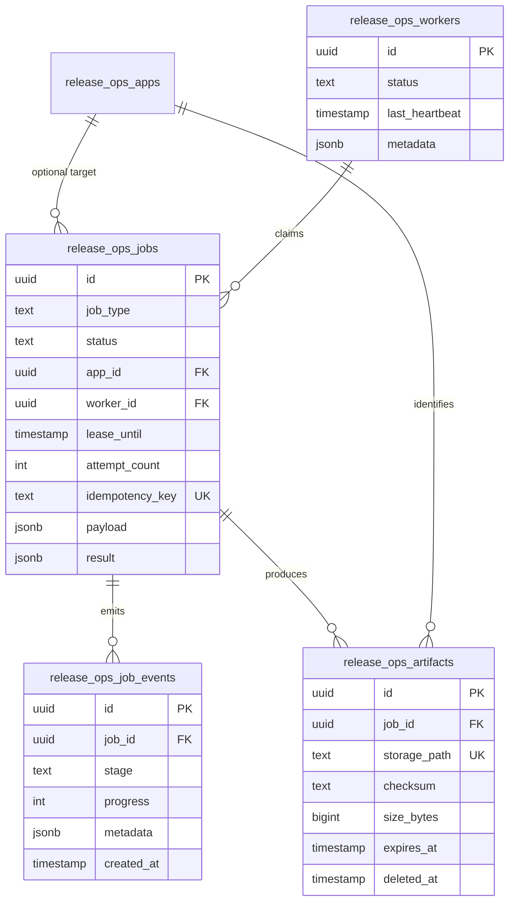

### 9.6 Storage layout

```text
release-ops-artifacts/
└── apk-pull/<yyyy>/<mm>/<jobId>/<packageId>-<versionCode>.zip
```

The server chooses the object key. Database metadata is finalized only after upload verification.

---

## 10. API Architecture

### 10.1 Contract policy

`API_SPEC.md` is the approved design document. It does not prove implementation. Runtime routes and schemas are the implementation source. `openapi.public.yaml` is generated only after reconciliation and validation.

### 10.2 Public dashboard API — Proposed

Base path:

```text
/api/release-ops/app-relay/v1
```

Resource groups:

| Group | Intended behavior |
|---|---|
| Jobs | Create, list, read, cancel and retry `pull_apk` jobs |
| Events | Read bounded job timeline/progress |
| Artifacts | Read metadata, request download and delete when authorized |
| Workers | Read operator-safe capability/availability summary |
| Capabilities/health | Client compatibility and operational readiness where required |

Exact methods, paths, schemas and status codes belong in `API_SPEC.md` and are `Proposed` until implemented.

### 10.3 Public API conventions — Target

| Concern | Decision |
|---|---|
| Protocol | REST/JSON over HTTPS |
| Authentication | Supabase JWT bearer |
| Versioning | URI major version `/v1` |
| Errors | Stable `{ error: { code, message, requestId, retryable, details? } }` |
| Pagination | Cursor preferred for events/jobs; exact design in API spec |
| Filtering | Bounded allowlist only |
| Sorting | Stable documented keys only |
| Idempotency | Required on create/retry-sensitive mutations |
| Correlation | Request ID returned and logged |
| OpenAPI | Public artifact generated from runtime registry |

### 10.4 Internal Worker Gateway — Existing evidence/Changed

Base path:

```text
/api/release-ops/worker/v1
```

| Method | Path | Scope | Purpose |
|---|---|---|---|
| `POST` | `/workers/register` | `release_ops:worker:register` | Register capabilities |
| `POST` | `/workers/heartbeat` | `release_ops:worker:heartbeat` | Report health |
| `POST` | `/jobs/claim` | `release_ops:job:claim` | Atomic compatible claim |
| `POST` | `/jobs/:id/start` | `release_ops:job:heartbeat` | Start attempt |
| `POST` | `/jobs/:id/heartbeat` | `release_ops:job:heartbeat` | Extend lease/read cancel |
| `POST` | `/jobs/:id/events` | `release_ops:job:event` | Append progress |
| `POST` | `/jobs/:id/artifacts/upload-init` | `release_ops:artifact:write` | Reserve signed upload |
| `POST` | `/jobs/:id/artifacts/upload-complete` | `release_ops:artifact:write` | Verify object |
| `POST` | `/jobs/:id/succeed` | `release_ops:job:complete` | Complete job |
| `POST` | `/jobs/:id/fail` | `release_ops:job:complete` | Retry/dead-letter failure |

### 10.5 Contract artifacts

```text
openapi.public.yaml    → both dashboard teams
openapi.internal.yaml  → Worker client only, if generated
```

Internal operations must never appear in the public frontend artifact.

---

## 11. Business Flows

### 11.1 Create APK job

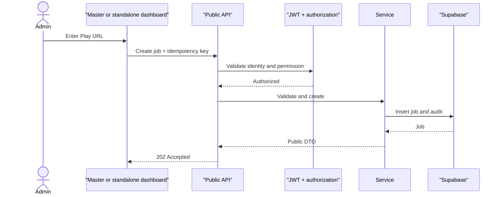

### 11.2 APK acquisition

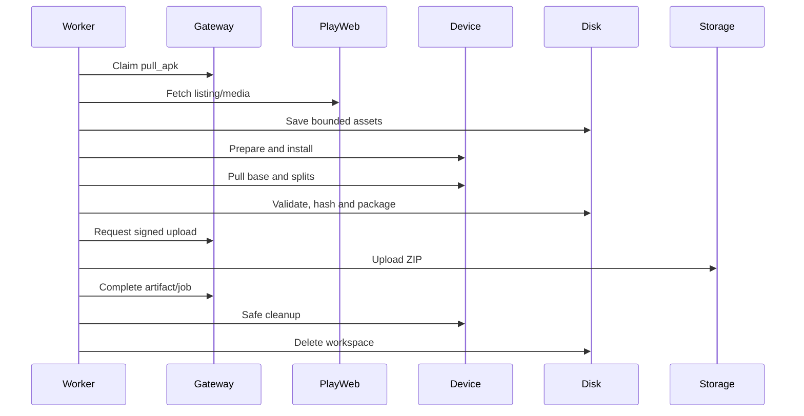

### 11.3 Failure and retry

- Transient errors use bounded retry with jitter.
- Whole-job retries respect attempt count and produce a new timeline.
- Permanent/exhausted errors enter dead-letter/manual review.
- Stale lease stops external work and prohibits completion.
- Cleanup runs after success, failure, cancellation and process recovery.

### 11.4 Cancellation

- Queued job becomes unclaimable.
- Claimed/running job receives cancellation through heartbeat.
- Worker stops at a safe checkpoint and cleans up.
- Existing completed artifact is not implicitly deleted.

### 11.5 Expiry and deletion

- Artifacts receive retention timestamp.
- Protected cleanup executes in bounded idempotent batches.
- Storage object is deleted before metadata is marked deleted/expired.
- Explicit deletion follows the same audited application service.

---

## 12. Dependency Graph

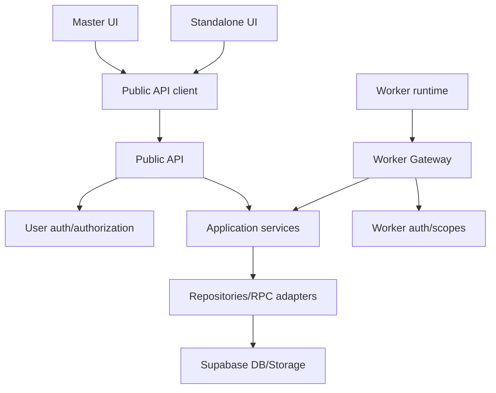

Dependency rules:

- UI modules depend on the public contract, not repositories.
- Public handlers and Gateway handlers remain thin.
- Application services contain orchestration.
- Repositories encapsulate Supabase access.
- Worker depends on internal contract/client, not dashboard code.
- Device, listing, archive and storage behavior remain behind adapters.

---

## 13. External Services

| Dependency | Use | Failure behavior |
|---|---|---|
| Supabase Auth | Shared user identity | Public API denies user operations |
| Supabase DB/RPC | Jobs, leases, events, artifacts, audits | Control-plane mutation fails safely |
| Supabase Storage | Private ZIP upload/download | Job remains incomplete or download unavailable |
| Supabase Realtime | Optional acceleration | Dashboard falls back to polling |
| Google Play web | Listing/media acquisition | Classified error/warning |
| Google Play Android app | Official installation | Region/login/payment/UI-drift error |
| ADB/device | APK extraction | Device unavailable/timeout |
| Master dashboard | Product-integrated frontend client | Standalone mode remains available |

Third-party APK mirrors remain excluded.

---

## 14. Configuration

### 14.1 Control plane

| Variable | Purpose |
|---|---|
| `APPRELAY_PUBLIC_BASE_URL` | Canonical externally reachable API URL |
| `APPRELAY_ALLOWED_ORIGINS` | Master and standalone browser origins |
| `APPRELAY_JWT_ISSUER` | Expected Supabase issuer |
| `APPRELAY_JWT_AUDIENCE` | Expected audience |
| `NEXT_PUBLIC_SUPABASE_URL` | Shared auth/platform URL |
| `NEXT_PUBLIC_SUPABASE_ANON_KEY` | Public Supabase key |
| `SUPABASE_SERVICE_ROLE_KEY` | Server-only privileged operations |
| `RELEASE_OPS_ARTIFACT_BUCKET` | Private bucket |
| `RELEASE_OPS_APK_RETENTION_HOURS` | Retention policy |
| `RELEASE_OPS_WORKER_LEASE_SECONDS` | Lease duration |
| `RELEASE_OPS_MAX_EVENT_BYTES` | Event bound |
| `CRON_SECRET` | Cleanup route authentication |

### 14.2 Dashboard clients

| Variable | Purpose |
|---|---|
| `NEXT_PUBLIC_APPRELAY_API_URL` | Public API base URL |
| `NEXT_PUBLIC_SUPABASE_URL` | Shared login provider |
| `NEXT_PUBLIC_SUPABASE_ANON_KEY` | Public auth key |

### 14.3 Worker

Retain V1 variables for Gateway URL/token, Worker identity/version/capabilities, ADB, device serial, emulator, work directory, timeouts, disk threshold, polling and log level.

No dashboard or Worker receives `SUPABASE_SERVICE_ROLE_KEY`.

---

## 15. Logging

### 15.1 Public API logs — Target

- request ID;
- route/operation ID;
- authenticated user ID or safe actor reference;
- client identifier/origin classification;
- job/artifact ID where applicable;
- status, duration and stable error code;
- no tokens, signed URLs or unbounded payloads.

### 15.2 Gateway logs

- request ID;
- Worker ID/version;
- job ID and attempt;
- endpoint/scope result;
- lease/RPC classification;
- artifact object ID where policy permits.

### 15.3 Worker logs

- Worker/job/device identifiers;
- pipeline stage and duration;
- bounded child-process result;
- split/media/byte/checksum summary;
- cleanup result.

### 15.4 Audit and events

Audit records track security/business mutations. Job events provide bounded user-visible progress. Neither replaces operational logs.

> Metrics/monitoring backend: **Not Found in supplied evidence**. Select during implementation.

---

## 16. Error Handling

### 16.1 Public error envelope — Target

```json
{
  "error": {
    "code": "STABLE_ERROR_CODE",
    "message": "Safe human-readable message",
    "requestId": "uuid",
    "retryable": false,
    "details": null
  }
}
```

### 16.2 APK error taxonomy

Retain the V1 classifications including invalid URL, app not found, unsupported region, login/payment/approval required, listing parse failure, device unavailable, emulator timeout, UI change, install timeout, APK pull/validation failure, upload failure, stale lease, cancellation and insufficient disk.

### 16.3 Retry policy

- Retry only explicitly transient codes.
- Bound substep retry and use exponential backoff with jitter.
- Respect job attempt limits.
- Do not retry security, validation or stale-lease errors.
- Preserve cleanup and idempotency across retry.

---

## 17. Security

### 17.1 Public API security — Target

- HTTPS only.
- Supabase JWT signature/issuer/audience/expiry validation.
- Explicit allowed origins.
- No wildcard CORS with credentials.
- Runtime schema and body limits.
- Operation-level authorization.
- Idempotency and rate protection.
- Stable safe errors with request correlation.

### 17.2 Input and command safety

- Allow only the approved Google Play host/path.
- Rebuild canonical URLs from validated package/locale.
- Validate package IDs before use.
- Execute ADB/emulator using executable plus argument array, never interpolated shell input.
- Generate local paths and Storage keys from trusted identifiers.
- Prove local paths remain below the configured workspace root.

### 17.3 Worker security

- No inbound public Worker port.
- ADB is not publicly exposed.
- Scoped, rotating and revocable Worker credentials.
- No service-role credential.
- Every mutation verifies Worker, attempt and lease.
- Dedicated Play account/device profile.

### 17.4 Artifact security

- Private bucket.
- Server-issued object keys.
- Short-lived signed transfer.
- Size/object/checksum verification before success.
- Authenticated public API authorizes downloads for either dashboard.
- Short retention and audited deletion/expiry.

### 17.5 Shared platform boundary

The AppRelay API must not become a generic Supabase proxy. Shared tables do not permit AppRelay clients or Workers to operate on unrelated Release Ops job types.

---

## 18. Performance

### 18.1 Bottleneck

Google Play installation and device execution dominate throughput. Web scaling does not increase device throughput.

### 18.2 Optimizations

- Keep device/AVD ready between jobs.
- Claim only with healthy device slot and sufficient disk.
- Stream downloads, hashes, ZIP and Storage upload.
- Use direct Storage transfer.
- Paginate history and bound events.
- Use atomic short RPC transactions.
- Poll with adaptive interval and caching headers.
- Use optional Realtime only as acceleration.

### 18.3 API performance targets — Proposed

Exact SLOs require measurement. Initially monitor public API latency/error rate, queue age, claim conflicts, Worker heartbeat age, job duration and artifact upload/download failures.

---

## 19. Scalability

### 19.1 Capacity model

```text
fleet throughput ≈ sum(device slots × 60 / average job minutes)
```

### 19.2 Scale stages

| Stage | Deployment |
|---|---|
| MVP | One control plane, one Worker, one Play-enabled device |
| Dual UI | Standalone and Master use the same public API |
| Small fleet | Multiple Workers with capability-aware claim |
| Multi-profile | Route by ABI, SDK, density, locale and region |
| High volume | Scale control plane independently; reconsider queue only from measured limits |

### 19.3 Scaling constraints

- Device/account/profile constraints limit throughput.
- Different profiles produce different split sets.
- Play UI/listing changes can break the fleet simultaneously.
- Shared `release_ops_*` schema changes require cross-module compatibility.
- Two dashboards can double read traffic; caching/polling must be bounded.
- Windows Server 2012 may be unsuitable for modern accelerated emulation.

---

## 20. Deployment

### 20.1 Target topology

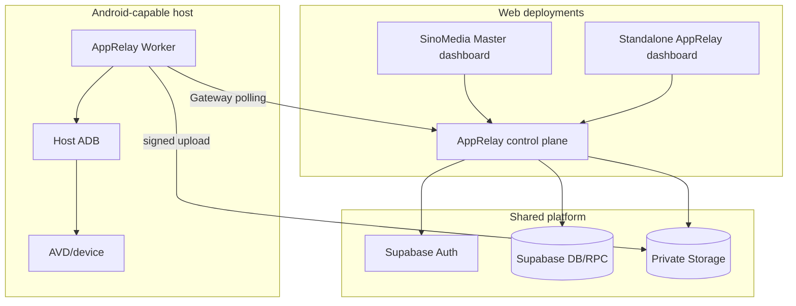

### 20.2 Deployment profiles

| Profile | Components |
|---|---|
| Standalone | Standalone UI + control plane + shared Supabase + Worker |
| Master-integrated | Master UI + control plane + shared Supabase + Worker |
| Dual-dashboard | Both UIs + one control plane + shared Supabase + Worker |

### 20.3 Worker packaging

Retain V1 Dockerized Node Worker with host-managed ADB/device, or native supervised service where host/container ADB integration is unreliable.

### 20.4 CI/CD target

1. lint and type-check;
2. unit/integration tests;
3. public contract tests;
4. Worker Gateway state tests;
5. OpenAPI generation/lint/diff;
6. build immutable control-plane and Worker artifacts;
7. deploy staging;
8. standalone and Master smoke tests;
9. controlled device E2E;
10. production rollout and rollback readiness.

### 20.5 Availability behavior

- Standalone UI can operate without Master web availability.
- Master surfaces a graceful AppRelay-unavailable state.
- No new Worker claims occur when control plane/Supabase is unavailable.
- Worker continues only while lease/heartbeat remains valid.

---

## 21. Testing

### 21.1 Public API

- valid/expired/invalid JWT;
- admin/non-admin authorization;
- allowed/rejected origins and preflight;
- schema/body/query validation;
- idempotent create/retry;
- pagination/filter stability;
- safe error envelope;
- Worker endpoints absent from public spec.

### 21.2 Application and data

- URL/package validation;
- atomic job/audit creation;
- capability-aware concurrent claim;
- lease/attempt checks;
- idempotent completion;
- artifact expiry and deletion;
- shared-schema compatibility with non-AppRelay jobs.

### 21.3 Worker

Retain V1 unit, fixture, fake-Gateway, fake-ADB, filesystem and controlled device E2E coverage.

### 21.4 Dual-dashboard contract

Run the same approved use-case suite against:

1. standalone dashboard;
2. Master dashboard;
3. direct public API test client.

All three must produce equivalent backend state.

### 21.5 Acceptance criteria

- Either dashboard can create and operate a `pull_apk` job.
- Both dashboards observe the same job/events/artifact state.
- Standalone mode does not depend on Master web deployment.
- Worker uses only Gateway and signed Storage transfer.
- No ZIP bytes pass through API functions.
- Generated public OpenAPI matches implementation.

---

## 22. Coding Convention

- `kebab-case` files and `PascalCase` types/classes.
- Runtime schemas are the contract source, not duplicated interface-only types.
- Thin route handlers and Gateway handlers call application services.
- One repository per persistence responsibility.
- Discriminated payload/result unions by job type and schema version.
- Stable error codes and explicit retry classification.
- UTC timestamps internally.
- Structured logs and bounded metadata.
- ADB/process execution uses argument arrays.
- UI components contain presentation behavior only.
- Generated OpenAPI is never edited manually.

---

## 23. Design Patterns

| Pattern | Use |
|---|---|
| Modular service/control plane | Independent deployment within Release Ops business domain |
| Ports and adapters | UI, API, DB, Storage, Gateway, ADB and Play integrations |
| Application service | One orchestration implementation for both dashboards |
| Repository/RPC adapter | Encapsulated shared Supabase access |
| API client | Master and standalone depend on public contract |
| Capability dispatch | `pull_apk` routed only to compatible Workers |
| Lease/heartbeat | Exclusive work ownership and crash recovery |
| State machine | Generic job lifecycle with APK event stages |
| Saga/compensation | Device/local cleanup after multi-step failure |
| Direct object transfer | Large artifacts bypass control-plane bytes |
| Idempotency | Safe create, retry, completion and deletion |

---

## 24. Strengths

- Preserves the proven V1 Worker and artifact safety model.
- Allows standalone operation without duplicating backend behavior.
- Integrates with Master through a stable API instead of repository coupling.
- Keeps shared Supabase Auth and Release Ops data model.
- Separates user and Worker security surfaces.
- Enables code-generated frontend types and contract tests.
- Supports independent backend deployment and rollback.
- Avoids service-role credentials on browsers and Workers.
- Keeps device-specific complexity outside web runtimes.

---

## 25. Technical Debt and Risks

| Risk/gap | Severity | Required treatment |
|---|---|---|
| Public AppRelay routes not evidenced in tree | Critical | Implement and test before frontend handoff |
| V1 mixes current and target claims | High | Preserve V1 as as-is; use this V2 as target |
| Worker Gateway status conflicts across documents | High | Audit code and runtime deployment |
| Two OpenAPI generator locations | High | Select one canonical generator |
| Existing YAML provenance uncertain | High | Reconcile and regenerate from actual runtime code |
| Server Actions may contain business logic | High | Extract application services |
| Shared table ownership can create coupling | High | Enforce job-type boundary and migration governance |
| Cross-origin auth not implemented/evidenced | High | JWT and CORS implementation/tests |
| Direct browser Realtime couples table schema | Medium | Polling baseline or formal Realtime contract |
| Standalone and Master UI behavior can drift | High | Shared API client and common E2E scenarios |
| Monitoring backend not evidenced | Medium | Add metrics/log aggregation/alerts |
| Device/Play UI volatility | High | Fixtures, diagnostics, dead-letter and manual repair |
| Shared Supabase outage affects all clients | High | Graceful UI failure, alerting and recovery runbook |

---

## 26. Implementation Plan

### Phase 0 — Architecture approval

- Approve dual-dashboard ADR.
- Preserve V1 under `as-is`.
- Approve this V2 under `to-be-v2`.
- Confirm shared Supabase and canonical namespaces.

### Phase 1 — Current-state audit

- Inspect actual routes, actions, schemas, services, repositories and tests.
- Resolve Worker Gateway status conflict.
- Trace YAML generator and runtime source.
- Produce evidence and mismatch matrices.

### Phase 2 — API design

- Run `$design-apprelay-api-spec` in Design mode.
- Revise `API_SPEC.md` for one public API and separate Worker Gateway.
- Mark all operations honestly.
- Approve contract before code changes.

### Phase 3 — Application core extraction

- Move business rules out of UI/actions.
- Centralize state, errors, auth and artifact behavior.
- Add service/repository tests.

### Phase 4 — Public API implementation

- Implement public routes, JWT, CORS and schemas.
- Add idempotency, pagination and stable errors.
- Add integration/contract tests.

### Phase 5 — Worker plane hardening

- Finish Gateway/RPC/lease/token/artifact behavior.
- Remove any privileged direct Worker data access.
- Preserve V1 pipeline safety.

### Phase 6 — Standalone dashboard migration

- Convert to public API client.
- Keep thin actions only when required.
- Add standalone E2E.

### Phase 7 — Master integration

- Add Master pages/navigation and typed client.
- Use direct JWT call or thin BFF.
- Remove duplicate `pull_apk` writes.
- Add Master E2E and failure states.

### Phase 8 — Reconciliation and OpenAPI

- Run Reconcile mode against code.
- Resolve mismatches.
- Generate/lint `openapi.public.yaml`.
- Add CI diff and public/internal separation.

### Phase 9 — Deployment and cutover

- Deploy control plane in staging.
- Connect standalone, then Master behind feature flag.
- Run dual-dashboard observation.
- Test rollback, token rotation, cleanup and outage handling.

---

## 27. Appendix

### 27.1 Architecture decision record

**Decision:** AppRelay remains a Release Ops capability but gains an independent deployment boundary and one canonical public API serving two dashboard clients.

**Consequences:**

- public API/JWT/CORS become required;
- Server Actions are no longer the only dashboard interface;
- Master must not duplicate AppRelay orchestration;
- shared Supabase schema requires governance;
- two frontend E2E paths must be maintained;
- backend can be deployed/rolled back independently.

### 27.2 Worker capability metadata

```json
{
  "workerVersion": "1.0.0",
  "capabilities": ["app_artifact_acquisition"],
  "jobTypes": ["pull_apk"],
  "devices": [
    {
      "deviceId": "emulator-5554",
      "status": "ready",
      "playReady": true,
      "sdk": 35,
      "abi": "arm64-v8a",
      "density": 420,
      "locale": "en-US",
      "maxParallelJobs": 1
    }
  ]
}
```

### 27.3 Pipeline stages

| Stage | Progress hint |
|---|---:|
| `claimed` | 1–3 |
| `scraping_listing` | 4–20 |
| `preparing_device` | 21–30 |
| `installing` | 31–55 |
| `pulling_apks` | 56–72 |
| `validating` | 73–80 |
| `packaging` | 81–88 |
| `uploading_artifact` | 89–96 |
| `cleaning` | 97–99 |
| `completed` | 100 |

### 27.4 Cleanup invariants

1. Never uninstall a package that existed before the job.
2. Never delete a path not proven below the job root.
3. Never mark success before private object verification.
4. Never accept completion without current unexpired lease.
5. Never let Worker choose arbitrary object key.
6. Never put credentials or signed URLs into payloads/events.
7. Never run two APK jobs concurrently on one device.

### 27.5 Contract lifecycle

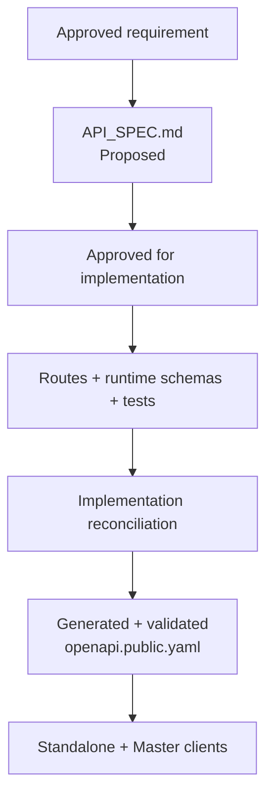

### 27.6 Final Definition of Done

- [ ] V1 is preserved as the previous/as-is architecture.
- [ ] V2 is approved as the target architecture.
- [ ] One backend serves both dashboard origins.
- [ ] Standalone operation does not require Master web availability.
- [ ] Both dashboards use the same public contract.
- [ ] Shared Supabase Auth and Release Ops data remain compatible.
- [ ] Master and standalone UI contain no duplicate AppRelay orchestration.
- [ ] Public API validates JWT, authorization and CORS.
- [ ] Worker uses only scoped Gateway credentials.
- [ ] Worker has no service-role credential or inbound public port.
- [ ] Artifact bytes transfer directly through signed Storage operations.
- [ ] Job claim, lease, retry, cancellation and completion are tested.
- [ ] Both dashboards pass equivalent end-to-end use cases.
- [ ] `openapi.public.yaml` is generated from implemented runtime code.
- [ ] Worker Gateway operations are absent from the frontend contract.
- [ ] Rollback, outage, credential rotation and cleanup runbooks are tested.
