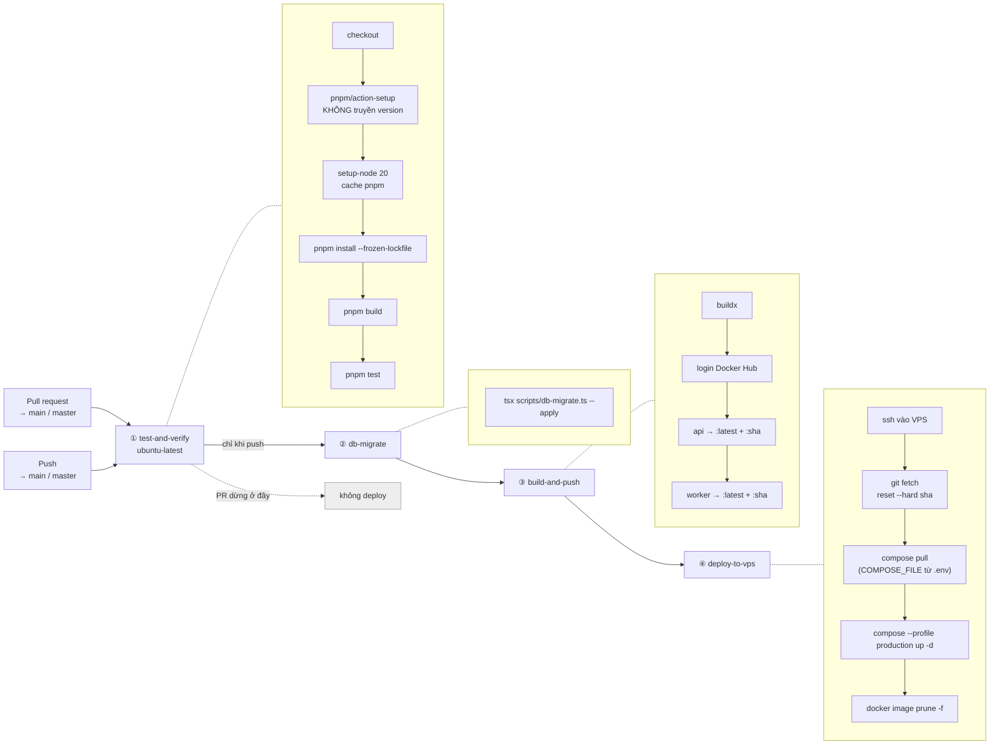

# CI/CD

Ghi lại pipeline **đang chạy** tại [.github/workflows/ci.yml](../.github/workflows/ci.yml), không phải pipeline mong muốn.

---

## 1. Sơ đồ



---

## 2. Bốn job

### ① `test-and-verify`

Chạy trên **mọi** push và PR. Là job duy nhất PR chạy.

```yaml
- uses: pnpm/action-setup@v4        # không có input `version`
- uses: actions/setup-node@v4
  with: { node-version: 20, cache: 'pnpm' }
- run: pnpm install --frozen-lockfile
- run: pnpm build
- run: pnpm test
```

> `pnpm/action-setup` **cố ý không truyền `version`**. Version lấy từ `packageManager` trong `package.json` gốc. Truyền cả hai thì action fail với "Multiple versions of pnpm specified".

`pnpm test` chạy `--recursive`, tức là ba package đều chạy `typecheck` rồi `tsx --test src/**/*.test.ts`. Xem [test-case.md](test-case.md).

### ② `db-migrate`

`needs: test-and-verify`, `if: github.event_name == 'push'`.

```bash
pnpm exec tsx scripts/db-migrate.ts --apply
```

Secret: `SUPABASE_ACCESS_TOKEN`, `SUPABASE_PROJECT_REF`, `SUPABASE_DB_URL`.

Script giữ sổ `public.schema_migrations` kèm checksum: migration đã áp mà nội dung file đổi thì **từ chối chạy**, không âm thầm bỏ qua.

> Job này **không** gọi `notify pgrst, 'reload schema'`. Với Supabase Cloud thì không sao (tự reload). Với self-host thì phải làm tay — xem [runbook.md](runbook.md).

### ③ `build-and-push`

`needs: db-migrate`, chỉ khi push.

Hai image, mỗi image hai tag:

```text
<user>/app-relay-api:latest      <user>/app-relay-api:<github.sha>
<user>/app-relay-worker:latest   <user>/app-relay-worker:<github.sha>
```

Tag `github.sha` là **toàn bộ cơ chế rollback** của dự án. Không có nó thì `latest` là đường một chiều.

Secret: `DOCKERHUB_USERNAME`, `DOCKERHUB_TOKEN`.

Image worker ~4 GB (JDK + Android SDK + system image `android-35;google_apis_playstore;x86_64`) nên job này là job chậm nhất.

### ④ `deploy-to-vps`

`needs: build-and-push`, chỉ khi push. SSH vào VPS rồi chạy:

```bash
set -e

cd $VPS_DEPLOY_PATH          # mặc định /root/app-relay
test -d .git || exit 1       # thư mục deploy PHẢI là git clone
git fetch --prune origin
git checkout -f $GITHUB_REF_NAME
git reset --hard $GITHUB_SHA

if [ -d "deploy" ]; then cd deploy; fi

docker compose pull
docker compose up -d --remove-orphans
docker image prune -f
```

Secret: `VPS_HOST`, `VPS_USER`, `VPS_SSH_KEY`, `VPS_SSH_PORT` (mặc định 22), `VPS_DEPLOY_PATH`.

**Ba điều kiện tiên quyết trên VPS** — thiếu cái nào job này cũng vô nghĩa hoặc fail:

1. `$VPS_DEPLOY_PATH` là một **git clone** của repo (private repo → cần deploy key trong `~/.ssh` của `VPS_USER`). Job fail sớm với thông báo rõ nếu không phải.
2. `deploy/.env` đã được [bootstrap.sh](../deploy/bootstrap.sh) sinh ra, chứa `COMPOSE_FILE` và `COMPOSE_PROFILES`.
3. `deploy/.env.api`, `deploy/.env.worker` tồn tại — pipeline không tạo chúng.

#### Tại sao `set -e`

`appleboy/ssh-action` mặc định `script_stop: false`, tức là **không dừng khi một lệnh fail**. Không có `set -e` thì `docker compose pull` hỏng vẫn chạy tiếp tới `echo "✅ deployed successfully"` và job báo xanh.

#### Tại sao `reset --hard` chứ không phải `pull`

Image do job ③ build, nhưng **file compose và Caddyfile không nằm trong image** — chúng đọc từ đĩa VPS lúc `up`. Không đồng bộ git ở bước này thì mọi thay đổi trong `deploy/` không bao giờ tới máy đích.

`reset --hard` thay vì `pull` vì hai lý do: git là nguồn sự thật cho file compose, và commit trên VPS phải khớp **đúng** commit đã build ra image.

> Lệnh này **xoá mọi sửa tay trên file đã track** ở VPS. File `.env`, `.env.api`, `.env.worker` an toàn — chúng gitignore nên untracked, ngoài tầm với của `reset --hard`.

#### Tại sao không còn `-f` lẫn `--profile`

Chuỗi file compose lấy từ `COMPOSE_FILE` trong `deploy/.env`, do `bootstrap.sh` sinh:

```text
compose.yml:compose.supabase.yaml:compose.prod.yaml
compose.yml:compose.kvm.yaml:compose.supabase.yaml:compose.prod.yaml   # máy có /dev/kvm
```

Việc dò `/dev/kvm` thuộc về `bootstrap.sh` — nó chạy trên chính máy đích nên nó mới biết máy có KVM, có chạy Supabase self-host hay không. CI không cần đoán.

Trước đây CI truyền `-f compose.yml` tường minh, mà **`-f` đè `COMPOSE_FILE`**. Hệ quả là mỗi lần deploy tự động lại âm thầm làm rơi hai overlay:

| Rơi mất | Hậu quả |
|---|---|
| `compose.prod.yaml` | mất xoay log (`max-size: 10m`) → vài tuần là đầy đĩa; mất `stop_grace_period: 120s` → emulator bị SIGKILL sau 10s, **hỏng AVD** |
| `compose.supabase.yaml` | `--remove-orphans` **xoá** container `db`/`rest` do bootstrap dựng |

`--profile production` cũng bỏ, cùng lý do: [bootstrap.sh:237](../deploy/bootstrap.sh#L237) cố ý để `COMPOSE_PROFILES` **rỗng** ở chế độ `--http-only` để Caddy không khởi động. Cờ tường minh trong CI sẽ dựng Caddy dậy bất chấp và giành cổng 80/443.

Cả ba đã sửa.

> Quy tắc chung cho job ④: **không cờ nào của `docker compose` được hardcode trong CI.** Máy đích tự mô tả nó qua `deploy/.env`; CI chỉ đồng bộ git rồi gọi `pull` + `up -d`.

---

## 3. Secret cần có

| Secret | Job | Không có thì |
|---|---|---|
| `SUPABASE_ACCESS_TOKEN` | ② | |
| `SUPABASE_PROJECT_REF` | ② | |
| `SUPABASE_DB_URL` | ② | migrate fail → chặn ③④ |
| `DOCKERHUB_USERNAME` | ③④ | login fail → chặn ④ |
| `DOCKERHUB_TOKEN` | ③ | |
| `VPS_HOST` | ④ | |
| `VPS_USER` | ④ | |
| `VPS_SSH_KEY` | ④ | ssh fail |
| `VPS_SSH_PORT` | ④ | mặc định 22 |
| `VPS_DEPLOY_PATH` | ④ | mặc định `/root/app-relay` |

Secret **không** đi vào image — chúng chỉ tồn tại trong runner. Biến ứng dụng (`API_TOKEN`, `SUPABASE_SECRET_KEY`…) nằm trong `deploy/.env.*` **trên máy đích**, pipeline không đụng tới.

Hệ quả: **thêm biến env mới thì phải sửa tay trên VPS**, pipeline không tự làm. Đây là bước dễ quên nhất khi deploy — nằm trong [checklist.md](checklist.md).

---

## 4. Rollback

### Code

```bash
cd /opt/app-relay/deploy
IMAGE_TAG=<sha-cũ> DOCKERHUB_USERNAME=<user> docker compose --profile production up -d
```

Không cần `-f` — `COMPOSE_FILE` trong `deploy/.env` lo phần đó.

Cố định thì ghi `IMAGE_TAG=<sha>` vào `deploy/.env`. Bỏ dòng đó ra là quay về `latest`.

> `deploy/.env` untracked nên `git reset --hard` của job ④ **không xoá** dòng ghim này. Ghim xong mà quên gỡ thì mọi push sau đó vẫn build image mới, deploy vẫn báo xanh, còn VPS thì đứng yên ở SHA cũ.

### Schema

**Không có rollback tự động.** Migration không có `down`. Chi tiết ở [runbook.md §10](runbook.md).

Ràng buộc quan trọng: `db-migrate` chạy **trước** `build-and-push`, nên luôn có một khoảng schema mới chạy cùng code cũ. **Mọi migration phải tương thích ngược.** Hiện đúng — migration của dự án toàn `add column if not exists` — nhưng đó là ràng buộc thiết kế, không phải may mắn.

---

## 5. Bốn khoảng trống

Ghi rõ thay vì để người sau tự phát hiện.

### 5.1. Không có branch protection

Push thẳng lên `main` chạy hết bốn job và deploy lên VPS. Không có review bắt buộc, không có status check chặn merge.

Cần thì bật trong Settings → Branches: yêu cầu PR, yêu cầu `test-and-verify` xanh, cấm push trực tiếp.

### 5.2. Migration chạy trước image

Xem §4. Chưa gãy vì migration hiện toàn là `add column`, nhưng `drop column` hay `rename` sẽ làm production 500 trong vài phút giữa job ② và job ④.

### 5.3. Pipeline chỉ deploy VPS profile `production`

Job ④ dùng `--profile production` (Caddy). WSL server chạy cloudflared và **hoàn toàn nằm ngoài pipeline** — nó deploy tay theo [runbook.md](runbook.md).

Nghĩa là: hiện có **hai đường deploy khác nhau** cho hai môi trường, và chỉ một đường được tự động hoá. Ai vận hành WSL phải biết CI không đụng tới máy mình.

### 5.4. CI test Node 20, production chạy Node 22

| Nơi | Node |
|---|---|
| `setup-node` trong CI | **20** |
| `apps/api/Dockerfile` | **22** (`node:22-alpine`) |
| `apps/worker/Dockerfile` | 20 (nodesource) |
| `package.json` `engines` | `>=18` |

API image phải là Node 22 vì `@supabase/supabase-js >= 2.112` cần native WebSocket và crash trên Node 20 — comment trong Dockerfile ghi rõ.

Nghĩa là **CI đang test API trên runtime khác với production**. Lỗi chỉ xuất hiện trên một trong hai sẽ lọt lưới.

Cách sửa đúng: nâng `setup-node` lên 22, **không** hạ Dockerfile xuống 20. Nằm trong [plan.md](plan.md).

---

## 6. Thứ chưa có trong pipeline

| Chưa có | Ảnh hưởng | Ưu tiên |
|---|---|---|
| `pnpm audit` / Dependabot | CVE không ai biết | cao |
| Smoke test sau deploy | container crash-loop ngay sau `up -d` vẫn báo "✅ deployed successfully" | cao |
| Đo coverage | không biết phần nào chưa test | trung bình |
| Lint (ESLint/Prettier) | chỉ có `tsc --noEmit` | trung bình |
| Cache Docker layer | job ③ build lại SDK mỗi lần | trung bình |
| Duyệt tay trước khi deploy | mọi push lên main là deploy thẳng | thấp |
| Quét secret (gitleaks) | dựa hoàn toàn vào `.gitignore` | cao |

### Smoke test — đề xuất cụ thể

Thêm vào cuối job ④, ngay trước dòng `echo "✅"`:

```bash
sleep 15
curl -fsS http://127.0.0.1:3000/v1/health || { echo "health check FAILED"; exit 1; }
```

Không có nó thì `deploy-to-vps` báo thành công kể cả khi container crash-loop ngay sau `up -d` — vì `docker compose up -d` trả về ngay khi container **khởi động**, không chờ nó **healthy**.

---

## 7. Chạy pipeline tại chỗ

Trước khi push, chạy đúng thứ CI sẽ chạy:

```bash
pnpm install --frozen-lockfile
pnpm build
pnpm test
```

Ba lệnh này là toàn bộ job ①. Xanh ở máy thì gần như chắc chắn xanh trên CI — khác biệt còn lại chỉ là Node version (§5.4).

Thử migration mà không đụng production:

```bash
# Không có --apply là dry run
SUPABASE_DB_URL='postgres://…' pnpm exec tsx scripts/db-migrate.ts
```

Thử build image:

```bash
docker build -f apps/api/Dockerfile -t app-relay-api:test .
docker build -f apps/worker/Dockerfile -t app-relay-worker:test .   # ~30 phút
```
