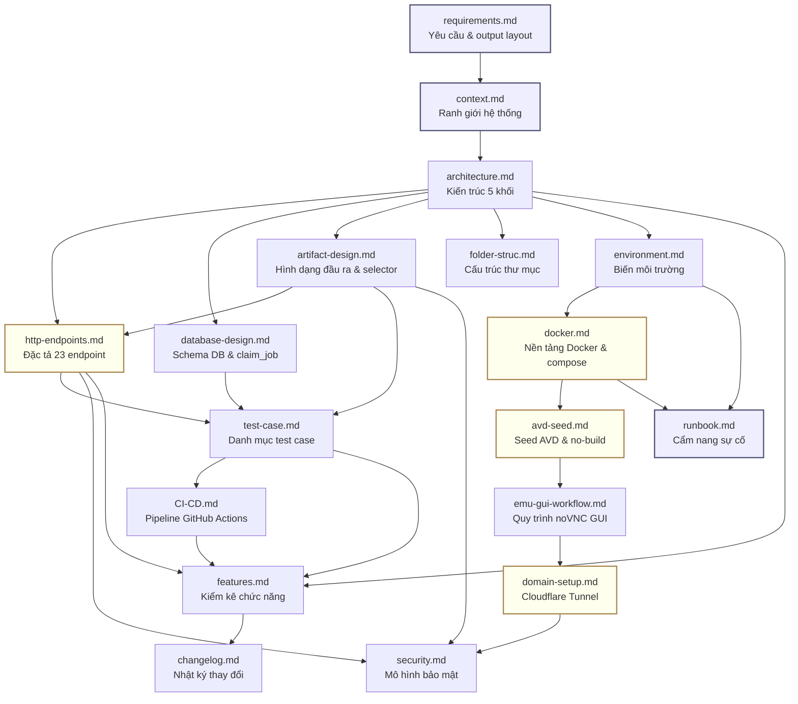

# Tài liệu app-relay

Dịch vụ HTTP nhận URL Google Play, dùng Android emulator kéo APK + listing về, đóng gói artifact và giao lại cho người gọi qua HTTP API.

Backend thuần — **không có dashboard**, không có quản lý tài khoản người dùng, người gọi là hệ thống khác.

---

## Đọc gì trước

| Tôi là… | Đọc theo thứ tự |
|---|---|
| **Đối tác gọi API** | [http-endpoints.md](http-endpoints.md) → [artifact-design.md](artifact-design.md) → [domain-setup.md](domain-setup.md) |
| **Dev mới vào dự án** | [requirements.md](requirements.md) → [context.md](context.md) → [architecture.md](architecture.md) → [folder-struc.md](folder-struc.md) |
| **Người dựng môi trường dev** | [docker.md](docker.md) → [environment.md](environment.md) → [`../deploy/README.md`](../deploy/README.md) |
| **Người vận hành / deploy VPS** | [docker.md](docker.md) → [avd-seed.md](avd-seed.md) → [emu-gui-workflow.md](emu-gui-workflow.md) → [domain-setup.md](domain-setup.md) → [`../deploy/README.md`](../deploy/README.md) |
| **Người mở API ra Internet** | [domain-setup.md](domain-setup.md) → [security.md](security.md) |
| **Người trực khi có sự cố (Ops)** | [runbook.md](runbook.md) |
| **AI làm việc trên repo** | [`../AGENTS.md`](../AGENTS.md) → [`../CLAUDE.md`](../CLAUDE.md) → [context.md](context.md) → [architecture.md](architecture.md) → [folder-struc.md](folder-struc.md) → [http-endpoints.md](http-endpoints.md) |
| **Người review code & kiểm thử** | [test-case.md](test-case.md) → [CI-CD.md](CI-CD.md) |
| **Người xem tổng quan tính năng** | [features.md](features.md) → [changelog.md](changelog.md) |

---

## Toàn bộ tài liệu

### 1. Yêu cầu & Ranh giới (Requirements & Context)

| File | Nội dung |
|---|---|
| [requirements.md](requirements.md) | Yêu cầu nghiệp vụ cốt lõi: nhận URL Play Store, pipeline 5 bước trích xuất APK + listing + screenshots, layout thư mục artifact bắt buộc, tiêu chí nghiệm thu. |
| [context.md](context.md) | Ranh giới hệ thống: mô hình hộp đen app-relay, các actor (đối tác gọi API, người vận hành qua noVNC, Google Play, Supabase/Postgres), luồng dữ liệu qua ranh giới. |
| [features.md](features.md) | Bản kiểm kê 13 khối chức năng đối chiếu trực tiếp với codebase, phân loại trạng thái (✅ Đang dùng thật / 🟨 Chưa đủ / ⬜ Chưa làm), các tính năng chưa có. |

### 2. Kiến trúc & Thiết kế (Architecture & Design)

| File | Nội dung |
|---|---|
| [architecture.md](architecture.md) | Kiến trúc tổng thể 5 khối (Cửa vào → Quầy tiếp nhận API → Sổ cái DB → Kho đĩa Artifacts → Máy làm việc Worker), luồng xử lý đơn hàng từ nhận URL tới bàn giao artifact. |
| [http-endpoints.md](http-endpoints.md) | Đặc tả 23 HTTP API endpoint (14 public `/v1` + 9 internal `/internal/v1`), 3 mặt phẳng xác thực (`API_TOKEN`, `WORKER_TOKEN`, HMAC signed URL), định dạng phản hồi chuẩn, mã lỗi, phân trang. |
| [database-design.md](database-design.md) | Thiết kế CSDL Postgres / Supabase, ERD 5 bảng (`jobs`, `job_events`, `apps`, `workers`, `artifacts`), hàm điều phối `claim_job()`, Row Level Security (RLS), quy trình migration. |
| [artifact-design.md](artifact-design.md) | Cấu trúc chi tiết thư mục output (`base.apk`, `split_config.*.apk`, `PULL_MANIFEST.txt`, `listing.json`, `screenshots/`), 8 bộ lọc tải `select` (ZIP / APK thô), TTL dọn dẹp. |
| [folder-struc.md](folder-struc.md) | Cây thư mục toàn monorepo (`apps/api`, `apps/worker`, `packages/contracts`, `packages/shared`, `deploy/`, `supabase/`, `scripts/`, `docs/`), trách nhiệm từng module và quy tắc phụ thuộc. |

### 3. Môi trường, Docker & Vận hành (Environment, Docker & Ops)

| File | Nội dung |
|---|---|
| [environment.md](environment.md) | Quản lý biến môi trường cho 3 môi trường (Local, Staging, Prod), bảng tra cứu chi tiết các biến cấu hình (`.env.api`, `.env.worker`, `deploy/.env`). |
| [docker.md](docker.md) | Nền tảng Docker & Docker Compose, 7 image của dự án, cơ chế ghép file compose overlay, phân biệt dữ liệu trong image vs 3 volume (`worker-avd`, `db-data`, `artifacts-data`), dọn dẹp đĩa an toàn, KVM. |
| [avd-seed.md](avd-seed.md) | **Chủ sở hữu duy nhất** về seed AVD (`avd-seed.tar.gz` ~2.4GB): cách snapshot phiên đăng nhập Google Play, nhúng vào Docker image của worker và cơ chế `--no-build`. |
| [emu-gui-workflow.md](emu-gui-workflow.md) | Toàn cảnh 3 giai đoạn (dựng local → lên VPS lần đầu → CI tự động), cơ chế noVNC GUI (`WORKER_GUI=on`) trên cổng 6080 để đăng nhập Google Play thủ công khi cần. |
| [domain-setup.md](domain-setup.md) | Hướng dẫn đưa API ra Internet an toàn qua Cloudflare Tunnel (Quick Tunnel vs Named Tunnel), cấu hình WAF chặn endpoint nội bộ, thông tin bàn giao cho đối tác. |
| [runbook.md](runbook.md) | Cẩm nang xử lý sự cố vận hành: cây chẩn đoán triệu chứng → hành động, bảng 15 sự cố thường gặp, quy trình rollback, sao lưu và phục hồi CSDL (backup/restore). |

### 4. Kiểm thử, CI/CD, Bảo mật & Nhật ký (Quality, Security & Changelog)

| File | Nội dung |
|---|---|
| [test-case.md](test-case.md) | Danh mục ~120 test case có mã định danh ID, phân loại kiểm thử tự động / thủ công, mục tiêu độ phủ (coverage) theo từng phân vùng logic. |
| [CI-CD.md](CI-CD.md) | Pipeline tự động hoá GitHub Actions (lint, typecheck, test, build container, scan), quản lý secrets CI/CD. |
| [security.md](security.md) | Ranh giới tin cậy, ma trận phân quyền, xác thực Bearer token constant-time SHA-256, chữ ký HMAC cho link tải artifact, danh sách nợ bảo mật đã biết. |
| [changelog.md](changelog.md) | Nhật ký thay đổi theo ngày, phân loại Added / Changed / Fixed / Removed, đánh dấu các thay đổi breaking. |

---

## Quan hệ giữa các file



---

## Chủ sở hữu sự thật — mỗi thứ chỉ có MỘT chỗ để sửa

Để tránh việc sửa một chỗ mà quên chỗ khác, mỗi mảng kiến thức kỹ thuật có đúng một file làm chủ sở hữu duy nhất (Single Source of Truth). File khác cần nhắc tới chỉ **trỏ link**, không sao chép lại:

| Sự thật | Chủ sở hữu duy nhất |
|---|---|
| Khái niệm Docker · 7 image của dự án · ghép compose · volume · KVM | [docker.md](docker.md) |
| Seed AVD (`avd-seed.tar.gz`) · nhúng image · cờ `--no-build` | [avd-seed.md](avd-seed.md) |
| Đưa API ra Internet qua Cloudflare Tunnel · Quick vs Named · bàn giao đối tác | [domain-setup.md](domain-setup.md) |
| Đặc tả 23 API endpoint · request/response schema · mã lỗi · selector | [http-endpoints.md](http-endpoints.md) |
| Thiết kế CSDL Postgres · 5 bảng · hàm `claim_job()` · RLS · PostgREST | [database-design.md](database-design.md) |
| Cấu trúc thư mục artifact · tên file hợp đồng · 8 selector download | [artifact-design.md](artifact-design.md) |
| Bảng biến môi trường đầy đủ · giá trị mặc định · biến throw khi boot | [environment.md](environment.md) |
| Cây thư mục repo · nhiệm vụ từng thư mục · quy tắc phụ thuộc | [folder-struc.md](folder-struc.md) |
| Xử lý sự cố · cây chẩn đoán triệu chứng · backup & restore DB | [runbook.md](runbook.md) |
| Quy trình noVNC GUI · 3 giai đoạn môi trường emulator | [emu-gui-workflow.md](emu-gui-workflow.md) |
| Danh mục ~120 test case · phân loại tự động / thủ công · độ phủ | [test-case.md](test-case.md) |
| Pipeline GitHub Actions · build container · quản lý secrets | [CI-CD.md](CI-CD.md) |
| Ranh giới tin cậy · xác thực token · HMAC signed URL · nợ bảo mật | [security.md](security.md) |
| Kiểm kê tính năng đang có · trạng thái hoàn thành | [features.md](features.md) |
| Lịch sử thay đổi codebase theo ngày | [changelog.md](changelog.md) |

> **Lưu ý**: [`deploy/README.md`](../deploy/README.md) chỉ giữ thông tin **thao tác đặc thù trên máy dev này** (số cổng bind, `COMPOSE_FILE`, cấu hình đo được), không chứa lý thuyết chung.

---

## Nguyên tắc tài liệu

1. **`docs/` là tài liệu sống duy nhất**: Mọi thay đổi về code, API, cấu hình hay quy trình deploy đều phải được cập nhật tương ứng vào `docs/`.
2. **Doc sai nguy hiểm hơn doc thiếu**: Tài liệu phản ánh chính xác trạng thái thực tế của code. Khi sửa code, luôn đối chiếu bảng phân quyền sở hữu sự thật để cập nhật đúng file chủ.

Các lệnh kiểm tra tính đúng đắn của codebase:

```bash
# Kiểm tra type toàn bộ monorepo
pnpm typecheck

# Chạy test suite
pnpm test

# Chạy probe kiểm tra endpoints
pnpm probe:endpoints
```

