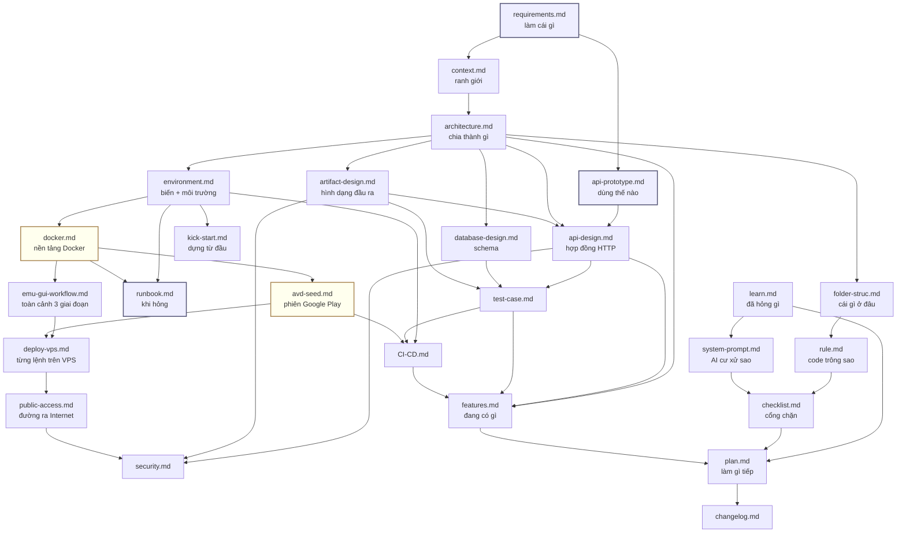

# Tài liệu app-relay

Dịch vụ HTTP nhận URL Google Play, dùng Android emulator kéo APK + listing về, giao lại cho người gọi.

Backend thuần — **không có dashboard**, không có tài khoản, người gọi là hệ thống khác.

---

## Đọc gì trước

| Tôi là… | Đọc theo thứ tự |
|---|---|
| **Đối tác gọi API** | [api-prototype.md](api-prototype.md) → [api-design.md](api-design.md) |
| **Dev mới vào dự án** | [requirements.md](requirements.md) → [architecture.md](architecture.md) → [folder-struc.md](folder-struc.md) → [rule.md](rule.md) |
| **Người dựng hệ thống** | [kick-start.md](kick-start.md) → [environment.md](environment.md) |
| **Người chưa quen Docker** | [docker.md](docker.md) → [`../deploy/README.md`](../deploy/README.md) |
| **Người deploy lên VPS** | [docker.md](docker.md) → [emu-gui-workflow.md](emu-gui-workflow.md) → [avd-seed.md](avd-seed.md) → [deploy-vps.md](deploy-vps.md) → [public-access.md](public-access.md) |
| **Người mở API cho đối tác** | [public-access.md](public-access.md) → [security.md](security.md) |
| **Người trực khi có sự cố** | [runbook.md](runbook.md) |
| **AI làm việc trên repo** | [system-prompt.md](system-prompt.md) → [rule.md](rule.md) → [checklist.md](checklist.md) |
| **Người review code** | [checklist.md](checklist.md) → [test-case.md](test-case.md) |
| **Người muốn xem tổng quan đã làm được gì** | [features.md](features.md) |
| **Người quyết định làm gì tiếp** | [features.md](features.md) → [plan.md](plan.md) |

---

## Toàn bộ tài liệu

### B1 — Requirements

| File | Nội dung |
|---|---|
| [requirements.md](requirements.md) | Làm cái gì, xong là như thế nào. Bảng in/out scope, 5 user story kèm acceptance criteria, ràng buộc phi chức năng đo được, giả định chưa kiểm chứng |

### B2 — Design & Architect (định hướng)

| File | Nội dung |
|---|---|
| [api-prototype.md](api-prototype.md) | Sản phẩm dùng như thế nào. 4 kịch bản bash chạy được, 5 trạng thái client phải xử lý, fake data để dựng client trước |
| [context.md](context.md) | Ranh giới hệ thống. Actor, hệ thống ngoài, dữ liệu qua ranh giới, và cái gì **không** chịu trách nhiệm |
| [system-prompt.md](system-prompt.md) | Chỉ thị cho AI. Stack chốt, quy trình GitNexus, và **bảng 20 cạm bẫy đã thử và hỏng** |

### B3 — Kick-start

| File | Nội dung |
|---|---|
| [kick-start.md](kick-start.md) | Dựng từ máy trắng. 10 bước, có nhánh rẽ khi không có KVM, 6 cổng xác nhận |

### B4 — Design & Architect (chi tiết)

| File | Nội dung |
|---|---|
| [architecture.md](architecture.md) | Thành phần, 4 sơ đồ (tổng quan · sequence · state machine · vòng đời artifact), **11 quyết định kiến trúc kèm phương án đã loại**, 9 nhược điểm đã biết |
| [folder-struc.md](folder-struc.md) | Cây thư mục từ `git ls-files`, mỗi thư mục chứa gì / **không** chứa gì, 4 luật phụ thuộc |
| [api-design.md](api-design.md) | 23 endpoint, 3 mặt phẳng xác thực, 8 selector, **bảng đầy đủ mã lỗi public + internal** |
| [database-design.md](database-design.md) | ERD, 5 bảng, `claim_job()` giải thích từng mệnh đề, RLS, quy trình migration |
| [artifact-design.md](artifact-design.md) | Hợp đồng hình dạng đầu ra. Layout chuẩn, **tên file nào là hợp đồng**, toàn vẹn sha256, TTL tách đôi, 3 chốt chống xoá nhầm |
| [environment.md](environment.md) | 3 môi trường, bảng đầy đủ biến env (sinh từ code), chọn overlay compose, quản lý secret |
| [runbook.md](runbook.md) | Triệu chứng → hành động. Cây chẩn đoán, bảng 15 sự cố, **rollback**, backup/restore |
| [rule.md](rule.md) | Code trông như thế nào. Naming, xử lý lỗi, comment, cấm gì, xử lý file lớn, truy vấn DB |

### B5 — Develop

| File | Nội dung |
|---|---|
| [features.md](features.md) | **Đang có gì.** Kiểm kê 13 khối chức năng đối chiếu thẳng với code, mỗi khối kèm trạng thái ✅/🟨/⬜, phần kiểm thử phủ tới đâu, và **bảng "chưa có" nói thẳng** |
| [plan.md](plan.md) | 14 task xếp P0/P1/P2, mỗi task có DoD, sơ đồ phụ thuộc, task rủi ro cao không giao AI |
| [learn.md](learn.md) | 17 bài học kèm triệu chứng và những hướng **không** hiệu quả |
| [changelog.md](changelog.md) | Theo ngày, nhóm Added/Changed/Fixed/Removed, breaking in đậm riêng |
| [checklist.md](checklist.md) | 4 cổng chặn + bảng đồng bộ tài liệu + **checklist riêng cho 5 vùng nguy hiểm** |

### B7 — Test / Deploy / Security

| File | Nội dung |
|---|---|
| [test-case.md](test-case.md) | ~120 case có ID, phân loại tự động / thủ công, mục tiêu coverage theo vùng |
| [docker.md](docker.md) | Nền tảng Docker cho người chưa có nền. 4 khái niệm, **bảng 7 image của dự án**, cách ghép 6 file compose, 3 con đường deploy, volume nào mất là mất thật, dọn đĩa an toàn, 6 cạm bẫy |
| [emu-gui-workflow.md](emu-gui-workflow.md) | Toàn cảnh 3 giai đoạn: dựng → lên VPS lần đầu → CI tự động. **4 hiểu nhầm thường gặp**, và **đánh giá thẳng quy trình này chuyên nghiệp tới đâu** |
| [avd-seed.md](avd-seed.md) | **Chủ sở hữu duy nhất** của mọi thứ về seed AVD, worker image và cờ `--no-build`. Cách chụp seed, vì sao CI không build worker, **4 chế độ hỏng đều im lặng**, 3 điều dễ mất tiền |
| [deploy-vps.md](deploy-vps.md) | VPS trắng → stack chạy được bằng `deploy/bootstrap.sh`. Tự chứa: Postgres self-host, **một bước tay duy nhất** (đăng nhập CH Play) |
| [public-access.md](public-access.md) | Đường ra Internet **chính thức**: Cloudflare Tunnel. Quick vs named, chuyển quick→named, vì sao bỏ Caddy, **giới hạn phải biết trước khi đưa cho đối tác** |
| [CI-CD.md](CI-CD.md) | 4 job đang chạy, secret cần có, rollback, **4 khoảng trống đã biết** |
| [security.md](security.md) | Ranh giới tin cậy, ma trận quyền, 7 chốt đã có, **8 nợ bảo mật ghi thẳng**, checklist trước khi mở public |

---

## Quan hệ giữa các file



Hai ô vàng là **file chủ**: `docker.md` giữ mọi sự thật về Docker/compose/volume,
`avd-seed.md` giữ mọi sự thật về seed và worker image. File khác trỏ về, không
chép lại — xem bảng dưới.

---

## Chủ sở hữu sự thật — mỗi thứ chỉ có MỘT chỗ để sửa

Mảng deploy từng bị chép lại ở 7 file: `compose.kvm` xuất hiện ở 13 file,
`COMPOSE_FILE` ở 12, `Docker Hub` ở 12. Hậu quả là đổi một cờ compose phải sửa
mười chỗ, và thực tế là **quên** — biến `EMULATOR_SCREEN_OFF_TIMEOUT` thêm ngày
2026-08-12 chỉ được ghi vào `changelog.md`.

Từ giờ mỗi sự thật có đúng một chủ. Cần nhắc lại ở file khác thì **trỏ link**,
không chép nội dung:

| Sự thật | Chủ sở hữu |
|---|---|
| Khái niệm Docker · 7 image của dự án · tên/tag/registry | [docker.md §1–2, §8](docker.md) |
| Ghép file compose · `COMPOSE_FILE` · dấu phân cách theo OS · profile | [docker.md §4](docker.md) |
| Volume nào chứa gì · trong image vs trong volume · cờ `-v` | [docker.md §6](docker.md) |
| `KVM_GID` lấy đúng cách · cạm bẫy đặc thù Docker | [docker.md §10](docker.md) |
| Seed AVD · `--no-build` · vì sao CI không build worker | [avd-seed.md](avd-seed.md) |
| Bảng biến môi trường · mặc định · biến nào throw lúc boot | [environment.md §2–3](environment.md) |
| Triệu chứng → xử lý · cây chẩn đoán · backup/restore | [runbook.md](runbook.md) |
| Đăng nhập Google Play qua noVNC (quy trình) | [deploy-vps.md §4](deploy-vps.md) |
| Đường ra Internet · quick vs named · đổi `API_TOKEN` sau HTTP trần | [public-access.md](public-access.md) |
| Đặc tả 23 endpoint · mã lỗi · selector | [api-design.md](api-design.md) |
| Đổi code thì phải sửa doc nào | [checklist.md §5](checklist.md) |

`deploy/README.md` chỉ giữ thứ **đặc thù máy dev này** (số cổng, `KVM_GID=991`,
cấu hình đo được), không giữ kiến thức chung.

---

## Hai điều cần biết trước khi sửa gì

**1. `new_setup/` là nguồn gốc, `docs/` là tài liệu sống.**

`new_setup/` chứa 10 file ghi chú thiết kế viết trong lúc dựng hệ thống. Chất lượng cao nhưng không có mục lục, trùng lặp giữa các file, và đã lệch với code ở vài chỗ. **Không sửa nó** — nó là bản ghi lịch sử. Mọi cập nhật vào `docs/`.

**2. Doc sai nguy hiểm hơn doc thiếu, vì AI tin doc.**

Bằng chứng có thật trong repo này: `new_setup/api-endpoint.md §4` hứa `pnpm test:endpoints` chạy được, trong khi bộ test đã bị xoá trong commit `ef53f90`. Ai đọc cũng tin là có test phủ 23 endpoint.

Bảng đồng bộ ở [checklist.md §5](checklist.md) nói rõ đổi gì thì phải sửa file nào.

---

## Trạng thái tài liệu

Đối chiếu với code tại commit `ef53f90` (2026-08-10). Index GitNexus: 628 nodes, 1013 edges, 22 clusters, 18 flows.

Sáu chỗ tài liệu cũ lệch với code đã được xử lý: bộ test bị xoá, `.env.api.example` thiếu 5 biến, `ARTIFACT_TTL_HOURS` lệch, URL tunnel đã chết, số liệu GitNexus trong `CLAUDE.md` cũ, cây thư mục thiếu 3 nhánh. Chi tiết và thứ tự sửa ở [plan.md](plan.md).

**Cập nhật 2026-08-12** — bốn chỗ lệch với *môi trường thật* (không phải với code) đã sửa:

| Chỗ lệch | Đã sửa ở |
|---|---|
| `deploy/README.md` mô tả distro WSL `Ubuntu-24.04` — distro đó đã bị xoá, engine thật là Docker Desktop | [`../deploy/README.md`](../deploy/README.md) viết lại, WSL hạ xuống mục 8 |
| Cách lấy `KVM_GID` sai (hỏi host thay vì hỏi docker engine) | [docker.md §10](docker.md), [`../deploy/README.md` §4](../deploy/README.md) |
| Dấu phân cách `COMPOSE_FILE` phụ thuộc OS — chưa từng được ghi | [docker.md §10](docker.md), [`../deploy/README.md`](../deploy/README.md) |
| `deploy-vps.md` giả định VPS đạt chuẩn; máy đích thật 2 vCPU / 3.9 GB và dùng chung với project khác | [deploy-vps.md §1](deploy-vps.md) |

Kèm theo: [docker.md §8](docker.md) thêm cảnh báo Docker Hub tự tạo repo **public**, [learn.md](learn.md) thêm 5 mục, [system-prompt.md](system-prompt.md) thêm 6 dòng vào bảng cạm bẫy.

Kiểm tài liệu còn khớp code:

```bash
node .gitnexus/run.cjs status --repo app-relay
```
