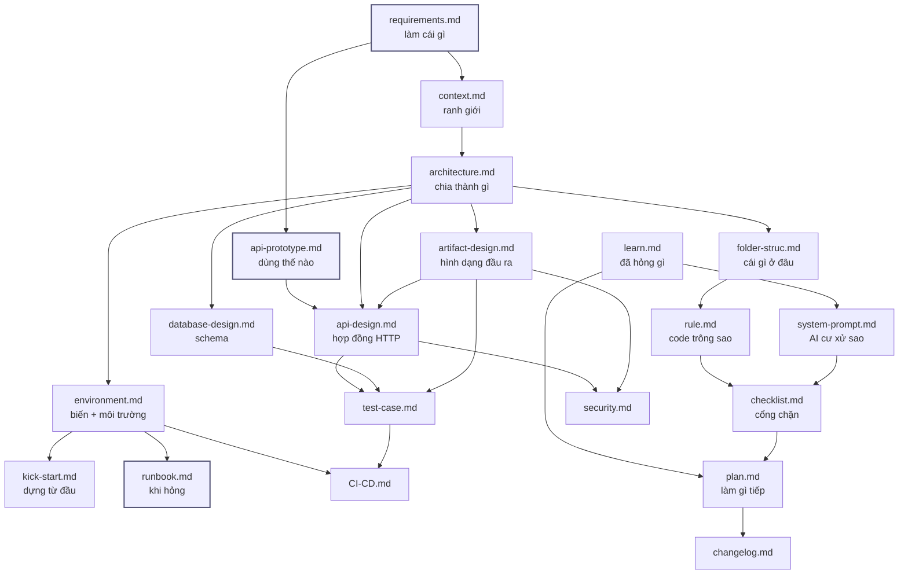

# Tài liệu app-relay

Dịch vụ HTTP nhận URL Google Play, dùng Android emulator kéo APK + listing về, giao lại cho người gọi.

Backend thuần — **không có dashboard**, không có tài khoản, người gọi là hệ thống khác.

---

## Đọc gì trước

| Tôi là… | Đọc theo thứ tự |
|---|---|
| **Đối tác gọi API** | [api-prototype.md](api-prototype.md) → [api-design.md](api-design.md) |
| **Dev mới vào dự án** | [requirements.md](requirements.md) → [architecture.md](architecture.md) → [folder-struc.md](folder-struc.md) → [rule.md](rule.md) |
| **Người dựng hệ thống** | [kick-start.md](kick-start.md) → [environment.md](environment.md) |
| **Người deploy lên VPS** | [workflow.md](workflow.md) → [deploy-vps.md](deploy-vps.md) |
| **Người trực khi có sự cố** | [runbook.md](runbook.md) |
| **AI làm việc trên repo** | [system-prompt.md](system-prompt.md) → [rule.md](rule.md) → [checklist.md](checklist.md) |
| **Người review code** | [checklist.md](checklist.md) → [test-case.md](test-case.md) |
| **Người quyết định làm gì tiếp** | [plan.md](plan.md) |

---

## Toàn bộ tài liệu

### B1 — Requirements

| File | Nội dung |
|---|---|
| [requirements.md](requirements.md) | Làm cái gì, xong là như thế nào. Bảng in/out scope, 5 user story kèm acceptance criteria, ràng buộc phi chức năng đo được, giả định chưa kiểm chứng |

### B2 — Design & Architect (định hướng)

| File | Nội dung |
|---|---|
| [api-prototype.md](api-prototype.md) | Sản phẩm dùng như thế nào. 4 kịch bản bash chạy được, 5 trạng thái client phải xử lý, fake data để dựng client trước |
| [context.md](context.md) | Ranh giới hệ thống. Actor, hệ thống ngoài, dữ liệu qua ranh giới, và cái gì **không** chịu trách nhiệm |
| [system-prompt.md](system-prompt.md) | Chỉ thị cho AI. Stack chốt, quy trình GitNexus, và **bảng 20 cạm bẫy đã thử và hỏng** |

### B3 — Kick-start

| File | Nội dung |
|---|---|
| [kick-start.md](kick-start.md) | Dựng từ máy trắng. 10 bước, có nhánh rẽ khi không có KVM, 6 cổng xác nhận |

### B4 — Design & Architect (chi tiết)

| File | Nội dung |
|---|---|
| [architecture.md](architecture.md) | Thành phần, 4 sơ đồ (tổng quan · sequence · state machine · vòng đời artifact), **11 quyết định kiến trúc kèm phương án đã loại**, 9 nhược điểm đã biết |
| [folder-struc.md](folder-struc.md) | Cây thư mục từ `git ls-files`, mỗi thư mục chứa gì / **không** chứa gì, 4 luật phụ thuộc |
| [api-design.md](api-design.md) | 23 endpoint, 3 mặt phẳng xác thực, 8 selector, **bảng đầy đủ mã lỗi public + internal** |
| [database-design.md](database-design.md) | ERD, 5 bảng, `claim_job()` giải thích từng mệnh đề, RLS, quy trình migration |
| [artifact-design.md](artifact-design.md) | Hợp đồng hình dạng đầu ra. Layout chuẩn, **tên file nào là hợp đồng**, toàn vẹn sha256, TTL tách đôi, 3 chốt chống xoá nhầm |
| [environment.md](environment.md) | 3 môi trường, bảng đầy đủ biến env (sinh từ code), chọn overlay compose, quản lý secret |
| [runbook.md](runbook.md) | Triệu chứng → hành động. Cây chẩn đoán, bảng 15 sự cố, **rollback**, backup/restore |
| [rule.md](rule.md) | Code trông như thế nào. Naming, xử lý lỗi, comment, cấm gì, xử lý file lớn, truy vấn DB |

### B5 — Develop

| File | Nội dung |
|---|---|
| [plan.md](plan.md) | 14 task xếp P0/P1/P2, mỗi task có DoD, sơ đồ phụ thuộc, task rủi ro cao không giao AI |
| [learn.md](learn.md) | 17 bài học kèm triệu chứng và những hướng **không** hiệu quả |
| [changelog.md](changelog.md) | Theo ngày, nhóm Added/Changed/Fixed/Removed, breaking in đậm riêng |
| [checklist.md](checklist.md) | 4 cổng chặn + bảng đồng bộ tài liệu + **checklist riêng cho 5 vùng nguy hiểm** |

### B7 — Test / Deploy / Security

| File | Nội dung |
|---|---|
| [test-case.md](test-case.md) | ~120 case có ID, phân loại tự động / thủ công, mục tiêu coverage theo vùng |
| [workflow.md](workflow.md) | Toàn cảnh 3 giai đoạn: dựng → lên VPS lần đầu → CI tự động. **4 hiểu nhầm thường gặp**, bảng cái gì trong image / cái gì trong volume |
| [deploy-vps.md](deploy-vps.md) | VPS trắng → API public bằng `deploy/bootstrap.sh`. Tự chứa: Postgres self-host, Caddy TLS, **một bước tay duy nhất** |
| [CI-CD.md](CI-CD.md) | 4 job đang chạy, secret cần có, rollback, **4 khoảng trống đã biết** |
| [security.md](security.md) | Ranh giới tin cậy, ma trận quyền, 7 chốt đã có, **8 nợ bảo mật ghi thẳng**, checklist trước khi mở public |

---

## Quan hệ giữa các file



---

## Hai điều cần biết trước khi sửa gì

**1. `new_setup/` là nguồn gốc, `docs/` là tài liệu sống.**

`new_setup/` chứa 10 file ghi chú thiết kế viết trong lúc dựng hệ thống. Chất lượng cao nhưng không có mục lục, trùng lặp giữa các file, và đã lệch với code ở vài chỗ. **Không sửa nó** — nó là bản ghi lịch sử. Mọi cập nhật vào `docs/`.

**2. Doc sai nguy hiểm hơn doc thiếu, vì AI tin doc.**

Bằng chứng có thật trong repo này: `new_setup/api-endpoint.md §4` hứa `pnpm test:endpoints` chạy được, trong khi bộ test đã bị xoá trong commit `ef53f90`. Ai đọc cũng tin là có test phủ 23 endpoint.

Bảng đồng bộ ở [checklist.md §5](checklist.md) nói rõ đổi gì thì phải sửa file nào.

---

## Trạng thái tài liệu

Đối chiếu với code tại commit `ef53f90` (2026-08-10). Index GitNexus: 628 nodes, 1013 edges, 22 clusters, 18 flows.

Sáu chỗ tài liệu cũ lệch với code đã được xử lý: bộ test bị xoá, `.env.api.example` thiếu 5 biến, `ARTIFACT_TTL_HOURS` lệch, URL tunnel đã chết, số liệu GitNexus trong `CLAUDE.md` cũ, cây thư mục thiếu 3 nhánh. Chi tiết và thứ tự sửa ở [plan.md](plan.md).

Kiểm tài liệu còn khớp code:

```bash
node .gitnexus/run.cjs status --repo app-relay
```
