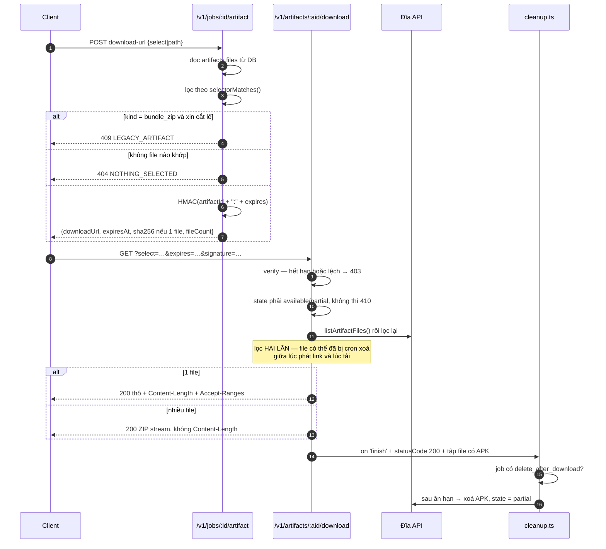

# API design — hợp đồng client ↔ server

23 endpoint: **14 public** (`/v1`) + **9 internal** (`/internal/v1`).

Không có dashboard endpoint, không có user/auth/account endpoint, không có endpoint xoá app hoặc job, và worker không truy cập Supabase trực tiếp.

Schema request/response là zod trong [packages/contracts/src/index.ts](../packages/contracts/src/index.ts) — đó là nguồn, file này là diễn giải.

---

## 1. Xác thực — ba mặt phẳng

| Nhóm | Cơ chế |
|---|---|
| `/v1/*` (trừ hai ngoại lệ dưới) | `Authorization: Bearer $API_TOKEN` |
| `/internal/v1/*` | `Authorization: Bearer $WORKER_TOKEN` |
| `GET /v1/health` | không cần gì |
| `GET /v1/artifacts/:id/download` | không cần token — URL mang `expires` + `signature` HMAC |

So sánh constant-time sau khi hash SHA-256 cả hai vế. Hash trước để độ dài token không lộ qua thời gian so sánh — một `if (a.length !== b.length)` trần sẽ rò rỉ đúng thứ đó.

---

## 2. Quy ước chung

### Thân phản hồi

Thành công:

```json
{ "data": { … } }
```

Có phân trang:

```json
{ "data": [ … ], "pagination": { "page": 1, "pageSize": 20, "total": 137 } }
```

Lỗi — **luôn** cùng một dạng:

```json
{ "error": { "code": "INVALID_STATUS", "message": "…" } }
```

> Phân nhánh theo `error.code`. `message` là tiếng Việt/tiếng Anh lẫn lộn và có thể đổi bất cứ lúc nào.

### Phân trang

`page` ≥ 1 (mặc định 1), `pageSize` 1–100 (mặc định 20). Vượt `pageSize` là `400`.

### Đặt tên

DB dùng `snake_case`, API trả `camelCase`. Chỗ chuyển đổi nằm ở [utils/formatters.ts](../apps/api/src/utils/formatters.ts) — không rải rác trong router.

### Idempotency

`POST /v1/jobs` nhận header `Idempotency-Key`. Trùng key → `200` kèm job cũ, không tạo job mới.

`POST /v1/jobs/batch` **không** hỗ trợ. Gửi lại là tạo batch mới.

---

## 3. Public API — 14 endpoint

### System

| Method | Path | Auth | Chức năng |
|---|---|---|---|
| `GET` | `/v1/health` | không | API còn sống |
| `GET` | `/v1/system/status` | ✓ | database, hàng đợi, số worker |

```json
// GET /v1/health
{ "status": "ok", "service": "app-relay-api", "version": "1.0.0" }
```

```json
// GET /v1/system/status
{
  "data": {
    "database": "ok",
    "jobs":    { "queued": 3, "running": 1, "failed": 2 },
    "workers": { "online": 0, "busy": 1, "offline": 0 }
  }
}
```

> `offline` tính theo heartbeat: worker im lặng quá **60 giây** thì bị coi là offline bất kể cột `status` trong DB ghi gì. Worker đang chạy job thì đếm vào `busy`, không đếm vào `online` — ba con số cộng lại mới là tổng.

### Apps

| Method | Path | Auth | Chức năng |
|---|---|---|---|
| `GET` | `/v1/apps` | ✓ | danh sách app đã kéo thành công |
| `GET` | `/v1/apps/:packageId` | ✓ | chi tiết một app |

```text
GET /v1/apps?page=1&pageSize=20
GET /v1/apps?search=facemoji        # ilike trên title HOẶC package_id
```

Sắp xếp theo `last_pulled_at` giảm dần. `packageId` sai dạng → `400 INVALID_PACKAGE_ID`.

### Jobs

| Method | Path | Auth | Chức năng |
|---|---|---|---|
| `POST` | `/v1/jobs` | ✓ | tạo một job |
| `POST` | `/v1/jobs/batch` | ✓ | tạo nhiều job |
| `GET` | `/v1/jobs` | ✓ | danh sách job |
| `GET` | `/v1/jobs/:jobId` | ✓ | chi tiết job + artifact |
| `GET` | `/v1/jobs/:jobId/events` | ✓ | timeline |
| `POST` | `/v1/jobs/:jobId/cancel` | ✓ | yêu cầu huỷ |
| `POST` | `/v1/jobs/:jobId/retry` | ✓ | chạy lại job failed |

**Tạo job:**

```json
{
  "playUrl": "https://play.google.com/store/apps/details?id=com.facemoji.lite",
  "includeListing": true,
  "includeScreenshots": true,
  "deleteAfterDownload": false,
  "options": {}
}
```

`201`:

```json
{
  "data": {
    "jobId": "job_1786001234_a3f9c0e21b7d5486",
    "packageId": "com.facemoji.lite",
    "status": "queued",
    "createdAt": "2026-08-10T10:00:00.000Z"
  }
}
```

`packageId` lấy từ query `?id=` của URL và phải khớp `^[a-zA-Z][a-zA-Z0-9_]*(\.[a-zA-Z][a-zA-Z0-9_]*)+$`, dài ≤ 255. Không khớp → `400 INVALID_URL`, **không** tạo job.

**Batch:**

```json
{ "urls": ["https://…?id=com.a", "https://…?id=com.b"], "includeListing": true }
```

```json
{
  "data": {
    "batchId": "01988abc-def0-7000-abcd-123456789000",
    "jobs": [
      { "jobId": "job_…_1_…", "packageId": "com.a", "status": "queued" },
      { "jobId": "job_…_2_…", "packageId": "com.b", "status": "queued" }
    ]
  }
}
```

Hai điều phải biết:

- **URL không hợp lệ bị bỏ qua im lặng.** Không có lỗi, chỉ là job đó không xuất hiện. Đếm `data.jobs.length` so với số URL gửi đi.
- **Mỗi job có artifact riêng.** Không có ZIP gộp cho cả batch.

**Lọc:**

```text
GET /v1/jobs?status=running
GET /v1/jobs?batchId=01988abc-…      # phải là UUID hợp lệ, sai → 400
GET /v1/jobs?packageId=com.facemoji.lite
```

**Huỷ:** `queued` → `cancelled` ngay. `running` → `cancelling`, worker tự dừng ở checkpoint gần nhất rồi xác nhận. Trạng thái khác → `400 INVALID_STATUS`.

Nếu trạng thái đổi ngay giữa lúc xử lý → `409 STATUS_CHANGED`. Đây là chốt thật, không phải phòng xa: worker claim đúng khe giữa `SELECT` và `UPDATE` sẽ khiến job báo `cancelled` trong khi emulator vẫn đang cài app và vẫn upload artifact.

**Retry:** chỉ nhận `failed`. Giữ nguyên `jobId`, reset `attempt_count` về 0, xoá `error_*`. `completed`/`cancelled` → `400`.

### Artifact

| Method | Path | Auth | Chức năng |
|---|---|---|---|
| `GET` | `/v1/jobs/:jobId/artifact/files` | ✓ | liệt kê file |
| `POST` | `/v1/jobs/:jobId/artifact/download-url` | ✓ | tạo link có thời hạn |
| `GET` | `/v1/artifacts/:artifactId/download` | chữ ký | stream file / nhóm / cả cục |

```json
// GET /v1/jobs/{id}/artifact/files
{
  "data": {
    "artifactId": "07a074d0-968f-4187-b841-d27cf6cf8e18",
    "state": "available",
    "totalSizeBytes": 149191734,
    "files": [
      { "path": "base.apk", "sizeBytes": 68582418, "sha256": "1c26…",
        "contentType": "application/vnd.android.package-archive", "select": "apk.base" },
      { "path": "playstore/icon.png", "sizeBytes": 23483, "sha256": "a7c8…",
        "contentType": "image/png", "select": "listing" }
    ]
  }
}
```

`state = partial` nghĩa là APK đã hết hạn sớm; `files` không còn liệt kê APK nhưng phần nhẹ vẫn tải được.

**Xin link** — body nhận `select` **hoặc** `path`, không được cả hai:

```bash
curl -X POST "$BASE_URL/jobs/$JOB/artifact/download-url" \
  -H "Authorization: Bearer $API_TOKEN" -H "Content-Type: application/json" \
  -d '{"select": "screenshots"}'
```

```json
{
  "data": {
    "downloadUrl": "https://…/v1/artifacts/07a0…/download?select=screenshots&expires=1786000000&signature=…",
    "expiresAt": "2026-08-10T10:15:00.000Z",
    "fileName": "com.facemoji.lite-screenshots.zip",
    "sizeBytes": 1240000,
    "sha256": null,
    "fileCount": 6
  }
}
```

- `sha256` **chỉ có giá trị khi kết quả là một file**. Nhiều file thì ZIP sinh tại chỗ nên mỗi lần một khác — dùng `sha256` từng file trong `/artifact/files`, hoặc `PULL_MANIFEST.txt` worker đã ghi sẵn.
- `sizeBytes` với nhiều file là **tổng kích thước thô**, ZIP thực tế nhỏ hơn. Chỉ để ước lượng.
- Selector không khớp file nào → `404` ngay ở bước này, không phát link chết.

**Tải:**

Endpoint này không cần `Authorization`. Chữ ký phủ `artifactId` + `expires`, **không** phủ `select`/`path` — xem [security.md](security.md) §3.

| Kết quả | Hành vi |
|---|---|
| đúng 1 file | file thô, `Content-Length`, `Accept-Ranges: bytes`, hỗ trợ `Range` (`206`) |
| nhiều file | ZIP nén khi đang stream, **không** có `Content-Length` |

`?path=a&path=b` (mảng) → `400`. Truyền cả `path` và `select` → `400`.

---

## 4. Bảng selector

| `select` | Nội dung | Zalo |
|---|---|---|
| bỏ trống / `all` | toàn bộ | 73 MB |
| `apk` | `base.apk` + mọi split | 68.5 MB |
| `apk.base` | chỉ `base.apk` | 65.4 MB |
| `apk.splits` | chỉ `split_config.*.apk` | 33.6 MB |
| `screenshots` | `playstore/screenshots/*` | 1.0 MB |
| `listing.full` | listing + `page.html` | 220 KB |
| `listing` | `description.md` + `listing.json` + `icon.png` | 24 KB |
| `metadata` | `PULL_MANIFEST.txt` + `package-info.txt` + `device-dir.listing` | 10 KB |

Chênh tới **3000 lần**. Đừng tải cả cục nếu chỉ cần metadata.

---

## 5. Mã lỗi

### Public

| Mã | `error.code` | Khi nào | Nên làm |
|---|---|---|---|
| `400` | `BAD_REQUEST` | body sai schema, query sai kiểu | sửa request |
| `400` | `INVALID_URL` | URL thiếu `?id=` hoặc packageId sai dạng | sửa URL |
| `400` | `INVALID_PACKAGE_ID` | `:packageId` trong path sai dạng | sửa path |
| `400` | `INVALID_STATUS` | retry job chưa `failed`, cancel job đã xong | đọc lại trạng thái |
| `400` | `INVALID_PATH` | `?path=` tuyệt đối, chứa `..`, hoặc là dotfile | sửa path |
| `400` | `INVALID_SELECT` | selector ngoài 8 giá trị hợp lệ | sửa selector |
| `401` | `UNAUTHORIZED` | thiếu header `Authorization` | thêm token |
| `403` | `FORBIDDEN` | có token nhưng sai | kiểm token, **đừng** thử lại |
| `403` | `INVALID_SIGNATURE` | link hết hạn hoặc chữ ký sai | gọi lại `download-url` |
| `404` | `NOT_FOUND` | job / app / artifact không tồn tại | không thử lại |
| `404` | `FILE_NOT_FOUND` | `path` không có trong danh sách file | gọi `/artifact/files` |
| `404` | `NOTHING_SELECTED` | selector không khớp file nào lúc xin link | APK có thể đã hết hạn |
| `409` | `STATUS_CHANGED` | job đổi trạng thái giữa lúc xử lý huỷ | đọc lại, gọi `cancel` lần nữa |
| `409` | `LEGACY_ARTIFACT` | artifact `kind=bundle_zip` cũ, không cắt lẻ được | xin cả cục |
| `410` | `ARTIFACT_GONE` | artifact ở state `expired`/`deleted`/`preparing` | chạy job mới |
| `410` | `FILE_GONE` | file không còn trên đĩa | chạy job mới |
| `410` | `NOTHING_TO_SERVE` | selector không còn khớp gì lúc tải | chạy job mới |
| `416` | — | `Range` vượt kích thước file | bỏ header `Range` |
| `500` | `INTERNAL_ERROR` | lỗi không lường trước | thử lại, rồi báo vận hành |

Gặp `404`/`410` với `apk*` mà `listing` vẫn chạy nghĩa là APK đã hết hạn theo `APK_TTL_HOURS`.

### Internal

| Mã | `error.code` | Khi nào |
|---|---|---|
| `204` | — | hàng đợi rỗng, **hoặc** đĩa dưới ngưỡng dự phòng |
| `400` | `INVALID_PATH` | đường dẫn upload tuyệt đối / có `..` / là dotfile |
| `400` | `SHA256_MISMATCH` | hash tính được lệch `X-Content-SHA256`; file đã bị xoá |
| `400` | `UPLOAD_INCOMPLETE` | stream đứt giữa chừng; file đã bị xoá |
| `400` | `FILE_COUNT_MISMATCH` | `fileCount` worker báo lệch số file trên đĩa |
| `404` | `JOB_NOT_FOUND` | không có job đó |
| `409` | `JOB_NOT_RUNNING` | job đã đóng, không nhận upload / không finalize |
| `409` | `NOT_JOB_OWNER` | `workerId` không khớp `jobs.worker_id` |
| `507` | `INSUFFICIENT_STORAGE` | `Content-Length` không vừa đĩa |

---

## 6. Internal Worker API — 9 endpoint

Chỉ container worker gọi, qua Docker network:

```env
RELAY_API_URL=http://api:3000/internal/v1
```

| Method | Path | Chức năng |
|---|---|---|
| `POST` | `/workers/heartbeat` | đăng ký / cập nhật worker |
| `POST` | `/jobs/claim` | nhận một job đang chờ |
| `POST` | `/jobs/:jobId/heartbeat` | gia hạn lease + cập nhật tiến độ + nhận cờ huỷ |
| `POST` | `/jobs/:jobId/events` | ghi timeline |
| `PUT` | `/jobs/:jobId/files/*` | upload một file của artifact |
| `POST` | `/jobs/:jobId/artifact/finalize` | chốt artifact |
| `POST` | `/jobs/:jobId/complete` | báo hoàn thành |
| `POST` | `/jobs/:jobId/fail` | báo thất bại |
| `POST` | `/jobs/:jobId/cancelled` | xác nhận đã huỷ |

**Claim** — `200` kèm job, hoặc `204`:

```json
{
  "data": {
    "jobId": "job_001", "packageId": "com.facemoji.lite",
    "playUrl": "https://…", "includeListing": true, "includeScreenshots": true,
    "attempt": 1, "leaseExpiresAt": "2026-08-10T10:02:00.000Z"
  }
}
```

`204` có **hai** nguyên nhân khác nhau và worker không phân biệt được: hàng đợi rỗng, hoặc đĩa dưới ngưỡng. Trường hợp sau, job nằm yên trong `queued` thay vì chạy hết pipeline emulator rồi mới chết ở bước upload.

**Job heartbeat:**

```json
// →
{ "workerId": "worker_vps_01", "progress": 60, "currentStep": "pulling_apk" }
// ←
{ "data": { "leaseExpiresAt": "2026-08-10T10:04:00.000Z", "cancelRequested": false } }
```

**Upload** — worker gửi thẳng từng file, giữ nguyên đường dẫn tương đối. Nén là việc của API và chỉ xảy ra khi client xin nhiều file:

```bash
curl -X PUT "http://api:3000/internal/v1/jobs/job_001/files/playstore/screenshots/screenshot_01.png" \
  -H "Authorization: Bearer $WORKER_TOKEN" \
  -H "Content-Length: 277350" \
  -H "X-Content-SHA256: cbea6ecc…" \
  --data-binary "@screenshot_01.png"
```

API hash on-the-fly khi stream xuống đĩa, lệch thì `400` **và xoá file**. Đường dẫn phải tương đối; tuyệt đối, `..`, hoặc dotfile đều `400` (dotfile bị cấm vì API dùng `.uploads.jsonl` để ghi sổ sha256 nội bộ).

**Finalize:**

```json
{ "workerId": "worker_vps_01", "fileName": "com.facemoji.lite", "fileCount": 18 }
```

Ba chốt: `workerId` phải khớp `jobs.worker_id` (`409`), job phải `running` (`409`), số file phải khớp đĩa (`400`). Trước khi finalize xong, artifact ở `state = preparing` và không tải được.

**Complete** — chỉ gọi sau khi finalize thành công. `result` được lưu vào `jobs.result_summary` **và** upsert lên bảng `apps`.

**Fail** — `retryable: true` và còn lượt thì job quay lại `queued` để tự chạy lại; hết lượt thì `failed`.

---

## 7. Luồng ký và tải



---

## 8. Rate limit

**Không có.** Cố ý chưa làm ở bản 1.0, không phải bỏ sót.

Phanh duy nhất là vật lý: một emulator, tuần tự, ~60 giây/job. Gửi 1000 job không làm sập gì cả — chúng chỉ xếp hàng. Nhưng cũng không có gì ngăn một đối tác chiếm hết hàng đợi của đối tác khác.

Khi cần tách quyền thì thêm bảng `api_keys` và hạn ngạch số job đang chờ theo từng key. Xem [security.md](security.md) §6.
