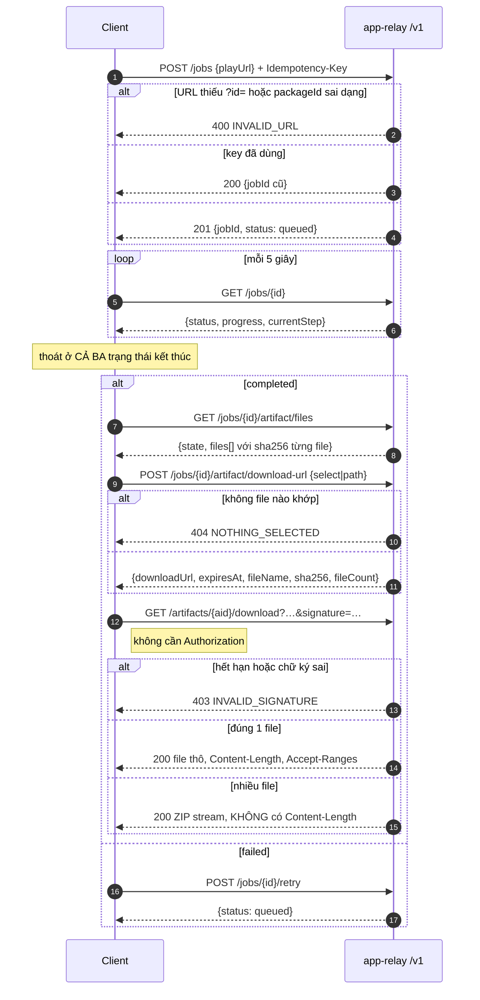

# API Prototype — hình dung sản phẩm từ phía người gọi

Dự án không có giao diện, nên "màn hình" ở đây là **kịch bản gọi API**. File này tương đương wireframe: nó cho thấy sản phẩm dùng như thế nào trước khi đọc bất kỳ dòng code nào.

Trạng thái loading / empty / error của UI, ở đây là trạng thái job và trạng thái artifact. Đó là phần hay bị bỏ sót nhất khi viết client.

---

## 1. Bốn kịch bản

### KB-1 — Một app, lấy tất cả

```bash
BASE_URL=https://<host>/v1
API_TOKEN=apr_live_xxxxxxxx

# 1. Đặt hàng
JOB=$(curl -s -X POST "$BASE_URL/jobs" \
  -H "Authorization: Bearer $API_TOKEN" \
  -H "Content-Type: application/json" \
  -H "Idempotency-Key: don-hang-001" \
  -d '{"playUrl":"https://play.google.com/store/apps/details?id=com.zing.zalo"}' \
  | jq -r .data.jobId)

# 2. Chờ. Phải thoát ở CẢ BA trạng thái kết thúc.
while :; do
  S=$(curl -s "$BASE_URL/jobs/$JOB" -H "Authorization: Bearer $API_TOKEN" | jq -r .data.status)
  case "$S" in
    completed)        break ;;
    failed|cancelled) echo "job kết thúc ở: $S" >&2; exit 1 ;;
  esac
  sleep 5
done

# 3. Xin link
URL=$(curl -s -X POST "$BASE_URL/jobs/$JOB/artifact/download-url" \
  -H "Authorization: Bearer $API_TOKEN" | jq -r .data.downloadUrl)

# 4. Tải — link đã mang chữ ký, không cần token
curl -O -J "$URL"
```

> Bám mỗi `completed` là lỗi kinh điển: job `failed` sẽ làm vòng lặp chạy vĩnh viễn.

### KB-2 — Chỉ lấy metadata

```bash
curl -s -X POST "$BASE_URL/jobs/$JOB/artifact/download-url" \
  -H "Authorization: Bearer $API_TOKEN" -H "Content-Type: application/json" \
  -d '{"select":"listing"}' | jq -r .data.downloadUrl
```

24 KB thay vì 73 MB. Xem trước có gì bằng `GET /jobs/$JOB/artifact/files`.

### KB-3 — Batch nhiều app

```bash
curl -s -X POST "$BASE_URL/jobs/batch" \
  -H "Authorization: Bearer $API_TOKEN" -H "Content-Type: application/json" \
  -d '{"urls":[
        "https://play.google.com/store/apps/details?id=com.facemoji.lite",
        "https://play.google.com/store/apps/details?id=com.simejikeyboard"
      ]}' | jq
```

Trả `batchId` + danh sách job. Theo dõi bằng `GET /jobs?batchId=...`.

**Mỗi job có artifact riêng.** Không có ZIP gộp cho cả batch — phải tải từng job.

Hai lưu ý dễ vấp:

- URL không hợp lệ trong mảng bị **bỏ qua im lặng**, không báo lỗi. Đếm `data.jobs.length` so với số URL gửi đi.
- Batch **không** nhận `Idempotency-Key`. Gửi lại là tạo batch mới.

### KB-4 — Chạy lại job hỏng

```bash
curl -s -X POST "$BASE_URL/jobs/$JOB/retry" -H "Authorization: Bearer $API_TOKEN"
```

Chỉ nhận job `failed`. Giữ nguyên `jobId`, reset `attempt_count` về 0. `completed` và `cancelled` thì không retry được — chạy job mới.

---

## 2. Trạng thái client phải xử lý

Đây là phần tương ứng với loading / empty / error của một màn hình.

### 2.1. Đang chờ

```json
{
  "data": {
    "jobId": "job_1786001234_abc",
    "status": "running",
    "progress": 60,
    "currentStep": "pulling_apk",
    "attemptCount": 1
  }
}
```

Chín bước, dùng để hiển thị tiến độ chứ **không phải** trạng thái riêng:

| progress | currentStep |
|---|---|
| 5 | `claiming` |
| 15 | `scraping_listing` |
| 25 | `booting_emulator` |
| 35 | `opening_play_store` |
| 45 | `installing` |
| 60 | `pulling_apk` |
| 70 | `creating_manifest` |
| 80 | `validating` |
| 90 | `uploading_artifact` |

Chi tiết hơn nữa thì đọc timeline: `GET /jobs/{id}/events`.

### 2.2. Rỗng — artifact chưa sẵn sàng

```json
{ "error": { "code": "NOT_FOUND", "message": "Job này chưa có artifact" } }
```

Job `queued`/`running` chưa có dòng artifact nào. Trước khi `finalize` chạy xong, artifact ở `state = preparing` và **không tải được** — nhờ vậy client không bao giờ vớ phải bản dở dang.

### 2.3. Mất một phần — APK đã hết hạn

```json
{
  "data": {
    "artifactId": "07a074d0-…",
    "state": "partial",
    "totalSizeBytes": 1300000,
    "files": [
      { "path": "playstore/icon.png", "sizeBytes": 23483, "sha256": "a7c8…", "select": "listing" }
    ]
  }
}
```

`state = partial` nghĩa là APK đã bị xoá theo `APK_TTL_HOURS`, phần nhẹ vẫn còn. Xin `select=apk` lúc này sẽ `404`, còn `select=listing` vẫn chạy.

**Luôn gọi `/artifact/files` trước khi xin link** nếu không chắc artifact còn gì.

### 2.4. Lỗi

Thân lỗi luôn cùng một dạng. Phân nhánh theo `error.code`, **đừng đọc `message`** — message là tiếng Việt và có thể đổi.

```json
{ "error": { "code": "INVALID_STATUS", "message": "..." } }
```

### 2.5. Kết thúc

```json
{
  "data": {
    "status": "completed",
    "progress": 100,
    "resultSummary": {
      "versionName": "3.5.1",
      "versionCode": 30501,
      "splitCount": 4,
      "screenshotCount": 8,
      "baseApkSizeBytes": 50231234
    }
  }
}
```

---

## 3. Vòng đời một job — chỉ từ góc nhìn client

Không có worker, không có emulator trong sơ đồ này. Đây là tất cả những gì đối tác cần biết.



---

## 4. Bốn điều quyết định cách viết client

**Job chạy tuần tự trên một emulator**, ~60 giây mỗi job. 20 URL ≈ 20 phút, và có bên khác gửi thì xếp hàng sau. Đừng thiết kế kiểu gọi xong chờ ngay trong cùng một request.

**Link tải sống 10 phút.** Hết hạn thì gọi lại `download-url`, file vẫn còn. Không cần chạy lại job.

**APK giữ 6 giờ.** Quá hạn thì listing/ảnh/metadata vẫn tra được, muốn APK phải chạy job mới.

**File lớn nên dùng `Range`.** Đứt mạng thì resume thay vì tải lại 68 MB.

> Lưu ý ngược: nếu job bật `deleteAfterDownload`, tải **hoàn toàn** bằng `Range` sẽ không bao giờ kích hoạt xoá (chỉ `200` mới tính, `206` thì không). Đây là hướng an toàn có chủ ý.

---

## 5. Fake data để dựng client trước khi có server

`GET /v1/jobs/{id}` khi đang chạy:

```json
{"data":{"jobId":"job_1786001234_abc","batchId":null,"packageId":"com.zing.zalo","playUrl":"https://play.google.com/store/apps/details?id=com.zing.zalo","includeListing":true,"includeScreenshots":true,"options":{},"status":"running","progress":60,"currentStep":"pulling_apk","errorCode":null,"errorMessage":null,"errorRetryable":null,"attemptCount":1,"createdAt":"2026-08-10T10:00:00.000Z","queuedAt":"2026-08-10T10:00:00.000Z","startedAt":"2026-08-10T10:00:05.000Z","completedAt":null,"updatedAt":"2026-08-10T10:00:42.000Z","cancelRequestedAt":null,"cancelReason":null,"resultSummary":{},"artifact":null}}
```

`GET /v1/jobs/{id}/artifact/files` sau khi xong:

```json
{"data":{"artifactId":"07a074d0-968f-4187-b841-d27cf6cf8e18","state":"available","totalSizeBytes":149191734,"files":[{"path":"PULL_MANIFEST.txt","sizeBytes":812,"sha256":"3f2a…","contentType":"text/plain; charset=utf-8","select":"metadata"},{"path":"base.apk","sizeBytes":68582418,"sha256":"1c26…","contentType":"application/vnd.android.package-archive","select":"apk.base"},{"path":"split_config.arm64_v8a.apk","sizeBytes":75029958,"sha256":"f60d…","contentType":"application/vnd.android.package-archive","select":"apk.splits"},{"path":"playstore/icon.png","sizeBytes":23483,"sha256":"a7c8…","contentType":"image/png","select":"listing"},{"path":"playstore/screenshots/screenshot_01.png","sizeBytes":277350,"sha256":"cbea…","contentType":"image/png","select":"screenshots"}]}}
```

`GET /v1/system/status`:

```json
{"data":{"database":"ok","jobs":{"queued":3,"running":1,"failed":2},"workers":{"online":0,"busy":1,"offline":0}}}
```

---

## 6. Vì sao API không đặt chung với dashboard

Dự án này không có dashboard, nên câu hỏi tương đương là: **vì sao worker không nói chuyện thẳng với Supabase?**

Trả lời đầy đủ ở [context.md §7](context.md). Tóm tắt: worker là thành phần dễ mất kiểm soát nhất (chạy emulator, cài phần mềm lạ, thao tác UI), nên nó không cầm khoá database. Mọi thay đổi trạng thái đi qua đúng một chỗ là API, nơi đã có sẵn các chốt: `claim_job()` nguyên tử, kiểm `workerId` lúc finalize, chặn upload khi job không `running`.

Hệ quả tương tự cho bất kỳ frontend nào sau này: nó gọi `/v1`, không gọi Supabase.
