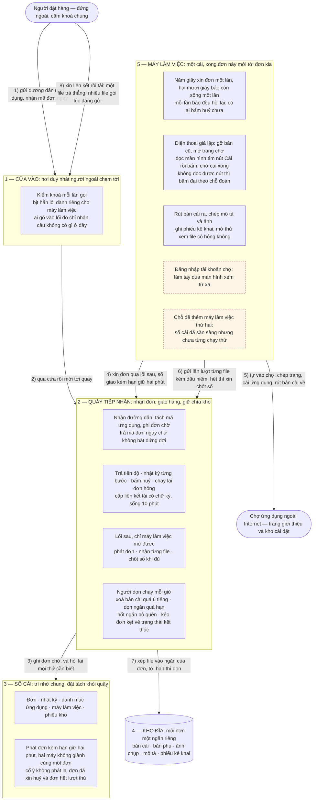

Kiến trúc hệ thống

```mermaid
flowchart TD
    ND(["Người đặt hàng — đứng ngoài, cầm khoá chung"])
    CHO(["Chợ ứng dụng ngoài Internet — trang giới thiệu và kho cài đặt"])

    subgraph A["1 — CỬA VÀO: nơi duy nhất người ngoài chạm tới"]
        A1["Kiểm khoá mỗi lần gọi<br/>bịt hẳn lối dành riêng cho máy làm việc<br/>ai gõ vào lối đó chỉ nhận câu không có gì ở đây"]
    end

    subgraph B["2 — QUẦY TIẾP NHẬN: nhận đơn, giao hàng, giữ chìa kho"]
        B1["Nhận đường dẫn, tách mã ứng dụng, ghi đơn chờ<br/>trả mã đơn ngay chứ không bắt đứng đợi"]
        B2["Trả tiến độ · nhật ký từng bước · bấm huỷ · chạy lại đơn hỏng<br/>cấp liên kết tải có chữ ký, sống 10 phút"]
        B3["Lối sau, chỉ máy làm việc mở được<br/>phát đơn · nhận từng file · chốt sổ khi đủ"]
        B4["Người dọn chạy mỗi giờ<br/>xoá bản cài quá 6 tiếng · dọn ngăn quá hạn<br/>hốt ngăn bỏ quên · kéo đơn kẹt về trạng thái kết thúc"]
    end

    subgraph C["3 — SỔ CÁI: trí nhớ chung, đặt tách khỏi quầy"]
        C1["Đơn · nhật ký · danh mục ứng dụng · máy làm việc · phiếu kho"]
        C2["Phát đơn kèm hạn giữ hai phút, hai máy không giành cùng một đơn<br/>cố ý không phát lại đơn đã xin huỷ và đơn hết lượt thử"]
    end

    KHO[("4 — KHO ĐĨA: mỗi đơn một ngăn riêng<br/>bản cài · bản phụ · ảnh chụp · mô tả · phiếu kê khai")]

    subgraph D["5 — MÁY LÀM VIỆC: một cái, xong đơn này mới tới đơn kia"]
        D1["Năm giây xin đơn một lần, hai mươi giây báo còn sống một lần<br/>mỗi lần báo đều hỏi lại: có ai bấm huỷ chưa"]
        D2["Điện thoại giả lập: gỡ bản cũ, mở trang chợ<br/>đọc màn hình tìm nút Cài rồi bấm, chờ cài xong<br/>không đọc được nút thì bấm đại theo chỗ đoán"]
        D3["Rút bản cài ra, chép mô tả và ảnh<br/>ghi phiếu kê khai, mở thử xem file có hỏng không"]
        D4["Đăng nhập tài khoản chợ: làm tay qua màn hình xem từ xa"]
        D5["Chỗ để thêm máy làm việc thứ hai:<br/>sổ cái đã sẵn sàng nhưng chưa từng chạy thử"]
    end

    ND -->|"1) gửi đường dẫn ứng dụng, nhận mã đơn ngay"| A
    A  -->|"2) qua cửa rồi mới tới quầy"| B
    B  -->|"3) ghi đơn chờ, và hỏi lại mọi thứ cần biết"| C
    D  -->|"4) xin đơn qua lối sau, sổ giao kèm hạn giữ hai phút"| B
    D  -->|"5) tự vào chợ: chép trang, cài ứng dụng, rút bản cài về"| CHO
    D  -->|"6) gửi lần lượt từng file kèm dấu niêm, hết thì xin chốt sổ"| B
    B  -->|"7) xếp file vào ngăn của đơn, tới hạn thì dọn"| KHO
    ND -->|"8) xin liên kết rồi tải: một file trả thẳng, nhiều file gói lúc đang gửi"| A

    classDef chuaLam fill:#fff5e6,stroke:#c88,stroke-dasharray:4 3
    class D4,D5 chuaLam
```