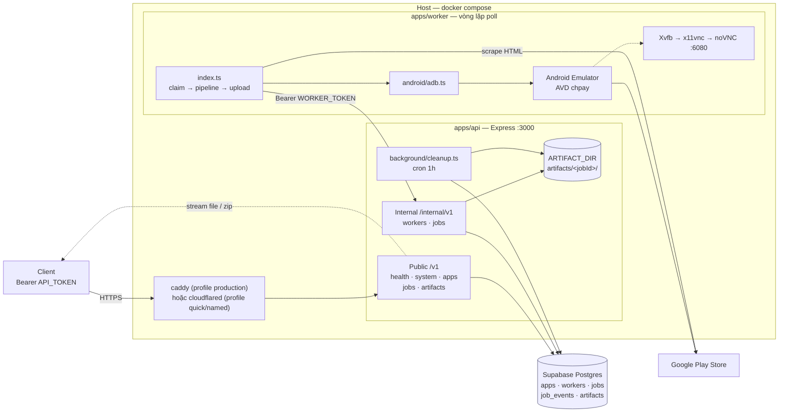
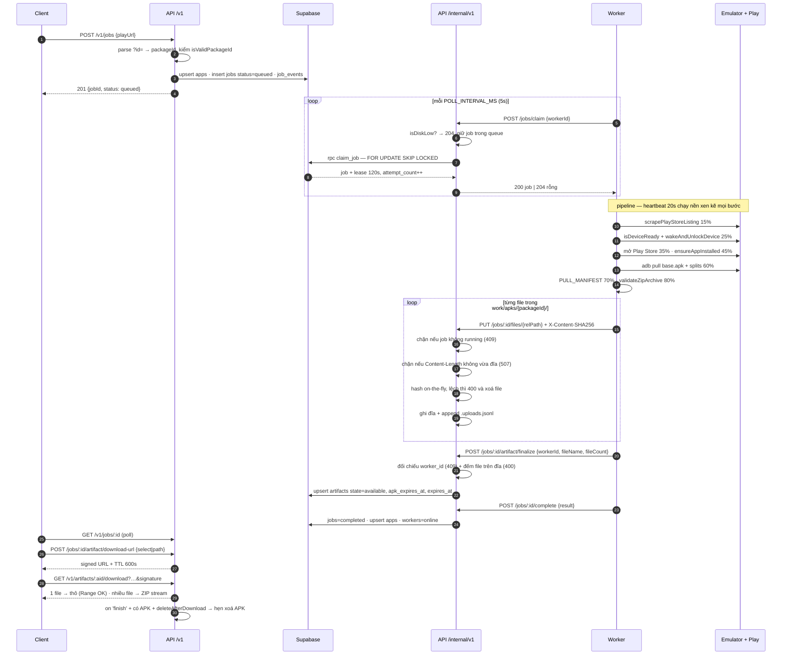
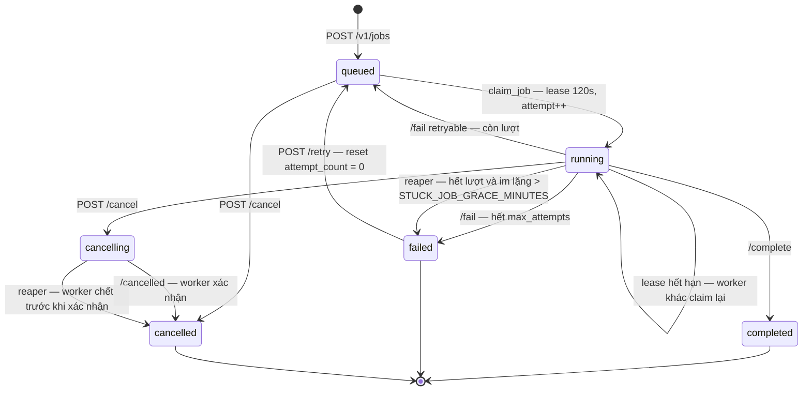
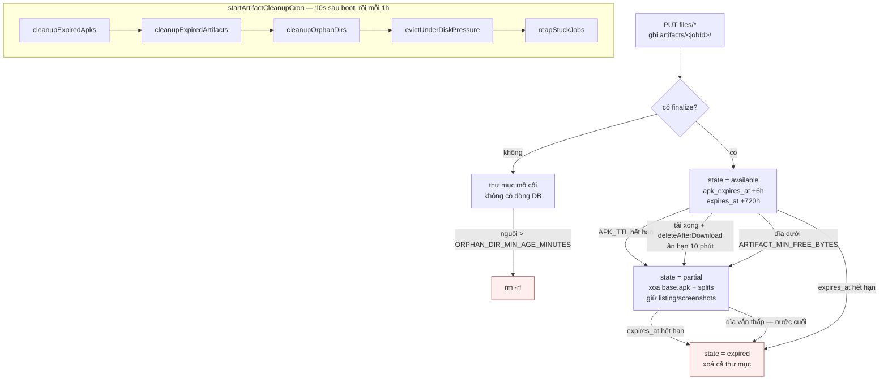
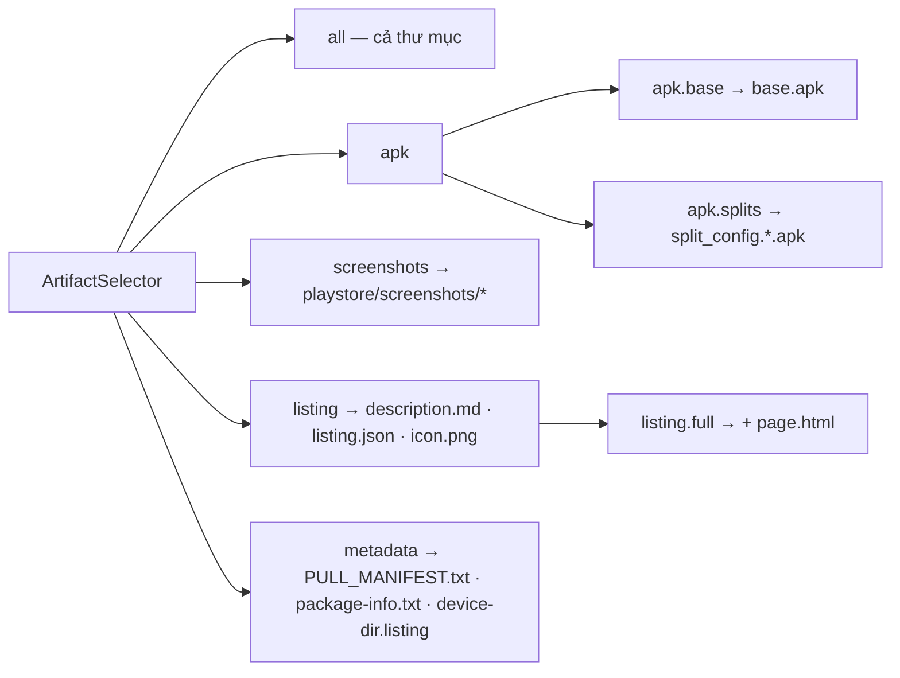

# Architecture

Monorepo pnpm: `apps/api` (Express + Supabase), `apps/worker` (Android emulator + adb), `packages/contracts` (zod schema dùng chung cả hai phía).

---

## 1. Thành phần

| Thành phần | Nhiệm vụ | Chạy ở đâu |
|---|---|---|
| `apps/api` | 14 endpoint public + 9 endpoint internal, lưu artifact lên đĩa, cron dọn dẹp | container `api`, Node 22 |
| `apps/worker` | vòng lặp poll → pipeline emulator → upload từng file | container `worker`, Node 20 + JDK 17 |
| `packages/contracts` | zod schema + `selectorMatches()`/`selectorFor()`/`isApkPath()` | thư viện, build vào cả hai image |
| Supabase Postgres | 5 bảng metadata + hàm `claim_job()` | ngoài VPS (Cloud) hoặc overlay self-host |
| Đĩa API server | `/data/artifacts/{jobId}/`, volume `api-artifacts` | container `api` |
| Caddy **hoặc** cloudflared | TLS và đường ra Internet — **loại trừ nhau** | container riêng, sau profile |

---

## 2. Tổng quan hệ thống

**Ba mặt phẳng xác thực** ([middleware/auth.ts](../apps/api/src/middleware/auth.ts)):

- `API_TOKEN` cho `/v1/*`
- `WORKER_TOKEN` cho `/internal/v1/*`
- Không token cho `GET /v1/health` và `GET /v1/artifacts/:id/download` — link đã mang `expires` + `signature` HMAC

Cả hai token so sánh constant-time sau khi hash SHA-256 — hash trước để độ dài token không lộ qua thời gian so sánh.

---

## 3. Luồng end-to-end của một job

**Heartbeat hai tầng:**

| Tầng | Endpoint | Chu kỳ | Mục đích |
|---|---|---|---|
| Worker | `/workers/heartbeat` | 20s | báo worker + emulator còn sống |
| Job | `/jobs/:id/heartbeat` | 20s nền + mỗi lần đổi bước | gia hạn lease 120s, nhận cờ `cancelRequested` |

Worker kiểm `cancelRequested` **giữa các bước** (sau scrape, sau boot, sau install, sau validate, sau upload) để dừng sớm thay vì chạy hết pipeline rồi mới biết đã bị huỷ.

---

## 4. State machine của job

`reapStuckJobs()` tồn tại vì `claim_job()` **cố ý** bỏ qua hai loại job:

- có `cancel_requested_at` → không claim lại được, mà `cancelling` cũng không nằm trong bộ lọc status
- `attempt_count >= max_attempts` → không claim lại được, cũng không ai đánh dấu `failed`

Hai loại đó sẽ nằm lại vĩnh viễn: client poll ba trạng thái kết thúc sẽ chờ mãi, và `POST /retry` cũng từ chối vì status không phải `failed`. Không có đường nào thoát ngoài sửa tay trong DB.

Job `running` **còn lượt** thì reaper không đụng tới — `claim_job()` sẽ tự lấy lại, cướp mất là bỏ đi một lần thử hợp lệ.

---

## 5. Vòng đời artifact và dọn đĩa

Thứ tự năm bước không tuỳ tiện: xoá APK hết hạn trước (rẻ nhất, giải phóng nhiều nhất), rồi mới tới xoá cả thư mục, rồi dò mồ côi, rồi mới đuổi theo áp lực đĩa — để bước cuối chỉ phải làm khi bốn bước trên đã không đủ.

---

## 6. Selector — client hỏi theo ý nghĩa, không theo tên file

Định nghĩa ở [packages/contracts/src/index.ts](../packages/contracts/src/index.ts). `selectorMatches()` dùng chung cho cả `download-url` (lọc trước, báo 404 sớm) và `/download` (lọc lại lúc stream). Đúng một file khớp thì trả thô, nhiều file thì zip stream.

---

## 7. Quyết định kiến trúc

Cột "đã loại" quan trọng nhất — nó ngăn việc đề xuất lại thứ đã bỏ.

| Quyết định | Lý do | Đã loại |
|---|---|---|
| **Artifact là thư mục, không phải ZIP** | worker đã dựng sẵn layout đúng chuẩn trước khi làm gì khác. Lưu ZIP rồi mỗi lần client xin một tấm ảnh lại phải đọc central directory và giải nén — làm ngược đúng việc worker vừa làm. Bỏ khâu nén thì lấy một file chỉ còn là đọc file | lưu ZIP dựng sẵn |
| **TTL tách đôi APK / phần nhẹ** | APK chiếm 98% dung lượng. Vì file nằm rời nên xoá 98% chỉ là một lệnh `rm`, không phải viết lại file nén. Dài hạn rẻ hơn ~50 lần | một TTL chung |
| **Chữ ký không phủ `select`/`path`** | link mặc định vốn đã cho cả thư mục, nên người sửa query chỉ lấy được **ít hơn** thứ họ đã có quyền lấy. Ký thêm không mua được gì | ký toàn bộ query string |
| **`claim_job()` + lease, không dùng message queue** | với vài worker thì bảng `jobs` + `FOR UPDATE SKIP LOCKED` là đủ, và dễ xem/dễ debug hơn hẳn | Supabase Queues / PGMQ |
| **Một `API_TOKEN` chung** | bản 1.0 cố ý không có bảng tài khoản. Đây là chuyện vận hành đã biết, không phải lỗ hổng bị bỏ sót | bảng `api_keys` + hạn ngạch |
| **Emulator chạy có cửa sổ** | phải nhìn và bấm được màn hình để đăng nhập Play lần đầu | `-no-window` |
| **Worker không cầm khoá Supabase** | worker là thành phần dễ mất kiểm soát nhất; mọi thay đổi trạng thái đi qua một chỗ | worker ghi thẳng DB |
| **Nén khi đang stream, không lưu lại** | không phải giữ hai bản của cùng dữ liệu. Đổi lại: không có `Content-Length` cho bản nhiều file | sinh sẵn ZIP để tải nhanh |
| **Sổ sha256 trong dotfile cạnh payload** | tính lại lúc finalize phải đọc lại ~150 MB chỉ để lấy con số vừa tính xong | tính lại lúc finalize |
| **`page.html` khai `application/octet-stream`** | CDN viết lại nội dung `text/html` trên đường truyền (Cloudflare Email Obfuscation) làm file phình và sha256 lệch | khai đúng `text/html` |
| **API và worker là hai image riêng** | API không cần Android SDK (~4 GB). Rebuild API không phải tải lại SDK | một image chung |

---

## 8. Nhược điểm đã biết

Ghi thẳng, không giấu:

| Nhược điểm | Hệ quả | Giảm nhẹ hiện tại |
|---|---|---|
| Một emulator, tuần tự | 20 URL ≈ 20 phút; hai đối tác cùng gửi thì bên sau chờ | `claim_job()` đã sẵn sàng cho nhiều worker, chưa thử |
| Một token chung | không tách được đối tác, không biết ai gọi gì, lộ thì đổi cho tất cả | link tải có chữ ký riêng, không cần đưa token |
| Phiên Google Play là trạng thái thủ công | mất là mọi job fail, phải đăng nhập tay qua noVNC | volume `worker-avd` giữ phiên qua `down`/`up` |
| Quick tunnel đổi URL mỗi lần restart | đối tác hardcode URL là gãy | tài liệu chỉ ghi **cách lấy** URL, không ghi URL |
| WSL tự thu hồi distro | cả stack chết mà không có dấu hiệu crash | keepalive `sleep infinity` + Task Scheduler |
| Migration không có `down` | rollback schema phải làm tay | image tag theo `github.sha` nên code rollback được |
| CI test trên Node 20, production chạy Node 22 | lỗi chỉ xuất hiện trên một trong hai runtime sẽ lọt lưới | — (nợ kỹ thuật, xem [plan.md](plan.md)) |
| Không có `Content-Length` cho ZIP | client không hiện được thanh tiến độ chính xác | `download-url` trả `sizeBytes` thô để ước lượng |
| Batch bỏ qua URL sai im lặng | client không biết URL nào bị loại | đếm `data.jobs.length` so với số URL gửi |

---

## 9. Điều GitNexus **không** thấy

Repo được index bằng GitNexus (628 nodes, 1013 edges, 18 flows). Nhưng **handler Express là closure bên trong router**, nên không có flow nào cho luồng HTTP.

18 flow hiện có đều thuộc hai nhóm:

- **Hàm nền của API**: `startArtifactCleanupCron`, `evictUnderDiskPressure`, `armDeleteAfterDownload`
- **Pipeline worker**: `startWorkerLoop`, `processJob`, `ensureAppInstalled`, `uploadArtifactDir`, `runMigrations`

Muốn hiểu một endpoint thì **đọc router**. Tìm trong graph không thấy rồi kết luận "không có" là sai.
