# ARCHITECTURE — App Relay

> Tài liệu kiến trúc chính thức của dự án. Mọi khẳng định dưới đây đọc trực tiếp từ mã nguồn trong `apps/`, `packages/`, `supabase/`, `deploy/`, `scripts/`, `.github/`.
> Phần nào không tìm thấy trong mã nguồn được ghi rõ `> Not Found` thay vì suy đoán.
>
> Phạm vi đọc: toàn bộ mã nguồn tại thời điểm viết — 30 file TypeScript (gồm 3 file test và `scripts/db-migrate.ts`), 2 file migration SQL, 2 Dockerfile, 6 file compose, 4 file script/cấu hình trong container worker, 1 workflow CI, 1 Caddyfile.

---

## Mục lục

1. [Tổng quan dự án](#1-tổng-quan-dự-án)
2. [Tech stack](#2-tech-stack)
3. [Cấu trúc thư mục](#3-cấu-trúc-thư-mục)
4. [Kiến trúc hệ thống](#4-kiến-trúc-hệ-thống)
5. [Phân rã module](#5-phân-rã-module)
6. [Vòng đời một request](#6-vòng-đời-một-request)
7. [Xác thực](#7-xác-thực)
8. [Phân quyền](#8-phân-quyền)
9. [Cơ sở dữ liệu](#9-cơ-sở-dữ-liệu)
10. [Kiến trúc API](#10-kiến-trúc-api)
11. [Các luồng nghiệp vụ chính](#11-các-luồng-nghiệp-vụ-chính)
12. [Đồ thị phụ thuộc](#12-đồ-thị-phụ-thuộc)
13. [Dịch vụ ngoài](#13-dịch-vụ-ngoài)
14. [Cấu hình](#14-cấu-hình)
15. [Logging](#15-logging)
16. [Xử lý lỗi](#16-xử-lý-lỗi)
17. [Bảo mật](#17-bảo-mật)
18. [Hiệu năng](#18-hiệu-năng)
19. [Khả năng mở rộng](#19-khả-năng-mở-rộng)
20. [Triển khai](#20-triển-khai)
21. [Kiểm thử](#21-kiểm-thử)
22. [Quy ước code](#22-quy-ước-code)
23. [Design pattern](#23-design-pattern)
24. [Điểm mạnh](#24-điểm-mạnh)
25. [Nợ kỹ thuật](#25-nợ-kỹ-thuật)
26. [Đề xuất cải thiện](#26-đề-xuất-cải-thiện)
27. [Phụ lục — tất cả sơ đồ](#27-phụ-lục--tất-cả-sơ-đồ)

---

## 1. Tổng quan dự án

### 1.1 Dự án làm gì

App Relay nhận một URL trang ứng dụng trên Google Play, dùng một máy ảo Android thật để cài ứng dụng đó qua Play Store, rút file cài đặt (`base.apk` + các `split_config.*.apk`) ra khỏi máy, đồng thời chép lại trang giới thiệu (mô tả, biểu tượng, ảnh chụp màn hình), rồi giao toàn bộ cho client qua một liên kết tải có chữ ký và thời hạn.

Bằng chứng trong mã nguồn:

| Việc | Nơi thực hiện |
|---|---|
| Nhận URL, tách `packageId` từ `?id=` | [jobs.router.ts:38-44](../apps/api/src/modules/jobs/jobs.router.ts#L38-L44) |
| Chép trang giới thiệu | [scraper.ts:35-243](../apps/worker/src/pipeline/scraper.ts#L35-L243) |
| Cài qua Play Store bằng cách bấm nút trên giao diện | [installer.ts:114-241](../apps/worker/src/pipeline/installer.ts#L114-L241) |
| Rút APK khỏi máy ảo | [puller.ts:27-127](../apps/worker/src/pipeline/puller.ts#L27-L127) |
| Giao hàng qua liên kết ký HMAC | [artifacts.router.ts:117-239](../apps/api/src/modules/artifacts/artifacts.router.ts#L117-L239) |

### 1.2 Kiểu kiến trúc

Không phải microservice, cũng không phải monolith thuần. Đây là **hai tiến trình chuyên trách chia nhau một cơ sở dữ liệu, giao tiếp một chiều qua HTTP nội bộ**:

- `apps/api` — tiến trình duy nhất được phép ghi cơ sở dữ liệu và giữ artifact trên đĩa.
- `apps/worker` — tiến trình duy nhất điều khiển máy ảo Android; **không cầm khoá cơ sở dữ liệu**, mọi thay đổi trạng thái đều phải đi qua API ([client.ts](../apps/worker/src/relay-api/client.ts) chỉ gọi HTTP).
- `packages/contracts` — thư viện zod schema dùng chung, build vào cả hai image.

Chiều gọi luôn là worker → API. API không bao giờ gọi ngược worker; nó chỉ đặt cờ `cancel_requested_at` trong DB và chờ worker tự đọc qua heartbeat.

### 1.3 Frontend / Backend / Mobile

| Thành phần | Trạng thái |
|---|---|
| Backend API | Có — Express 4, `apps/api` |
| Worker | Có — Node + Android Emulator, `apps/worker` |
| Frontend / Web UI | > Not Found — không có thư mục frontend, không có file `.tsx`/`.vue`/`.html` phục vụ giao diện người dùng. Giao diện duy nhất trong hệ là noVNC (nhìn màn hình emulator), do gói `novnc` của hệ điều hành cung cấp, không phải code dự án. |
| Ứng dụng di động | > Not Found — Android chỉ xuất hiện dưới dạng emulator bị điều khiển, không có mã nguồn app Android nào trong repo. |

### 1.4 Cơ sở dữ liệu và hạ tầng

- Postgres, truy cập qua PostgREST bằng `@supabase/supabase-js`. Hai chế độ: Supabase Cloud, hoặc self-host bằng `deploy/compose.supabase.yaml` (Postgres 16 + PostgREST v12.2.3 + nginx làm gateway giả lập đường dẫn `/rest/v1`).
- Artifact **không** nằm trên object storage. Chúng nằm trên đĩa của chính container API, trong volume `api-artifacts` mount vào `/data/artifacts` ([compose.yml:38-39](../deploy/compose.yml#L38-L39)).
- Đường ra Internet: Caddy (profile `production`) **hoặc** Cloudflare Tunnel (profile `quick`/`named`) — loại trừ nhau.

---

## 2. Tech stack

### 2.1 Ngôn ngữ và runtime

| Hạng mục | Giá trị | Nguồn |
|---|---|---|
| Ngôn ngữ | TypeScript 5.4, `strict: true` | `tsconfig.json` của cả ba package |
| Module system | ESM (`module: NodeNext`), import có đuôi `.js` | [apps/api/tsconfig.json](../apps/api/tsconfig.json) |
| Target | ES2022 | như trên |
| Runtime API (image) | Node 22 alpine | [apps/api/Dockerfile:4](../apps/api/Dockerfile#L4) — bắt buộc vì `@supabase/supabase-js` >= 2.112 cần WebSocket native, Node 20 crash lúc `createClient()` |
| Runtime worker (image) | Node 20 (NodeSource) trên `eclipse-temurin:17-jdk-jammy` | [apps/worker/Dockerfile](../apps/worker/Dockerfile) |
| Runtime CI | Node 20 | [.github/workflows/ci.yml:27](../.github/workflows/ci.yml#L27) |
| Package manager | pnpm 9.15.9 (ghim, khớp `lockfileVersion 9.0`) | `package.json` → `packageManager` |
| Workspace | pnpm workspace: `apps/*`, `packages/*` | [pnpm-workspace.yaml](../pnpm-workspace.yaml) |

### 2.2 Thư viện

| Vai trò | Thư viện | Dùng ở đâu |
|---|---|---|
| HTTP framework | `express` ^4.19.2 | api |
| CORS | `cors` ^2.8.5 | api — gọi trần `cors()`, không cấu hình |
| Validation | `zod` ^3.22.4 | contracts + api |
| Client cơ sở dữ liệu | `@supabase/supabase-js` ^2.45.0 | api |
| Nén ZIP khi stream | `archiver` ^7.0.1 | api (worker khai dependency nhưng không còn import) |
| Nạp biến môi trường | `dotenv` ^16.4.5 | api, worker |
| HTTP client | `node-fetch` ^3.3.2 | worker |
| Driver Postgres thuần | `pg` ^8.22.0 | chỉ `scripts/db-migrate.ts` |
| Chạy TS trực tiếp | `tsx` ^4.7.1 | dev + test |

### 2.3 Những thứ **không** có

Ghi rõ để không ai đi tìm:

| Hạng mục | Trạng thái |
|---|---|
| ORM | > Not Found — dùng thẳng PostgREST query builder, không Prisma/TypeORM/Drizzle |
| Thư viện log | > Not Found — chỉ `console.log`/`warn`/`error` |
| Cache (Redis, memcached) | > Not Found |
| Message queue (RabbitMQ, Kafka, PGMQ) | > Not Found — hàng đợi là bảng `jobs` + hàm `claim_job()` |
| `helmet`, `express-rate-limit`, `csurf` | > Not Found |
| Monitoring / APM / metrics endpoint | > Not Found — quan sát duy nhất là `GET /v1/health`, `GET /v1/system/status` và log container |
| Dependency injection container | > Not Found — module singleton (`supabase`, `client`) |

### 2.4 Hạ tầng

| Hạng mục | Công nghệ |
|---|---|
| Container | Docker, Docker Compose (6 file, xếp chồng qua `COMPOSE_FILE`) |
| CI/CD | GitHub Actions — 4 job nối tiếp: test → migrate → build+push image API → deploy SSH |
| Registry | Docker Hub, repo **private** (image worker chứa phiên đăng nhập Google) |
| TLS / đường ra | Caddy 2 (Let's Encrypt) hoặc Cloudflare Tunnel |
| Cơ sở dữ liệu | Supabase Cloud hoặc Postgres 16 + PostgREST v12.2.3 + nginx 1.27 |
| Lưu trữ artifact | Volume Docker `api-artifacts` trên đĩa VPS |
| Android | Android SDK cmdline-tools 11076708, platform-tools, emulator, `system-images;android-35;google_apis_playstore;x86_64` |
| Màn hình từ xa | Xvfb + openbox + x11vnc + noVNC/websockify, quản lý bởi supervisord |
| Test runner | `node:test` chạy qua `tsx --test` |

---

## 3. Cấu trúc thư mục

```
project/
├─ apps/
│  ├─ api/                        Tiến trình HTTP, chủ sở hữu DB và đĩa artifact
│  │  ├─ src/
│  │  │  ├─ app.ts                Lắp express: cors, json 10mb, gắn 7 router
│  │  │  ├─ server.ts             Nghe cổng 5500 + khởi động cron dọn dẹp
│  │  │  ├─ modules/              Mặt phẳng CÔNG KHAI /v1 — một thư mục một tài nguyên
│  │  │  │  ├─ health/            GET /v1/health (không cần token)
│  │  │  │  ├─ system/            GET /v1/system/status
│  │  │  │  ├─ apps/              Danh mục ứng dụng đã kéo
│  │  │  │  ├─ jobs/              Tạo/tra cứu/huỷ/thử lại job, xin link tải
│  │  │  │  └─ artifacts/         Phục vụ file: stream thô, Range, ZIP on-the-fly
│  │  │  ├─ internal/             Mặt phẳng WORKER /internal/v1 — token khác
│  │  │  │  ├─ workers/           heartbeat của worker
│  │  │  │  └─ jobs/              claim, heartbeat job, event, upload file, finalize, complete, fail, cancelled
│  │  │  ├─ middleware/auth.ts    Hai middleware Bearer, so sánh constant-time
│  │  │  ├─ database/supabase.ts  Khởi tạo client duy nhất, không persist session
│  │  │  ├─ background/cleanup.ts Cron 1 giờ: 5 bước dọn đĩa + reaper job kẹt
│  │  │  └─ utils/                Hàm thuần, không phụ thuộc express
│  │  │     ├─ artifact-path.ts   Chống path traversal + bảng content-type
│  │  │     ├─ artifact-store.ts  Duyệt file, sổ SHA, đo đĩa trống, xoá APK
│  │  │     ├─ signature.ts       Ký/kiểm HMAC cho link tải
│  │  │     ├─ formatters.ts      snake_case (DB) → camelCase (API), lọc field nội bộ
│  │  │     ├─ validation.ts      Regex packageId
│  │  │     ├─ postgrest.ts       Escape giá trị người dùng trong bộ lọc PostgREST
│  │  │     └─ env.ts             requireEnv — chết ngay lúc boot nếu thiếu
│  │  └─ Dockerfile               Multi-stage, chạy non-root uid 10001
│  ├─ worker/                     Tiến trình điều khiển emulator
│  │  ├─ src/
│  │  │  ├─ index.ts              Vòng lặp claim, JobHeartbeatController, processJob 9 bước
│  │  │  ├─ relay-api/client.ts   Toàn bộ lời gọi tới /internal/v1
│  │  │  ├─ android/adb.ts        Bọc lệnh adb: devices, wake, focus, ANR, pm path
│  │  │  └─ pipeline/
│  │  │     ├─ scraper.ts         Tải HTML trang Play + JSON-LD + ảnh
│  │  │     ├─ installer.ts       Mở Play Store, đọc cây UI, bấm Install
│  │  │     └─ puller.ts          adb pull APK, sinh PULL_MANIFEST, kiểm ZIP
│  │  ├─ docker/                  supervisord.conf, entrypoint.sh, create-avd.sh, wait-for-emulator.sh
│  │  └─ Dockerfile               JDK 17 + Android SDK + Node + noVNC (~vài GB)
├─ packages/contracts/            Zod schema + selectorMatches/selectorFor/isApkPath
├─ supabase/migrations/           001_initial_schema.sql, 002_artifact_directory.sql
├─ scripts/db-migrate.ts          Migration runner tự viết, có sổ schema_migrations + checksum
├─ deploy/                        compose.yml + 5 overlay, Caddyfile, bootstrap.sh, gui.sh, capture-avd-seed.sh
├─ avd-seed/                      avd-seed.tar.gz — ảnh AVD đã đăng nhập Google (gitignore)
├─ tests/                         helpers/ (rỗng), reports/test_execution_report.md
├─ work/                          Kết quả chạy tay: downloads, endpoint-live, endpoint-report.*
├─ workers/app-relay-worker/      Thư mục làm việc của worker khi chạy ngoài container
└─ docs/                          Tài liệu, kể cả file này
```

Ghi chú về quy ước đặt thư mục: `modules/` và `internal/` chia theo **mặt phẳng xác thực**, không phải theo tầng. Trong mỗi thư mục chỉ có đúng một file `*.router.ts` — dự án **không có** tầng `controllers/`, `services/`, `repositories/` riêng.

---

## 4. Kiến trúc hệ thống


Hai ô viền đứt là phần **chưa tự động**: đăng nhập tài khoản chợ vẫn phải làm tay, và máy làm việc thứ hai chưa từng chạy thử lần nào.

Tên thường trong sơ đồ ứng với thành phần thật như sau:

| Tên trong sơ đồ | Thành phần thật |
|---|---|
| Cửa vào | `caddy` (profile `production`) hoặc `cloudflared` (profile `quick`/`named`); chặn `/internal/*` trả 404 |
| Quầy tiếp nhận — nhận đơn, trả tiến độ, cấp liên kết | router công khai `/v1` trong container `api` |
| Lối sau chỉ máy làm việc mở được | router nội bộ `/internal/v1`, xác thực bằng `WORKER_TOKEN` |
| Người dọn chạy mỗi giờ | `background/cleanup.ts`, `startArtifactCleanupCron` |
| Sổ cái | Postgres qua PostgREST — Supabase Cloud, hoặc overlay tự dựng (`db` + `rest` + gateway `supabase`) |
| Phát đơn kèm hạn giữ hai phút | hàm `claim_job()` với `for update skip locked` |
| Kho đĩa | volume `api-artifacts` mount `/data/artifacts/<jobId>/` |
| Máy làm việc | container `worker`: vòng lặp `dist/index.js` + emulator AVD `chpay` |
| Màn hình xem từ xa | Xvfb + x11vnc + noVNC cổng 6080, chỉ bật khi `WORKER_GUI=on` |
| Chợ ứng dụng | Google Play: trang HTML, CDN ảnh, và kho cài đặt trong emulator |

Ba điểm quan trọng đọc được từ sơ đồ:

1. **Worker không có đường tới cơ sở dữ liệu.** Không file nào trong `apps/worker/src` import `@supabase/supabase-js`.
2. **Artifact chỉ nằm trên đĩa của container API.** Không có đường nào khác đọc được nó, kể cả worker sau khi đã upload.
3. **Caddy chặn `/internal/*` bằng 404** ([Caddyfile:14-22](../deploy/caddy/Caddyfile#L14-L22)); worker đi thẳng `http://api:5500` qua mạng Docker nên không cần đi qua Caddy.

---

## 5. Phân rã module

### 5.1 Module công khai — `apps/api/src/modules/`

#### health

| Mục | Nội dung |
|---|---|
| Endpoint | `GET /v1/health` |
| Xác thực | Không — cố ý, để healthcheck của Docker gọi được |
| Phụ thuộc | Không có |
| Trả về | `{status: 'ok', service: 'app-relay-api', version: '1.0.0'}` (chuỗi cứng trong code) |

#### system

| Mục | Nội dung |
|---|---|
| Endpoint | `GET /v1/system/status` |
| Xác thực | `requirePublicAuth` |
| Bảng đụng tới | `jobs` (đếm queued/running/failed), `workers` (đọc `last_heartbeat_at`) |
| Nghiệp vụ | Worker im lặng quá 60 giây bị tính là `offline` ngay tại tầng đọc, bất kể cột `status` trong DB ghi gì ([system.router.ts:19-35](../apps/api/src/modules/system/system.router.ts#L19-L35)) |

#### apps

| Mục | Nội dung |
|---|---|
| Endpoint | `GET /v1/apps` (phân trang + tìm kiếm), `GET /v1/apps/:packageId` |
| Bảng | `apps` |
| Tìm kiếm | `or(title.ilike, package_id.ilike)`, giá trị đi qua `ilikeContains()` để escape |
| Nghiệp vụ | Bảng `apps` là **kết quả tích luỹ**: mỗi lần `POST /v1/jobs` upsert bản ghi rỗng, mỗi lần job xong `complete` upsert đè metadata thật |

#### jobs

Module lớn nhất, 9 endpoint:

| Endpoint | Việc |
|---|---|
| `POST /v1/jobs` | Tách `packageId`, kiểm regex, upsert `apps`, sinh `jobId = job_<millis>_<16 hex>`, insert `jobs` status `queued`, ghi `job_events`. Hỗ trợ header `Idempotency-Key` (trùng thì trả 200 kèm job cũ) |
| `POST /v1/jobs/batch` | Cùng logic, gán chung `batch_id` (uuid). URL sai bị `continue` bỏ qua **im lặng** |
| `GET /v1/jobs` | Lọc theo `status`/`batchId`/`packageId`, phân trang `range()`, sắp xếp `created_at desc` |
| `GET /v1/jobs/:jobId` | Job + artifact kèm theo |
| `GET /v1/jobs/:jobId/events` | Toàn bộ dòng thời gian, tăng dần |
| `POST /v1/jobs/:jobId/cancel` | `queued` → `cancelled` ngay; `running` → `cancelling`. Update có ràng `.eq('status', trạng thái vừa đọc)` để tránh ghi đè khi worker claim chen vào giữa; thua cuộc thì trả 409 |
| `POST /v1/jobs/:jobId/retry` | Chỉ nhận job `failed`, reset `attempt_count = 0` |
| `GET /v1/jobs/:jobId/artifact/files` | Liệt kê `files` jsonb đã lưu lúc finalize |
| `POST /v1/jobs/:jobId/artifact/download-url` | Lọc trước theo `select`/`path`, không khớp thì 404 sớm; khớp thì ký HMAC và trả URL kèm `expiresAt`, `sizeBytes`, `sha256` (chỉ khi đúng một file) |

#### artifacts

| Mục | Nội dung |
|---|---|
| Endpoint | `GET /v1/artifacts/:artifactId/download` |
| Xác thực | **Không dùng Bearer** — chữ ký HMAC + `expires` trong query |
| Nghiệp vụ | Kiểm chữ ký → kiểm `state` phải là `available`/`partial` → chọn file → đúng một file thì stream thô (hỗ trợ `Range`, trả 206/416), nhiều file thì `archiver` nén khi đang gửi |
| Hiệu ứng phụ | `armDeleteAfterDownload()` chỉ gắn khi lượt tải **thực sự chứa APK**, và chỉ kích hoạt khi `res` phát `finish` với status 200 và đúng `Content-Length` |

### 5.2 Module nội bộ — `apps/api/src/internal/`

#### workers

`POST /internal/v1/workers/heartbeat` — upsert bảng `workers` (`capabilities`, `stats`, `last_heartbeat_at`). Đây là nơi duy nhất worker tự khai báo sự tồn tại của mình.

#### jobs (8 endpoint)

| Endpoint | Chốt chặn trong code |
|---|---|
| `POST /jobs/claim` | Đĩa dưới ngưỡng → trả 204, job nằm yên trong hàng đợi. Ngược lại gọi `rpc('claim_job', {lease 120s})` |
| `POST /jobs/:id/heartbeat` | Gia hạn lease 120s, cập nhật `progress`/`current_step`, trả về `cancelRequested` |
| `POST /jobs/:id/events` | Ghi `job_events` |
| `PUT /jobs/:id/files/*` | Bốn chốt: đường dẫn phải hợp lệ (400) → job phải `running` (409) → `Content-Length` phải vừa đĩa (507) → SHA-256 tính khi ghi phải khớp header `X-Content-SHA256` (400 + xoá file). Ghi xong nối một dòng vào `.uploads.jsonl` |
| `POST /jobs/:id/artifact/finalize` | Đối chiếu `worker_id` (409 nếu không phải chủ job), job phải `running`, số file đếm trên đĩa phải khớp `fileCount` (400). Đạt thì upsert `artifacts` state `available` + hai mốc hết hạn |
| `POST /jobs/:id/complete` | `jobs` → `completed`, upsert `apps` với metadata, ghi event, `workers` → `online` |
| `POST /jobs/:id/fail` | Còn lượt và `retryable` → về `queued`; hết lượt → `failed`. Cả hai đều ghi event và giải phóng worker |
| `POST /jobs/:id/cancelled` | Worker xác nhận đã dừng → `cancelled` |

### 5.3 Module worker — `apps/worker/src/`

| Module | Trách nhiệm | Phụ thuộc |
|---|---|---|
| `index.ts` | `startWorkerLoop` (claim + backoff luỹ thừa tới 60s), `startHeartbeatLoop` (20s), `JobHeartbeatController` (heartbeat nền + đọc cờ huỷ), `processJob` (9 bước, mốc tiến độ 5/15/25/35/45/60/70/80/90) | tất cả module dưới |
| `relay-api/client.ts` | Toàn bộ HTTP tới `/internal/v1`; `uploadArtifactDir` duyệt thư mục (bỏ dotfile), băm từng file theo luồng rồi PUT lần lượt, cuối cùng gọi finalize | `node-fetch` |
| `pipeline/scraper.ts` | Tải HTML bằng User-Agent Chrome, ưu tiên JSON-LD, riêng phần mô tả **ưu tiên khối `data-g-id="description"` và chọn ứng viên dài nhất**; ghi `page.html`, `description.md`, `listing.json`, `icon.png`, `screenshots/screenshot_NN.png` | `node-fetch` |
| `pipeline/installer.ts` | Dọn hộp thoại ANR trước, `am force-stop` rồi `am start market://details?id=`, lặp `uiautomator dump` tối đa 120s tìm nút Install; không thấy thì bấm toạ độ đoán (0.5w, 0.53h) và **trả về `false` để người gọi biết là đang đoán**; sau khi bấm chờ 20s kiểm chứng, rồi poll tới 360s | `android/adb.ts` |
| `pipeline/puller.ts` | `adb pull` từng đường dẫn `pm path` trả về, kiểm magic ZIP + `AndroidManifest.xml`, ghi `device-dir.listing`, `package-info.txt` (bóc `versionName`/`versionCode`), `PULL_MANIFEST.txt` (kích thước + sha256); `validateZipArchive` kiểm thêm bản ghi EOCD | `android/adb.ts` |
| `android/adb.ts` | `execAdb` (timeout mặc định 600s, buffer 10MB), `isDeviceReady`, `wakeAndUnlockDevice` (đặt `screen_off_timeout` = INT32_MAX rồi **đọc lại kiểm chứng**, không đặt được thì ném lỗi), `getCurrentFocus`, `dismissAnrDialog`, `getInstalledPaths` | `child_process` |

### 5.4 Package dùng chung — `packages/contracts`

Chứa toàn bộ zod schema của cả hai mặt phẳng API, các enum trạng thái (`JobStatusSchema` 6 giá trị, `StepSchema` 9 bước, `WorkerStatusSchema`, `EventLevelSchema`), và ba hàm thuần quyết định "file nào thuộc nhóm nào":

- `selectorMatches(path, selector)` — dùng ở **cả hai** chỗ: lọc trước khi ký link, và lọc lại lúc stream.
- `selectorFor(path)` — gắn nhãn nhóm cho từng file khi liệt kê.
- `isApkPath(path)` — quyết định file nào chịu TTL ngắn và file nào bị xoá khi dọn.

---

## 6. Vòng đời một request

Dự án **không có** tầng Controller → Service → Repository. Đường đi thật ngắn hơn nhiều so với mẫu thường gặp:

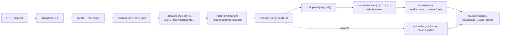

Từng bước, kèm chỗ đọc được trong mã nguồn:

1. **`app.set('trust proxy', 1)`** — [app.ts:19](../apps/api/src/app.ts#L19). Cần vì `req.protocol` được dùng để dựng `downloadUrl`; sau Caddy/cloudflared mà không tin proxy thì link sinh ra sẽ mang `http://`.
2. **`cors()`** — không tham số, tức là cho phép mọi origin.
3. **`express.json({limit: '10mb'})`** — chỉ áp cho body JSON. Upload artifact đi bằng `PUT` với `Content-Type: application/octet-stream` nên **không** qua middleware này; nó được đọc thẳng bằng `stream/promises.pipeline`, do đó giới hạn 10mb không chặn file 150MB.
4. **Định tuyến theo tiền tố** — 7 lời gọi `app.use` trong [app.ts:31-39](../apps/api/src/app.ts#L31-L39).
5. **Middleware xác thực** — gắn ở **từng route**, không gắn ở tầng `app`. Ngoại lệ có chủ đích: `GET /v1/health` và `GET /v1/artifacts/:id/download`.
6. **Handler** — closure trong router, tự gọi zod, tự gọi supabase, tự `try/catch`.
7. **Formatter** — chỉ ba hàm, mục đích là **lọc field nội bộ** (`locator`, `storage_backend`) trước khi trả ra ngoài.

Không có `app.use((err, req, res, next) => ...)` ở bất kỳ đâu — xem [§16](#16-xử-lý-lỗi).

---

## 7. Xác thực

Ba mặt phẳng, ba cơ chế khác nhau:

| Mặt phẳng | Cơ chế | Áp dụng cho |
|---|---|---|
| Công khai | `Authorization: Bearer <API_TOKEN>` | mọi route `/v1/*` trừ hai ngoại lệ dưới |
| Worker | `Authorization: Bearer <WORKER_TOKEN>` | mọi route `/internal/v1/*` |
| Không token | không có | `GET /v1/health`; `GET /v1/artifacts/:id/download` (thay bằng chữ ký) |

### 7.1 So sánh token

```ts
// middleware/auth.ts
function safeCompare(a: string, b: string): boolean {
  const digestA = crypto.createHash('sha256').update(a).digest();
  const digestB = crypto.createHash('sha256').update(b).digest();
  return crypto.timingSafeEqual(digestA, digestB);
}
```

Hash trước rồi mới so sánh: hai buffer luôn 32 byte nên thời gian so sánh không phụ thuộc độ dài token người gửi. Nếu so trực tiếp, `timingSafeEqual` sẽ ném lỗi khi lệch độ dài — và chính việc ném lỗi đó đã rò rỉ độ dài token thật.

Thiếu header → 401. Sai token → 403.

### 7.2 Chữ ký link tải

```ts
// utils/signature.ts
payload   = `${artifactId}:${expires}`
signature = HMAC-SHA256(DOWNLOAD_SIGNING_SECRET, payload)
```

Kiểm tra: hết hạn → false trước; so sánh bằng `timingSafeEqual` sau khi đối chiếu độ dài. TTL mặc định `DOWNLOAD_URL_TTL_SECONDS = 600`.

Chữ ký **cố ý không phủ** `select` và `path`: link mặc định vốn đã cho cả thư mục, nên người sửa query chỉ có thể lấy **ít hơn** thứ họ đã được phép lấy ([artifacts.router.ts:112-116](../apps/api/src/modules/artifacts/artifacts.router.ts#L112-L116)).

### 7.3 Những gì không có

> Not Found — JWT của người dùng cuối, session, cookie, OAuth, refresh token, đăng ký/đăng nhập tài khoản. Bản 1.0 không có bảng người dùng.

Lưu ý: `JWT_SECRET` trong `deploy/.env` **không** dùng để xác thực client. Nó chỉ để PostgREST chấp nhận service key trong chế độ self-host.

---

## 8. Phân quyền

Không có RBAC/ABAC, không có bảng `roles` hay `permissions`. Toàn bộ phân quyền của hệ thống nằm ở bốn ranh giới sau:

| Ranh giới | Thực thi ở đâu | Ý nghĩa |
|---|---|---|
| Client vs Worker | `requirePublicAuth` / `requireWorkerAuth` | Cầm `API_TOKEN` không gọi được `/internal/v1`, và ngược lại |
| Chủ sở hữu job | `.eq('worker_id', body.workerId)` ở complete/fail/cancelled, và so sánh tường minh ở finalize (409 `NOT_JOB_OWNER`) | Worker này không chốt được artifact của job đang do worker khác giữ |
| Người cầm link vs người cầm token | chữ ký HMAC | Link tải chia sẻ được mà không phải đưa `API_TOKEN` |
| Người ngoài vs cơ sở dữ liệu | RLS bật trên cả 5 bảng + `revoke all ... from anon, authenticated` + `grant execute on claim_job to service_role` | Kể cả lộ URL Supabase, vai trò `anon` không đọc được gì |

Hệ quả đã biết, ghi rõ: **mọi client dùng chung một `API_TOKEN`**, nên không phân biệt được đối tác nào gọi endpoint nào, và job của đối tác A tra cứu/huỷ được bởi đối tác B.

---

## 9. Cơ sở dữ liệu

### 9.1 Sơ đồ quan hệ

```mermaid
erDiagram
    apps {
        text package_id PK
        text play_url
        text title
        text developer
        text version_name
        bigint version_code
        numeric rating
        text installs_text
        text description
        jsonb listing_metadata
        integer screenshot_count
        integer split_count
        bigint base_apk_size_bytes
        bigint artifact_size_bytes
        text last_successful_job_id
        timestamptz first_seen_at
        timestamptz last_pulled_at
        timestamptz updated_at
    }

    workers {
        text id PK
        text name
        text status "online|busy|draining"
        text current_job_id
        text version
        jsonb capabilities
        jsonb host_info
        jsonb stats
        timestamptz last_heartbeat_at
    }

    jobs {
        text id PK
        uuid batch_id
        text package_id
        text play_url
        boolean include_listing
        boolean include_screenshots
        boolean delete_after_download
        jsonb options
        text status "queued|running|cancelling|completed|failed|cancelled"
        text current_step
        smallint progress "0..100"
        smallint priority
        integer attempt_count
        integer max_attempts "mặc định 3"
        text worker_id FK
        timestamptz lease_expires_at
        timestamptz last_heartbeat_at
        timestamptz cancel_requested_at
        text cancel_reason
        text error_code
        text error_message
        boolean error_retryable
        jsonb result_summary
        text idempotency_key UK
        timestamptz queued_at
        timestamptz started_at
        timestamptz completed_at
    }

    job_events {
        bigint id PK
        text job_id FK
        text event_type
        text level "debug|info|warning|error"
        text message
        jsonb data
        timestamptz created_at
    }

    artifacts {
        uuid id PK
        text job_id FK_UK
        text kind "bundle_dir|bundle_zip"
        text state "preparing|available|partial|expired|deleted"
        text file_name
        text content_type
        bigint size_bytes
        text sha256
        jsonb files
        text storage_backend
        text locator
        timestamptz apk_expires_at
        timestamptz expires_at
    }

    workers ||--o{ jobs : "worker_id, on delete set null"
    jobs ||--o{ job_events : "on delete cascade"
    jobs ||--|| artifacts : "unique job_id, on delete cascade"
    apps ||..o{ jobs : "cùng package_id, KHÔNG có khoá ngoại"
```

Lưu ý quan hệ cuối: `jobs.package_id` **không** khai `references apps(package_id)`. Ràng buộc chỉ tồn tại ở tầng ứng dụng (API upsert `apps` trước khi insert `jobs`).

### 9.2 Index

| Index | Định nghĩa | Phục vụ |
|---|---|---|
| `jobs_queue_idx` | `(priority desc, created_at asc) where status = 'queued'` | mệnh đề `order by` của `claim_job()` |
| `jobs_status_created_idx` | `(status, created_at desc)` | `GET /v1/jobs?status=` |
| `jobs_worker_idx` | `(worker_id, status)` | truy vấn theo worker |
| `jobs_batch_idx` | `(batch_id) where batch_id is not null` | `GET /v1/jobs?batchId=` |
| `job_events_timeline_idx` | `(job_id, created_at asc)` | `GET /v1/jobs/:id/events` |
| `workers_heartbeat_idx` | `(last_heartbeat_at desc)` | `GET /v1/system/status` |
| `artifacts_apk_expiry_idx` | `(apk_expires_at) where state='available' and apk_expires_at is not null` | `cleanupExpiredApks()` |
| `artifacts_expiry_idx` | `(expires_at) where state in ('available','partial')` | `cleanupExpiredArtifacts()` |

Ràng buộc `unique`: `jobs.idempotency_key`, `artifacts.job_id`.

### 9.3 Trigger và hàm

- `set_updated_at()` — trigger `before update` trên `apps`, `workers`, `jobs`, `artifacts`. Bảng `job_events` không có (chỉ ghi thêm, không sửa).
- `claim_job(p_worker_id text, p_lease_seconds integer default 120)` — `security definer`, chỉ `service_role` được `execute`. Bên trong làm bốn việc trong một giao dịch: upsert worker → chọn ứng viên bằng `for update skip locked limit 1` → cập nhật job sang `running` và tăng `attempt_count` → ghi `job_events` và đánh dấu worker `busy`.

Điều kiện chọn ứng viên (đọc kỹ, vì nó là lý do tồn tại của `reapStuckJobs`):

```sql
where (status = 'queued' or (status = 'running' and lease_expires_at < now()))
  and cancel_requested_at is null
  and attempt_count < max_attempts
order by priority desc, created_at asc
```

### 9.4 Soft delete

> Not Found — không bảng nào có `deleted_at`. Xoá là xoá thật; artifact chỉ chuyển `state` sang `expired` còn file trên đĩa bị `rm -rf`.

### 9.5 Migration và seeder

- Hai file trong `supabase/migrations/`, đặt tên `NNN_mô_tả.sql`, áp dụng theo thứ tự tên.
- Runner tự viết: [scripts/db-migrate.ts](../scripts/db-migrate.ts). Tạo bảng sổ `public.schema_migrations(filename, checksum, applied_at)`, chuẩn hoá CRLF trước khi băm để checkout trên Windows không đổi checksum, chạy `--apply` mới thực thi (mặc định dry-run), tắt kiểm chứng chỉ SSL khi không phải localhost vì pooler của Supabase trình chứng chỉ của host pooler.
- Trong chế độ self-host, `deploy/supabase-local/01-migrations.sh` mount cả thư mục `migrations` và chạy theo thứ tự tên lúc khởi tạo container.
- **Không có `down` migration**, không có seeder.

---

## 10. Kiến trúc API

### 10.1 Kiểu

REST trên HTTP/1.1. > Not Found — GraphQL, gRPC, WebSocket, webhook. Client biết job xong bằng cách **poll** `GET /v1/jobs/:jobId`.

### 10.2 Bảng đường dẫn đầy đủ

**Công khai — 14 endpoint:**

| Method | Đường dẫn | Token |
|---|---|---|
| GET | `/v1/health` | không |
| GET | `/v1/system/status` | API |
| GET | `/v1/apps` | API |
| GET | `/v1/apps/:packageId` | API |
| POST | `/v1/jobs` | API |
| POST | `/v1/jobs/batch` | API |
| GET | `/v1/jobs` | API |
| GET | `/v1/jobs/:jobId` | API |
| GET | `/v1/jobs/:jobId/events` | API |
| POST | `/v1/jobs/:jobId/cancel` | API |
| POST | `/v1/jobs/:jobId/retry` | API |
| GET | `/v1/jobs/:jobId/artifact/files` | API |
| POST | `/v1/jobs/:jobId/artifact/download-url` | API |
| GET | `/v1/artifacts/:artifactId/download` | chữ ký |

**Nội bộ — 9 endpoint:**

| Method | Đường dẫn |
|---|---|
| POST | `/internal/v1/workers/heartbeat` |
| POST | `/internal/v1/jobs/claim` |
| POST | `/internal/v1/jobs/:jobId/heartbeat` |
| POST | `/internal/v1/jobs/:jobId/events` |
| PUT | `/internal/v1/jobs/:jobId/files/*` |
| POST | `/internal/v1/jobs/:jobId/artifact/finalize` |
| POST | `/internal/v1/jobs/:jobId/complete` |
| POST | `/internal/v1/jobs/:jobId/fail` |
| POST | `/internal/v1/jobs/:jobId/cancelled` |

### 10.3 Quy ước

| Hạng mục | Quy ước |
|---|---|
| Versioning | Trong đường dẫn: `/v1`, `/internal/v1` |
| Bọc kết quả | Thành công: `{"data": ...}`. Một số endpoint nội bộ trả `{"status": "ok", ...}` |
| Bọc lỗi | `{"error": {"code": "SCREAMING_SNAKE", "message": "..."}}` |
| Kiểu dữ liệu | camelCase ra ngoài, snake_case trong DB, chuyển ở `formatters.ts` |
| Phân trang | `?page=1&pageSize=20` (tối đa 100), trả `{"pagination": {page, pageSize, total}}` |
| Lọc | `?status=`, `?batchId=`, `?packageId=` (jobs); `?search=` (apps) |
| Sắp xếp | Cố định trong code, không cho client chọn: jobs theo `created_at desc`, apps theo `last_pulled_at desc`, events theo `created_at asc` |
| Idempotency | Header `Idempotency-Key` ở `POST /v1/jobs` |
| Toàn vẹn | Header `X-Content-SHA256` ở `PUT .../files/*` |

### 10.4 Mã lỗi thực sự dùng

| Mã | Xuất hiện ở |
|---|---|
| 200 / 201 | thành công / tạo job |
| 204 | `claim` không có job, hoặc đĩa thấp |
| 206 / 416 | tải file thô có header `Range` |
| 400 | zod parse hỏng, `INVALID_URL`, `INVALID_PATH`, `SHA256_MISMATCH`, `FILE_COUNT_MISMATCH`, `INVALID_SELECT`, truyền cả `select` lẫn `path` |
| 401 / 403 | thiếu Bearer / sai token, `INVALID_SIGNATURE` |
| 404 | `NOT_FOUND`, `JOB_NOT_FOUND`, `FILE_NOT_FOUND`, `NOTHING_SELECTED`, và `/internal/*` khi đi qua Caddy |
| 409 | `JOB_NOT_RUNNING`, `NOT_JOB_OWNER`, `STATUS_CHANGED`, `LEGACY_ARTIFACT` |
| 410 | `ARTIFACT_GONE`, `FILE_GONE`, `NOTHING_TO_SERVE` |
| 507 | `INSUFFICIENT_STORAGE` |
| 500 | `INTERNAL_ERROR` |

---

## 11. Các luồng nghiệp vụ chính

### 11.1 Toàn cảnh một job, từ lúc gửi tới lúc tải xong

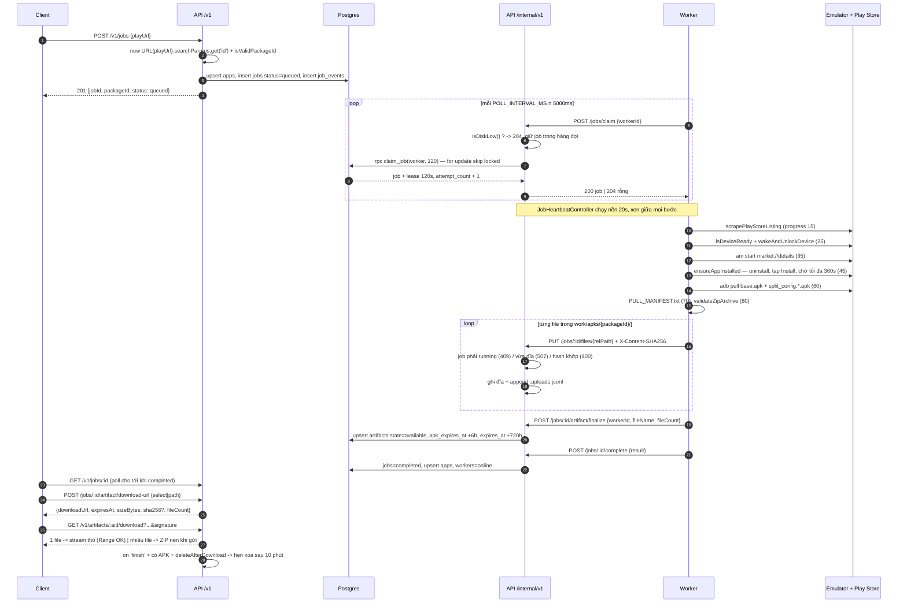

### 11.2 Máy trạng thái của job

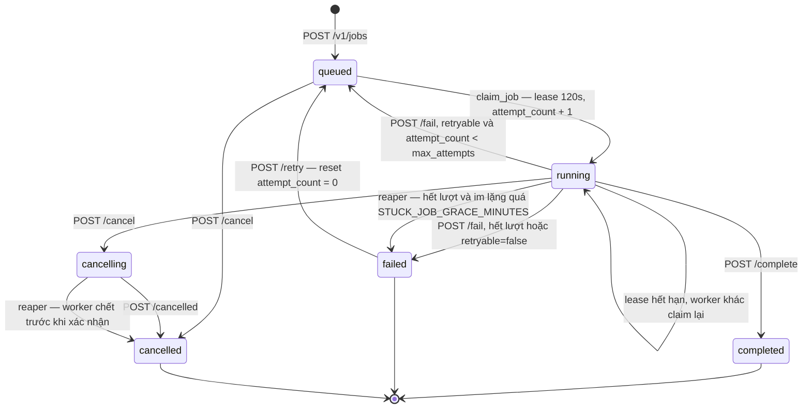

### 11.3 Vòng đời artifact và dọn đĩa

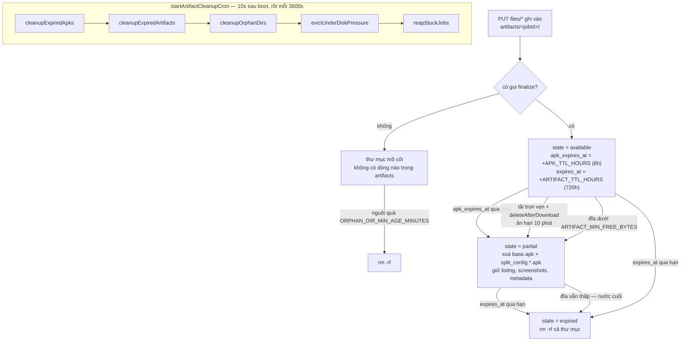

Thứ tự năm bước không tuỳ tiện: xoá APK hết hạn trước (rẻ nhất, giải phóng nhiều nhất), rồi xoá cả thư mục hết hạn, rồi dò mồ côi, rồi mới đuổi theo áp lực đĩa — để bước cuối, bước duy nhất phá dữ liệu chưa hết hạn, chỉ phải chạy khi bốn bước trên không đủ.

`reapStuckJobs()` tồn tại vì `claim_job()` **cố ý** bỏ qua hai loại job: job có `cancel_requested_at` và job `attempt_count >= max_attempts`. Cả hai loại đó nếu worker chết giữa chừng sẽ nằm lại vĩnh viễn — client poll ba trạng thái kết thúc sẽ chờ mãi, và `POST /retry` cũng từ chối vì status không phải `failed`.

### 11.4 Luồng huỷ job

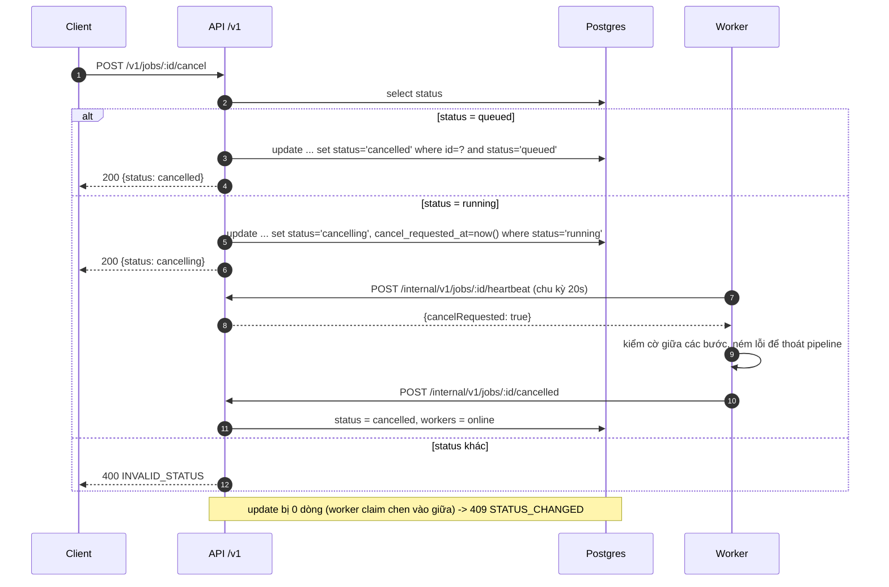

### 11.5 Luồng khởi động container worker

```mermaid
sequenceDiagram
    autonumber
    participant S as supervisord
    participant X as Xvfb / openbox / x11vnc / noVNC
    participant E as entrypoint.sh
    participant AV as create-avd.sh
    participant EM as emulator
    participant WT as wait-for-emulator.sh
    participant N as node dist/index.js

    S->>X: khởi động (Xvfb luôn chạy; ba cái sau chỉ khi WORKER_GUI=on)
    S->>E: khởi động worker-node (priority 50)
    E->>AV: tạo hoặc bung AVD
    alt có /opt/avd-seed/avd-seed.tar.gz
        AV->>AV: tar xzf, kiểm tên AVD khớp, dựng lại sdcard.img, kiểm adbkey
    else không có seed
        AV->>AV: avdmanager create avd (pixel_6, android-35 playstore) + chỉnh ram/heap/data
    end
    E->>EM: emulator -avd chpay -accel $EMULATOR_ACCEL -no-audio -no-boot-anim -gpu swiftshader_indirect
    E->>WT: chờ boot
    WT->>WT: chờ adb get-state = device, chờ sys.boot_completed = 1
    WT->>WT: đặt screen_off_timeout = 2147483647 rồi ĐỌC LẠI kiểm chứng (thất bại -> exit 1)
    E->>E: kiểm com.android.vending có tồn tại không (chỉ cảnh báo)
    E->>N: exec node worker
```

### 11.6 Luồng CI/CD

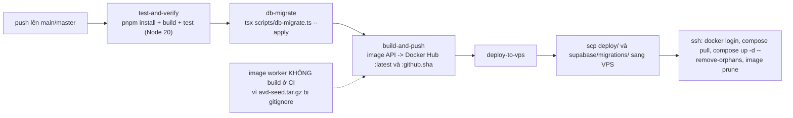

---

## 12. Đồ thị phụ thuộc

### 12.1 Phụ thuộc giữa các package

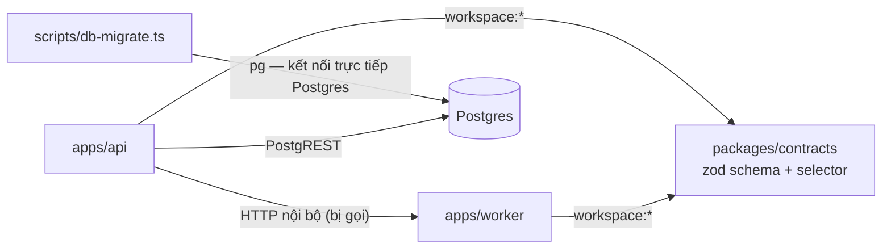

Không có chiều `contracts -> api` hay `contracts -> worker`: package dùng chung không biết gì về hai bên gọi nó.

### 12.2 Phụ thuộc giữa các file trong API

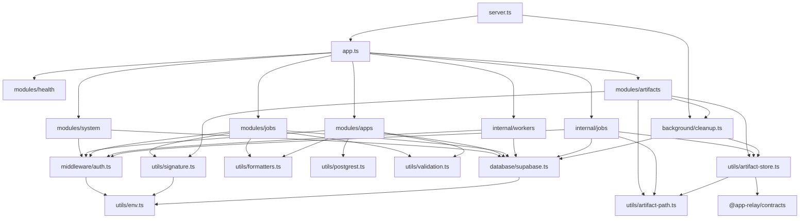

Một chiều đáng chú ý: `modules/artifacts` import `background/cleanup` để gọi `scheduleDeleteAfterDownload`. Đây là chiều **router gọi vào tác vụ nền**, ngược với hướng thông thường; nó tồn tại vì thời điểm "tải xong" chỉ router mới biết.

### 12.3 Phụ thuộc nghiệp vụ (không phải import)

| Phụ thuộc | Hệ quả khi đứt |
|---|---|
| Worker phụ thuộc phiên đăng nhập Google Play trong volume `worker-avd` | Mất phiên là **mọi** job fail ở bước cài; phải đăng nhập tay qua noVNC |
| API phụ thuộc đĩa còn trống | Dưới `ARTIFACT_MIN_FREE_BYTES` thì `claim` trả 204 cho **mọi** worker, hệ thống đứng im mà không có job nào fail |
| Worker phụ thuộc bố cục HTML trang Play | Google đổi layout thì scraper trả về mô tả rỗng/sai, job **vẫn báo thành công** |
| Worker phụ thuộc bố cục giao diện Play Store trong emulator | Không đọc được nút Install thì rơi xuống bấm toạ độ đoán |
| `.env.api` và `.env.worker` phải cùng `WORKER_TOKEN` | Lệch thì worker online, heartbeat chạy, nhưng mọi lần claim đều 403 — bootstrap.sh kiểm chéo chính vì lỗi này |

---

## 13. Dịch vụ ngoài

| Dịch vụ | Tích hợp thế nào | Nơi đọc |
|---|---|---|
| **Google Play (trang web)** | `node-fetch` GET với User-Agent Chrome, bóc JSON-LD và regex HTML; lưu nguyên `page.html` | `pipeline/scraper.ts` |
| **CDN ảnh của Play** (`play-lh.googleusercontent.com`) | Tải icon và ảnh chụp; URL được viết lại về `=w1080-h1920` | `pipeline/scraper.ts:167` |
| **Google Play (ứng dụng trong emulator)** | `am start -a android.intent.action.VIEW -d market://details?id=...`, rồi điều khiển giao diện bằng `uiautomator dump` + `input tap` | `pipeline/installer.ts` |
| **Supabase** | `createClient(SUPABASE_URL, SUPABASE_SECRET_KEY)` với `persistSession: false`, `autoRefreshToken: false` | `database/supabase.ts` |
| **Docker Hub** | Nguồn image `${DOCKERHUB_USERNAME}/app-relay-api` và `-worker`; repo private | `deploy/compose.yml`, `ci.yml` |
| **Cloudflare Tunnel** | Container `cloudflared` trỏ `http://api:5500`; profile `quick` (URL ngẫu nhiên) hoặc `named` (token) | `deploy/compose.tunnel.yaml` |
| **Let's Encrypt** | Qua Caddy, cấu hình bằng `CADDY_EMAIL` và `DOMAIN` | `deploy/caddy/Caddyfile` |
| **GitHub Actions** | 4 job; deploy bằng `appleboy/scp-action` + `appleboy/ssh-action` | `.github/workflows/ci.yml` |

> Not Found — Redis, RabbitMQ, Kafka, AWS, S3/MinIO, Cloudinary, Firebase, Elastic, Stripe, VNPay, MoMo, dịch vụ email.

---

## 14. Cấu hình

### 14.1 Biến môi trường của API (`deploy/.env.api`)

| Biến | Bắt buộc | Mặc định trong code | Việc |
|---|---|---|---|
| `PORT` | không | `5500` | Cổng nghe. Con số này lặp lại ở compose, Caddyfile, `RELAY_API_URL` — đổi phải đổi hết |
| `API_TOKEN` | **có** | — | `requireEnv`, thiếu là chết lúc boot |
| `WORKER_TOKEN` | **có** | — | như trên; phải trùng `.env.worker` |
| `SUPABASE_URL` | **có** | — | `requireEnv` |
| `SUPABASE_SECRET_KEY` hoặc `SUPABASE_SERVICE_ROLE_KEY` | **có** | — | thiếu cả hai thì ném lỗi |
| `DOWNLOAD_SIGNING_SECRET` | **có** | — | khoá HMAC ký link tải |
| `DOWNLOAD_URL_TTL_SECONDS` | không | `600` | hạn của link tải |
| `ARTIFACT_DIR` | không | `<cwd>/artifacts` (compose đặt `/data/artifacts`) | gốc thư mục artifact |
| `APK_TTL_HOURS` | không | `6` | hạn riêng của file APK |
| `ARTIFACT_TTL_HOURS` | không | `720` | hạn của cả thư mục |
| `ARTIFACT_MIN_FREE_BYTES` | không | `10737418240` (10 GB) | ngưỡng dự phòng đĩa |
| `ORPHAN_DIR_MIN_AGE_MINUTES` | không | `120` | thư mục phải nguội bao lâu mới bị coi là mồ côi |
| `DELETE_AFTER_DOWNLOAD_GRACE_MINUTES` | không | `10` | ân hạn trước khi xoá APK sau tải |
| `STUCK_JOB_GRACE_MINUTES` | không | `15` | im lặng bao lâu thì reaper kéo job về trạng thái kết thúc |
| `NODE_ENV` | không | — | chỉ đặt trong overlay production, code không đọc |

### 14.2 Biến môi trường của worker (`deploy/.env.worker`)

| Biến | Mặc định trong code | Việc |
|---|---|---|
| `WORKER_ID` | `worker_vps_01` | khoá chính bảng `workers` |
| `WORKER_NAME` | `VPS Worker 01` | nhãn hiển thị |
| `RELAY_API_URL` | `http://localhost:5500/internal/v1` | bootstrap đặt `http://api:5500/internal/v1` |
| `WORKER_TOKEN` | **bắt buộc** — thiếu là `throw` ngay đầu `index.ts` | |
| `WORK_DIR` | `<cwd>/work/apks` | nơi dựng thư mục artifact trước khi gửi |
| `POLL_INTERVAL_MS` | `5000` | nhịp claim |
| `HEARTBEAT_INTERVAL_MS` | `20000` | nhịp heartbeat cả worker lẫn job |
| `ANDROID_AVD` | `chpay` | tên AVD |
| `ADB_PATH` | `adb` | đường dẫn adb |
| `EMULATOR_ACCEL` | `auto` | `on` khi có `/dev/kvm` (overlay kvm) |
| `EMULATOR_BOOT_TIMEOUT` | `600` | bootstrap đặt `1800` nếu không có KVM |
| `EMULATOR_SCREEN_OFF_TIMEOUT` | `2147483647` | INT32_MAX — "không bao giờ tắt màn hình" |
| `WORKER_GUI` | `on` (đặt trong Dockerfile) | `off` thì emulator chạy `-no-window` và không bật openbox/x11vnc/noVNC |
| `AVD_RAM_MB` / `AVD_HEAP_MB` / `AVD_DATA_SIZE` / `AVD_SDCARD_SIZE` | `3072` / `512` / `12G` / `2G` | tham số AVD trắng |
| `AVD_SEED_PATH` / `AVD_SEED_DISABLE` | `/opt/avd-seed/avd-seed.tar.gz` / `0` | bung seed hay tạo AVD trắng |

### 14.3 Biến của tầng compose (`deploy/.env`)

`COMPOSE_FILE`, `COMPOSE_PROFILES`, `DOMAIN`, `CADDY_EMAIL`, `KVM_GID`, `HTTP_PORT`, `POSTGRES_PASSWORD`, `AUTHENTICATOR_PASSWORD`, `JWT_SECRET`, `DOCKERHUB_USERNAME`, `IMAGE_TAG`, `CLOUDFLARE_TUNNEL_TOKEN`.

Ba file `.env` tách nhau **có chủ đích**: service `api` và `worker` chỉ nạp `.env.api`/`.env.worker`, không nạp `.env` — để `POSTGRES_PASSWORD` và `JWT_SECRET` không lọt vào môi trường của tiến trình không dùng tới chúng, nhất là worker (nơi chạy APK của bên thứ ba).

### 14.4 Bí mật

- Sinh bởi `deploy/bootstrap.sh` bằng `gen_hex`, `chmod 600`, không commit (`.gitignore`).
- CI dùng GitHub Secrets: `SUPABASE_ACCESS_TOKEN`, `SUPABASE_PROJECT_REF`, `SUPABASE_DB_URL`, `DOCKERHUB_USERNAME`, `DOCKERHUB_TOKEN`, `VPS_HOST`, `VPS_USER`, `VPS_SSH_KEY`, `VPS_SSH_PORT`, `VPS_DEPLOY_PATH`.
- `avd-seed.tar.gz` chứa **phiên đăng nhập Google** và được nướng vào image worker; đó là lý do repo Docker Hub phải để private.

---

## 15. Logging

| Loại log | Trạng thái |
|---|---|
| Log ứng dụng | `console.log` / `console.warn` / `console.error` với tiền tố thủ công: `[Worker]`, `[Cleanup]`, `[Reaper]`, `[Claim]`, `[Installer]`, `[Puller]`, `[Scraper]`, `[ADB]`, `[Upload]`, `[AVD]`, `[Emulator]`, `[Entrypoint]`, `[db-migrate]` |
| Log có cấu trúc (JSON) | > Not Found |
| Request log / access log của API | > Not Found — không có morgan hay middleware log request |
| Access log tầng ngoài | Có, ở Caddy: `log { output stdout, format console }` |
| Audit log nghiệp vụ | **Có** — bảng `job_events`, ghi bởi cả API và worker, đọc qua `GET /v1/jobs/:id/events` |
| Error log | Lẫn trong `console.error`, không tách file |
| Xoay log | Ở tầng Docker, chỉ trong overlay production: `json-file`, `max-size 10m`, `max-file 5` |
| Log của supervisord | `/var/log/supervisord.log` trong container worker |

Danh sách `event_type` thực sự được ghi: `job.queued`, `job.claimed`, `job.cancel_requested`, `job.retried`, `job.auto_retried`, `job.completed`, `job.failed`, `job.cancelled`, `listing.scraping`, `listing.scraped`, `play.opening`, `play.installing`, `apk.pulling`, `apk.pulled`, `apk.validated`, `manifest.created`, `artifact.uploading`, `artifact.ready`.

---

## 16. Xử lý lỗi

### 16.1 Tầng HTTP

Không có error middleware toàn cục. Mỗi handler tự bọc `try/catch` và tự chọn mã lỗi. Hệ quả cụ thể, đọc được trong code:

- Lỗi zod bị gộp chung vào `400 BAD_REQUEST` với `message` là chuỗi lỗi thô của zod — client không nhận được danh sách field lỗi có cấu trúc.
- Một số handler dùng `400` làm mã mặc định của `catch` (ví dụ `finalize`, `complete`, `fail`), nên lỗi hạ tầng (DB sập) cũng hiện ra thành `400`.
- `modules/artifacts` có xử lý riêng cho trường hợp lỗi xảy ra **sau khi** header đã gửi: `if (res.headersSent) return res.destroy()`.

### 16.2 Tầng tiến trình

| Nơi | Cơ chế |
|---|---|
| Worker | `process.on('unhandledRejection')` và `process.on('uncaughtException')` chỉ **ghi log**, tiến trình chạy tiếp |
| Worker | `SIGINT`/`SIGTERM` → `process.exit(0)`, có hẹn giờ 10s ép thoát |
| Worker | Vòng claim lỗi liên tiếp → backoff luỹ thừa `POLL_INTERVAL_MS * 2^(n-1)`, trần 60s |
| API | > Not Found — không bắt `uncaughtException`; `restart: unless-stopped` của Docker là lưới cuối |

### 16.3 Retry và fallback

| Cơ chế | Chi tiết |
|---|---|
| Retry job | `attempt_count` / `max_attempts` (mặc định 3). `POST /fail` với `retryable != false` và còn lượt thì đưa job về `queued` |
| Retry ngầm | Lease hết hạn → `claim_job()` tự nhặt lại job `running`, `attempt_count` tăng thêm |
| Retry thủ công | `POST /v1/jobs/:id/retry` reset `attempt_count = 0` |
| Fallback trong pipeline | Không đọc được nút Install → bấm toạ độ ước lượng; icon/screenshot tải hỏng → chỉ `console.warn` rồi đi tiếp; `device-dir.listing` và `package-info.txt` lỗi cũng chỉ cảnh báo |
| Fail-fast có chủ đích | `requireEnv` chết lúc boot; `applyScreenOffTimeout` ném lỗi thay vì chạy tiếp; `wait-for-emulator.sh` `exit 1` |
| Bảo vệ dữ liệu | Upload hash lệch hoặc đứt giữa chừng → xoá file vừa ghi rồi mới trả lỗi |

---

## 17. Bảo mật

### 17.1 Đã có

| Biện pháp | Nơi thực hiện |
|---|---|
| So sánh token constant-time sau khi hash SHA-256 | `middleware/auth.ts` |
| Link tải ký HMAC-SHA256 kèm hạn, so sánh constant-time | `utils/signature.ts` |
| Chống path traversal ba lớp: `jobId` phải khớp `^[A-Za-z0-9._-]+$`; đường dẫn con được `decodeURIComponent` → chuẩn hoá → từ chối `..`, đường dẫn tuyệt đối, ký tự NUL, và mọi segment bắt đầu bằng `.`; sau `path.resolve` còn kiểm lại phải nằm trong thư mục artifact | `utils/artifact-path.ts` |
| Chống command injection: `packageId` phải khớp regex trước khi ghép vào lệnh adb (kiểm ở **cả** API và worker) | `utils/validation.ts`, `installer.ts:115`, `adb.ts:140` |
| Chống injection bộ lọc PostgREST: escape `%`, `_`, `\`, `"` đúng thứ tự rồi bọc trong dấu nháy kép | `utils/postgrest.ts` |
| RLS bật trên cả 5 bảng, `revoke all` với `anon`/`authenticated`, `claim_job` chỉ `service_role` được gọi | `001_initial_schema.sql:323-341` |
| Kiểm toàn vẹn từng file bằng SHA-256 hai đầu | `client.ts:115-136`, `internal/jobs.router.ts:160-196` |
| Từ chối upload khi đĩa không đủ (507) thay vì ghi hỏng | `hasRoomFor()` |
| Container API chạy non-root (uid 10001) | `apps/api/Dockerfile` |
| Caddy chặn `/internal/*` trả 404, thêm HSTS, `X-Content-Type-Options`, `Referrer-Policy`, gỡ header `Server` | `Caddyfile` |
| noVNC chỉ publish ra `127.0.0.1:6080`, kể cả ở overlay HTTP | `compose.yml:69`, `compose.http.yaml` |
| Cổng Postgres self-host chỉ mở `127.0.0.1:54322` | `compose.supabase.yaml` |
| `page.html` khai `application/octet-stream` để CDN không viết lại nội dung làm lệch sha256 | `artifact-path.ts:85-93` |
| Formatter lọc `locator`, `storage_backend` khỏi response | `formatters.ts` |

### 17.2 Chưa có

| Thiếu | Ghi chú |
|---|---|
| Rate limit | > Not Found — không có ở cả Express lẫn Caddy |
| `helmet` | > Not Found — Caddy có ba header, nhưng khi chạy overlay `compose.http.yaml` thì không có Caddy nên không có header nào |
| CORS thu hẹp | `cors()` cho phép mọi origin. Ảnh hưởng hạn chế vì xác thực bằng Bearer chứ không bằng cookie |
| CSRF | Không áp dụng — không dùng cookie |
| Hash mật khẩu | Không áp dụng — không có tài khoản người dùng |
| Kiểm nội dung file upload | Không có quét virus/kiểu file; đường dẫn được kiểm nhưng nội dung thì không |
| Xoay token | Đổi `API_TOKEN` là đổi cho tất cả client |
| Mã hoá khi lưu | Artifact nằm trần trên volume |

Rủi ro vận hành nêu thẳng trong chính mã nguồn:

- `compose.http.yaml` đưa API ra Internet bằng HTTP trần — `API_TOKEN` đi qua đường truyền dưới dạng đọc được. File tự ghi cảnh báo "KHÔNG đưa địa chỉ này cho đối tác thật".
- Image worker chứa phiên đăng nhập Google; ai pull được image là vào được tài khoản đó.

---

## 18. Hiệu năng

| Kỹ thuật | Ở đâu |
|---|---|
| Băm và đo kích thước **trên luồng đang ghi** bằng `Transform`, file 150MB không bao giờ nằm trong RAM | `internal/jobs.router.ts:160-182` |
| Băm theo luồng ở phía worker (`pipeline(createReadStream, hash)`) | `client.ts:26-30` |
| Nén ZIP **khi đang gửi**, không sinh file tạm | `artifacts.router.ts:97-110` |
| Hỗ trợ `Range` cho file thô, cho phép tải tiếp | `artifacts.router.ts:15-66` |
| Sổ `.uploads.jsonl` để `finalize` không phải đọc lại toàn bộ dữ liệu chỉ để tính lại sha256 | `artifact-store.ts:14-31` |
| TTL tách đôi: APK (98% dung lượng) hết hạn sau 6h, phần nhẹ giữ 720h | `002_artifact_directory.sql`, `finalize` |
| Index từng phần cho hàng đợi và cho hai mốc hết hạn | mục [§9.2](#92-index) |
| `for update skip locked` — worker không chặn nhau khi claim | `claim_job()` |
| Phân trang bắt buộc, `pageSize` trần 100 | `JobQuerySchema`, `AppQuerySchema` |
| Đếm bằng `head: true` (chỉ lấy count, không kéo dữ liệu) | `system.router.ts` |
| Caddy: `encode zstd gzip` (bỏ qua ZIP theo content-type) và `flush_interval -1` để stream thay vì buffer | `Caddyfile` |
| Docker layer: manifest copy trước source, seed AVD 2.5GB copy trước mã nguồn | hai Dockerfile |
| `pnpm install --prod` để loại devDependencies khỏi image runtime API | `apps/api/Dockerfile` |
| Chờ theo **điều kiện** thay vì `sleep` cứng khi tìm nút Install | `installer.ts:138-157` |

Chưa có: cache tầng ứng dụng, connection pool tự quản (đi qua PostgREST nên pool nằm ở đó), CDN cho artifact, `Content-Length` cho phản hồi ZIP (không có, vì nén khi đang gửi).

---

## 19. Khả năng mở rộng

### 19.1 Giới hạn thực tế hiện tại

Nút thắt không nằm ở API mà ở **một emulator chạy tuần tự**. Đọc từ code: `maxConcurrentJobs: 1` khai trong heartbeat, vòng lặp `while` xử lý xong một job mới claim job tiếp, và bản thân pipeline có các mốc chờ dài — `ensureAppInstalled` chờ tới 360 giây, tìm nút Install tới 120 giây.

### 19.2 Nếu tải tăng

| Quy mô | Điều gì gãy trước |
|---|---|
| ~10k người dùng | Không phải vấn đề của API mà của hàng đợi: mỗi job tốn hàng chục giây tới vài phút emulator. Hàng đợi dài vô hạn, client poll mãi không xong. `claim_job()` đã sẵn sàng cho nhiều worker (`skip locked` + lease), nhưng **chưa từng chạy nhiều worker**; mỗi worker cần một phiên Google Play riêng |
| ~100k người dùng | Đĩa trở thành nút thắt thứ hai. Artifact nằm trên volume của **một** container API, nên không nhân bản API được — hai container API sẽ có hai kho artifact khác nhau và link tải sẽ trỏ sai chỗ một nửa số lần. Phải chuyển sang object storage hoặc gắn dính (sticky) theo `jobId` |
| ~1M người dùng | Một `API_TOKEN` chung không còn tách được đối tác, không đặt được hạn ngạch. `job_events` tăng tuyến tính theo job và không có chính sách dọn — bảng này sẽ lớn hơn tất cả các bảng khác cộng lại. Poll trạng thái thay vì webhook làm số request tăng theo số client chứ không theo số job |

### 19.3 Những chỗ đã chuẩn bị sẵn cho mở rộng

- `claim_job()` viết đúng kiểu competing-consumers, có lease và `skip locked`.
- Lease + heartbeat + reaper cho phép worker chết mà job không kẹt.
- `worker_id` được đối chiếu ở mọi endpoint đổi trạng thái, nên nhiều worker không giẫm lên nhau.
- Hàng đợi có cột `priority` và `claim_job()` đã `order by priority desc`, nhưng **chưa endpoint nào cho client đặt giá trị này** — luôn là 0.

---

## 20. Triển khai

### 20.1 Các file compose và cách xếp chồng

| File | Vai trò |
|---|---|
| `compose.yml` | Nền: `caddy` (profile production), `api`, `worker`, 5 volume, network `app-relay` |
| `compose.kvm.yaml` | Gắn `/dev/kvm`, thêm `group_add`, bật `EMULATOR_ACCEL=on` |
| `compose.supabase.yaml` | Postgres 16 + PostgREST + nginx gateway; API `depends_on` gateway healthy |
| `compose.prod.yaml` | Xoay log cho mọi service, healthcheck cho caddy, `stop_grace_period: 120s` cho worker (emulator cần thời gian ghi userdata 12G) |
| `compose.http.yaml` | Chạy thử không TLS: `ports: !override` để không giành cổng với mapping của bản nền |
| `compose.tunnel.yaml` | `cloudflared-quick` (profile `quick`) hoặc `cloudflared-named` (profile `named`) |

`bootstrap.sh` dò máy (KVM, RAM, đĩa, IP công khai, DNS của domain) rồi **ghi chuỗi `COMPOSE_FILE` và `COMPOSE_PROFILES` vào `deploy/.env`**, nên về sau chỉ cần `docker compose up -d` không kèm cờ. CI cố ý không truyền `-f` hay `--profile` vì làm vậy sẽ đè lên lựa chọn mà bootstrap đã tính trên chính máy đích.

### 20.2 Cổng, volume, network

| Hạng mục | Giá trị |
|---|---|
| Cổng | `api` → `127.0.0.1:5500:5500` (overlay http đổi thành `0.0.0.0:${HTTP_PORT}`); `worker` → `127.0.0.1:6080:6080` (noVNC); `caddy` → `80:80`, `443:443`; `db` (self-host) → `127.0.0.1:54322:5432` |
| Volume | `api-artifacts` (artifact), `worker-avd` (phiên Google Play), `worker-work` (thư mục làm việc), `caddy-data`, `caddy-config`, `supabase-db` |
| Network | một mạng bridge `app-relay` cho tất cả |
| Healthcheck | `api`: `wget --spider http://127.0.0.1:5500/v1/health` mỗi 15s (dùng `127.0.0.1` chứ không `localhost` vì trong container `localhost` phân giải ra `::1` trước, còn server chỉ bind IPv4) |

### 20.3 Môi trường

| Môi trường | Trạng thái |
|---|---|
| Production | Có — `bootstrap.sh` mặc định, `compose.prod.yaml`, profile `production` |
| Development | Có ở mức script: `pnpm dev:api`, `pnpm dev:worker` (tsx watch) |
| Staging | > Not Found — CI chỉ deploy lên một VPS duy nhất |

### 20.4 Điểm cần biết khi deploy

- Image worker **không** được build bởi CI, vì `avd-seed.tar.gz` bị gitignore; build và push tay từ máy đang giữ seed.
- Rollback code: image có tag `github.sha`. Rollback schema: **không có `down` migration**.
- `chmod +x` được chạy lại sau `scp` vì scp không giữ bit thực thi.
- Bước SSH có `set -e` tường minh, vì `appleboy/ssh-action` mặc định không dừng khi một lệnh fail.

---

## 21. Kiểm thử

### 21.1 Hiện có

| Bộ | File | Nội dung |
|---|---|---|
| API | `apps/api/src/api.test.ts` (397 dòng, 6 nhóm) | Chống path traversal, `requireEnv`, formatter lọc field nội bộ, regex packageId (gồm cả payload injection), escape PostgREST, ba test HTTP thật với `app.listen(0)` (health 200, thiếu token 401, có token qua middleware), và một test sinh 10.000 `jobId` kiểm trùng |
| Worker | `apps/worker/src/worker.test.ts` (150 dòng) | Giá trị mặc định cấu hình, chặn packageId dị dạng, `selectorMatches`/`isApkPath`, tính toạ độ ước lượng, `findInstallButton` với 6 tình huống XML (kể cả dump của hộp thoại ANR và bounds hỏng), `validateZipArchive` từ chối file không phải ZIP |
| Contracts | `packages/contracts/src/contracts.test.ts` (65 dòng) | Zod schema: enum trạng thái, enum bước, URL hợp lệ/không hợp lệ, giá trị mặc định của heartbeat, kết quả complete có metadata |

Cách chạy: mỗi package có `"test": "pnpm run typecheck && tsx --test src/**/*.test.ts"`, gọi chung bằng `pnpm test` ở gốc. Runner là `node:test` — **không** dùng Jest/Vitest/supertest.

### 21.2 Không có

| Hạng mục | Trạng thái |
|---|---|
| Đo coverage | > Not Found |
| Thư viện mock/stub | > Not Found — test chỉ dùng hàm thuần và server thật trên cổng ngẫu nhiên |
| Fixture | > Not Found — dữ liệu mẫu viết thẳng trong test |
| Test tích hợp có cơ sở dữ liệu | > Not Found — không endpoint nào chạm DB được kiểm |
| E2E qua emulator | > Not Found |
| `tests/helpers/` | Thư mục rỗng |
| `pnpm test:endpoints`, `pnpm probe:endpoints`, `pnpm download:artifacts` | Trỏ vào `tests/test-endpoints/…` — **thư mục này không tồn tại trong repo**, ba script này hiện gọi là hỏng |

---

## 22. Quy ước code

| Hạng mục | Quy ước thực tế |
|---|---|
| Tên file | `<tên>.router.ts` cho router, `<tên>.test.ts` cho test, còn lại kebab-case (`artifact-path.ts`, `artifact-store.ts`) |
| Tên biến/hàm | camelCase; hằng cấu hình SCREAMING_SNAKE (`POLL_INTERVAL_MS`, `LEDGER`, `PLAY_STORE_PKG`) |
| Tên bảng/cột | snake_case, bảng số nhiều |
| Ranh giới đặt tên | `formatters.ts` là nơi duy nhất chuyển snake_case sang camelCase; không router nào tự trả bản ghi thô |
| Import | ESM có đuôi `.js` cả khi nguồn là `.ts` (yêu cầu của `NodeNext`) |
| Mã lỗi | SCREAMING_SNAKE trong `error.code` |
| DTO / Entity | Không có class; kiểu suy ra từ zod bằng `z.infer` trong `packages/contracts` |
| Repository / Service | Không có — router gọi thẳng `supabase` |
| Xác thực đầu vào | zod ở biên; regex riêng cho `packageId` và đường dẫn |
| Ngôn ngữ chú thích | Hỗn hợp: phần mới viết tiếng Việt, phần cũ tiếng Anh. Chú thích tập trung giải thích **vì sao**, thường kèm hậu quả cụ thể của cách làm sai |
| Linter / formatter | > Not Found — không có `.eslintrc`, không có `.prettierrc` |

---

## 23. Design pattern

Chỉ liệt kê những gì thật sự đọc được trong mã nguồn:

| Pattern | Hiện diện ở |
|---|---|
| **Competing consumers + lease** | `claim_job()` với `for update skip locked` + `lease_expires_at`, heartbeat gia hạn, reaper thu dọn |
| **Pipeline** | `processJob` chạy chín bước tuyến tính, mỗi bước cập nhật `progress`/`current_step` và kiểm cờ huỷ giữa các bước |
| **Facade** | `RelayApiClient` gói toàn bộ giao tiếp `/internal/v1` sau 8 phương thức |
| **Adapter** | `android/adb.ts` bọc lệnh dòng lệnh `adb` thành hàm TypeScript có kiểu |
| **Middleware chain** | `requirePublicAuth` / `requireWorkerAuth` của Express |
| **Ledger (append-only)** | `.uploads.jsonl` — ghi thêm sau mỗi upload, đọc lại lúc liệt kê; dòng hỏng bị bỏ qua thay vì làm hỏng cả sổ |
| **Guard clause** | Kiểu viết chủ đạo trong mọi handler: kiểm và `return` sớm, không lồng if |
| **Idempotent upsert** | `apps` (`onConflict: package_id`), `artifacts` (`onConflict: job_id`), `workers` (upsert theo id) |
| **Optimistic concurrency** | `update ... where status = <trạng thái vừa đọc>`; 0 dòng bị ảnh hưởng thì trả 409 thay vì ghi đè |
| **Strategy qua cấu hình** | `WORKER_GUI` chọn giữa có cửa sổ / `-no-window`; profile compose chọn Caddy hay cloudflared |

Không có: Repository, DI container, CQRS, DDD, Event Sourcing, Hexagonal/Clean Architecture. `job_events` **giống** event sourcing nhưng không phải: trạng thái thật nằm ở cột `jobs.status`, không dựng lại từ chuỗi sự kiện.

---

## 24. Điểm mạnh

1. **Ranh giới tin cậy vẽ đúng chỗ.** Worker là thành phần dễ mất kiểm soát nhất (chạy APK của bên thứ ba trong emulator) và nó không cầm khoá DB, không nạp `.env` chung, mọi thay đổi trạng thái phải đi qua một cửa duy nhất có kiểm `worker_id`.
2. **Các trạng thái hỏng đều có đường thoát.** Lease hết hạn được claim lại; job kẹt ở `cancelling` hoặc hết lượt được reaper kéo về trạng thái kết thúc; thư mục upload dở dang được `cleanupOrphanDirs` dọn; đĩa đầy thì ngừng nhận job thay vì hỏng giữa pipeline.
3. **Toàn vẹn dữ liệu kiểm hai đầu và kiểm đúng lúc.** SHA-256 tính khi ghi, đối chiếu ngay, lệch thì xoá file. `finalize` đếm lại số file trên đĩa thay vì tin lời worker.
4. **Quyết định lưu trữ hợp với dạng dữ liệu.** Giữ nguyên thư mục thay vì ZIP làm cho việc lấy một file là đọc một file, và xoá 98% dung lượng là một lệnh `rm`.
5. **Chú thích giải thích nguyên nhân, không mô tả lại code.** Rất nhiều chú thích ghi kèm hậu quả đo được (ví dụ: `page.html` phình từ 1.185.094 lên 1.185.454 byte vì CDN viết lại `text/html`). Đây là loại tri thức mất đi nếu không viết ra.
6. **Kiểm thử nhắm đúng chỗ nguy hiểm.** Path traversal, injection packageId, escape PostgREST, phân loại APK — đều là những chỗ sai một lần là mất dữ liệu hoặc thủng bảo mật.
7. **Triển khai tự mô tả.** `bootstrap.sh` dò máy rồi ghi lựa chọn vào `.env`, nên CI không phải đoán, và người vận hành không phải nhớ chuỗi `-f` dài.

---

## 25. Nợ kỹ thuật

| Vấn đề | Bằng chứng | Hệ quả |
|---|---|---|
| Ba script `pnpm test:endpoints` / `probe:endpoints` / `download:artifacts` trỏ vào `tests/test-endpoints/` **không tồn tại** | `package.json` vs. nội dung `tests/` | Gõ lệnh là lỗi; người mới tưởng có bộ test endpoint |
| CI test trên Node 20, production chạy Node 22 | `ci.yml:27` vs `apps/api/Dockerfile:4` | Lỗi chỉ xuất hiện ở một trong hai runtime sẽ lọt lưới — chính lỗi WebSocket của `supabase-js` là ví dụ |
| Không có error middleware toàn cục; mã lỗi chọn thủ công từng handler | mọi `*.router.ts` | Lỗi hạ tầng trả về `400`, client không phân biệt được "tôi gửi sai" với "server hỏng" |
| Lỗi zod trả về dưới dạng `message` chuỗi thô | `catch (err) { res.status(400)... err.message }` | Client không lấy được danh sách field lỗi |
| `POST /v1/jobs/batch` bỏ qua URL sai **im lặng** (`continue`) | `jobs.router.ts:110` | Gửi 20 URL, nhận 18 job, không biết hai cái nào bị loại |
| Logic router lặp lại: đọc job, kiểm tồn tại, kiểm trạng thái, ghi `job_events` được viết lại ở nhiều handler | `internal/jobs.router.ts`, `modules/jobs.router.ts` | Sửa quy tắc phải sửa nhiều chỗ; đã có tiền lệ (`workerId` từng bị nhận rồi bỏ qua ở `finalize`) |
| `apps/worker/package.json` còn khai `archiver` nhưng không file nào import | `apps/worker/src/**` | Image nặng thêm, gây hiểu nhầm là worker vẫn nén |
| Migration không có `down`; bảng `schema_migrations` chỉ ghi nhận, không rollback | `scripts/db-migrate.ts` | Rollback schema phải làm tay |
| `jobs.package_id` không có khoá ngoại tới `apps` | `001_initial_schema.sql` | Ràng buộc chỉ tồn tại ở tầng ứng dụng |
| `job_events` không có chính sách dọn | không tìm thấy trong `cleanup.ts` | Bảng tăng vô hạn |
| Cột `priority` có, index có, nhưng không endpoint nào đặt được | `claim_job()` vs. router | Tính năng nửa vời |
| `artifacts.content_type` và `artifacts.sha256` chỉ còn ý nghĩa với artifact `bundle_zip` cũ | `002_artifact_directory.sql` | Hai nhánh code song song cho hai định dạng |
| Không có linter/formatter, chú thích lẫn hai ngôn ngữ | toàn repo | Phong cách trôi dần theo thời gian |
| `console.log` không có cấu trúc, không có `requestId` | toàn repo | Lần theo một job qua log phải đọc bằng mắt |
| `getEstimatedInstallCoordinates` là phỏng đoán theo bố cục Play Store hiện tại | `installer.ts:40-57` | Google đổi giao diện là hỏng; code đã chú thích rõ nhưng bản chất vẫn mong manh |
| Chỉ một emulator, `maxConcurrentJobs: 1` | `index.ts:77` | Xem [§19](#19-khả-năng-mở-rộng) |
| Phiên đăng nhập Google Play là trạng thái thủ công nằm trong volume và trong image | `create-avd.sh`, `Dockerfile` mục 4 | Mất phiên là mọi job fail; image phải để private |

---

## 26. Đề xuất cải thiện

### Ưu tiên cao

| Đề xuất | Lý do |
|---|---|
| Đưa CI về Node 22 cho bước test (hoặc chạy ma trận 20 + 22) | Đang test trên runtime khác production. Chi phí gần bằng không, rủi ro tránh được đã từng xảy ra thật |
| Sửa hoặc gỡ ba script trỏ vào `tests/test-endpoints/` | Lệnh hỏng trong `package.json` là thứ đầu tiên người mới gõ phải |
| Thêm error middleware toàn cục, tách lỗi zod (400 có danh sách field) khỏi lỗi hạ tầng (500) | Đang trả 400 cho lỗi server; client không thể xử lý đúng |
| `POST /v1/jobs/batch` trả về danh sách URL bị loại kèm lý do | Mất dữ liệu im lặng là loại lỗi tệ nhất trong nhóm này |
| Thêm rate limit ở tầng Caddy hoặc Express cho `/v1/jobs` | Một token chung, không hạn ngạch, mỗi job tốn hàng phút emulator — một client vòng lặp là đủ làm nghẽn hàng đợi |

### Ưu tiên trung bình

| Đề xuất | Lý do |
|---|---|
| Tách phần lặp trong router thành hàm dùng chung (`loadJobOrThrow`, `requireJobRunning`, `recordEvent`) | Đã có tiền lệ sót kiểm tra vì logic nằm rải rác |
| Thêm test tích hợp chạm cơ sở dữ liệu (Postgres trong Docker ở CI) | Hiện không endpoint nào có test chạm DB; toàn bộ logic trạng thái không được bảo vệ |
| Dọn `job_events` theo tuổi trong cron sẵn có | Bảng duy nhất tăng vô hạn; thêm một bước vào `runAll()` là đủ |
| Log có cấu trúc kèm `jobId`/`workerId` | Lần theo một job qua nhiều tiến trình hiện phải đọc bằng mắt |
| Gỡ `archiver` khỏi `apps/worker/package.json` | Dependency chết, gây hiểu nhầm về kiến trúc |
| Cho phép client đặt `priority` khi tạo job | Hạ tầng đã có sẵn, chỉ thiếu đường vào |
| Viết `down` cho migration, hoặc ghi rõ trong tài liệu là chính sách "chỉ tiến" | Hiện là khoảng trống ngầm hiểu |

### Ưu tiên thấp

| Đề xuất | Lý do |
|---|---|
| Bảng `api_keys` thay cho một `API_TOKEN` chung | Cần khi có đối tác thứ hai; hiện là quyết định có ý thức của bản 1.0 |
| Webhook báo job xong thay cho poll | Giảm tải khi số client tăng; chưa cần với quy mô hiện tại |
| Chuyển artifact sang object storage | Điều kiện bắt buộc nếu muốn chạy nhiều container API |
| Thêm ESLint + Prettier | Ngăn phong cách trôi; chi phí là một lần chỉnh toàn repo |
| Thống nhất ngôn ngữ chú thích | Giảm ma sát khi đọc |

---

## 27. Phụ lục — tất cả sơ đồ

### 27.1 Sơ đồ thành phần (mức triển khai)

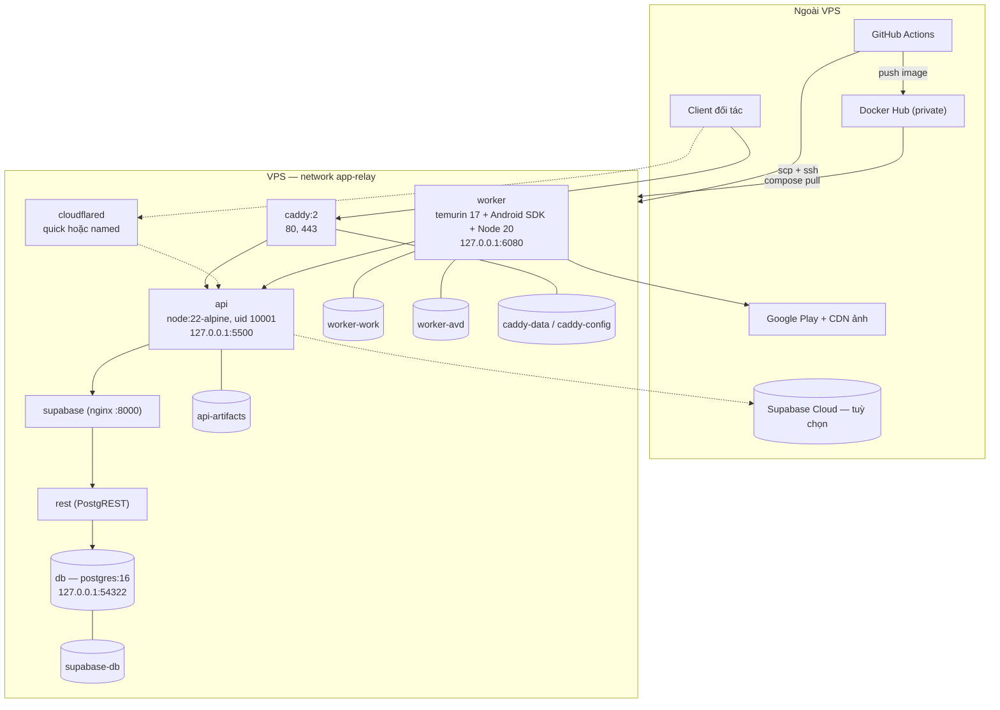

### 27.2 Sơ đồ tuần tự — upload và chốt artifact

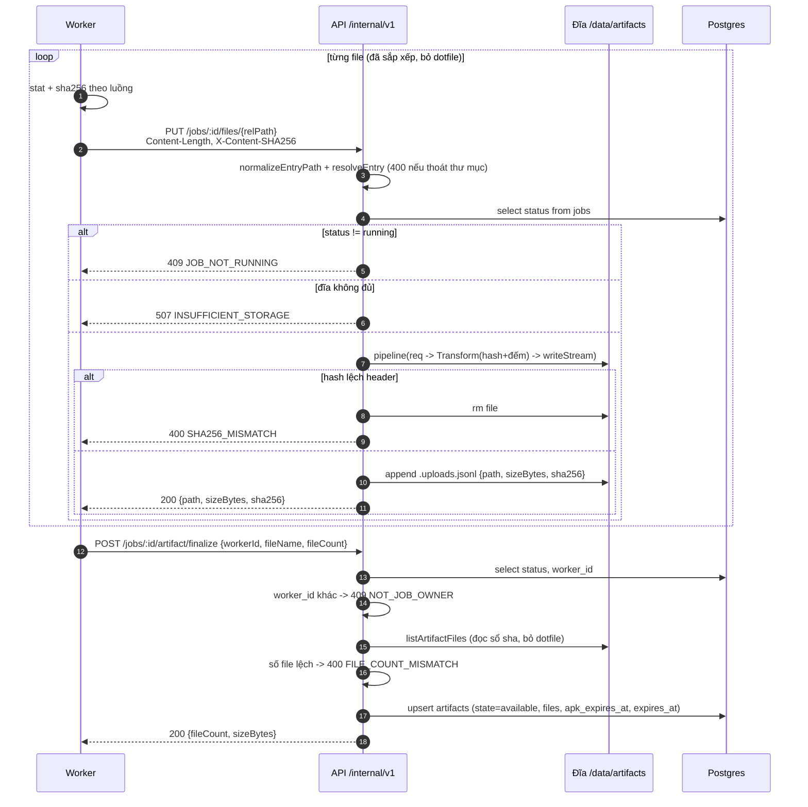

### 27.3 Sơ đồ tuần tự — tải artifact

```mermaid
sequenceDiagram
    autonumber
    participant C as Client
    participant A as API /v1
    participant DB as Postgres
    participant FS as Đĩa

    C->>A: POST /v1/jobs/:id/artifact/download-url {select | path}
    A->>DB: select * from artifacts where job_id
    A->>A: lọc files theo selectorMatches; rỗng -> 404 sớm
    A->>A: signDownloadUrl(artifactId, now+TTL)
    A-->>C: {downloadUrl, expiresAt, fileName, sizeBytes, sha256?, fileCount}

    C->>A: GET /v1/artifacts/:aid/download?select=...&expires=...&signature=...
    A->>A: verifyDownloadUrlSignature (hết hạn hoặc sai -> 403)
    A->>DB: select * from artifacts where id
    A->>A: state không phải available/partial -> 410
    A->>FS: listArtifactFiles + lọc lại theo selector
    alt đúng một file
        A->>A: armDeleteAfterDownload nếu là APK
        A-->>C: stream thô, Accept-Ranges, 200 hoặc 206
    else nhiều file
        A->>A: armDeleteAfterDownload nếu nhóm có APK
        A-->>C: archiver zip level 6, không có Content-Length
    end
    A->>A: res 'finish' + status 200 + đúng Content-Length -> scheduleDeleteAfterDownload
```

### 27.4 Sơ đồ nhóm selector

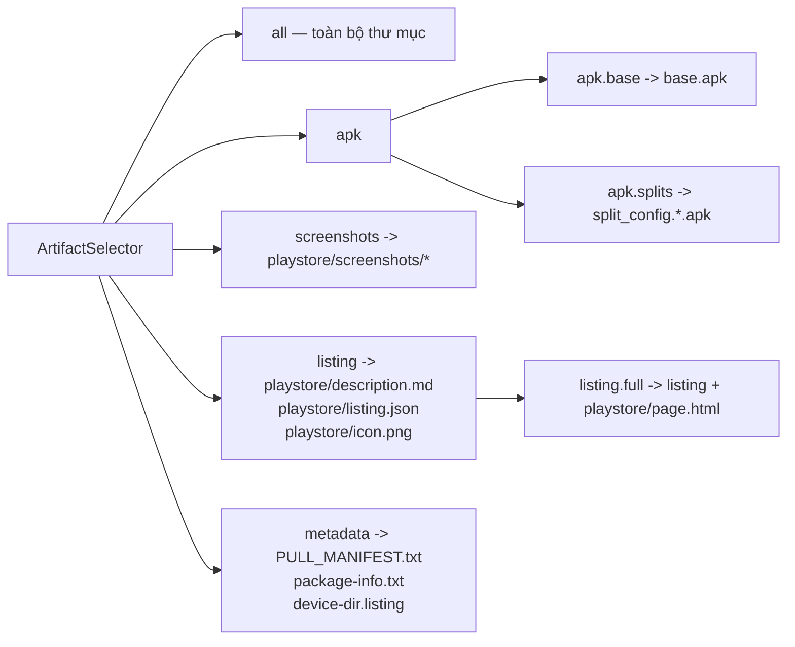

### 27.5 Bố cục thư mục artifact trên đĩa

```
/data/artifacts/<jobId>/
├─ base.apk                         nhóm apk.base   — TTL 6 giờ
├─ split_config.arm64_v8a.apk       nhóm apk.splits — TTL 6 giờ
├─ split_config.xxhdpi.apk          nhóm apk.splits — TTL 6 giờ
├─ PULL_MANIFEST.txt                nhóm metadata
├─ package-info.txt                 nhóm metadata
├─ device-dir.listing               nhóm metadata
├─ playstore/
│  ├─ description.md                nhóm listing
│  ├─ listing.json                  nhóm listing
│  ├─ icon.png                      nhóm listing
│  ├─ page.html                     nhóm listing.full
│  └─ screenshots/screenshot_NN.png nhóm screenshots
└─ .uploads.jsonl                   sổ sha256 nội bộ — không bao giờ giao cho client
```

---

*Tài liệu này mô tả mã nguồn tại thời điểm đọc. Khi sửa mã, sửa kèm mục tương ứng ở đây — nhất là §4 (sơ đồ hệ thống), §9 (schema), §10 (bảng endpoint) và §14 (biến môi trường), vì đó là bốn chỗ người mới tra cứu trước tiên.*
