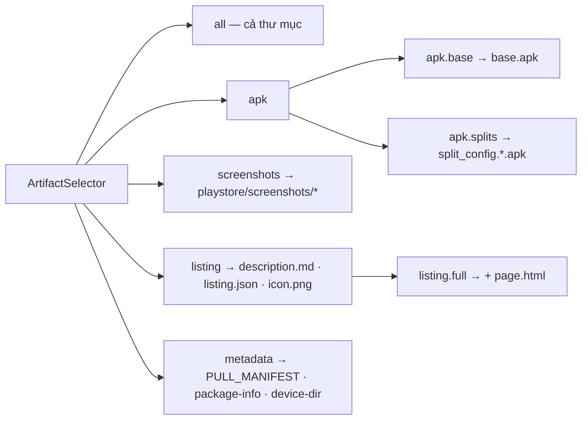
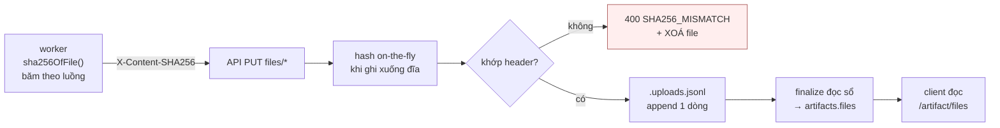

# Artifact design — hợp đồng hình dạng đầu ra

Dự án không có giao diện, nên "sản phẩm bàn giao" là **cây thư mục artifact**. File này giữ vai trò mà design system giữ ở dự án có UI: chốt hình dạng, tên gọi, và cái gì được phép đổi.

---

## 1. Nguyên tắc

- Artifact lưu dưới dạng **thư mục**, đúng layout worker dựng ra.
- **Không lưu file ZIP nào trên đĩa.**
- ZIP chỉ sinh **khi đang stream**, và chỉ khi client xin nhiều file.
- Client lấy được cả cục, một nhóm theo ý nghĩa, hoặc đúng một file.
- APK và phần metadata có **thời hạn sống khác nhau**.
- Không dùng dịch vụ lưu trữ bên thứ ba.

---

## 2. Layout chuẩn

Một layout duy nhất, giữ nguyên qua ba nơi — không có bước dịch:

```text
worker: work/apks/<packageId>/     →     API: /data/artifacts/<jobId>/     →     client
```

```text
<gốc>/
├── base.apk                       # split base — thứ analyzer thật sự cần
├── split_config.arm64_v8a.apk     # mọi split đã cài trên máy
├── split_config.xxhdpi.apk        #   (abi / density / locale)
├── PULL_MANIFEST.txt              # package, play_url, pulled_at, ls, sha256
├── package-info.txt               # dumpsys package — versionName, versionCode…
├── device-dir.listing             # ls -la thư mục /data/app/… trên device
└── playstore/
    ├── description.md             # title, developer, rating, installs, mô tả đầy đủ
    ├── listing.json               # cùng nội dung, dạng structured
    ├── icon.png
    ├── page.html                  # HTML gốc — để client re-parse
    └── screenshots/
        └── screenshot_01.png …    # toàn bộ screenshot trên listing
```

Trên đĩa API còn một file nữa mà client **không bao giờ thấy**:

```text
└── .uploads.jsonl                 # sổ sha256 nội bộ — dotfile, bị lọc khỏi mọi danh sách
```

---

## 3. Vì sao không lưu ZIP

Worker đã dựng sẵn thư mục đúng chuẩn trước khi làm bất cứ việc gì khác. Nén chỉ là bước đóng gói cuối để vận chuyển.

Nếu API lưu lại file ZIP đó thì mỗi lần client xin một tấm ảnh, server phải đọc *central directory*, tìm entry, giải nén — **làm ngược đúng việc worker vừa làm**. Bỏ khâu nén ở giữa thì lấy một file chỉ còn là đọc file khỏi đĩa.

Đo trên `com.zing.zalo`:

| Nhóm | Thô | Trong ZIP | % bundle |
|---|---|---|---|
| `base.apk` + 2 split | 146.7 MB | 68.5 MB | **98.2%** |
| `playstore/screenshots/` (6 ảnh) | 1.24 MB | 1.05 MB | 1.5% |
| `page.html` | 1.19 MB | 204 KB | 0.3% |
| `icon.png` + `description.md` + `listing.json` | 24 KB | 22 KB | 0.03% |
| `PULL_MANIFEST` + `package-info` + `device-dir` | 80 KB | 10 KB | 0.01% |

Client chỉ cần metadata mà phải tải cả cục là lãng phí ~3000 lần.

Cái giá phải trả, ghi thẳng:

| | Trong 48h | Dài hạn |
|---|---|---|
| Lưu ZIP nguyên cục | 69.8 MB | 69.8 MB |
| Thư mục + TTL tách đôi | **149 MB** | **1.3 MB** |

Ngắn hạn tốn gấp đôi vì bỏ nén khi lưu. Dài hạn rẻ hơn ~50 lần vì xoá 98% chỉ là một lệnh `rm`.

---

## 4. Tên file là **hợp đồng**, không phải chi tiết

`selectorMatches()` khớp bằng regex trên đúng mấy tên dưới đây. Đổi tên là **vỡ selector của mọi client**, kể cả khi nội dung file không đổi:

| Tên | Khớp bởi | Mức ràng buộc |
|---|---|---|
| `base.apk` | `p === 'base.apk'` | so sánh chính xác |
| `split_config.<gì đó>.apk` | `/^split_config\.[^/]+\.apk$/` | regex, không cho có `/` ở giữa |
| `playstore/screenshots/…` | `p.startsWith('playstore/screenshots/')` | tiền tố thư mục |
| `playstore/description.md`, `playstore/listing.json`, `playstore/icon.png` | danh sách cứng `LISTING_FILES` | so sánh chính xác |
| `playstore/page.html` | `p === 'playstore/page.html'` | so sánh chính xác |
| `PULL_MANIFEST.txt`, `package-info.txt`, `device-dir.listing` | danh sách cứng `METADATA_FILES` | so sánh chính xác |

Tên **không** ràng buộc: `screenshot_01.png` (chỉ cần nằm trong `playstore/screenshots/`), và bất kỳ file nào khác — chúng rơi vào `select: "all"` và chỉ tải được khi xin cả cục.

Muốn đổi layout thì sửa [packages/contracts/src/index.ts](../packages/contracts/src/index.ts) **và** báo breaking change trong [changelog.md](changelog.md). Không có đường nào khác.

---

## 5. Tám selector



| `select` | Zalo | So với cả cục |
|---|---|---|
| `all` | 73 MB | 1× |
| `apk` | 68.5 MB | 0.94× |
| `apk.base` | 65.4 MB | 0.90× |
| `apk.splits` | 33.6 MB | 0.46× |
| `screenshots` | 1.0 MB | **59× nhẹ hơn** |
| `listing.full` | 220 KB | 330× nhẹ hơn |
| `listing` | 24 KB | **3000× nhẹ hơn** |
| `metadata` | 10 KB | 7300× nhẹ hơn |

Hai hàm phụ trong cùng file:

- `selectorFor(path)` — nhóm "chính" chứa file này, dùng để gợi ý trong `/artifact/files`. Không phải nghịch đảo của `selectorMatches()`: `page.html` trả `listing.full`, nhưng `base.apk` trả `apk.base` chứ không trả `apk`.
- `isApkPath(path)` — dùng cho TTL riêng của APK và cho `deleteAfterDownload`.

---

## 6. Giao hàng

| Tình huống | Hành vi |
|---|---|
| đúng 1 file khớp | file thô, `Content-Type` theo đuôi, `Content-Length`, `Accept-Ranges: bytes` |
| nhiều file khớp | ZIP nén ở mức 6 khi đang stream, **không** `Content-Length`, không lưu lại |
| không file nào khớp | `404` lúc xin link, `410` lúc tải — **không phải** ZIP rỗng |

Selector khớp đúng một file thì **không bọc ZIP quanh một entry**. `select=apk.base` trả thẳng `base.apk`.

### Content-Type

Bảng ánh xạ trong [utils/artifact-path.ts](../apps/api/src/utils/artifact-path.ts). Đuôi lạ → `application/octet-stream`.

**`.html` cố ý khai `application/octet-stream`, không phải `text/html`.** CDN đứng trước API viết lại nội dung `text/html` trên đường truyền: Cloudflare bật sẵn Email Address Obfuscation, chèn `/cdn-cgi/scripts/…/email-decode.min.js` và thay địa chỉ email bằng `/cdn-cgi/l/email-protection`. Đo được: `page.html` của Zalo phình từ 1.185.094 lên 1.185.454 byte và sha256 lệch hoàn toàn.

`page.html` sinh ra để client re-parse listing gốc, nên nó phải tới nơi **nguyên vẹn từng byte**. Khai là octet-stream thì CDN để yên.

---

## 7. Toàn vẹn dữ liệu

**sha256 theo từng file, không có sha256 cho cả cục.** ZIP sinh tại chỗ nên mỗi lần một khác.

Ba nơi client tra được:

1. `GET /jobs/:id/artifact/files` → `files[].sha256`
2. `download-url` với một file → `data.sha256`
3. `PULL_MANIFEST.txt` — worker ghi sẵn lúc pull

Đường đi của hash:



Băm theo luồng ở cả hai đầu để file vài trăm MB không bao giờ nằm trong bộ nhớ.

### Vì sao sổ nằm trong dotfile

`finalize` cần sha256 của mọi file. Tính lại lúc đó phải **đọc lại ~150 MB chỉ để lấy con số vừa tính xong** lúc ghi. Thay vào đó `PUT files/*` nối thêm một dòng JSON vào `.uploads.jsonl` sau mỗi upload thành công.

Vì tên bắt đầu bằng dấu chấm, `listArtifactFiles()` bỏ qua nó — nên nó không lọt vào `/artifact/files`, không lọt vào ZIP, và client không biết nó tồn tại. Cùng lý do đó, **upload dotfile bị cấm** (`400 INVALID_PATH`): worker không được ghi đè sổ của API.

Upload lại cùng một path thì bản sau thắng. Dòng hỏng thì bỏ qua — thiếu sha256 chỉ mất thông tin, không sai dữ liệu.

---

## 8. Thời hạn tách đôi

Vì file nằm rời nên xoá 98% dung lượng chỉ là một lệnh `rm`, không phải viết lại file nén.

| Phần | Biến | Mặc định |
|---|---|---|
| APK (`base` + `split_*`) | `APK_TTL_HOURS` | 6 giờ |
| Phần còn lại | `ARTIFACT_TTL_HOURS` | 720 giờ (30 ngày) |
| Link tải | `DOWNLOAD_URL_TTL_SECONDS` | 600 giây |

**Hết `APK_TTL_HOURS`**: xoá APK, `state = partial`, `files` bị lọc bỏ mục APK, `size_bytes` tính lại. Client vẫn tra được listing, screenshots, version — nhưng **không** còn tra được sha256 của APK đã xoá, vì mục đó bị gỡ khỏi `files`.

**Hết `ARTIFACT_TTL_HOURS`**: xoá cả thư mục, `state = expired`, `files = []`.

---

## 9. Xoá sau khi giao

Tuỳ chọn theo từng job:

```json
{ "playUrl": "https://…?id=com.zing.zalo", "deleteAfterDownload": true }
```

Ba điều kiện phải đủ cả — thiếu một là mất dữ liệu:

**1. Lượt tải phải thực sự chứa APK.** Gắn vào mọi lượt tải thành công là sai: client xin `select=listing` (22 KB) sẽ làm bay 140 MB APK mà họ chưa hề nhận. Chỉ kích hoạt khi tập file được phục vụ có `base.apk` hoặc `split_config.*`.

**2. Phải là `finish`, không phải `close`.** `close` phát cả khi client tụt mạng ở 95% — xoá lúc đó là mất trắng công emulator và phải chạy lại job.

**3. Phải là `200`, không phải `206`.** Tải dở bằng `Range` chưa phải đã nhận đủ.

> Hệ quả: **client tải hoàn toàn bằng `Range` sẽ không bao giờ kích hoạt xoá.** Cố ý chọn hướng an toàn, để TTL lo phần còn lại.

Với một file thì còn đối chiếu thêm số byte đã gửi bằng đúng kích thước file. Với ZIP thì không biết trước kích thước nên chỉ dựa vào response kết thúc bình thường.

Có ân hạn `DELETE_AFTER_DOWNLOAD_GRACE_MINUTES` (mặc định 10) để còn cửa tải lại nếu client ghi file hỏng. Và vì có `Range`, tải đứt giữa chừng thì resume được thay vì chạy lại job — đây chính là điều kiện để bật `deleteAfterDownload` mà không rủi ro.

---

## 10. Thư mục mồ côi

`PUT files/*` ghi xuống đĩa, nhưng **chỉ `finalize` mới tạo dòng trong bảng `artifacts`**. Job bị huỷ hoặc chết giữa lúc upload để lại thư mục vô chủ — mà mọi tác vụ dọn khác đều quét theo DB nên không bao giờ nhìn thấy nó.

Không xử lý thì mỗi lần job hỏng giữa chừng là mất vĩnh viễn tới hàng trăm MB — đúng thứ mà cả thiết kế này sinh ra để tránh.

Cách dò: liệt kê thư mục trực tiếp trên đĩa, đối chiếu `artifacts.job_id`, thư mục nào không có dòng nào thì xoá.

Ba chốt an toàn, **bắt buộc cả ba**:

| Chốt | Vì sao |
|---|---|
| Chỉ đụng thư mục "nguội" quá `ORPHAN_DIR_MIN_AGE_MINUTES` (120) | upload đang chạy có file ghi liên tục nên luôn mới |
| Mốc thời gian lấy theo **file mới nhất bên trong**, không phải mtime thư mục gốc | ghi vào thư mục con không làm đổi mtime cha → upload đang dở sẽ bị coi là cũ và **bị xoá mất** |
| Truy vấn DB lỗi thì **không xoá gì cả** | chạy tiếp thì mọi thư mục trông như mồ côi và bị xoá sạch |

---

## 11. Phanh đĩa

`cleanupExpiredArtifacts()` chỉ xoá thứ đã hết hạn. Không đủ khi job dồn về nhanh hơn tốc độ hết hạn.

Ba lớp phanh:

| Lớp | Ngưỡng | Hành vi |
|---|---|---|
| `evictUnderDiskPressure()` | `< ARTIFACT_MIN_FREE_BYTES` | đuổi APK của tối đa 50 artifact `available` cũ nhất, dừng ngay khi đĩa về trên ngưỡng |
| `POST /jobs/claim` | `isDiskLow()` | trả `204` — job nằm yên trong `queued` thay vì chết **sau khi** đã tốn hết công emulator |
| `PUT files/*` | `hasRoomFor(Content-Length)` | `507` từ chối sớm, trước khi ghi byte nào |

**Nước cuối**: mọi artifact đã `partial` mà đĩa vẫn thấp → xoá hẳn cả thư mục của artifact cũ nhất. Không làm thế thì claim bị chặn vĩnh viễn và hệ thống đứng im — mất phần nhẹ của artifact cũ nhất vẫn hơn là không nhận job nào nữa.

Nếu không còn gì để đuổi mà đĩa vẫn thấp, log `[Cleanup] cần can thiệp thủ công` ở mức `error`. Đó là tín hiệu duy nhất, hiện chưa có cảnh báo tự động.

`freeBytes()` không đo được thì trả `MAX_SAFE_INTEGER` — coi như còn chỗ. Thà nhận job rồi hỏng ở bước ghi còn hơn đứng im vĩnh viễn vì một lỗi đo đạc.

---

## 12. Cố ý không làm

- Không dùng S3 / R2 / Supabase Storage. Mọi thứ nằm trên đĩa API server.
- Không lưu ZIP dựng sẵn để tải nhanh hơn — phải giữ hai bản.
- Không ký `select`/`path` — xem [security.md](security.md) §3.
- Không cho client xoá artifact thủ công; chỉ có TTL và `deleteAfterDownload`.
- Không có sha256 cấp bundle.
- Không nén trước khi lưu.
