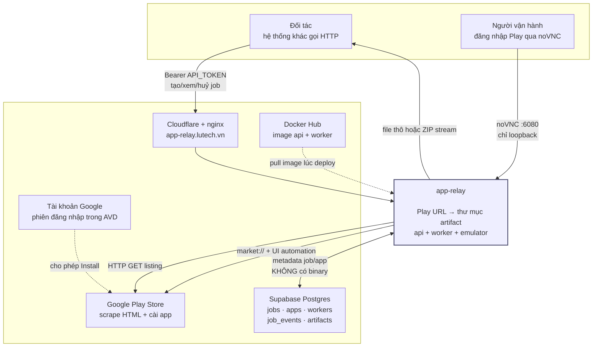
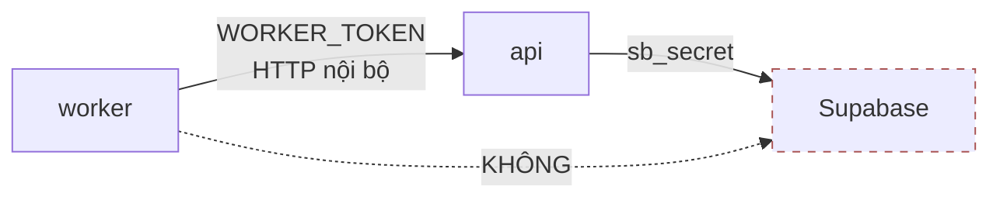

# Context — ranh giới hệ thống

Cái gì nằm trong app-relay, cái gì nằm ngoài, và dữ liệu đi qua ranh giới đó như thế nào.

## 1. Hộp đen

app-relay nhận một URL Google Play và trả về thư mục artifact gồm APK, listing, ảnh và metadata. Bên trong nó chạy một Android emulator đã đăng nhập Google để cài app rồi kéo bản cài ra — nhưng người gọi không cần biết điều đó.

Người gọi chỉ cần hai giá trị:

```env
BASE_URL=https://<host>/v1
API_TOKEN=apr_live_xxxxxxxx
```

Không cần cài gì, không VPN, không biết hệ thống chạy ở đâu.

## 2. Sơ đồ context



## 3. Actor

| Actor | Là gì | Vào bằng đường nào | Làm được gì |
|---|---|---|---|
| **Đối tác** | hệ thống khác, không phải người | `/v1/*` với `API_TOKEN` | tạo job, xem job, huỷ, retry, xin link, tải |
| **Người cầm link** | ai được đưa link đã ký | `/v1/artifacts/:id/download` | tải đúng artifact đó, trong 10 phút |
| **Worker** | container trong cùng Docker network | `/internal/v1/*` với `WORKER_TOKEN` | claim job, heartbeat, upload file, báo kết quả |
| **Cron dọn đĩa** | tiến trình nền trong API, 1 giờ/lần | trong process | xoá APK/artifact hết hạn, dọn mồ côi, dọn job kẹt |
| **Người vận hành** | con người | SSH + noVNC `:6080` | đăng nhập Google Play, xem màn hình emulator, chạy runbook |

## 4. Hệ thống ngoài

| Bên ngoài | app-relay gửi đi | Nhận về | Hỏng thì sao |
|---|---|---|---|
| **Google Play (web)** | HTTP GET với User-Agent desktop | HTML listing, ảnh, icon | job fail ở `scraping_listing`, retryable |
| **Google Play (app)** | intent `market://details?id=…`, thao tác chạm | app được cài lên emulator | job fail ở `installing` sau 6 phút |
| **Tài khoản Google** | — | quyền Install trên emulator | mất phiên → mọi job fail; phải đăng nhập tay qua noVNC |
| **Supabase Postgres** | SQL qua PostgREST, dùng `sb_secret` | trạng thái job, metadata | `/system/status` báo `database: error`; API không nhận job |
| **Cloudflare + nginx** | HTTPS vào `app-relay.lutech.vn`, hạ về HTTP qua hai lớp nginx | đường public cố định | đối tác không gọi được; nội bộ vẫn chạy — soi từng lớp ở [runbook.md §5](runbook.md) |
| **Docker Hub** | — | image lúc deploy | không deploy được bản mới; bản đang chạy vẫn sống |

## 5. Dữ liệu qua ranh giới

### Đi vào

```
Play URL          ← đối tác
Idempotency-Key   ← đối tác (tuỳ chọn)
HTML + ảnh        ← Google Play
APK + splits      ← emulator qua adb
```

### Đi ra

```
jobId, status, progress, currentStep   → đối tác
danh sách file + sha256 từng file      → đối tác
link tải có chữ ký                     → đối tác
file thô hoặc ZIP                      → đối tác / người cầm link
metadata app đã kéo                    → Supabase
```

### **Không** bao giờ đi ra

Đây là ranh giới chủ động, không phải ngẫu nhiên:

| Không lộ | Chặn ở đâu |
|---|---|
| `locator`, `storage_backend` | `formatArtifactResponse()` lọc trước khi trả |
| đường dẫn đĩa thật | không endpoint nào trả |
| `SUPABASE_SECRET_KEY` | chỉ API server giữ; worker không có |
| `DOWNLOAD_SIGNING_SECRET` | chỉ dùng để ký, không bao giờ trả |
| dotfile trong artifact (`.uploads.jsonl`) | `listArtifactFiles()` bỏ qua mọi tên bắt đầu bằng `.` |
| thông tin tài khoản Google | nằm trong volume `worker-avd`, không có API nào chạm tới |

## 6. app-relay **không** chịu trách nhiệm

- **App bị gỡ khỏi Play hoặc khoá theo region.** Scrape listing có thể vẫn chạy, nhưng cài thì không.
- **Tính hợp pháp của việc lưu và phân phối APK.** Đó là chuyện của bên gọi API.
- **Uptime khi máy chủ tắt.** Không có HA, không có failover. Một emulator, một máy.
- **Phân biệt đối tác.** Một token chung — không biết ai gọi gì, không giới hạn được ai.
- **Tính đúng đắn của nội dung listing.** Chép nguyên từ Play; Play sai thì artifact sai theo.
- **Giữ APK vô thời hạn.** Mặc định 6 giờ. Cần lâu hơn thì chạy job mới hoặc nâng TTL và tính lại đĩa.

## 7. Ranh giới bên trong: vì sao worker không nói chuyện thẳng với Supabase

Đây là quyết định dễ bị đề xuất lại nhất, nên ghi rõ:



Ba lý do:

1. **Worker là thứ dễ mất kiểm soát nhất trong hệ thống** — nó chạy emulator, cài phần mềm lạ từ Internet, và thao tác UI. Đưa khoá toàn quyền Supabase vào đó là mở rộng bán kính thiệt hại không cần thiết.
2. **Mọi thay đổi trạng thái đi qua một chỗ.** `claim_job()`, kiểm `workerId` lúc finalize, chặn upload khi job không `running` — tất cả nằm trong API. Nếu worker ghi thẳng DB thì mấy chốt đó phải chuyển thành ràng buộc DB, khó hơn nhiều.
3. **Artifact vốn đã phải đi qua API** (file nằm trên đĩa API server). Đã có một kênh HTTP rồi thì mở thêm kênh DB chỉ là thêm bề mặt.

Giá phải trả: mỗi thao tác của worker là một HTTP request. Với 1 worker và ~18 file/job thì không đáng kể.
