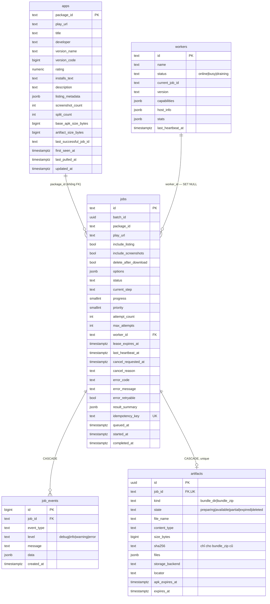
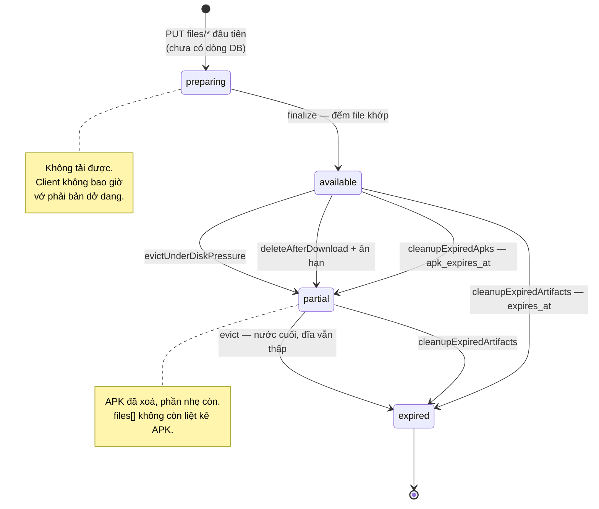

# Database design

Supabase Postgres. **Chỉ lưu metadata** — không APK, không ZIP, không icon, không screenshot. Binary nằm trên đĩa API server.

Nguồn thật là [supabase/migrations/](../supabase/migrations/). File này là diễn giải; lệch nhau thì migration đúng.

---

## 1. ERD



---

## 2. Năm bảng

### `apps` — app đã kéo thành công

Khoá chính là `package_id` (text), không phải id sinh tự động. Một app tồn tại đúng một dòng bất kể kéo bao nhiêu lần.

Được ghi ở hai chỗ: `POST /v1/jobs` upsert `package_id` + `play_url` ngay lúc tạo job, và `POST /internal/v1/jobs/:id/complete` upsert đầy đủ metadata sau khi job xong.

`listing_metadata` giữ `iconUrl`, `screenshotUrls`, `scrapedAt` — **URL ảnh trên Google Play, không phải binary**.

> `artifact_size_bytes` khai trong schema nhưng **hiện không có code nào ghi vào**. Cột chết, xem [plan.md](plan.md).

### `workers` — fleet

`id` là text do người vận hành đặt (`worker_vps_01`), không phải UUID — để đọc log biết ngay máy nào.

`status` có ba giá trị `online | busy | draining`, nhưng **`draining` chưa được code nào dùng**. Và `offline` không nằm trong enum: `/v1/system/status` tính offline theo `last_heartbeat_at` cũ hơn 60 giây.

`current_job_id` **không** có ràng buộc khoá ngoại — cố ý, để xoá job không kéo theo cập nhật worker.

### `jobs` — bảng lõi

`id` sinh ở tầng ứng dụng: `job_${Date.now()}_${randomBytes(8).hex}` (batch chèn thêm chỉ số). Dạng text chứ không UUID để đọc log biết ngay thứ tự thời gian.

Ba nhóm cột đáng chú ý:

| Nhóm | Cột | Vai trò |
|---|---|---|
| Lease | `worker_id`, `lease_expires_at`, `last_heartbeat_at` | `claim_job()` lấy lại job khi lease hết hạn |
| Thử lại | `attempt_count`, `max_attempts` (mặc định 3) | hết lượt thì không claim được nữa → reaper dọn |
| Huỷ | `cancel_requested_at`, `cancel_reason` | có giá trị là `claim_job()` bỏ qua vĩnh viễn |

`idempotency_key` là `unique` — đó là toàn bộ cơ chế idempotency, không có bảng riêng.

`progress` có `check (progress between 0 and 100)`. `status` có check 6 giá trị.

### `job_events` — timeline

Chỉ ghi thêm, không sửa. `id` là `bigint identity`.

Event type đang dùng: `job.queued`, `job.claimed`, `job.cancel_requested`, `job.retried`, `job.auto_retried`, `job.completed`, `job.failed`, `job.cancelled`, `listing.scraping`, `listing.scraped`, `play.opening`, `play.installing`, `apk.pulling`, `apk.pulled`, `apk.validated`, `manifest.created`, `artifact.uploading`, `artifact.ready`.

**Không ghi APK, HTML lớn hoặc ảnh vào `data`.** Đây là bảng timeline, không phải kho.

### `artifacts` — metadata của thư mục artifact

Một job có tối đa một artifact (`job_id` là `unique`).

`files` là jsonb `[{path, sizeBytes, sha256, contentType, select}]` — chính là thứ `/artifact/files` trả về, và là thứ `download-url` lọc theo selector.

**Không có sha256 cho "cả cục"**, vì ZIP sinh tại chỗ nên mỗi lần một khác. Cột `sha256` chỉ còn ý nghĩa với artifact `kind = bundle_zip` cũ — migration 002 đã ghi comment đúng điều đó lên cột.

Hai mốc hết hạn tách rời:

| Cột | Mặc định | Ai đặt | Ai dùng |
|---|---|---|---|
| `apk_expires_at` | `now() + APK_TTL_HOURS` (6h) | `finalize` | `cleanupExpiredApks()` |
| `expires_at` | `now() + ARTIFACT_TTL_HOURS` (720h) | `finalize` | `cleanupExpiredArtifacts()` |

`locator` và `storage_backend` là nội bộ — `formatArtifactResponse()` lọc bỏ trước khi trả cho client.

---

## 3. Vòng đời `artifacts.state`



`deleted` có trong check constraint nhưng **chưa code nào đặt** — dành cho trường hợp xoá thủ công sau này.

---

## 4. Khoá ngoại và hành vi xoá

| Quan hệ | Hành vi | Vì sao |
|---|---|---|
| `job_events.job_id → jobs.id` | `CASCADE` | timeline không có ý nghĩa khi job biến mất |
| `artifacts.job_id → jobs.id` | `CASCADE` | metadata artifact vô nghĩa khi job biến mất |
| `jobs.worker_id → workers.id` | `SET NULL` | xoá worker **không được** làm bay job |
| `jobs.package_id → apps` | **không có FK** | job tạo được trước khi app tồn tại đầy đủ |
| `workers.current_job_id` | **không có FK** | tránh phụ thuộc vòng workers ↔ jobs |

`CASCADE` từ `jobs` xoá dòng DB nhưng **không xoá file trên đĩa**. Đó chính là cách thư mục mồ côi sinh ra, và là lý do `cleanupOrphanDirs()` tồn tại.

---

## 5. Index

| Index | Trên | Điều kiện | Phục vụ |
|---|---|---|---|
| `jobs_queue_idx` | `(priority desc, created_at asc)` | `where status = 'queued'` | `claim_job()` — index bộ phận, chỉ giữ job đang chờ |
| `jobs_status_created_idx` | `(status, created_at desc)` | | `GET /v1/jobs?status=` |
| `jobs_worker_idx` | `(worker_id, status)` | | reaper, `/system/status` |
| `jobs_batch_idx` | `(batch_id)` | `where batch_id is not null` | `GET /v1/jobs?batchId=` |
| `job_events_timeline_idx` | `(job_id, created_at asc)` | | `GET /v1/jobs/:id/events` |
| `workers_heartbeat_idx` | `(last_heartbeat_at desc)` | | `/system/status` |

Hai index bộ phận (`jobs_queue_idx`, `jobs_batch_idx`) chỉ chứa dòng thoả điều kiện — với bảng job tích luỹ hàng chục nghìn dòng đã kết thúc, index hàng đợi vẫn nhỏ.

---

## 6. `claim_job()` — nhận job nguyên tử

Không được làm kiểu `SELECT` rồi `UPDATE`: hai worker sẽ lấy cùng một job.

```sql
create or replace function public.claim_job(
  p_worker_id text,
  p_lease_seconds integer default 120
)
returns setof public.jobs
language plpgsql
security definer
set search_path = public
```

Năm bước trong một transaction:

1. **Upsert worker** — worker mới tự đăng ký, không cần bước riêng.
2. **Chọn ứng viên**:

   ```sql
   where (status = 'queued'
          or (status = 'running' and lease_expires_at < now()))
     and cancel_requested_at is null
     and attempt_count < max_attempts
   order by priority desc, created_at asc
   for update skip locked
   limit 1
   ```

3. **Update sang `running`**, tăng `attempt_count`, đặt lease.
4. **Không tìm được** → đặt worker về `online`, `current_job_id = null`, return rỗng.
5. **Tìm được** → worker sang `busy`, ghi event `job.claimed`.

### Ba mệnh đề quan trọng nhất

**`for update skip locked`** — hai worker gọi cùng lúc thì worker thứ hai bỏ qua dòng đang bị khoá và lấy dòng kế tiếp, thay vì chờ rồi lấy trùng.

**`cancel_requested_at is null`** — job đã yêu cầu huỷ thì không bao giờ được claim lại. Cố ý.

**`attempt_count < max_attempts`** — hết lượt thì không claim nữa. Cũng cố ý.

Hai mệnh đề sau tạo ra hệ quả: job `cancelling` mà worker chết, và job `running` đã hết lượt, **sẽ nằm lại vĩnh viễn**. Client poll ba trạng thái kết thúc sẽ chờ mãi, và `POST /retry` cũng từ chối vì status không phải `failed`.

Đó là lý do `reapStuckJobs()` tồn tại — nó là mảnh ghép còn thiếu của `claim_job()`, không phải một tính năng phụ.

### Quyền

```sql
revoke execute on function public.claim_job(text, integer) from public, anon, authenticated;
grant execute on function public.claim_job(text, integer) to service_role;
```

Hàm là `security definer` nên phải khoá kỹ — chỉ `service_role` (API server) gọi được.

---

## 7. Row Level Security

Cả năm bảng bật RLS và thu hồi mọi quyền của `anon`/`authenticated`:

```sql
alter table public.jobs enable row level security;
revoke all on public.jobs from anon, authenticated;
```

**Không có policy nào** — cố ý. RLS bật mà không policy nghĩa là `anon`/`authenticated` không đọc được gì. API server dùng `sb_secret`/`service_role`, vốn đi vòng qua RLS.

Nghĩa là: kể cả khi `anon key` lộ ra ngoài, người cầm nó không đọc được một dòng nào.

---

## 8. Trigger

`set_updated_at()` gắn `before update` cho `apps`, `workers`, `jobs`, `artifacts`. `job_events` không có vì chỉ ghi thêm.

Lưu ý: code vẫn tự set `updated_at` ở nhiều chỗ. Thừa nhưng vô hại — trigger ghi đè.

---

## 9. Migration

### Quy ước

- `NNN_mô_tả.sql`, 3 chữ số, snake_case.
- **Chỉ thêm mới, không sửa file đã commit.** `scripts/db-migrate.ts` giữ checksum trong `public.schema_migrations` và **từ chối chạy** nếu nội dung đổi:

  ```text
  002_artifact_directory.sql was already applied with a different checksum
  ```

- Dùng `if not exists` / `drop … if exists` để chạy lại được.

### Chạy

```bash
# Xem trước
SUPABASE_DB_URL='postgres://…' pnpm exec tsx scripts/db-migrate.ts

# Áp thật
SUPABASE_DB_URL='postgres://…' pnpm exec tsx scripts/db-migrate.ts --apply
```

Với self-host, init script Postgres tự áp mọi file trong `supabase/migrations/` — nhưng **chỉ khi thư mục dữ liệu còn trống**. Deploy đã tồn tại thì phải chạy tay.

### Bước bắt buộc sau mỗi migration đổi cấu trúc

```sql
notify pgrst, 'reload schema';
```

PostgREST cache schema lúc khởi động. Thiếu bước này thì mọi ghi vào cột mới lỗi:

```text
Could not find the 'delete_after_download' column of 'jobs' in the schema cache
```

Supabase Cloud tự reload. Self-host thì gọi tay hoặc restart container `rest`.

---

## 10. Seed data

**Không có, và đó là chủ ý.** `apps` được upsert từ job chạy thật. Seed dữ liệu giả vào đó chỉ tạo ra app không có artifact tương ứng.

---

## 11. Vì sao không dùng Supabase Queues

Với vài worker, bảng `jobs` + `claim_job()` + lease là đủ, và **dễ xem dễ debug hơn hẳn**: một câu `select * from jobs where status='running'` cho biết ngay mọi thứ.

PGMQ có visibility timeout và cơ chế message queue sẵn, nhưng vẫn phải giữ bảng `jobs` để phục vụ status, timeline và API — nên nó là thêm một hệ thống, không phải thay thế.

Đổi khi có hàng chục worker hoặc khi `claim_job()` trở thành điểm nghẽn đo được. Không đổi vì "queue thì đúng bài hơn".
