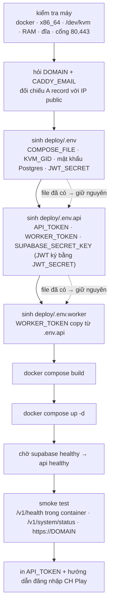

# Deploy lên VPS — từ máy trắng tới API public

Tài liệu này là đường deploy **tự chứa**: VPS chỉ cần Docker, mọi thứ còn lại
nằm trong compose. Không cài Node, không cài Java, không cài Android SDK, không
cần project Supabase Cloud.

Khác với [kick-start.md](kick-start.md) (dựng để phát triển, chạy tay từng bước)
và với [CI-CD.md](CI-CD.md) (pipeline pull image có sẵn từ Docker Hub).

---

## 1. VPS cần gì

| | Tối thiểu | Nên có |
|---|---|---|
| Kiến trúc | `x86_64` | `x86_64` |
| vCPU | 4 | 8 |
| RAM | 8 GB | 16 GB |
| Đĩa | 60 GB | 120 GB SSD |
| KVM | — | **bắt buộc trên thực tế** |
| OS | Ubuntu 22.04 / 24.04 | 24.04 |

Kiểm tra trước khi bắt đầu:

```bash
uname -m                       # phải ra x86_64
ls -la /dev/kvm                # phải tồn tại
egrep -c '(vmx|svm)' /proc/cpuinfo
```

**Không có `/dev/kvm` thì coi như không deploy được.** Emulator vẫn chạy bằng
software emulation nhưng chậm tới mức một job kéo APK có thể mất hàng chục phút
và thường timeout. Nhà cung cấp VPS phải bật nested virtualization; hỏi họ trước
khi mua, đây là thứ không sửa được từ phía mình.

`bootstrap.sh` vẫn cho tiếp tục nếu thiếu KVM (có hỏi lại), và tự đặt
`EMULATOR_ACCEL=off` cùng `EMULATOR_BOOT_TIMEOUT=1800`.

Domain: một bản ghi **A** trỏ về IP VPS, tạo **trước** khi chạy bootstrap.
Let's Encrypt cấp cert qua HTTP-01 nên A record sai là cert fail.

Firewall phải mở **cả 80 lẫn 443**. Nhiều người chỉ mở 443 rồi không hiểu tại
sao không có cert — thử thách ACME đi qua cổng 80.

---

## 2. Ba lệnh

```bash
# 1. Docker + git. get.docker.com KHÔNG cài git, và bản Ubuntu server tối giản
#    thường không có sẵn — thiếu nó thì bước 2 báo "command not found".
curl -fsSL https://get.docker.com | sh
apt-get update && apt-get install -y git

# 2. Lấy code
sudo mkdir -p /opt/app-relay && sudo chown "$USER":"$USER" /opt/app-relay
git clone git@github.com:<owner>/app-relay.git /opt/app-relay

# 3. Dựng tất cả
cd /opt/app-relay/deploy
DOMAIN=api.tenmien.com CADDY_EMAIL=ban@tenmien.com ./bootstrap.sh
```

Repo private mà clone qua HTTPS sẽ **treo vô hạn** chờ mật khẩu — không lỗi,
không timeout, chỉ đứng im. Dùng deploy key SSH như trên, hoặc nếu buộc phải
dùng token thì tắt hẳn prompt để nó fail ngay:

```bash
GIT_TERMINAL_PROMPT=0 git clone https://<token>@github.com/<owner>/app-relay.git /opt/app-relay
```

Bỏ trống `DOMAIN` / `CADDY_EMAIL` thì script tự hỏi. Chạy trong CI hoặc qua
`ssh <host> '...'` (không có TTY) thì **phải** truyền sẵn, kèm `--yes`.

### Chưa có tên miền — chạy thử bằng HTTP trần

```bash
./bootstrap.sh --http-only
```

API ra thẳng `http://<IP-VPS>:3000`, không có Caddy, không có TLS. Dùng để kiểm
tra emulator và luồng kéo APK khi chưa kịp có domain.

**Đánh đổi phải hiểu rõ:** `API_TOKEN` đi qua Internet dưới dạng chữ đọc được.
Ai chen được vào đường truyền — wifi công cộng, nhà mạng, router giữa đường —
đều lấy được token và gọi API thay bạn. Chế độ này để **tự kiểm tra**, không
đưa địa chỉ cho đối tác thật.

noVNC vẫn chỉ bind `127.0.0.1:6080`, kể cả ở chế độ này. Nó là màn hình điều
khiển emulator và **không có xác thực nào cả** — mở ra Internet là giao cả máy.
Vào bằng SSH tunnel, §4.

Cổng 3000 phải được firewall cho qua. Trên FPT Cloud là **Security Group** của
VM; trên host còn có `ufw`:

```bash
ufw status
ufw allow 3000/tcp     # chỉ khi ufw đang active
```

Chuyển sang HTTPS về sau: §8, không phải build lại, không mất dữ liệu.

Lần đầu mất **~30–40 phút**, gần hết là build worker image: JDK 17 + Android SDK
+ system image `android-35;google_apis_playstore;x86_64` ≈ 9 GB.

---

## 3. Bootstrap làm những gì



Script **idempotent**: chạy lại không ghi đè secret đã sinh, không xoá volume.
Chạy lại sau khi `git pull` = build lại + up lại, dữ liệu giữ nguyên.

### Ba file nó sinh ra

| File | Chứa | Quyền |
|---|---|---|
| `deploy/.env` | biến cho compose nội suy: `COMPOSE_FILE`, `COMPOSE_PROFILES`, `DOMAIN`, `KVM_GID`, mật khẩu Postgres, `JWT_SECRET` | `600` |
| `deploy/.env.api` | biến của container api: `API_TOKEN`, `WORKER_TOKEN`, `SUPABASE_*`, TTL artifact | `600` |
| `deploy/.env.worker` | biến của container worker: `WORKER_TOKEN`, đường dẫn SDK, `AVD_*` | `600` |

Cả ba đều gitignore. Mọi token sinh bằng `openssl rand`, không có giá trị mặc
định nào để quên đổi.

### Mẹo `COMPOSE_FILE` — sau bootstrap không cần cờ `-f` nữa

Bootstrap ghi vào `deploy/.env`:

```env
COMPOSE_FILE=compose.yml:compose.kvm.yaml:compose.supabase.yaml:compose.prod.yaml
COMPOSE_PROFILES=production
```

Docker Compose đọc hai biến này từ `.env` của thư mục project. Nghĩa là đứng
trong `deploy/` thì `docker compose ps`, `logs`, `up -d` **tự động** dùng đúng
bộ overlay và đúng profile. Không còn chuỗi `-f compose.yml -f compose.kvm.yaml …`
để gõ sai.

Máy không có KVM thì `compose.kvm.yaml` bị bỏ khỏi danh sách này.

### SUPABASE_SECRET_KEY khi self-host là cái gì

Không có Supabase Cloud thì không có khoá `sb_secret_...`. Thay vào đó bootstrap
tự ký một **JWT HS256** mang claim `role: service_role` bằng `JWT_SECRET`.
PostgREST xác thực JWT đó bằng `PGRST_JWT_SECRET` (cùng giá trị) rồi `set role`
theo claim — đúng cơ chế Supabase Cloud dùng, nên code trong
[apps/api/src/database/supabase.ts](../apps/api/src/database/supabase.ts) không
phải đổi một dòng nào.

Hệ quả: **đổi `JWT_SECRET` mà không sinh lại `SUPABASE_SECRET_KEY` thì API nhận
401 từ PostgREST ở mọi truy vấn.** Hai giá trị này đi thành cặp.

### Migration chạy lúc nào

Init script của Postgres **chỉ chạy khi thư mục dữ liệu còn trống**. Deploy sạch
→ toàn bộ `supabase/migrations/*.sql` được áp theo thứ tự tên, tự động, không
cần làm gì.

Thêm migration mới **sau khi** stack đã chạy thì phải áp tay:

```bash
cd /opt/app-relay
SUPABASE_DB_URL='postgres://postgres:<POSTGRES_PASSWORD>@127.0.0.1:54322/postgres' \
  docker compose -f deploy/compose.yml run --rm api node -e '…'
```

hoặc đơn giản hơn, dùng `psql` trong chính container db:

```bash
cd /opt/app-relay/deploy
docker compose exec -T db psql -U postgres -d postgres < ../supabase/migrations/003_xxx.sql
docker compose exec -T db psql -U postgres -d postgres -c "notify pgrst, 'reload schema';"
```

Dòng `notify pgrst` **không được quên**: self-host không tự nạp lại schema như
Cloud, và mọi ghi vào cột mới sẽ lỗi cho tới khi chạy nó.

---

## 4. Bước tay duy nhất — đăng nhập Google Play

Script không làm thay được việc này. Emulator chưa đăng nhập CH Play thì mọi job
fail ở bước tải app.

Từ máy cá nhân:

```bash
ssh -N -L 6080:127.0.0.1:6080 <user>@<IP-VPS>
```

Rồi mở trên trình duyệt:

```
http://localhost:6080/vnc.html?autoconnect=true&resize=scale
```

Phải có `autoconnect=true`. Mở `vnc.html` trần thì noVNC dừng ở màn hình chờ và
**phải bấm nút Connect** — không bấm thì trông y như chưa có emulator nào chạy.

Desktop ảo 1080x1920, cửa sổ emulator ~413x939 ở góc trên-trái. Thấy khung nhỏ
trên nền xám là đúng.

Mở app Play Store trong emulator, đăng nhập tài khoản Google. Xong thì đóng
trình duyệt và ngắt SSH — phiên đăng nhập nằm trong volume `worker-avd`, làm
**một lần duy nhất**, restart container vẫn còn.

Lần đầu emulator mất 5–10 phút mới hiện: tạo AVD userdata 12 GB rồi boot Android.
Theo dõi:

```bash
docker compose exec worker bash -c 'tail -f /tmp/worker-node-stdout*.log'
docker compose exec worker adb shell getprop sys.boot_completed   # 1 = xong
```

noVNC **chỉ bind `127.0.0.1`**, không mở ra Internet — đó là lý do phải đi qua
SSH tunnel. Kiểm tra lại từ ngoài: `curl http://<IP-VPS>:6080` phải fail.

---

## 5. Vận hành

Mọi lệnh đứng trong `/opt/app-relay/deploy`, không cần cờ `-f`:

```bash
docker compose ps
docker compose logs -f api
docker compose logs -f caddy          # xem cấp cert Let's Encrypt
docker compose restart worker

# Deploy lại sau khi sửa code
git pull && docker compose up -d --build

# Chỉ build lại api (nhanh, không đụng worker image 9 GB)
docker compose up -d --build api
```

Lấy lại `API_TOKEN` khi cần đưa cho bên gọi API:

```bash
grep '^API_TOKEN=' /opt/app-relay/deploy/.env.api
```

Gọi thử:

```bash
curl https://api.tenmien.com/v1/health
curl -H "Authorization: Bearer $API_TOKEN" https://api.tenmien.com/v1/system/status
curl -X POST -H "Authorization: Bearer $API_TOKEN" -H "Content-Type: application/json" \
  -d '{"playUrl":"https://play.google.com/store/apps/details?id=com.google.android.calculator"}' \
  https://api.tenmien.com/v1/jobs
```

Đặc tả đầy đủ 23 endpoint: [api-design.md](api-design.md).

### Không bao giờ chạy

```bash
docker compose down -v
```

Cờ `-v` xoá volume: mất AVD, mất phiên đăng nhập CH Play, mất **toàn bộ
database** (Postgres self-host nằm trong volume `supabase-db`). `docker compose
down` không có `-v` thì an toàn.

### Backup

Với self-host, database nằm trên chính VPS này — không ai backup hộ.

```bash
cd /opt/app-relay/deploy

# Database
docker compose exec -T db pg_dump -U postgres postgres | gzip > ~/app-relay-db-$(date +%F).sql.gz

# Phiên đăng nhập CH Play — làm ngay sau khi đăng nhập xong
docker run --rm -v deploy_worker-avd:/data -v "$HOME":/backup alpine \
  tar czf /backup/worker-avd-$(date +%F).tar.gz -C /data .

# Secret
cp deploy/.env deploy/.env.api deploy/.env.worker ~/app-relay-secrets-$(date +%F)/
```

Ba file `.env*` là thứ **không tái tạo được**: mất `DOWNLOAD_SIGNING_SECRET` thì
mọi link tải đã phát ra thành vô hiệu; mất `JWT_SECRET` thì API không nối được
database nữa.

---

## 6. Khi không lên được

| Triệu chứng | Nguyên nhân hay gặp nhất |
|---|---|
| `https://domain` lỗi TLS | A record chưa trỏ đúng IP, hoặc firewall chặn cổng **80** (ACME cần cả 80 lẫn 443). `docker compose logs caddy` |
| api `unhealthy` mãi | thiếu biến bắt buộc trong `.env.api` → throw lúc boot. `docker compose logs api` in thẳng tên biến |
| api báo 401 khi đọc database | `JWT_SECRET` và `SUPABASE_SECRET_KEY` lệch nhau — xem §3 |
| worker online nhưng không nhận job | `WORKER_TOKEN` lệch giữa `.env.api` và `.env.worker`. Bootstrap có kiểm tra chéo, nhưng sửa tay thì tự chịu |
| emulator chạy nhưng chậm bất thường | `docker compose exec worker kvm-ok` phải ra "KVM acceleration can be used". Sai `KVM_GID` là nguyên nhân số một |
| job fail ở bước tải app | chưa đăng nhập CH Play — xem §4 |
| noVNC đen hình | chưa bấm Connect. Dùng URL có `autoconnect=true` |

Cây chẩn đoán đầy đủ và 15 sự cố khác: [runbook.md](runbook.md).

---

## 7. Script cố ý không làm

Ghi rõ để không ai tưởng nó lo hết:

- **Không đăng nhập Google Play.** Thao tác tay, §4.
- **Không cài Docker.** Một dòng `curl | sh`, và cài hộ thì che mất lựa chọn
  phiên bản của người vận hành.
- **Không cấu hình firewall.** Mở cổng là quyết định của người quản trị máy;
  script chỉ *kiểm tra* 80/443 còn trống.
- **Không tự đổi secret định kỳ.** Muốn xoay thì xoá file `.env.*` tương ứng rồi
  chạy lại — nhưng xoá `.env` là mất `JWT_SECRET`, và database hiện có sẽ không
  đọc được nữa.
- **Không backup.** Xem §5, phải tự đặt cron.
- **Không đụng tới CI/CD.** Pipeline trong [CI-CD.md](CI-CD.md) là đường khác:
  nó *pull* image từ Docker Hub thay vì build tại chỗ. Hai đường dùng chung
  `deploy/.env*`, nên bootstrap chạy trước rồi để CI deploy tiếp là hợp lệ.

---

## 8. Từ HTTP trần chuyển sang HTTPS

Đã chạy `--http-only`, giờ muốn cho đối tác gọi thật.

> **Đường mặc định của dự án là Cloudflare Tunnel, không phải Caddy.**
> Xem [public-access.md](public-access.md) — không cần domain trỏ về IP, không
> mở cổng nào, và chạy được cả khi VPS nằm sau NAT.
>
> Phần dưới đây là **đường thay thế**: chỉ dùng khi VPS có IP tĩnh **và** đã có
> domain trỏ về đúng IP đó. Hai đường không chạy cùng lúc — Caddy và tunnel
> giành nhau cổng 80/443.

Không phải build lại, không mất dữ liệu, không đụng tới AVD hay phiên đăng nhập
CH Play.

**1.** Tạo A record trỏ domain về IP VPS. Chờ nó lan — kiểm tra:

```bash
getent hosts api.tenmien.com      # phải ra đúng IP VPS
```

**2.** Sửa `deploy/.env`, đúng ba dòng:

```env
DOMAIN=api.tenmien.com
CADDY_EMAIL=ban@tenmien.com
COMPOSE_PROFILES=production
```

**3.** Cùng file, bỏ `:compose.http.yaml` ở cuối dòng `COMPOSE_FILE`:

```env
# trước
COMPOSE_FILE=compose.yml:compose.kvm.yaml:compose.supabase.yaml:compose.prod.yaml:compose.http.yaml
# sau
COMPOSE_FILE=compose.yml:compose.kvm.yaml:compose.supabase.yaml:compose.prod.yaml
```

Bỏ overlay này thì `api` quay về bind `127.0.0.1:3000` — không còn ra Internet
trực tiếp nữa, mọi request đi qua Caddy.

**4.** Áp dụng:

```bash
cd /opt/app-relay/deploy
docker compose up -d
docker compose logs -f caddy      # xem quá trình xin cert
curl https://api.tenmien.com/v1/health
```

**5.** Đóng cổng 3000 trên firewall (Security Group của FPT Cloud, và `ufw` nếu
đang bật). API đã đi qua 443, để 3000 mở là để ngỏ một đường vòng không TLS.

**6.** Đổi `API_TOKEN`. Token cũ đã từng đi qua HTTP trần nên coi như đã lộ:

```bash
NEW_TOKEN="apr_live_$(openssl rand -hex 24)"
sed -i "s|^API_TOKEN=.*|API_TOKEN=${NEW_TOKEN}|" .env.api
docker compose up -d api
echo "$NEW_TOKEN"
```

Chỉ `API_TOKEN` thôi — đổi `WORKER_TOKEN` thì phải sửa cả `.env.worker` cho
trùng, và `WORKER_TOKEN` chưa bao giờ ra khỏi mạng Docker nên không cần.

---

## 9. Tắt GUI emulator sau khi đăng nhập xong

Cửa sổ emulator được vẽ bằng `swiftshader` — render mềm trên CPU. Cộng với
`x11vnc` quét framebuffer liên tục **kể cả khi không có trình duyệt nào kết
nối**, đây là phần tốn CPU thầm lặng nhất trên một VPS yếu.

Đăng nhập Google Play xong thì không cần GUI nữa. Có script riêng cho việc này,
**không phải sửa file tay**:

```bash
cd /root/app-relay/deploy

./gui.sh          # đang bật hay tắt?
./gui.sh off      # tắt cho nhẹ CPU
./gui.sh on       # bật lại khi cần đăng nhập hoặc nhìn tận mắt
```

Script tự sửa `.env.worker`, dựng lại container worker, rồi in ra việc cần làm
tiếp — bật thì in sẵn lệnh SSH tunnel kèm IP thật, tắt thì nhắc cách kiểm tra
worker còn sống.

Nó **tách riêng khỏi `bootstrap.sh`** có chủ đích. `bootstrap.sh` là việc dựng
máy, chạy một lần; bật tắt GUI là việc vận hành, chạy nhiều lần. Gộp vào nhau
thì mỗi lần muốn đăng nhập lại Play Store phải chạy lại cả quy trình dựng.

`WORKER_GUI=off` làm hai việc: emulator chạy với `-no-window`, và
`openbox`/`x11vnc`/`novnc` không khởi động.

Android bên trong **vẫn chạy đủ** — worker vẫn nhận job, vẫn mở Play Store, vẫn
kéo APK. Chỉ là không xem được màn hình qua noVNC.

### Đăng nhập lại Google Play về sau

Phiên đăng nhập có thể hết hạn, hoặc bạn muốn đổi tài khoản. Quy trình:

```bash
./gui.sh on
# → SSH tunnel + noVNC như §4, đăng nhập
./gui.sh off
```

Ba lệnh, không đụng tới `bootstrap.sh`, không build lại, không mất dữ liệu gì.

**Tắt GUI không làm mất phiên đăng nhập.** Phiên nằm trong volume `worker-avd`,
không liên quan gì tới màn hình. Chỉ `docker compose down -v` mới xoá nó.

### Lần đầu cần build lại một lượt

Công tắc này nằm trong `entrypoint.sh` và `supervisord.conf`, hai file được COPY
vào image. Nếu image trên máy có trước khi tính năng này được thêm:

```bash
cd /root/app-relay && git pull
cd deploy && docker compose build worker && docker compose up -d worker
```

Mất khoảng **2–3 phút**, không phải 30 — Docker còn cache toàn bộ layer
apt-get và Android SDK, chỉ layer `COPY` + `pnpm build` chạy lại.

### Trước khi đổ lỗi cho GUI

Tắt GUI giúp thật, nhưng nếu emulator chậm tới mức không dùng được thì thủ phạm
gần như luôn là KVM chứ không phải GUI:

```bash
docker compose exec worker kvm-ok
docker compose exec worker bash -c 'pgrep -a qemu-system' | grep -o '\-accel [a-z]*'
```

Phải ra `KVM acceleration can be used` và `-accel on`. Không có KVM thì Android
chạy bằng software emulation — chậm gấp hàng chục lần, và tắt GUI không cứu
được. Xem §1.

Cân nhắc thêm nếu RAM eo hẹp: hạ `AVD_RAM_MB` từ `3072` xuống `2048` trong
`.env.worker`. Thấp hơn nữa thì Android tự kill app giữa chừng.
