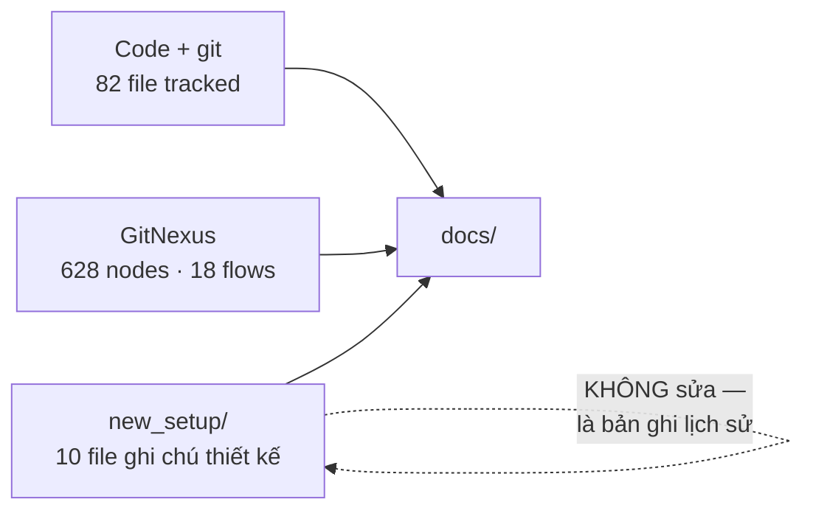

# Phương pháp — bộ tài liệu này được dựng thế nào

> Bộ docs đã viết xong. Mục lục ở [README.md](README.md). File này chỉ giữ lại **phương pháp** và **cách bảo trì**, để lần sau mở rộng không phá vỡ cấu trúc.

---

## 1. Khung B1→B7

```text
Requirements → Design/Architect → Develop → Test → Deploy → Vận hành
```

| Bước | File | Trả lời câu hỏi |
|---|---|---|
| B1 | [requirements.md](requirements.md) | Làm cái gì, xong là như thế nào |
| B2 | [api-prototype.md](api-prototype.md) · [context.md](context.md) · [system-prompt.md](system-prompt.md) | Dùng thế nào, ranh giới ở đâu, AI cư xử sao |
| B3 | [kick-start.md](kick-start.md) | Từ máy trắng tới stack chạy được |
| B4 | [architecture.md](architecture.md) · [folder-struc.md](folder-struc.md) · [api-design.md](api-design.md) · [database-design.md](database-design.md) · [artifact-design.md](artifact-design.md) · [environment.md](environment.md) · [runbook.md](runbook.md) · [rule.md](rule.md) | Bên trong chia thế nào |
| B5 | [features.md](features.md) · [plan.md](plan.md) · [learn.md](learn.md) · [changelog.md](changelog.md) · [checklist.md](checklist.md) | Đang có gì, làm gì tiếp, đã hỏng gì, đổi gì |
| B6 | mục §5 trong [checklist.md](checklist.md) | Đổi code thì sửa doc nào |
| B7 | [test-case.md](test-case.md) · [CI-CD.md](CI-CD.md) · [security.md](security.md) | Kiểm thế nào, an toàn chưa |
| B7-deploy | [docker.md](docker.md) · [emu-gui-workflow.md](emu-gui-workflow.md) · [avd-seed.md](avd-seed.md) · [deploy-vps.md](deploy-vps.md) · [public-access.md](public-access.md) | Đóng gói thế nào, lên máy đích thế nào, ra Internet thế nào |

Mỗi file theo cùng một format: **mục đích → nội dung → sơ đồ Mermaid**.

---

## 2. Bốn chỗ khung gốc phải đổi cho dự án này

Khung B1→B7 chuẩn viết cho dự án chưa có code. app-relay đã có code chạy được, nên:

**1. B1–B4 là tài liệu ngược, không phải tài liệu định hướng.** 82 file đã commit. Requirements và architecture mô tả **cái đang chạy**, rồi mới ghi phần chưa làm. Viết như thể chưa có gì là tự tạo ra tài liệu sai.

**2. B3 kick-start không phải "khởi tạo project"** mà là "dựng lại từ máy trắng" — thứ thật sự cần khi đổi máy hoặc mất WSL distro.

**3. Không có dashboard**, nên hai file đổi vai:

| Khung gốc | Ở đây | Vì sao |
|---|---|---|
| `prototype.md` — màn hình, wireframe | `api-prototype.md` — kịch bản gọi API | không có UI; "màn hình" là request/response |
| `arts-design.md` — bảng màu, font, component | `artifact-design.md` — cây thư mục artifact | sản phẩm bàn giao là file, không phải giao diện |

Loading/empty/error của UI vẫn tồn tại — dưới dạng trạng thái job (`queued`/`running`) và trạng thái artifact (`preparing`/`partial`).

**4. CI đã tồn tại từ trước.** [CI-CD.md](CI-CD.md) là ghi lại pipeline thật, không thiết kế pipeline mới. Và vì thế nó phát hiện được mâu thuẫn: CI deploy bằng `--profile production` (Caddy) trong khi WSL server chạy cloudflared.

---

## 3. Nguồn dữ liệu



Quy tắc khi ba nguồn mâu thuẫn: **code thắng**. `new_setup/` là ghi chú viết trong lúc dựng, đã lệch ở vài chỗ.

Cụ thể:

- Cây thư mục dựng từ `git ls-files`, không chép tay.
- Bảng biến env sinh từ `grep process.env`, không chép từ `.env.example`.
- Danh sách endpoint đếm từ `router.get/post/put`, không đếm từ tài liệu.
- Schema đọc từ `supabase/migrations/`, không đọc từ ghi chú.

---

## 4. Sáu chỗ lệch đã phát hiện

Đối chiếu `new_setup/` với code tại `ef53f90`. Cả sáu đã được ghi vào tài liệu tương ứng và xếp thành task trong [plan.md](plan.md):

| # | Lệch | Đã ghi ở |
|---|---|---|
| 1 | `pnpm test:endpoints` trỏ vào `tests/test-endpoints/` — bị xoá trong `ef53f90` (3410 dòng) nhưng script bị bỏ lại | [changelog.md](changelog.md), [test-case.md §1](test-case.md), plan T-01 |
| 2 | `.env.api.example` thiếu 5 biến code đang đọc | [environment.md §6](environment.md), plan T-02 |
| 3 | `ARTIFACT_TTL_HOURS=48` trong example vs `720` trong code | [environment.md §6](environment.md), plan T-03 |
| 4 | `BASE_URL` trong tài liệu cũ là quick tunnel đã chết | [environment.md §5](environment.md) — chỉ ghi **cách lấy** URL |
| 5 | `CLAUDE.md` ghi "374 symbols, 6 flows"; thực tế 628 / 18 | plan T-04 |
| 6 | Cây thư mục thiếu `middleware/`, `utils/`, `scripts/`, `.github/` | [folder-struc.md](folder-struc.md) — dựng lại từ `git ls-files` |

Phần lõi **không lệch**: 23 endpoint đúng số, 8 selector khớp `contracts`, 9 `currentStep` khớp worker, state machine khớp migration.

---

## 5. Bảo trì

Đổi code thì sửa doc nào — bảng đầy đủ ở [checklist.md §5](checklist.md).

Thêm file mới vào `docs/` thì phải làm ba việc:

1. Thêm một dòng vào bảng phân loại B1→B7 ở §1 trên.
2. Thêm vào [README.md](README.md) — cả bảng "đọc gì trước" lẫn bảng toàn bộ tài liệu.
3. Nối vào sơ đồ quan hệ trong README.

> Ba việc này **đã từng bị bỏ**: năm file deploy (`docker.md`,
> `emu-gui-workflow.md`, `deploy-vps.md`, `public-access.md`, `features.md`) nằm
> ngoài bảng §1 và ngoài sơ đồ suốt hai ngày. Đã vá 2026-08-12.

### Một sự thật, một chủ sở hữu

Trước khi viết một đoạn, kiểm bảng **chủ sở hữu sự thật** trong
[README.md](README.md). Nếu thứ định viết đã có chủ thì **trỏ link**, không chép
lại — kể cả khi chép chỉ mất ba dòng.

Vì sao: chép ba dòng vào file thứ tư nghĩa là lần sau đổi cờ compose phải sửa bốn
chỗ, và thực tế đã chứng minh là sẽ quên — biến `EMULATOR_SCREEN_OFF_TIMEOUT`
thêm ngày 2026-08-12 chỉ được ghi vào `changelog.md`, thiếu ở
[environment.md](environment.md) và ở `.env.worker.example`. Doc chép lại không
sai lúc viết — nó sai **sáu tuần sau**, và lúc đó không ai biết bản nào mới.

Nguyên tắc bao trùm: **doc sai nguy hiểm hơn doc thiếu, vì AI tin doc.** Bằng chứng là mục #1 ở §4 — tài liệu hứa một bộ test không tồn tại, và ai đọc cũng tin.

---

## 6. Thứ cố ý không viết

| Không có | Vì sao |
|---|---|
| `prototype.md` với wireframe | không có UI |
| `arts-design.md` với bảng màu | không có UI |
| Tài liệu cho từng hàm | code đã có comment giải thích **vì sao**; JSDoc lặp lại tên hàm là nhiễu |
| Sơ đồ deploy riêng cho từng môi trường | ba môi trường khác nhau ở 4 điểm, đã liệt kê trong [environment.md §8](environment.md) |
| SLA, on-call rotation | hệ thống một máy một emulator, chưa có cam kết vận hành |
