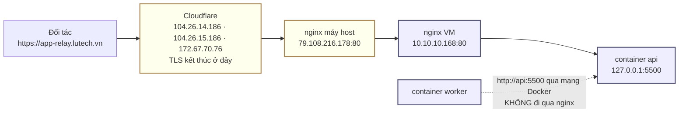

# Mở API ra Internet (domain + nginx)

Đường chính thức đưa app-relay ra Internet là **tên miền cố định
`app-relay.lutech.vn` đi qua Cloudflare rồi vào nginx**, không phải Cloudflare
Tunnel nữa. Lý do đổi ở [§8](#8-còn-cloudflare-tunnel-thì-sao).

Số liệu trong tài liệu này đo ngày **2026-08-17**.

---

## 1. Đường đi thật của một request



**Hai máy khác nhau, đừng nhầm:**

| | Máy host | VM chạy stack |
|---|---|---|
| Địa chỉ | `79.108.216.178` (= `lutech.vn`) | `10.10.10.168` |
| Ai quản | bên hạ tầng (HungTM) | dự án này |
| Vào bằng | không có SSH cho mình (cổng 22 đóng) | `ssh hieu-server` → `79.108.216.178:2222` |
| Chạy gì | nginx 1.18.0 nhận cổng 80/443 | nginx 1.18.0 + toàn bộ docker stack |

Cổng 80 của IP public **không** forward vào VM — nó là nginx của máy host. Kiểm
lại bất cứ lúc nào: nginx VM trả 444 cho Host lạ, còn máy host trả 404, nên

```bash
curl -sS -o /dev/null -w '%{http_code}\n' -H 'Host: khong-co.example' http://79.108.216.178/
```

ra `404` nghĩa là đang nói chuyện với máy host.

---

## 2. Lớp VM — thuộc repo này

Cấu hình nginx của VM nằm ở [`../deploy/nginx/app-relay.conf`](../deploy/nginx/app-relay.conf).
**Bản trong repo là bản đúng**; đừng sửa tay `/etc/nginx/sites-available/app-relay`
vì lần cài lại sẽ đè mất.

```bash
# chép repo lên VM rồi:
sudo /root/app-relay/deploy/nginx/install.sh
```

Script tự sao lưu bản cũ, chạy `nginx -t` trước khi reload, rồi tự kiểm ba thứ:
health 200, `/internal/` 404, Host lạ 444. Chạy lại nhiều lần vô hại.

Bốn thứ trong file đó không được bỏ, mỗi thứ đổi lấy một lỗi thật:

| Dòng | Bỏ đi thì |
|---|---|
| `proxy_set_header X-Forwarded-Proto https` | link tải artifact giao cho đối tác ra `http://` — xem [§3](#3-vì-sao-phải-ghim-x-forwarded-proto) |
| `proxy_read_timeout 300s` | job chạy emulator ~60s bị cắt ở mốc 60s mặc định |
| `proxy_buffering off` | artifact vài trăm MB bị ghi tạm trọn gói xuống đĩa rồi mới trả |
| `server_name _; return 444` | mọi Host lạ được proxy thẳng vào API |

`client_max_body_size 0` là bỏ giới hạn upload — mặc định 1 MB của nginx sẽ chặn
body lớn ở `413` trước khi API kịp thấy.

---

## 3. Vì sao phải ghim `X-Forwarded-Proto`

API dựng link tải artifact bằng `${req.protocol}://${req.get('host')}`
([`apps/api/src/modules/jobs/jobs.router.ts:431`](../apps/api/src/modules/jobs/jobs.router.ts#L431)),
và `app.set('trust proxy', 1)` khiến `req.protocol` đọc từ header
`X-Forwarded-Proto` thay vì từ socket.

Chặng Cloudflare → host → VM chạy **HTTP trần**, nên `$scheme` ở nginx VM là
`http`. Để `proxy_set_header X-Forwarded-Proto $scheme` thì đối tác gọi vào bằng
HTTPS nhưng nhận về link `http://app-relay.lutech.vn/...`. Ghim hằng số `https`
mới đúng, vì đường duy nhất từ Internet vào luôn là HTTPS qua Cloudflare.

Đo được sau khi sửa:

```text
qua nginx, Host = app-relay.lutech.vn  →  "downloadUrl":"https://app-relay.lutech.vn/v1/artifacts/..."
gọi thẳng 127.0.0.1:5500               →  "downloadUrl":"http://127.0.0.1:5500/v1/artifacts/..."
```

Chữ ký HMAC **không** phụ thuộc host — `signDownloadUrl(artifactId, expires)` chỉ
ký id và hạn — nên đổi tên miền không làm hỏng link đã phát.

---

## 4. Lớp máy host — bên hạ tầng làm

Repo này không với tới `79.108.216.178`. Cần bên giữ máy đó thêm một vhost:

```nginx
server {
    listen 80;
    server_name app-relay.lutech.vn;

    location / {
        proxy_pass http://10.10.10.168:80;

        proxy_set_header Host              $host;
        proxy_set_header X-Real-IP         $remote_addr;
        proxy_set_header X-Forwarded-For   $proxy_add_x_forwarded_for;
        proxy_set_header X-Forwarded-Proto $scheme;

        proxy_connect_timeout 30s;
        proxy_send_timeout    300s;
        proxy_read_timeout    300s;

        proxy_buffering         off;
        proxy_request_buffering off;
        client_max_body_size    0;
    }
}
```

`proxy_set_header Host $host` là bắt buộc: nginx VM chọn vhost theo Host, mất
header này thì rơi vào block 444.

Ba dòng timeout và `proxy_buffering off` phải copy y hệt xuống lớp này. Lớp VM
chờ đủ 300s nhưng lớp host vẫn cắt ở 60s thì đối tác nhận `504` — và log của VM
sẽ trông như mọi thứ bình thường.

---

## 5. Lớp Cloudflare — bên hạ tầng làm

Đo ngày 2026-08-17, `https://app-relay.lutech.vn/v1/health` trả **403** kèm header
`Cf-Mitigated: challenge`. Đó là Cloudflare chặn, chưa tới được máy nào cả.

| Cần đặt | Vì sao |
|---|---|
| Tắt Bot Fight Mode / Managed Challenge cho hostname này (WAF → Configuration Rule → Skip) | API không chạy JavaScript. Bất kỳ challenge nào cũng biến mọi lệnh gọi thành 403, không có cách nào lách từ phía client. |
| SSL/TLS mode = **Flexible** | Origin chỉ có HTTP cổng 80, không có cert. Để Full (strict) là đứt toàn bộ. |
| WAF chặn `/internal/*` | Lớp phòng thủ thứ hai. nginx VM đã trả 404 rồi, nhưng chặn từ biên rẻ hơn. |

Giữ proxy cam (proxied) chứ đừng chuyển sang DNS only: xám mây thì lộ thẳng IP
máy host và mất luôn TLS miễn phí.

---

## 6. Tắt Cloudflare Tunnel

Sửa `deploy/.env` trên VM — bỏ `compose.tunnel.yaml` khỏi `COMPOSE_FILE` và bỏ
profile `quick`:

```env
COMPOSE_FILE=compose.yml:compose.kvm.yaml:compose.supabase.yaml:compose.prod.yaml
COMPOSE_PROFILES=
```

```bash
cd /root/app-relay/deploy
docker compose --profile quick stop cloudflared-quick
docker compose --profile quick rm -f cloudflared-quick
docker compose up -d
```

Phải có `--profile quick` ở hai lệnh đầu: container thuộc profile không bật thì
compose không nhìn thấy để dừng, `up -d` cũng không tự dọn nó.

> [!WARNING]
> Chỉ tắt tunnel **sau khi** [§4](#4-lớp-máy-host--bên-hạ-tầng-làm) và
> [§5](#5-lớp-cloudflare--bên-hạ-tầng-làm) đã xong và §7 chạy sạch. Tắt trước là
> không còn đường nào từ Internet vào API.

`DOMAIN` và `CADDY_EMAIL` trong `deploy/.env` **để trống**. Hai biến đó chỉ dành
cho Caddy, mà Caddy ở đây không chạy — nginx đã giữ cổng 80. Điền `DOMAIN` rồi lỡ
chạy `bootstrap.sh` không kèm `--http-only` sẽ bật `--profile production`, Caddy
tranh cổng 80 với nginx và một trong hai chết.

---

## 7. Kiểm tra từng lớp

Chạy từ ngoài vào, lớp nào hỏng thì dừng đúng ở đó:

```bash
# 1. DNS đã trỏ Cloudflare chưa
dig +short app-relay.lutech.vn          # ra IP Cloudflare (104.26.* / 172.67.*)

# 2. Cloudflare có chặn không
curl -sS -o /dev/null -w '%{http_code}\n' https://app-relay.lutech.vn/v1/health
#   200 = xong · 403 kèm Cf-Mitigated = còn challenge, xem §5

# 3. Máy host đã có vhost chưa
curl -sS -o /dev/null -w '%{http_code}\n' -H 'Host: app-relay.lutech.vn' http://79.108.216.178/v1/health
#   200 = xong · 404 = host chưa cấu hình, xem §4

# 4. nginx VM (chạy trên VM)
curl -sS -H 'Host: app-relay.lutech.vn' http://127.0.0.1/v1/health          # 200 + JSON
curl -sS -o /dev/null -w '%{http_code}\n' -H 'Host: app-relay.lutech.vn' \
     http://127.0.0.1/internal/v1/jobs/claim                                # 404
curl -sS -o /dev/null -w '%{http_code}\n' -H 'Host: la.example' http://127.0.0.1/  # kết nối đứt = 444

# 5. Link tải phải là https
curl -sS -X POST -H "Authorization: Bearer $API_TOKEN" -H 'Host: app-relay.lutech.vn' \
     -H 'Content-Type: application/json' -d '{}' \
     http://127.0.0.1/v1/jobs/<jobId>/artifact/download-url | grep -o '"downloadUrl":"[^"]*'
```

Log riêng của vhost này nằm ở `/var/log/nginx/app-relay.access.log`. **Access log
trống nghĩa là request chưa từng tới VM** — lỗi nằm ở lớp Cloudflare hoặc lớp
host, không phải ở đây.

---

## 8. Còn Cloudflare Tunnel thì sao

`deploy/compose.tunnel.yaml` vẫn giữ trong repo, nhưng **chỉ để dev và demo**:

| Chế độ | Profile | Còn dùng khi |
|---|---|---|
| Quick Tunnel | `quick` | Máy dev sau NAT, cần cho ai đó xem thử vài tiếng. URL `*.trycloudflare.com` **đổi sau mỗi lần restart**. |
| Named Tunnel | `named` | Máy không có IP public và không có nginx đứng trước. Cần `CLOUDFLARE_TUNNEL_TOKEN`. |

Vì sao production bỏ tunnel: máy này **có** IP public và **đã có** nginx ở cả hai
lớp. Thêm tunnel là thêm một tiến trình nữa phải sống, một đường phụ thuộc nữa ra
Cloudflare, trong khi vẫn không cho thêm gì — đường nginx đã cố định tên miền
rồi. Quick tunnel còn tệ hơn: đổi URL mỗi lần restart nên không bao giờ được giao
cho đối tác.

---

## 9. Bàn giao đối tác

```text
BASE_URL: https://app-relay.lutech.vn/v1
API_TOKEN: apr_live_xxxxxxxxx
```

Xác thực bằng header `Authorization: Bearer apr_live_xxxxxxxxx`. Mọi endpoint
`/v1/*` đều cần, trừ `/v1/health`.

Link tải artifact do API tự sinh, đã kèm chữ ký và hạn dùng (mặc định 600s) —
đối tác không cần biết gì thêm về hạ tầng. Danh sách endpoint đầy đủ:
[http-endpoints.md](http-endpoints.md).
