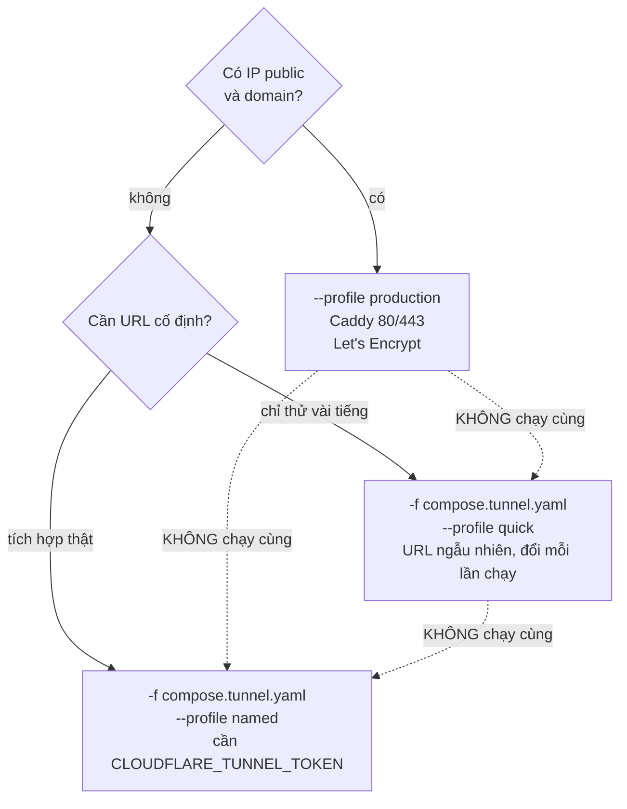
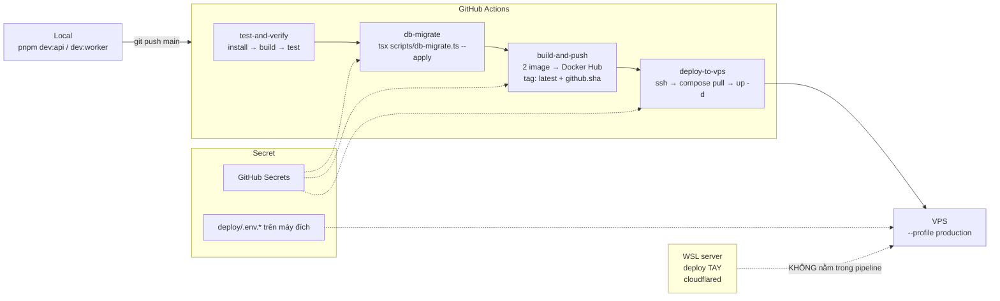

# Environment — môi trường và biến

Bảng biến dưới đây sinh từ `grep process.env` trong code, **không** chép từ `.env.*.example`. Hai bên đang lệch — xem §6.

---

## 1. Ba môi trường

| | Local dev | WSL server | VPS production |
|---|---|---|---|
| Docker | Docker Desktop | Docker Engine trong distro | Docker Engine |
| API nghe ở | `127.0.0.1:5500` | `127.0.0.1:5500` | `127.0.0.1:5500` |
| Đường ra ngoài | không | cloudflared quick/named | Caddy `--profile production` |
| TLS | không | Cloudflare lo | Caddy + Let's Encrypt |
| Supabase | `compose.supabase.yaml` | tuỳ | Cloud |
| KVM | thường không | tuỳ máy | bắt buộc |
| noVNC | `localhost:6080` | `localhost:6080` | qua SSH tunnel |
| Ai truy cập | mình | mình + đối tác qua tunnel | đối tác qua domain |

**Không chạy song song Docker Desktop và Docker trong WSL.** Các distro WSL2 dùng chung network namespace nên sẽ tranh cổng 5500, 6080, 54322. Dừng một bên trước bằng `stop` (không phải `down -v`).

---

## 2. Biến của API

`deploy/.env.api` — đọc bởi container `api`.

| Biến | Ý nghĩa | Bắt buộc | Mặc định | Ví dụ |
|---|---|---|---|---|
| `PORT` | cổng HTTP | không | `5500` | `5500` |
| `NODE_ENV` | | không | | `production` |
| `API_TOKEN` | token cho `/v1/*` | **có** — throw lúc boot | — | `apr_live_<48 hex>` |
| `WORKER_TOKEN` | token cho `/internal/v1/*` | **có** — throw lúc boot | — | `worker_live_<48 hex>` |
| `SUPABASE_URL` | | **có** — throw lúc boot | — | `https://<ref>.supabase.co` |
| `SUPABASE_SECRET_KEY` | khoá bí mật; fallback `SUPABASE_SERVICE_ROLE_KEY` | **có** — throw lúc boot | — | `sb_secret_…` |
| `DOWNLOAD_SIGNING_SECRET` | khoá HMAC ký link tải | **có** — throw lúc boot | — | `<64 hex>` |
| `ARTIFACT_DIR` | thư mục gốc artifact | không | `<cwd>/artifacts` | `/data/artifacts` |
| `APK_TTL_HOURS` | APK sống bao lâu | không | `6` | `6` |
| `ARTIFACT_TTL_HOURS` | phần nhẹ sống bao lâu | không | `720` | `720` |
| `ARTIFACT_MIN_FREE_BYTES` | ngưỡng đĩa dự phòng | không | `10737418240` (10 GB) | |
| `ORPHAN_DIR_MIN_AGE_MINUTES` | thư mục phải nguội bao lâu mới bị coi là mồ côi | không | `120` | |
| `DELETE_AFTER_DOWNLOAD_GRACE_MINUTES` | ân hạn trước khi xoá APK sau tải | không | `10` | |
| `STUCK_JOB_GRACE_MINUTES` | job im lặng bao lâu thì reaper dọn | không | `15` | |
| `DOWNLOAD_URL_TTL_SECONDS` | link tải sống bao lâu | không | `600` | |

**Bốn biến "throw lúc boot"** đi qua `requireEnv()`, throw ngay **lúc nạp module** chứ không phải lúc dùng. Deploy sai cấu hình thì container chết ngay khi boot thay vì chạy ngầm với fallback không an toàn — và healthcheck sẽ giữ worker đứng ở `depends_on`.

`STUCK_JOB_GRACE_MINUTES` phải **cao hơn hẳn** lease 120 giây. Đặt thấp thì reaper sẽ cướp job còn sống.

---

## 3. Biến của worker

`deploy/.env.worker` — đọc bởi container `worker`.

| Biến | Ý nghĩa | Bắt buộc | Mặc định |
|---|---|---|---|
| `WORKER_TOKEN` | phải **giống hệt** giá trị trong `.env.api` | **có** — throw lúc boot | — |
| `WORKER_ID` | id worker, hiện trong log và DB | không | `worker_vps_01` |
| `WORKER_NAME` | tên hiển thị | không | `VPS Worker 01` |
| `RELAY_API_URL` | endpoint internal | không | `http://localhost:5500/internal/v1` |
| `WORK_DIR` | thư mục làm việc tạm | không | `<cwd>/work/apks` |
| `POLL_INTERVAL_MS` | chu kỳ claim | không | `5000` |
| `HEARTBEAT_INTERVAL_MS` | chu kỳ heartbeat | không | `20000` |
| `ANDROID_AVD` | tên AVD | không | `chpay` |
| `ADB_PATH` | | không | `adb` (trên PATH trong image) |
| `EMULATOR_PATH` | | không | `emulator` |
| `JAVA_HOME` | | đặt sẵn trong image | `/opt/java/openjdk` |
| `ANDROID_SDK_ROOT` | | đặt sẵn trong image | `/opt/android-sdk` |
| `ANDROID_AVD_HOME` | | đặt sẵn trong image | `/home/worker/.android/avd` |
| `EMULATOR_ACCEL` | `on` \| `auto` \| `off` | không | `auto` (overlay KVM đặt `on`) |
| `EMULATOR_BOOT_TIMEOUT` | giây chờ boot | không | `600` |
| `AVD_RAM_MB` | | không | `3072` |
| `AVD_HEAP_MB` | | không | `512` |
| `AVD_DATA_SIZE` | dung lượng userdata | không | `12G` |
| `AVD_SDCARD_SIZE` | | không | `2G` |
| `DISPLAY` | | đặt sẵn trong image | `:0` |

> AVD sizing đáng lưu ý: profile `pixel_6` mặc định chỉ ~2 GB userdata, đầy ngay khi Play Store cache và vài trăm MB APK đáp xuống. Đó là lý do `AVD_DATA_SIZE=12G`.

Worker gọi API qua Docker network — `http://api:5500/internal/v1`. Không đi qua domain public, nên nhanh hơn và không ra Internet.

---

## 4. Biến của compose

`deploy/.env` — compose đọc để **nội suy**, không phải biến ứng dụng.

| Biến | Dùng khi | Lấy bằng |
|---|---|---|
| `COMPOSE_FILE` | VPS — bootstrap ghi vào | danh sách overlay ngăn cách bằng `:`, compose tự đọc thay cho cờ `-f` |
| `COMPOSE_PROFILES` | VPS — bootstrap ghi vào | `production` (bật Caddy) |
| `KVM_GID` | luôn, nếu bật `compose.kvm.yaml` | `getent group kvm \| cut -d: -f3` (mặc định `108`) |
| `DOCKERHUB_USERNAME` | pull image từ registry | mặc định `conghieudoan19` |
| `IMAGE_TAG` | pin version image | mặc định `latest`; rollback thì đặt bằng `github.sha` |
| `DOMAIN` | chỉ với Caddy | `api.tenmien.com` |
| `CADDY_EMAIL` | chỉ với Caddy | email nhận cảnh báo Let's Encrypt |
| `CLOUDFLARE_TUNNEL_TOKEN` | chỉ với named tunnel | Cloudflare Dashboard → Zero Trust → Networks → Tunnels |
| `POSTGRES_PASSWORD` | chỉ với Supabase self-host | tự sinh |
| `AUTHENTICATOR_PASSWORD` | chỉ với Supabase self-host | tự sinh |
| `JWT_SECRET` | chỉ với Supabase self-host | tự sinh |

---

## 5. Chọn overlay compose

`compose.yml` là nền, ba file `compose.*.yaml` là lớp phủ chồng lên bằng nhiều cờ `-f`. Chỉ bật đúng thứ môi trường đó cần.

| Overlay | Thêm gì | Bật khi |
|---|---|---|
| `compose.kvm.yaml` | `/dev/kvm`, `group_add: KVM_GID`, `EMULATOR_ACCEL=on` | máy có `/dev/kvm` |
| `compose.supabase.yaml` | `db` (postgres:16) + `rest` (postgrest) + gateway | không dùng Supabase Cloud |
| `compose.prod.yaml` | xoay log json-file, healthcheck cho caddy, `stop_grace_period` 120s cho worker | chạy dài ngày trên VPS |
| `compose.tunnel.yaml` | `cloudflared-quick` / `cloudflared-named` | không có IP public |

> Trên VPS thì **không phải gõ chuỗi `-f` này**. `deploy/bootstrap.sh` ghi
> `COMPOSE_FILE` và `COMPOSE_PROFILES` vào `deploy/.env`, compose tự đọc — sau
> đó `docker compose ps` trần đã đúng overlay và đúng profile. Xem
> [deploy-vps.md §3](deploy-vps.md).

### Profile loại trừ nhau



Cả ba dịch vụ đều nằm sau profile nên mặc định không cái nào chạy. `compose.yml` trần chỉ có `api` + `worker`, nghe ở `127.0.0.1`.

### Lệnh mẫu

```bash
# WSL, có KVM, Supabase self-host, quick tunnel
docker compose -f compose.yml -f compose.kvm.yaml -f compose.supabase.yaml \
  -f compose.tunnel.yaml --profile quick up -d

# VPS production, Supabase Cloud, Caddy
docker compose -f compose.yml -f compose.kvm.yaml --profile production up -d

# Máy không có KVM
docker compose -f compose.yml up -d      # nhớ EMULATOR_ACCEL=off
```

### Lấy URL quick tunnel

URL **đổi mỗi lần khởi động lại**. Tài liệu này cố ý không ghi URL nào; lấy bản hiện hành:

```bash
docker compose -f compose.yml -f compose.tunnel.yaml --profile quick \
  logs cloudflared-quick 2>&1 \
  | grep -o 'https://[a-z0-9-]*\.trycloudflare\.com' | tail -1
```

`tail -1` chứ không phải `head -1`: cloudflared in một URL mới mỗi lần khởi động lại, và bản đầu trong log đã chết từ lâu.

---

## 6. Lệch giữa code và `.env.example` — đã vá

Hai lệch ghi nhận tại `ef53f90` đã được sửa trong `.env.api.example`:

| Vấn đề | Trạng thái |
|---|---|
| `.env.api.example` thiếu 5 biến (`APK_TTL_HOURS`, `ARTIFACT_MIN_FREE_BYTES`, `ORPHAN_DIR_MIN_AGE_MINUTES`, `DELETE_AFTER_DOWNLOAD_GRACE_MINUTES`, `STUCK_JOB_GRACE_MINUTES`) | **đã thêm đủ, kèm ghi chú ý nghĩa** |
| `ARTIFACT_TTL_HOURS` example ghi `48` còn code mặc định `720` | **đã sửa thành `720`**, khớp code và [artifact-design.md](artifact-design.md) |

Trên VPS thì hai file example này không còn là đường deploy chính:
`deploy/bootstrap.sh` sinh thẳng `.env.api` với đủ biến và secret ngẫu nhiên.
Example giờ chỉ để tra cứu và cho dev local.

---

## 7. Secret

### Ở đâu

| Nơi | Chứa gì | Vào git? |
|---|---|---|
| `deploy/.env.api`, `.env.worker`, `.env` | secret thật | **không** — gitignore |
| `deploy/.env.*.example` | placeholder `xxxxxxxxx` | có |
| GitHub Secrets | secret cho CI/CD | không |
| `new_setup/*.info` | credential Supabase thật | **không** — gitignore dòng 10 |

### GitHub Secrets mà CI cần

`SUPABASE_ACCESS_TOKEN` · `SUPABASE_PROJECT_REF` · `SUPABASE_DB_URL` · `DOCKERHUB_USERNAME` · `DOCKERHUB_TOKEN` · `VPS_HOST` · `VPS_USER` · `VPS_SSH_KEY` · `VPS_SSH_PORT` · `VPS_DEPLOY_PATH`

### Quy tắc

**Secret đã commit coi như đã lộ.** Xoá ở commit sau **không** xoá khỏi lịch sử — ai clone repo đều đọc được. Lỡ commit thì phải **đổi secret**, không phải xoá file.

Sinh token bằng lệnh, không copy từ tài liệu:

```bash
openssl rand -hex 24    # token
openssl rand -hex 32    # signing secret
```

`SUPABASE_SECRET_KEY` dùng dạng `sb_secret_...`. Không bắt đầu dự án mới bằng legacy `service_role` — Supabase dự kiến ngừng legacy key cuối 2026.

---

## 8. Khác biệt giữa các môi trường

Không có feature flag, không có debug mode. Khác biệt thật sự chỉ có bốn:

| Khác biệt | Ảnh hưởng |
|---|---|
| `EMULATOR_ACCEL` | `on` cần `/dev/kvm`; `off` chạy nhưng chậm tới mức không dùng được thật |
| Đường ra ngoài | Caddy (IP tĩnh) vs cloudflared (sau NAT) vs không có |
| Supabase Cloud vs self-host | Cloud tự reload PostgREST schema; self-host phải `notify pgrst` tay |
| Migration tự động | init script Postgres **chỉ chạy khi data dir còn trống** |

> CI deploy bằng `--profile production` (Caddy), trong khi WSL server chạy cloudflared. Nghĩa là pipeline hiện chỉ đúng cho VPS. Xem [CI-CD.md](CI-CD.md) §5.

---

## 9. Luồng code local → prod



PR chỉ chạy `test-and-verify`; ba job sau chỉ chạy khi `push`.

Rollback: image có tag theo `github.sha`, nên `IMAGE_TAG=<sha cũ> docker compose up -d`. Migration thì **không có đường lùi tự động** — xem [runbook.md](runbook.md) §4.
