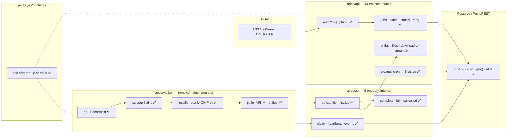

# Features — đã làm được cái gì

Bản kiểm kê **khối chức năng đang có trong repo**, đối chiếu thẳng với code chứ không chép lại từ tài liệu thiết kế.

Đọc file này khi cần trả lời: *"dự án này đã có cục nào rồi?"*, *"cái X đã làm chưa hay mới chỉ nằm trong plan?"*

Ba file gần nhau nhưng khác việc:

| File | Trả lời câu hỏi |
|---|---|
| **features.md** (file này) | Đang **có** gì |
| [plan.md](plan.md) | Còn **thiếu** gì, làm theo thứ tự nào |
| [changelog.md](changelog.md) | Đã **đổi** gì, ngày nào |

Ký hiệu trạng thái:

- ✅ **chạy được và đang dùng thật** — có code, có đường chạy qua nó trong luồng thật
- 🟨 **có nhưng chưa đủ** — code chạy được nhưng thiếu test / thiếu tự động hoá / còn bước tay
- ⬜ **chưa làm** — chỉ có trong thiết kế hoặc plan

---

## 1. Bản đồ một trang



---

## 2. Tóm tắt — 13 khối

| # | Khối | Trạng thái | Nằm ở |
|---|---|---|---|
| 1 | **Hợp đồng dùng chung** (zod schema, enum, selector) | ✅ | `packages/contracts/` |
| 2 | **API public `/v1`** — 14 endpoint | ✅ | `apps/api/src/modules/` |
| 3 | **API internal `/internal/v1`** — 9 endpoint | ✅ | `apps/api/src/internal/` |
| 4 | **Xác thực 3 lớp** (API token, worker token, signed URL) | ✅ | `apps/api/src/middleware/auth.ts`, `utils/signature.ts` |
| 5 | **Kho artifact dạng thư mục** (chống traversal, range, zip on-the-fly) | ✅ | `apps/api/src/utils/artifact-*.ts` |
| 6 | **Dọn dẹp tự động** — 5 tác vụ theo giờ | 🟨 | `apps/api/src/background/cleanup.ts` |
| 7 | **Database** — 5 bảng, `claim_job()`, RLS, migration runner | ✅ | `supabase/migrations/`, `scripts/db-migrate.ts` |
| 8 | **Worker pipeline** — scrape → install → pull → upload | ✅ | `apps/worker/src/` |
| 9 | **Container emulator** — AVD dựng sẵn, GUI bật/tắt được | 🟨 | `apps/worker/Dockerfile`, `apps/worker/docker/` |
| 10 | **Seed phiên đăng nhập CH Play** | 🟨 | `deploy/capture-avd-seed.sh`, `avd-seed/` |
| 11 | **Deploy bằng compose overlay** — 6 file, bootstrap một lệnh | ✅ | `deploy/` |
| 12 | **CI/CD** — 4 job | 🟨 | `.github/workflows/ci.yml` |
| 13 | **Tài liệu** — 27 file có mục lục | ✅ | `docs/` |

Ba khối 🟨 là chỗ nên nhìn kỹ nhất — chi tiết ở §4 và §5.

---

## 3. Chi tiết từng khối

### 3.1 ✅ Hợp đồng dùng chung — `packages/contracts`

Một nguồn sự thật cho cả API lẫn worker. Đổi ở đây là hai bên cùng đổi, không lệch được.

| Có gì | Cụ thể |
|---|---|
| Enum trạng thái job | `queued` · `running` · `cancelling` · `completed` · `failed` · `cancelled` |
| Enum bước đang chạy | 9 bước, từ `claiming` tới `uploading_artifact` |
| Enum trạng thái worker | `online` · `busy` · `draining` |
| Schema request | 11 schema zod cho cả hai mặt phẳng |
| **Từ vựng selector** | 8 giá trị: `all` `apk` `apk.base` `apk.splits` `screenshots` `listing` `listing.full` `metadata` |
| Hàm ánh xạ | `selectorMatches()` · `selectorFor()` · `isApkPath()` |

Điểm quan trọng: selector là **từ vựng theo ý nghĩa, không theo tên file** — đổi layout artifact không vỡ client. Hợp đồng đầy đủ ở [artifact-design.md](artifact-design.md).

### 3.2 ✅ API public `/v1` — 14 endpoint

| Nhóm | Endpoint | Ghi chú |
|---|---|---|
| Health | `GET /v1/health` | Không cần token — dùng cho healthcheck của compose |
| System | `GET /v1/system/status` | Trạng thái DB, worker, đĩa |
| Apps | `GET /v1/apps` · `GET /v1/apps/:packageId` | Tra app đã kéo về |
| Jobs | `POST /v1/jobs` | Tạo từ URL Google Play |
| | `POST /v1/jobs/batch` | Tạo hàng loạt |
| | `GET /v1/jobs` · `GET /v1/jobs/:jobId` | Liệt kê / xem một job |
| | `GET /v1/jobs/:jobId/events` | Dòng sự kiện để theo dõi tiến độ |
| | `POST /v1/jobs/:jobId/cancel` · `POST /v1/jobs/:jobId/retry` | |
| | `GET /v1/jobs/:jobId/artifact/files` | Danh sách file kèm size + sha256 |
| | `POST /v1/jobs/:jobId/artifact/download-url` | Xin URL ký sẵn theo `select` hoặc `path` |
| Artifacts | `GET /v1/artifacts/:artifactId/download` | Endpoint **duy nhất không cần Bearer** — xác thực bằng chữ ký trong URL |

Hợp đồng đầy đủ (mã lỗi, shape response) ở [api-design.md](api-design.md); ví dụ bash chạy được ở [api-prototype.md](api-prototype.md).

### 3.3 ✅ API internal `/internal/v1` — 9 endpoint

Chỉ worker gọi. Caddy chặn `/internal/*` ở lớp ngoài (404) nên không có đường vào từ Internet — nhưng lưu ý: **bỏ Caddy đi (chạy Cloudflare Tunnel thẳng) là mất lớp chặn này**, xem [public-access.md](public-access.md).

| Endpoint | Việc |
|---|---|
| `POST /internal/v1/workers/heartbeat` | Đăng ký + báo sống, kèm `emulatorReady` |
| `POST /internal/v1/jobs/claim` | Nhận một job — atomic, qua `claim_job()` |
| `POST /internal/v1/jobs/:id/heartbeat` | Báo còn sống + bước đang chạy |
| `POST /internal/v1/jobs/:id/events` | Ghi sự kiện |
| `PUT /internal/v1/jobs/:id/files/*` | **Đẩy từng file** lên thẳng, không nén |
| `POST /internal/v1/jobs/:id/artifact/finalize` | Chốt danh sách file |
| `POST /internal/v1/jobs/:id/complete` · `/fail` · `/cancelled` | Ba lối ra của một job |

### 3.4 ✅ Xác thực — 3 lớp

| Lớp | Cơ chế | Bảo vệ |
|---|---|---|
| Public | `Bearer API_TOKEN` | 13/14 endpoint `/v1` |
| Worker | `Bearer WORKER_TOKEN` | Toàn bộ `/internal/v1` |
| Download | HMAC `artifactId + expires` trong query | Endpoint tải file |

Cả hai lớp Bearer so sánh bằng `timingSafeEqual` **sau khi hash sha256 hai vế** — làm vậy buffer luôn 32 byte nên độ dài token không rò ra ngoài qua thời gian so sánh. Chi tiết ở `apps/api/src/middleware/auth.ts:11-18`.

**Giới hạn đã biết:** bản 1.0 cố ý dùng **một** `API_TOKEN` chung cho mọi đối tác. Tách token theo đối tác là T-14 trong [plan.md](plan.md), chưa làm.

### 3.5 ✅ Kho artifact dạng thư mục

Artifact lưu **nguyên thư mục**, không nén thành ZIP (migration `002` giải thích lý do: worker đã dựng đúng layout rồi, nén rồi giải nén ngược là làm hai lần một việc).

| Có gì | Cụ thể |
|---|---|
| Chống path traversal | `normalizeEntryPath()` + `resolveEntry()` — hai chốt riêng |
| Ghi nhận từng file | `recordUpload()` lưu size + sha256 mỗi file |
| HTTP Range | `parseRange()` — tải lại được từ giữa chừng khi đứt mạng |
| ZIP sinh lúc stream | `streamZip()` — client xin nhiều file thì nén khi đang gửi, không lưu bản nén xuống đĩa |
| TTL tách đôi | APK hết hạn sớm (chiếm ~98% dung lượng), phần nhẹ giữ lâu → trạng thái `partial` |
| Xoá sau khi tải | `armDeleteAfterDownload()` — hẹn xoá khi client đã lấy xong |
| Kiểm đĩa trước khi ghi | `hasRoomFor()` · `minFreeBytes()` · `isDiskLow()` |

### 3.6 🟨 Dọn dẹp tự động

Cron nội bộ trong tiến trình API, chạy lần đầu sau 10 giây rồi mỗi giờ một lần (`cleanup.ts:338-341`). Năm tác vụ:

| Tác vụ | Việc |
|---|---|
| `cleanupExpiredApks()` | Xoá APK quá `APK_TTL_HOURS` |
| `cleanupExpiredArtifacts()` | Xoá cả thư mục quá `ARTIFACT_TTL_HOURS` |
| `cleanupOrphanDirs()` | Xoá thư mục không có bản ghi DB tương ứng |
| `evictUnderDiskPressure()` | Đĩa gần đầy thì xoá bớt bản cũ nhất |
| `reapStuckJobs()` | Trả job mất worker về hàng đợi |

**Vì sao 🟨:** `cleanupOrphanDirs()` có ba chốt an toàn (chỉ đụng thư mục nguội quá ngưỡng · lấy mtime của file mới nhất bên trong chứ không phải thư mục gốc · query DB lỗi thì không xoá gì cả) và **cả ba đều chưa có test**. Hỏng một chốt là mất artifact hợp lệ, im lặng, không có exception. Đây là T-10 trong [plan.md](plan.md), rủi ro cao nhất trong toàn bộ danh sách còn lại.

### 3.7 ✅ Database

| Có gì | Cụ thể |
|---|---|
| 5 bảng | `apps` · `workers` · `jobs` · `job_events` · `artifacts` |
| Nhận job atomic | `claim_job()` — một worker lấy được thì worker khác không lấy trùng |
| 6 index | Hàng đợi, lọc theo status, theo worker, theo batch, timeline sự kiện, heartbeat |
| Trigger | Tự cập nhật `updated_at` |
| RLS | Chặn truy cập ẩn danh; API dùng `service_role` |
| 2 migration | `001_initial_schema` · `002_artifact_directory` |
| Runner riêng | `scripts/db-migrate.ts` — CI chạy trước khi đẩy image |
| Self-host được | `deploy/compose.supabase.yaml`: Postgres 16 + PostgREST v12.2.3 + nginx làm gateway |

Chi tiết từng mệnh đề của `claim_job()` ở [database-design.md](database-design.md).

**Cột chết đã biết:** `apps.artifact_size_bytes`, `workers.status='draining'`, `artifacts.state='deleted'`, `artifacts.content_type` — khai ra nhưng không code nào dùng. T-12 trong plan.

### 3.8 ✅ Worker pipeline

Vòng lặp poll + heartbeat song song, có graceful shutdown và dọn `WORK_DIR` lúc khởi động.

| Bước | Module | Việc |
|---|---|---|
| 0 | `android/adb.ts` | Lớp bọc adb: `isDeviceReady` · `wakeAndUnlockDevice` · `getCurrentFocus` · `dismissAnrDialog` · `getInstalledPaths` |
| 1 | `pipeline/scraper.ts` | Kéo listing từ trang web Play Store |
| 2 | `pipeline/installer.ts` | **Bấm nút Install bằng UI automation** — đọc cây UI (`findInstallButton`), có đường lùi tính toạ độ ước lượng theo kích thước màn hình |
| 3 | `pipeline/puller.ts` | Kéo APK (kể cả split) + sinh manifest, `validateZipArchive()` kiểm file lấy về |
| 4 | `relay-api/client.ts` | Đẩy từng file lên API rồi `finalize` |

Bước 2 là chỗ mong manh nhất về bản chất — nó phụ thuộc giao diện CH Play, mà giao diện đó Google đổi được bất cứ lúc nào. Đã có hai đường (đọc cây UI → toạ độ ước lượng) nhưng không có đường thứ ba.

### 3.9 🟨 Container emulator

Một container chạy nhiều tiến trình dưới supervisord:

| Tiến trình | Việc |
|---|---|
| `xvfb` | Màn hình ảo 1080×1920 |
| `openbox` | Window manager |
| `x11vnc` | VNC ở cổng 5900 |
| `novnc` | Xem bằng trình duyệt ở cổng 6080 |
| `worker-node` | Chính worker |

Kèm ba script: `create-avd.sh` (dựng AVD, bung seed nếu có), `wait-for-emulator.sh` (chờ boot xong), `entrypoint.sh`.

Bật/tắt màn hình bằng `deploy/gui.sh on|off` — tắt GUI **không** làm mất phiên đăng nhập CH Play (phiên nằm trong volume `worker-avd`).

**Vì sao 🟨:** cần `/dev/kvm` và `KVM_GID` đúng theo kernel của docker engine. Đặt sai thì emulator **âm thầm** tụt về chạy phần mềm — không có lỗi nào báo ra, chỉ chậm gấp nhiều lần. Xem [docker.md §10](docker.md).

### 3.10 🟨 Seed phiên đăng nhập CH Play

`deploy/capture-avd-seed.sh` chụp AVD đã đăng nhập thành `avd-seed/avd-seed.tar.gz` (~2.5 GB), Dockerfile nướng vào image, máy nào pull cũng có sẵn phiên.

**Vì sao 🟨 — hai ràng buộc phải nhớ:**

1. Seed **là thông tin đăng nhập Google**. Repo Docker Hub bắt buộc private. Docker Hub tự tạo repo mới theo *Default privacy* của tài khoản, mặc định **public, không hỏi, không cảnh báo**.
2. File seed bị `.gitignore` chặn → **CI không build được worker image** (checkout từ git nên thư mục luôn rỗng). Sửa code trong `apps/worker/` thì phải build và push tay từ máy giữ seed.

### 3.11 ✅ Deploy

| Có gì | Cụ thể |
|---|---|
| 6 file compose ghép chồng | `compose.yml` (nền) + `kvm` · `http` · `prod` · `supabase` · `tunnel` |
| Chọn overlay bằng `.env` | `COMPOSE_FILE` + `COMPOSE_PROFILES` — sau bootstrap chỉ còn gõ `docker compose ps` |
| Bootstrap một lệnh | `deploy/bootstrap.sh` — kiểm máy, sinh secret bằng `openssl rand`, tự ký JWT `service_role`, build, up, chờ healthy, smoke test. **Idempotent** |
| Postgres self-host | Không phụ thuộc Supabase Cloud |
| Đường ra Internet | Cloudflare Tunnel (quick + named), `deploy/compose.tunnel.yaml` |
| Xoay log | `compose.prod.yaml`: json-file 10m × 5 cho cả 6 service |
| Tắt máy an toàn | `stop_grace_period: 120s` cho worker để emulator kịp ghi userdata xuống đĩa |

Caddy còn trong repo nhưng đã **xuống hàng thay thế** — đường chính thức là Cloudflare Tunnel, lý do ở [public-access.md](public-access.md).

### 3.12 🟨 CI/CD — 4 job

| Job | Việc |
|---|---|
| ① `test-and-verify` | Cài deps → build → chạy test |
| ② `db-migrate` | Áp migration còn thiếu |
| ③ `build-and-push` | Build & push **API image** lên Docker Hub |
| ④ `deploy-to-vps` | `scp` thư mục `deploy/` + `migrations/` → `docker login` → `compose pull` → `up -d` |

**Bốn khoảng trống đã biết:**

| Vấn đề | Hậu quả |
|---|---|
| Không build worker image | Sửa code worker thì pipeline **không** đưa lên VPS; worker cũng không có tag `<sha>` để rollback |
| CI test trên Node 20, image chạy Node 22 | Đang test trên runtime khác production (T-06) |
| Không có smoke test sau deploy | `up -d` trả về khi container **khởi động**, không phải khi **healthy** → job xanh dù app chết (T-07) |
| Không quét secret, không quét CVE | Bảo vệ secret dựa hoàn toàn vào `.gitignore` (T-08) |

Chi tiết ở [CI-CD.md](CI-CD.md).

### 3.13 ✅ Tài liệu

27 file trong `docs/` có mục lục và sơ đồ quan hệ ở [README.md](README.md). Ngoài ra `new_setup/` giữ 10 file ghi chú gốc — **không sửa**, đó là bản ghi lịch sử.

---

## 4. Kiểm thử — đang phủ tới đâu

| Nơi | Số test | Phủ gì |
|---|---|---|
| `apps/api/src/api.test.ts` | 27 | Chống path traversal, `requireEnv`, formatter, validate packageId, chống tiêm PostgREST, tích hợp endpoint HTTP |
| `apps/worker/src/worker.test.ts` | 17 | `getInstalledPaths`, `triggerPlayStoreInstall`, selector, tính toạ độ, `findInstallButton`, `validateZipArchive` |
| `packages/contracts/src/contracts.test.ts` | 6 | Schema |
| **Tổng** | **50** | |

**Chưa được phủ, xếp theo mức thiệt hại nếu hỏng:**

| Vùng | Hỏng thì sao |
|---|---|
| Ba chốt an toàn của `cleanupOrphanDirs()` | **Mất artifact vĩnh viễn, im lặng** |
| `reapStuckJobs()` không đụng job `running` còn lượt | Cướp job đang chạy |
| `verifyDownloadUrlSignature` — `timingSafeEqual` ném lỗi khi lệch độ dài | 500 thay vì 403 |
| `escapePostgrestValue` — thứ tự escape | Tiêm filter |
| `contentTypeFor` | Hồi quy CDN |

Hai script test cũ (`pnpm test:endpoints`, `pnpm probe:endpoints`) **trỏ vào thư mục đã bị xoá** trong commit `ef53f90` — chạy là lỗi ngay. Đây là T-01, chưa dọn.

Danh sách case đầy đủ ở [test-case.md](test-case.md).

---

## 5. Chưa có — nói thẳng

Không phải bug, là **cố ý chưa làm** hoặc **biết mà chưa tới lượt**. Chi tiết và thứ tự ở [plan.md](plan.md).

| Chưa có | Vì sao chưa | Task |
|---|---|---|
| Tách token theo đối tác | Bản 1.0 chỉ có một đối tác | T-14 |
| Cảnh báo tự động (đĩa đầy, mất phiên Play, DB lỗi) | Hiện chỉ biết khi có người nhìn log | T-13 |
| Bộ test conformance 23 endpoint | Bản cũ bị xoá, chưa dựng lại | T-11 |
| Smoke test sau deploy | | T-07 |
| Quét secret + CVE trong CI | | T-08 |
| Build worker image trong CI | Vướng seed 2.5 GB không commit được | — |
| Dashboard / tài khoản người dùng | **Ngoài phạm vi có chủ đích** — đây là backend thuần | — |
| Nhiều worker chạy song song | Mỗi worker `maxConcurrentJobs: 1`, chưa thử nhiều worker | — |

---

## 6. Số liệu

| Chỉ số | Giá trị |
|---|---|
| Endpoint | 23 (14 public + 9 internal) |
| Bảng DB | 5 + 1 stored function + 6 index |
| Migration | 2 |
| Selector artifact | 8 |
| Trạng thái job | 6 · bước pipeline: 9 |
| Test | 50 |
| File compose | 6 |
| Job CI | 4 |
| Script vận hành | `bootstrap.sh` · `gui.sh` · `capture-avd-seed.sh` |
| Tài liệu | 27 file |
| Index GitNexus | 628 symbol · 1013 quan hệ · 18 luồng |

Đối chiếu với code tại nhánh `main`, commit `f93eb31` (2026-08-12).

Kiểm lại khi nghi tài liệu đã cũ:

```bash
node .gitnexus/run.cjs status --repo app-relay
```
