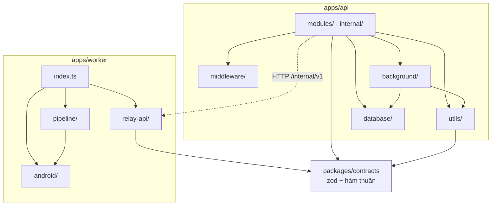

# Folder structure

Cây dưới đây dựng từ `git ls-files`, không chép tay. 82 file được theo dõi.

---

## 1. Cây thư mục

```text
app-relay/
├── apps/
│   ├── api/
│   │   ├── src/
│   │   │   ├── server.ts               # entry: listen + khởi động cron
│   │   │   ├── app.ts                  # gắn router, cors, json limit 10mb
│   │   │   ├── api.test.ts
│   │   │   ├── middleware/
│   │   │   │   └── auth.ts             # requirePublicAuth · requireWorkerAuth
│   │   │   ├── modules/                # ROUTER PUBLIC /v1
│   │   │   │   ├── health/health.router.ts
│   │   │   │   ├── system/system.router.ts
│   │   │   │   ├── apps/apps.router.ts
│   │   │   │   ├── jobs/jobs.router.ts
│   │   │   │   └── artifacts/artifacts.router.ts
│   │   │   ├── internal/               # ROUTER WORKER /internal/v1
│   │   │   │   ├── workers/workers.router.ts
│   │   │   │   └── jobs/jobs.router.ts
│   │   │   ├── database/
│   │   │   │   └── supabase.ts         # client duy nhất, dùng sb_secret
│   │   │   ├── background/
│   │   │   │   └── cleanup.ts          # 5 tác vụ dọn + cron
│   │   │   └── utils/
│   │   │       ├── env.ts              # requireEnv — throw lúc nạp module
│   │   │       ├── artifact-path.ts    # jobArtifactDir · normalizeEntryPath · contentTypeFor
│   │   │       ├── artifact-store.ts   # listArtifactFiles · freeBytes · sổ .uploads.jsonl
│   │   │       ├── signature.ts        # HMAC ký/verify link tải
│   │   │       ├── formatters.ts       # snake_case DB → camelCase API
│   │   │       ├── validation.ts       # isValidPackageId
│   │   │       └── postgrest.ts        # escape giá trị trong filter .or()
│   │   ├── Dockerfile                  # node:22-alpine, 2 stage
│   │   ├── package.json
│   │   └── tsconfig.json
│   │
│   └── worker/
│       ├── src/
│       │   ├── index.ts                # vòng lặp poll + processJob + heartbeat
│       │   ├── worker.test.ts
│       │   ├── pipeline/
│       │   │   ├── scraper.ts          # scrapePlayStoreListing
│       │   │   ├── installer.ts        # ensureAppInstalled + UI automation
│       │   │   └── puller.ts           # pullApkAndMetadata · validateZipArchive
│       │   ├── android/
│       │   │   └── adb.ts              # execAdb · isDeviceReady · wakeAndUnlockDevice
│       │   └── relay-api/
│       │       └── client.ts           # RelayApiClient — mọi lời gọi /internal/v1
│       ├── docker/
│       │   ├── supervisord.conf        # xvfb · openbox · x11vnc · novnc · worker
│       │   ├── entrypoint.sh           # tạo AVD → chạy emulator → chờ boot → node
│       │   ├── create-avd.sh
│       │   └── wait-for-emulator.sh
│       ├── Dockerfile                  # eclipse-temurin:17-jdk-jammy + Node 20 + SDK
│       ├── package.json
│       └── tsconfig.json
│
├── packages/
│   └── contracts/
│       ├── src/
│       │   ├── index.ts                # zod schema + selectorMatches/selectorFor/isApkPath
│       │   └── contracts.test.ts
│       ├── package.json
│       └── tsconfig.json
│
├── supabase/
│   └── migrations/
│       ├── 001_initial_schema.sql      # 5 bảng, index, trigger, claim_job, RLS
│       └── 002_artifact_directory.sql  # ZIP → thư mục: files, apk_expires_at, state partial
│
├── scripts/
│   └── db-migrate.ts                   # sổ schema_migrations + checksum, --apply
│
├── deploy/
│   ├── compose.yml                     # api · worker · caddy(profile production)
│   ├── compose.kvm.yaml                # /dev/kvm + group_add + EMULATOR_ACCEL=on
│   ├── compose.supabase.yaml           # postgres + postgrest + gateway self-host
│   ├── compose.tunnel.yaml             # cloudflared-quick / cloudflared-named
│   ├── .env.api.example
│   ├── .env.worker.example
│   ├── README.md
│   ├── nginx/                          # cửa vào production — app-relay.lutech.vn
│   │   ├── app-relay.conf              # vhost cài lên nginx của VM
│   │   └── install.sh                  # cài + nginx -t + reload + tự kiểm
│   ├── caddy/Caddyfile
│   └── supabase-local/
│       ├── 00-roles.sh
│       ├── 01-migrations.sh
│       ├── 02-grants.sql
│       └── gateway.conf
│
├── .github/workflows/ci.yml            # test → migrate → build/push → deploy
├── .claude/skills/gitnexus/            # 6 skill file
├── new_setup/                          # ghi chú thiết kế gốc — KHÔNG sửa
├── docs/                               # tài liệu sống — sửa ở đây
├── tests/                              # 10 thư mục RỖNG + 1 report (xem §5)
├── CLAUDE.md · AGENTS.md               # hai file giống hệt nhau
├── package.json · pnpm-workspace.yaml · pnpm-lock.yaml
├── .gitignore · .dockerignore · .gitattributes
```

Không được theo dõi (gitignore): `node_modules/`, `dist/`, `artifacts/`, `work/`, `.gitnexus/`, `deploy/.env*` (trừ `.example`), `new_setup/*.info`, `*.apk`.

---

## 2. Mỗi thư mục chứa gì — và **không** chứa gì

| Thư mục | Chứa | **Không** chứa |
|---|---|---|
| `apps/api/src/modules/` | router public `/v1`, một thư mục một tài nguyên | route internal, logic đọc đĩa, truy vấn SQL thô |
| `apps/api/src/internal/` | router `/internal/v1` chỉ worker gọi | bất kỳ thứ gì đối tác chạm tới được |
| `apps/api/src/utils/` | hàm thuần, không phụ thuộc Express | router, `req`/`res`, side effect lúc import (trừ `requireEnv` — cố ý) |
| `apps/api/src/database/` | đúng một client Supabase | câu truy vấn nghiệp vụ (nằm trong router) |
| `apps/api/src/background/` | tác vụ nền + cron | endpoint HTTP |
| `apps/api/src/middleware/` | middleware Express | logic nghiệp vụ |
| `apps/worker/src/pipeline/` | ba bước có thể test riêng: scrape, install, pull | gọi `/internal/v1` (đó là việc của `relay-api/`) |
| `apps/worker/src/android/` | mọi lời gọi `adb` | logic nghiệp vụ |
| `apps/worker/src/relay-api/` | mọi HTTP request tới API | thao tác adb, đọc HTML Play |
| `apps/worker/docker/` | script khởi động container | code TypeScript |
| `packages/contracts/` | zod schema + hàm thuần dùng chung | đọc đĩa, gọi DB, gọi HTTP, đọc `process.env` |
| `supabase/migrations/` | file `.sql` đánh số, **chỉ thêm mới** | migration đã sửa lại (checksum sẽ từ chối) |
| `deploy/` | compose, env example, cấu hình reverse proxy | secret thật |
| `new_setup/` | ghi chú thiết kế gốc, giữ nguyên làm nguồn | tài liệu đang bảo trì |
| `docs/` | tài liệu sống | code, secret |

---

## 3. Chiều phụ thuộc



Bốn luật, vi phạm là chặn PR:

1. **`contracts` không import gì từ `apps/`.** Nó là tầng đáy. Không đọc đĩa, không gọi DB, không đọc `process.env`.
2. **`utils/` không import `modules/` hay `internal/`.** Chiều một hướng: router → utils.
3. **`api` và `worker` không import nhau.** Chỉ nói chuyện qua HTTP `/internal/v1`. Chúng ở hai image khác nhau, hai runtime khác nhau.
4. **`pipeline/` không gọi `relay-api/`.** Pipeline trả kết quả về cho `index.ts`; `index.ts` mới quyết định báo gì lên API. Nhờ vậy test được pipeline mà không cần server.

---

## 4. Quy ước đặt tên

| Loại | Quy ước | Ví dụ |
|---|---|---|
| Router | `<tài-nguyên>.router.ts` trong thư mục cùng tên | `modules/jobs/jobs.router.ts` |
| Test | `<tên>.test.ts` **cạnh** file nguồn | `src/api.test.ts` |
| Migration | `NNN_mô_tả.sql`, 3 chữ số, snake_case | `002_artifact_directory.sql` |
| Compose overlay | `compose.<mục-đích>.yaml` | `compose.kvm.yaml` |
| Env example | `.env.<service>.example` | `.env.api.example` |
| Script docker | `kebab-case.sh` trong `docker/` | `wait-for-emulator.sh` |

Import trong TypeScript ESM **phải có đuôi `.js`** kể cả khi nguồn là `.ts`:

```ts
import { supabase } from '../../database/supabase.js';   // đúng
import { supabase } from '../../database/supabase';      // sai — chạy sẽ ENOENT
```

---

## 5. Hai chỗ cần dọn

**`tests/` có 10 thư mục rỗng.** `config/ contracts/ fixtures/ gateway/ outputs/ parsers/ scripts/ services/ worker/` không có file nào; chỉ `tests/reports/test_execution_report.md` được commit. Thư mục rỗng làm người đọc tưởng có bộ test.

Nặng hơn: `package.json` khai hai script trỏ vào **`tests/test-endpoints/` — thư mục không tồn tại**:

```json
"test:endpoints": "tsx tests/test-endpoints/run.ts",
"download:artifacts": "tsx tests/test-endpoints/download-all.ts"
```

Chạy là lỗi ngay. Test thật đang có là ba file cạnh nguồn: `apps/api/src/api.test.ts`, `apps/worker/src/worker.test.ts`, `packages/contracts/src/contracts.test.ts` — chúng chạy qua `pnpm test`.

**`CLAUDE.md` và `AGENTS.md` giống hệt nhau** và cả hai chỉ nói về GitNexus. Nên để một file là nguồn, file kia trỏ sang, và trỏ cả hai tới [system-prompt.md](system-prompt.md).

Cả hai mục nằm trong [plan.md](plan.md).

---

## 6. Vì sao API và worker là hai package riêng

Câu hỏi tương đương với "vì sao không để endpoint chung với dashboard" ở dự án có frontend.

- **Image worker nặng ~4 GB** (JDK + Android SDK + system image). API không cần một byte nào trong đó. Gộp lại thì mỗi lần sửa một dòng router phải build lại toàn bộ SDK.
- **Runtime khác nhau**: API chạy `node:22-alpine`, worker chạy `eclipse-temurin:17-jdk-jammy` + Node 20. Không gộp được.
- **Vòng đời khác nhau**: API là stateless, restart lúc nào cũng được. Worker giữ emulator đang chạy và phiên đăng nhập Google — restart là mất tiến độ job và có thể mất phiên.
- **Ranh giới bảo mật**: worker chạy phần mềm lạ tải từ Internet. Nó không được cầm khoá Supabase.

Điểm chung duy nhất là `packages/contracts` — và đó chính là lý do package đó tồn tại: một chỗ định nghĩa selector và schema, hai bên cùng dùng, không thể lệch nhau.
