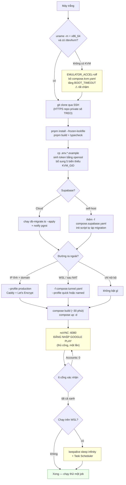

# Kick-start — dựng hệ thống từ máy trắng

Project đã tồn tại, nên đây **không phải** hướng dẫn khởi tạo. Đây là: máy mới, hoặc mất WSL distro, hoặc VPS mới — làm gì để có một stack chạy được.

Thời gian: ~45 phút, trong đó ~30 phút là build image worker (tải Android SDK + system image ~4 GB).

---

## 0. Kiểm điều kiện trước — fail sớm

Chạy hết đoạn này **trước khi clone**. Thiếu KVM mà build xong 30 phút rồi mới biết là phí thời gian.

```bash
uname -m                              # phải là x86_64
egrep -c '(vmx|svm)' /proc/cpuinfo    # > 0
ls -la /dev/kvm                       # phải tồn tại
docker --version && docker compose version
free -g | awk '/Mem:/ {print $2" GB RAM"}'   # nên ≥ 16
df -h / | tail -1                            # nên ≥ 80 GB trống
```

Kiểm kỹ hơn:

```bash
sudo apt-get update && sudo apt-get install -y cpu-checker
sudo kvm-ok
```

Mong đợi:

```text
INFO: /dev/kvm exists
KVM acceleration can be used
```

### Không có `/dev/kvm` thì sao

Vẫn chạy được, nhưng bằng software emulation — chậm tới mức không dùng cho production. Nếu vẫn muốn:

- Bỏ `-f compose.kvm.yaml` khỏi mọi lệnh compose.
- Đặt `EMULATOR_ACCEL=off` trong `.env.worker`.
- Nâng `EMULATOR_BOOT_TIMEOUT` lên (mặc định 600 giây thường không đủ).

Trên Windows/WSL, nested virtualization còn phụ thuộc Hyper-V có expose virtualization extension hay không — không phải lúc nào cũng bật được.

---

## 1. Clone

```bash
sudo mkdir -p /opt/app-relay
sudo chown "$USER":"$USER" /opt/app-relay
cd /opt/app-relay
```

Repo private thì **bắt buộc** dùng một trong hai cách sau. `git clone` HTTPS thường sẽ **treo vô hạn** chờ mật khẩu — không lỗi, không timeout, chỉ đứng im, và trong script tự động là treo luôn:

```bash
# deploy key (SSH) — khuyến nghị
git clone git@github.com:<owner>/app-relay.git .

# hoặc token, tắt hẳn prompt để lỗi xác thực fail ngay
GIT_TERMINAL_PROMPT=0 git clone https://<token>@github.com/<owner>/app-relay.git .
```

---

## 2. Cài dependency và build

```bash
corepack disable 2>/dev/null || true      # tránh corepack kéo pnpm 11
npm install -g pnpm@9.15.9

pnpm install --frozen-lockfile
pnpm build
pnpm typecheck
```

Cả ba phải xanh trước khi đi tiếp.

---

## 3. Cấu hình

```bash
cd deploy
cp .env.api.example .env.api
cp .env.worker.example .env.worker
touch .env
```

### Sinh token — không copy từ tài liệu

```bash
{
  echo "API_TOKEN=apr_live_$(openssl rand -hex 24)"
  echo "WORKER_TOKEN=worker_live_$(openssl rand -hex 24)"
  echo "DOWNLOAD_SIGNING_SECRET=$(openssl rand -hex 32)"
} >> .env.api
```

Rồi **xoá ba dòng placeholder cũ** trong `.env.api` (giá trị `xxxxxxxxx`), nếu không dòng sau sẽ đè dòng trước theo thứ tự đọc.

`WORKER_TOKEN` phải giống hệt ở cả `.env.api` và `.env.worker`:

```bash
grep '^WORKER_TOKEN=' .env.api
# copy đúng giá trị đó sang .env.worker
```

### Bổ sung biến còn thiếu trong `.env.api`

`.env.api.example` hiện **thiếu** năm biến mà code có đọc. Không có chúng thì mọi thứ chạy bằng mặc định ngầm, và người vận hành không biết chúng tồn tại:

```bash
cat >> .env.api <<'EOF'

# APK chiếm ~98% dung lượng nên hết hạn sớm hơn hẳn phần còn lại.
APK_TTL_HOURS=6

# Dưới ngưỡng này thì đuổi artifact cũ và ngừng giao job mới cho worker.
ARTIFACT_MIN_FREE_BYTES=10737418240

# Thư mục upload dở dang phải "nguội" bao lâu mới bị coi là mồ côi.
ORPHAN_DIR_MIN_AGE_MINUTES=120

# Ân hạn trước khi xoá APK sau khi client tải xong, để còn cửa tải lại.
DELETE_AFTER_DOWNLOAD_GRACE_MINUTES=10

# Job im lặng quá lâu mà claim_job() không lấy lại được thì reaper dọn.
# Phải cao hơn hẳn lease 120s để không cướp job còn sống.
STUCK_JOB_GRACE_MINUTES=15
EOF
```

Kiểm lại `ARTIFACT_TTL_HOURS`: file example ghi `48`, tài liệu thiết kế chốt `720`. Chọn một con số và đảm bảo `.env.api` với [environment.md](environment.md) khớp nhau.

### KVM group ID

```bash
echo "KVM_GID=$(getent group kvm | cut -d: -f3)" >> .env
```

### Chọn Supabase

**Cloud** — điền vào `.env.api`:

```env
SUPABASE_URL=https://<project-ref>.supabase.co
SUPABASE_SECRET_KEY=sb_secret_xxxxxxxxx
```

Dùng `sb_secret_...`, không dùng legacy `service_role` cho dự án mới.

**Self-host local** — thêm `-f compose.supabase.yaml` vào mọi lệnh compose, và vào `.env`:

```bash
{
  echo "POSTGRES_PASSWORD=$(openssl rand -hex 16)"
  echo "AUTHENTICATOR_PASSWORD=$(openssl rand -hex 16)"
  echo "JWT_SECRET=$(openssl rand -hex 32)"
} >> .env
```

Rồi trỏ `.env.api` vào gateway nội bộ thay vì `*.supabase.co`.

---

## 4. Chọn đường ra ngoài

Ba lựa chọn, **loại trừ nhau**:

| Tình huống | Cách | Lệnh thêm |
|---|---|---|
| VPS có IP tĩnh + domain | Caddy tự xin Let's Encrypt | `--profile production`, đặt `DOMAIN` và `CADDY_EMAIL` trong `.env` |
| Máy cá nhân / WSL / sau NAT — thử nhanh | quick tunnel | `-f compose.tunnel.yaml --profile quick` |
| Máy cá nhân / WSL — tích hợp thật | named tunnel | `-f compose.tunnel.yaml --profile named`, đặt `CLOUDFLARE_TUNNEL_TOKEN` |
| Chỉ dùng nội bộ | không bật gì | API vẫn nghe ở `127.0.0.1:5500` |

---

## 5. Migration

Init script của Postgres **chỉ chạy khi thư mục dữ liệu còn trống**:

- Deploy mới, self-host: mọi migration trong `supabase/migrations/` tự áp theo thứ tự tên.
- Supabase Cloud, hoặc deploy đã tồn tại: phải chạy tay.

```bash
cd /opt/app-relay

# Xem trước, không ghi gì
SUPABASE_DB_URL='postgres://postgres:<pass>@127.0.0.1:54322/postgres' \
  pnpm exec tsx scripts/db-migrate.ts

# Áp thật
SUPABASE_DB_URL='postgres://postgres:<pass>@127.0.0.1:54322/postgres' \
  pnpm exec tsx scripts/db-migrate.ts --apply
```

Script giữ sổ `public.schema_migrations` kèm checksum. Migration đã áp mà nội dung file đổi thì nó **từ chối chạy** thay vì âm thầm bỏ qua — đó là lý do không được sửa migration cũ.

Sau mỗi migration đổi cấu trúc bảng, **bắt buộc**:

```sql
notify pgrst, 'reload schema';
```

Thiếu bước này thì mọi ghi vào cột mới báo `Could not find the '<cột>' column of '<bảng>' in the schema cache`. Supabase Cloud tự reload; self-host thì phải gọi tay hoặc restart container `rest`.

---

## 6. Build và chạy

```bash
cd /opt/app-relay/deploy

# Đặt biến cho gọn — thêm/bớt overlay theo môi trường
C="docker compose -f compose.yml -f compose.kvm.yaml"

$C build          # ~30 phút lần đầu: tải Android SDK + system image
$C up -d
$C ps
```

Worker chờ API `healthy` mới khởi động (`depends_on: service_healthy`), nên API hỏng thì worker đứng im — đó là cố ý.

---

## 7. Đăng nhập Google Play — bước thủ công duy nhất

Không tự động hoá được, và là thứ dễ mất nhất trong toàn hệ thống.

```bash
# Trên VPS: mở tunnel từ máy cá nhân
ssh -L 6080:127.0.0.1:6080 ubuntu@<IP_VPS>

# Trên WSL/máy cá nhân: mở thẳng
```

Mở `http://localhost:6080/vnc.html` → thấy desktop Openbox có cửa sổ Android Emulator → mở Play Store trong emulator → đăng nhập tài khoản Google.

Xong rồi có thể đóng trình duyệt và ngắt SSH tunnel; emulator và worker vẫn chạy. Phiên đăng nhập nằm trong volume `worker-avd`.

> **Tuyệt đối không chạy `docker compose down -v`.** Cờ `-v` xoá volume, mất luôn AVD và phiên Play Store. Dừng thì dùng `stop`, xoá container thì dùng `down` không kèm `-v`.

---

## 8. Cổng xác nhận — xong là như thế nào

Cả sáu phải xanh:

```bash
# 1. API sống
curl -s http://127.0.0.1:5500/v1/health
# {"status":"ok","service":"app-relay-api","version":"1.0.0"}

# 2. Database nối được
T=$(grep '^API_TOKEN=' deploy/.env.api | cut -d= -f2-)
curl -s -H "Authorization: Bearer $T" http://127.0.0.1:5500/v1/system/status
# "database":"ok"

# 3. Emulator boot xong  (mất ~2 phút)
$C exec -T worker /opt/android-sdk/platform-tools/adb shell getprop sys.boot_completed
# 1

# 4. Play Store có mặt
$C exec -T worker /opt/android-sdk/platform-tools/adb shell pm list packages | grep com.android.vending

# 5. Tài khoản Google còn
$C exec -T worker /opt/android-sdk/platform-tools/adb shell dumpsys account | grep 'Accounts:'
# Accounts: 1     ← 0 nghĩa là mất phiên, quay lại bước 7

# 6. Worker đã đăng ký
curl -s -H "Authorization: Bearer $T" http://127.0.0.1:5500/v1/system/status | grep -o '"workers":{[^}]*}'
```

### Chạy thử một job thật

```bash
JOB=$(curl -s -X POST http://127.0.0.1:5500/v1/jobs \
  -H "Authorization: Bearer $T" -H "Content-Type: application/json" \
  -d '{"playUrl":"https://play.google.com/store/apps/details?id=com.facemoji.lite"}' \
  | jq -r .data.jobId)

watch -n5 "curl -s -H 'Authorization: Bearer $T' \
  http://127.0.0.1:5500/v1/jobs/$JOB | jq '.data | {status, progress, currentStep}'"
```

Tới `completed` là dựng xong.

---

## 9. Nếu chạy trên WSL — thêm một bước bắt buộc

WSL2 thu hồi distro khi không còn tiến trình nào từ Windows giữ nó sống. Lúc đó systemd nhận lệnh tắt máy thật, Docker daemon tắt theo, mọi container dừng. Dấu hiệu: mọi thứ "sạch", `RestartCount=0`, không có gì crash.

Giữ distro sống bằng một tiến trình nền trên Windows:

```powershell
Start-Process -FilePath "wsl.exe" `
  -ArgumentList '-d','Ubuntu-24.04','-u','root','--','sleep','infinity' `
  -WindowStyle Hidden
```

Dùng WSL làm server thật thì đăng ký lệnh trên vào Task Scheduler chạy lúc boot Windows. Không có nó thì mỗi lúc máy rảnh là cả stack chết.

---

## 10. Sơ đồ


