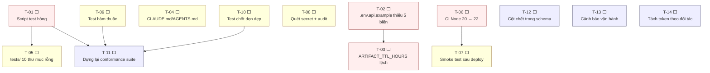

# Plan — việc cần làm

Mỗi task: mô tả một dòng · file sẽ đụng · Definition of Done · trạng thái.

Trạng thái: ⬜ chưa làm · 🟨 đang làm · ✅ xong

---

## 1. Phụ thuộc



---

## 2. P0 — sửa trước, rẻ và đang gây hại

### T-01 ⬜ Hai script test trỏ vào thư mục không tồn tại

`tests/test-endpoints/` (3410 dòng) bị xoá trong commit `ef53f90` nhưng script trong `package.json` bị bỏ lại. Chạy `pnpm test:endpoints` là lỗi ngay, và `new_setup/api-endpoint.md §4` vẫn hứa nó chạy được.

- **File**: [package.json](../package.json), `new_setup/api-endpoint.md`
- **Quyết định cần**: dựng lại bộ test (→ T-11) hay bỏ hẳn script?
- **Làm ngay**: bỏ hai script và sửa câu hứa trong tài liệu. Dựng lại thì làm ở T-11.
- **DoD**: `pnpm run` không liệt kê script hỏng; không tài liệu nào nhắc bộ test không tồn tại.
- **Rủi ro**: thấp.

### T-02 ⬜ `.env.api.example` thiếu 5 biến

Code đọc `APK_TTL_HOURS`, `ARTIFACT_MIN_FREE_BYTES`, `ORPHAN_DIR_MIN_AGE_MINUTES`, `DELETE_AFTER_DOWNLOAD_GRACE_MINUTES`, `STUCK_JOB_GRACE_MINUTES` nhưng file example không có. Deploy theo example là chạy toàn mặc định ngầm mà người vận hành không biết chúng tồn tại.

- **File**: [deploy/.env.api.example](../deploy/.env.api.example)
- **DoD**: mọi `process.env.X` trong `apps/api/src` đều có mặt trong example (kèm comment giải thích), và khớp bảng ở [environment.md §2](environment.md).
- **Cách kiểm**:

  ```bash
  grep -rhoE 'process\.env\.[A-Z_]+' apps/api/src | sed 's/process\.env\.//' | sort -u
  ```

- **Rủi ro**: thấp.

### T-03 ⬜ `ARTIFACT_TTL_HOURS` lệch giữa example và code

Example ghi `48`, code mặc định `720`, tài liệu thiết kế chốt `720`.

- **File**: `deploy/.env.api.example`, [environment.md](environment.md), [artifact-design.md](artifact-design.md)
- **Quyết định cần**: giữ 30 ngày hay hạ xuống? 30 ngày × ~1.3 MB/job phần nhẹ là rẻ, nên khuyến nghị giữ `720`.
- **DoD**: một con số duy nhất xuất hiện ở cả ba nơi.
- **Phụ thuộc**: làm cùng T-02.

### T-06 ⬜ CI test Node 20, image API chạy Node 22

`setup-node` dùng 20; `apps/api/Dockerfile` dùng `node:22-alpine` vì `@supabase/supabase-js >= 2.112` cần native WebSocket và crash trên Node 20. Nghĩa là **CI đang test trên runtime khác với production**.

- **File**: [.github/workflows/ci.yml](../.github/workflows/ci.yml), [package.json](../package.json)
- **Làm**: nâng `node-version` lên `22`. **Không** hạ Dockerfile xuống 20. Cân nhắc siết `engines.node` từ `>=18` lên `>=20`.
- **DoD**: `pnpm test` xanh trên Node 22 trong CI.
- **Rủi ro**: trung bình — có thể lộ ra lỗi vốn đang bị Node 20 che.

---

## 3. P1 — nên làm sớm

### T-04 ⬜ `CLAUDE.md` và `AGENTS.md` giống hệt nhau và đã cũ

Cả hai chỉ nói về GitNexus, và ghi sai số liệu index: "374 symbols, 641 relationships, 6 execution flows" trong khi thực tế là 628 / 1013 / 18.

- **File**: [CLAUDE.md](../CLAUDE.md), [AGENTS.md](../AGENTS.md)
- **Làm**: chạy lại `node .gitnexus/run.cjs analyze`, cập nhật số, và trỏ cả hai sang [system-prompt.md](system-prompt.md) thay vì duy trì hai bản trùng.
- **DoD**: số khớp `node .gitnexus/run.cjs status`; không còn hai file trùng nội dung.

### T-05 ⬜ `tests/` có 10 thư mục rỗng

`config/ contracts/ fixtures/ gateway/ outputs/ parsers/ scripts/ services/ worker/` không có file nào. Chỉ `tests/reports/test_execution_report.md` được commit. Thư mục rỗng làm người đọc tưởng có bộ test.

- **DoD**: hoặc có file thật, hoặc thư mục biến mất.
- **Phụ thuộc**: quyết định của T-01/T-11.

### T-07 ⬜ Deploy báo thành công kể cả khi container crash

`deploy-to-vps` in `✅ App Relay deployed successfully` ngay sau `docker compose up -d` — mà lệnh đó trả về khi container **khởi động**, không chờ nó **healthy**.

- **File**: `.github/workflows/ci.yml`
- **Làm**: thêm vào cuối job:

  ```bash
  sleep 15
  curl -fsS http://127.0.0.1:5500/v1/health || { echo "health check FAILED"; exit 1; }
  ```

- **DoD**: cố tình deploy bản hỏng → job đỏ.

### T-08 ⬜ Không quét secret, không quét CVE

Bảo vệ secret hiện dựa hoàn toàn vào `.gitignore`.

- **File**: `.github/workflows/ci.yml`
- **Làm**: thêm `gitleaks` (hoặc tương đương) và `pnpm audit --audit-level=high` vào job `test-and-verify`.
- **DoD**: cố tình commit chuỗi giống token → CI đỏ.

### T-09 ⬜ Test hàm thuần

Chín nhóm hàm thuần hiện gần như không được phủ, mà chúng là nơi bug gây hậu quả nặng nhất: `selectorMatches`, `selectorFor`, `normalizeEntryPath`, `resolveEntry`, `parseRange`, `escapePostgrestValue`, `verifyDownloadUrlSignature`, `isValidPackageId`, `contentTypeFor`.

- **File**: `packages/contracts/src/contracts.test.ts`, `apps/api/src/api.test.ts`
- **DoD**: mọi case ở [test-case.md §3](test-case.md) có test; 100% nhánh cho `contracts`, `artifact-path.ts`, `signature.ts`, `postgrest.ts`, `validation.ts`.
- **Ưu tiên trong nhóm**: NEP-06/07 (path traversal), PGR-07 (thứ tự escape), SIG-04 (`timingSafeEqual` throw khi lệch độ dài), CTY-03 (hồi quy CDN).

### T-10 ⬜ Test ba chốt an toàn của tác vụ dọn

Ba chốt trong `cleanupOrphanDirs()` — hỏng một cái là **xoá mất artifact hợp lệ**, im lặng, không có exception:

1. chỉ đụng thư mục nguội quá ngưỡng
2. lấy mtime của **file mới nhất bên trong**, không phải thư mục gốc
3. query DB lỗi thì **không xoá gì cả**

Cộng thêm CLN-11: reaper **không** đụng job `running` còn lượt.

- **File**: `apps/api/src/api.test.ts` (hoặc file test riêng cho cleanup)
- **DoD**: CLN-04, CLN-05, CLN-06, CLN-11 ở [test-case.md §4.8](test-case.md) đều có test.
- **Rủi ro nếu bỏ qua**: **cao** — mất dữ liệu vĩnh viễn không cảnh báo.

---

## 4. P2 — khi có thời gian

### T-11 ⬜ Dựng lại bộ test conformance

Bản cũ phủ 23 endpoint, kiểm shape response, trường bắt buộc, quy tắc token, và các ca phải bị từ chối. Dựng lại thì làm nhẹ hơn và chạy được trong CI (cần Supabase test hoặc mock).

- **DoD**: chạy được bằng một lệnh, không cần emulator; CI chạy được.
- **Phụ thuộc**: T-01, T-09, T-10.

### T-12 ⬜ Cột chết trong schema

| Cột | Vấn đề |
|---|---|
| `apps.artifact_size_bytes` | không code nào ghi vào |
| `workers.status = 'draining'` | khai trong check constraint, không code nào dùng |
| `artifacts.state = 'deleted'` | tương tự |
| `artifacts.content_type` | chỉ có ý nghĩa với `bundle_zip` cũ |

- **Làm**: hoặc dùng, hoặc bỏ bằng migration mới (**không** sửa migration cũ — checksum sẽ từ chối).
- **DoD**: mọi cột trong schema hoặc được ghi, hoặc có comment giải thích vì sao giữ.

### T-13 ⬜ Không có cảnh báo tự động

Đĩa đầy, mất phiên Google Play, `database: error` — chỉ biết khi có người nhìn. Log `[Cleanup] cần can thiệp thủ công` là tín hiệu duy nhất và không ai đọc.

- **Làm**: script cron gọi `/v1/system/status` + `dumpsys account` + `df -h`, báo ra webhook khi lệch ngưỡng.
- **DoD**: mất phiên Play → có thông báo trong vòng 15 phút.

### T-14 ⬜ Tách token theo đối tác

Bản `1.0` cố ý dùng một `API_TOKEN` chung. Khi có đối tác thứ ba thì phải tách.

- **Làm**: bảng `api_keys` (`id`, `key_hash`, `label`, `created_at`, `revoked_at`, `max_pending_jobs`), sửa `requirePublicAuth` tra bảng thay vì so với một hằng, thêm `jobs.api_key_id`, lọc theo key ở các endpoint đọc.
- **DoD**: hai key khác nhau không thấy job của nhau; huỷ một key không ảnh hưởng key kia.
- **Rủi ro**: **cao** — đụng vào mọi endpoint public. Chạy `impact` trước.

---

## 5. Task rủi ro cao — làm tay, không giao AI tự chạy

| Task | Vì sao |
|---|---|
| T-14 tách token | đụng mọi endpoint public; sai là chặn hết đối tác |
| Bất kỳ migration nào `drop`/`rename` | CI chạy migrate **trước** khi push image → schema mới chạy cùng code cũ vài phút |
| Đổi layout artifact hoặc selector | vỡ hợp đồng với mọi client; phải qua changelog breaking |
| Đụng `worker-avd` | mất phiên Google Play là mất thủ công, phải đăng nhập lại tay |
| Sửa `normalizeEntryPath` / `escapePostgrestValue` / `isValidPackageId` | ba chốt bảo mật; đọc kỹ comment trước |

Với mọi task trên: chạy `impact` trước, báo blast radius, và có kế hoạch rollback.

---

## 6. Thứ tự đề nghị

**Đợt 1 — dọn nhà (nửa ngày)**: T-01, T-02, T-03, T-04, T-05. Toàn thứ rẻ, và chúng đang làm tài liệu nói dối.

**Đợt 2 — chặn hồi quy (1–2 ngày)**: T-06, T-09, T-10. Sau đợt này, mọi thay đổi vào vùng nguy hiểm đều bị test chặn.

**Đợt 3 — an toàn vận hành (1 ngày)**: T-07, T-08, T-13.

**Đợt 4 — khi có nhu cầu thật**: T-11, T-12, T-14.

> Vì sao T-09/T-10 đứng trước T-11: bộ conformance cần server chạy và DB thật, còn test hàm thuần thì không cần gì. Viết cái rẻ trước, và cái rẻ ấy lại phủ đúng vùng hậu quả nặng nhất (mất dữ liệu, path traversal, tiêm SQL).
