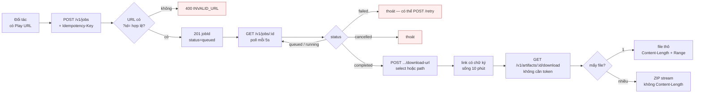

# Requirements — app-relay

> Phiên bản `1.0`. Đối chiếu với code tại commit `ef53f90`.

## 1. Bài toán

Lấy APK và trang giới thiệu của một ứng dụng Android từ Google Play về, giao lại qua HTTP.

Google Play không cho tải APK trực tiếp. Cách duy nhất lấy được bản cài thật là **cài app lên một thiết bị đã đăng nhập Google rồi `adb pull` ra**. app-relay đóng gói toàn bộ việc đó thành một API: đối tác gửi URL, nhận về file.

**Người dùng là hệ thống khác, không phải con người.** Không có màn hình, không có tài khoản, không có giao diện quản trị. Đầu vào là một URL, đầu ra là một thư mục file.

## 2. Phạm vi

### Trong phạm vi

| Hạng mục | Chi tiết |
|---|---|
| Nhận job theo URL Play Store | một URL hoặc một batch nhiều URL |
| Scrape listing | title, developer, rating, installs, mô tả đầy đủ, icon, toàn bộ screenshot, HTML gốc |
| Cài app qua Play Store | UI automation trên emulator đã đăng nhập Google |
| Kéo bản cài | `base.apk` + mọi `split_config.*.apk` |
| Sinh metadata | `PULL_MANIFEST.txt` (sha256 từng file), `package-info.txt`, `device-dir.listing` |
| Giao artifact | tải cả cục, một nhóm theo ý nghĩa, hoặc đúng một file |
| Vòng đời artifact | TTL riêng cho APK và phần nhẹ, dọn tự động, phanh theo áp lực đĩa |
| Theo dõi job | trạng thái, tiến độ, timeline sự kiện, huỷ, chạy lại |

### Ngoài phạm vi — và vì sao

Cột này quan trọng hơn cột trên. Mỗi dòng là một quyết định đã chốt, không phải việc chưa làm kịp.

| Không làm | Lý do |
|---|---|
| Dashboard, giao diện web | dự án chỉ là backend. Người gọi là hệ thống khác |
| Bảng user / auth / phân quyền | bản 1.0 dùng một token chung, cố ý không có bảng tài khoản |
| S3 / R2 / Supabase Storage | mọi file nằm trên đĩa API server. Thêm một hệ lưu trữ nữa là thêm một chỗ hỏng |
| Lưu ZIP dựng sẵn | phải giữ hai bản của cùng một dữ liệu. ZIP chỉ sinh khi đang stream |
| Mirror APKPure và nguồn bên thứ ba | Play + emulator cho bản cài thật, đúng ABI, đúng version |
| Endpoint xoá app / xoá job | chỉ có TTL và `deleteAfterDownload` |
| Rate limit, hạn ngạch | chưa cần với vài đối tác. Thêm khi có bảng `api_keys` |
| Nhiều emulator song song | một emulator, hàng đợi tuần tự |
| Ghi APK / ảnh vào database | Supabase chỉ giữ metadata |
| Worker truy cập Supabase trực tiếp | worker không cầm khoá DB, mọi thứ đi qua API |

## 3. User story

### US-1 — Lấy APK của một app

> Là đối tác, tôi gửi một URL Play Store và nhận về file APK, để phân tích ứng dụng đó.

**Acceptance criteria**

- `POST /v1/jobs` với `playUrl` hợp lệ → `201`, có `jobId`, `status = queued`.
- URL không có `?id=`, hoặc `id` không đúng dạng package Android → `400 INVALID_URL`, **không** tạo job.
- Gửi lại cùng `Idempotency-Key` → `200` kèm đúng job cũ, không sinh job thứ hai.
- Job đi tới `completed` trong ~60 giây khi emulator rảnh.
- `GET /v1/jobs/{id}/artifact/files` liệt kê `base.apk` với `sha256` khớp giá trị trong `PULL_MANIFEST.txt`.
- Tải về được, và file là ZIP hợp lệ có `AndroidManifest.xml` bên trong.

### US-2 — Chỉ lấy phần mình cần

> Là đối tác, tôi chỉ cần mô tả và ảnh chụp màn hình, không cần APK 68 MB.

**Acceptance criteria**

- `POST .../download-url` với `{"select":"listing"}` → link tải ~24 KB thay vì 73 MB.
- Selector khớp đúng một file → trả file thô, có `Content-Length`, hỗ trợ `Range`.
- Selector khớp nhiều file → ZIP sinh khi đang stream, **không** có `Content-Length`.
- Selector không khớp file nào → `404 NOTHING_SELECTED` lúc xin link, `410 NOTHING_TO_SERVE` lúc tải.
- Selector không nằm trong 8 giá trị hợp lệ → `400`.

### US-3 — Job không bao giờ kẹt

> Là người vận hành, tôi cần mọi job đều kết thúc, để vòng lặp poll của đối tác không chạy vô hạn.

**Acceptance criteria**

- Mọi job cuối cùng đều tới `completed`, `failed`, hoặc `cancelled`.
- Worker chết giữa chừng, còn lượt thử → lease hết hạn, worker khác claim lại, `attempt_count` tăng.
- Worker chết, hết `max_attempts` → reaper đưa về `failed` sau `STUCK_JOB_GRACE_MINUTES`.
- Worker chết khi đang `cancelling` → reaper đưa về `cancelled`.
- Job `running` **còn lượt** thì reaper **không** đụng tới — `claim_job()` sẽ tự lấy lại.

### US-4 — Server không tự đầy đĩa

> Là người vận hành, tôi cần hệ thống không bao giờ ghi đầy đĩa rồi chết.

**Acceptance criteria**

- Đĩa dưới `ARTIFACT_MIN_FREE_BYTES` → `POST /internal/v1/jobs/claim` trả `204`, job nằm yên trong `queued`.
- `PUT files/*` với `Content-Length` không vừa đĩa → `507`, từ chối trước khi ghi.
- Cron mỗi giờ: xoá APK hết hạn → xoá artifact hết hạn → dọn thư mục mồ côi → đuổi theo áp lực đĩa → dọn job kẹt.
- Job hỏng giữa lúc upload để lại thư mục không có dòng DB → bị dọn sau `ORPHAN_DIR_MIN_AGE_MINUTES`.
- Truy vấn DB lỗi lúc dò mồ côi → **không xoá gì cả**.

### US-5 — Huỷ và chạy lại

> Là đối tác, tôi muốn huỷ job gửi nhầm và chạy lại job hỏng.

**Acceptance criteria**

- Huỷ job `queued` → `cancelled` ngay.
- Huỷ job `running` → `cancelling`; worker thấy cờ giữa hai bước rồi tự dừng và xác nhận.
- Trạng thái đổi ngay giữa lúc xử lý huỷ → `409 STATUS_CHANGED`, **không** báo huỷ thành công một job vẫn đang chạy.
- Huỷ job đã kết thúc → `400 INVALID_STATUS`.
- `POST /retry` chỉ nhận job `failed`, giữ nguyên `jobId`, reset `attempt_count` về 0.

## 4. Ràng buộc phi chức năng

Số đo thật, không phải ước lượng:

| Chỉ tiêu | Giá trị | Nguồn |
|---|---|---|
| Thời gian một job | ~60 giây | đo trên emulator đã boot sẵn |
| Số job song song | **1** | một emulator, hàng đợi tuần tự |
| Dung lượng một job | ~70 MB (Zalo: 149 MB thô) | `com.zing.zalo` |
| Số file một artifact | ~18 | Zalo |
| Timeout cài từ Play | 6 phút / app | `ensureAppInstalled` |
| Lease job | 120 giây | `claim_job()` |
| Heartbeat | 20 giây | `HEARTBEAT_INTERVAL_MS` |
| Link tải sống | 10 phút | `DOWNLOAD_URL_TTL_SECONDS` |
| APK giữ lại | 6 giờ | `APK_TTL_HOURS` |
| Phần nhẹ giữ lại | 720 giờ (30 ngày) | `ARTIFACT_TTL_HOURS` |
| Ngưỡng đĩa dự phòng | 10 GB | `ARTIFACT_MIN_FREE_BYTES` |
| RAM khuyến nghị | 16 GB | yêu cầu Android Emulator |
| Đĩa khuyến nghị | 80 GB SSD | |

**Hệ quả cho người viết client**: gửi 20 URL mất khoảng 20 phút, và nếu có bên khác đang gửi thì xếp hàng sau. Đừng thiết kế kiểu gọi xong chờ ngay.

## 5. Giả định

Ghi ra để khi hỏng thì biết chỗ nghi trước.

- **Emulator có KVM.** Không có thì chạy được bằng software emulation nhưng chậm tới mức không dùng nổi cho production.
- **Phiên đăng nhập Google Play sống lâu.** Chưa đo được nó tồn tại bao lâu trước khi Google bắt xác thực lại. Đây là trạng thái thủ công duy nhất trong hệ thống.
- **Play cho cài liên tục.** Chưa gặp giới hạn tốc độ, nhưng cũng chưa thử ở mức hàng nghìn lượt.
- **Cloudflare quick tunnel chịu được file 68 MB.** Điều khoản tự phục vụ của Cloudflare hạn chế dùng CDN để phát tán file lớn không phải HTML — vài chục lượt thì không sao, hàng nghìn thì nên đổi sang VPS có IP riêng.
- **Máy chạy server luôn bật.** Trên WSL còn phải giữ distro khỏi bị Windows thu hồi.

## 6. Câu hỏi chưa trả lời

| Câu hỏi | Ảnh hưởng |
|---|---|
| Bao lâu thì phải đăng nhập lại Google Play? | quyết định có cần cảnh báo tự động không |
| Có cần tách token theo đối tác không? | nếu có thì phải thêm bảng `api_keys` và sửa middleware |
| App khoá theo region xử lý thế nào? | hiện chỉ báo lỗi; có thể cần proxy hoặc đổi tài khoản |
| Giữ APK 6 giờ có đủ cho đối tác không? | nâng lên thì phải tính lại dung lượng đĩa |
| Có chạy nhiều emulator không? | `claim_job()` đã sẵn sàng, nhưng chưa thử |

## 7. Luồng người dùng chính

