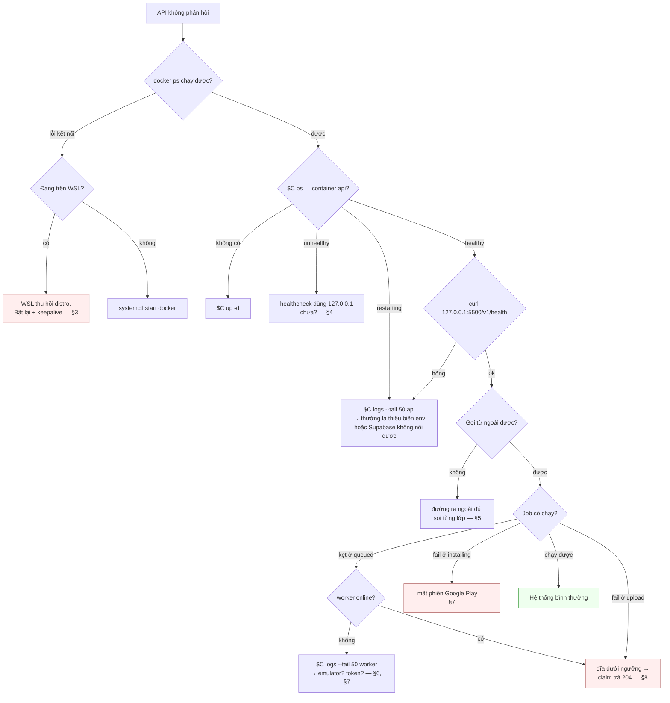

# Runbook — có sự cố thì làm gì

Viết theo dạng **triệu chứng → hành động**. Dựng từ máy trắng nằm ở [kick-start.md](kick-start.md), không lặp lại ở đây.

---

## 0. Đặt biến trước

Mọi lệnh dưới đây giả định:

```bash
cd /root/app-relay/deploy

# VPS hiện tại: COMPOSE_FILE trong .env đã lo overlay, không cần cờ -f
C="docker compose"

# Máy dev còn chạy quick tunnel thì thêm overlay và profile:
# C="docker compose -f compose.yml -f compose.kvm.yaml -f compose.supabase.yaml -f compose.tunnel.yaml --profile quick"

T=$(grep '^API_TOKEN=' .env.api | cut -d= -f2-)
```

---

## 1. Ba điều tuyệt đối tránh

| Đừng | Vì sao | Thay bằng |
|---|---|---|
| `docker compose down -v` | `-v` xoá volume → mất AVD **và phiên đăng nhập Google Play** | `$C stop` hoặc `$C down` (không `-v`) |
| Chạy song song Docker Desktop và Docker trong WSL | distro WSL2 dùng chung network namespace → tranh cổng 5500/6080/54322 | `stop` bên kia trước |
| Hardcode URL quick tunnel vào code | URL đổi mỗi lần restart | đọc từ config, lấy URL bằng lệnh ở §5 |

---

## 2. Cây chẩn đoán



---

## 3. WSL thu hồi distro

**Triệu chứng** — mọi thứ trông "sạch", không có gì crash:

```text
RestartCount=0   OOMKilled=false   NRestarts=0
```

Container dừng, API không phản hồi, nhưng không có log lỗi nào. Trong journal của distro:

```text
systemd[1]: Reached target poweroff.target - System Power Off
```

**Nguyên nhân** — WSL2 thu hồi distro khi không còn tiến trình nào từ phía Windows giữ nó sống. systemd nhận lệnh tắt máy thật, Docker daemon tắt theo. Container chết dù có `restart: unless-stopped`, và `wsl -l -v` báo distro `Stopped`.

> **Chỉ xảy ra khi engine là docker cài trong một distro WSL. Docker Desktop không dính chuyện này.** Distro `Ubuntu-24.04` dùng trong các lệnh dưới đây đã bị xoá ngày 2026-08-12 — thay bằng tên distro thật đang dùng, xem [`../deploy/README.md` §8](../deploy/README.md).

**Xử lý** — từ PowerShell trên Windows:

```powershell
wsl -d Ubuntu-24.04 -u root -- systemctl is-active docker

Start-Process -FilePath "wsl.exe" `
  -ArgumentList '-d','Ubuntu-24.04','-u','root','--','sleep','infinity' `
  -WindowStyle Hidden
```

Lệnh thứ hai là tiến trình giữ distro sống. **Không có nó thì mọi thứ sẽ chết lại y như lần trước.** Dùng WSL làm server thật thì đăng ký lệnh đó vào Task Scheduler chạy lúc boot Windows.

Rồi vào WSL và bật lại stack:

```bash
wsl -d Ubuntu-24.04 -u root
cd /opt/app-relay/deploy
systemctl start docker
$C up -d
```

Container nào kẹt thì ép tạo lại: `$C up -d --force-recreate`.

---

## 4. Bảng sự cố

| Triệu chứng | Nguyên nhân | Xử lý |
|---|---|---|
| Worker treo mãi ở `depends_on`, api không bao giờ `healthy` | healthcheck dùng `localhost` → container phân giải `::1` trước, server chỉ bind IPv4 → `ECONNREFUSED` | dùng `http://127.0.0.1:5500/v1/health` |
| API crash-loop lúc boot, log nhắc `WebSocket` | image chạy Node 20; `supabase-js >= 2.112` cần native WebSocket | image API phải là `node:22-alpine` |
| API crash-loop, log `... environment variable is required` | thiếu một trong 4 biến bắt buộc | kiểm `.env.api`: `API_TOKEN`, `WORKER_TOKEN`, `SUPABASE_URL`, `DOWNLOAD_SIGNING_SECRET` |
| `/system/status` trả `"database":"error"` | Supabase không nối được | kiểm `SUPABASE_URL`/`SUPABASE_SECRET_KEY`; self-host thì `$C logs db rest` |
| Ghi cột mới lỗi `Could not find the '<cột>' column ... in the schema cache` | PostgREST chưa reload sau migration | `notify pgrst, 'reload schema';` hoặc restart container `rest` |
| Emulator không boot, `wait-for-emulator.sh` quay vòng tới hết giờ | lock sót lại sau SIGTERM | xoá lock — xem §6 |
| Job fail ở `installing`, `Accounts: 0` | mất phiên Google Play | đăng nhập lại qua noVNC — §7 |
| Job đứng `queued` dù worker online | đĩa dưới ngưỡng → `claim` trả `204` | `df -h`, dọn artifact — §8 |
| Upload trả `507` | đĩa không đủ cho `Content-Length` | như trên |
| Job kẹt `running`/`cancelling` không đổi | worker chết; đợi reaper | sau `STUCK_JOB_GRACE_MINUTES` (15 phút) reaper dọn. Vẫn kẹt thì kiểm log `[Reaper]` |
| Tải file lỗi `403 INVALID_SIGNATURE` | link quá 10 phút, hoặc query bị sửa | gọi lại `download-url` |
| `410` với `select=apk` nhưng `listing` vẫn chạy | APK đã hết `APK_TTL_HOURS` | chạy job mới, hoặc nâng TTL |
| `page.html` tải về sha256 lệch | CDN viết lại `text/html` | đã vá: khai `application/octet-stream`. Vẫn lệch thì kiểm CDN có transform khác không |
| Tranh cổng 5500/6080/54322 | hai stack Docker chạy song song trên WSL | `stop` một bên |
| `git clone` treo không lỗi | repo private qua HTTPS chờ mật khẩu | SSH deploy key, hoặc `GIT_TERMINAL_PROMPT=0` |
| CI lỗi `Multiple versions of pnpm specified` | `pnpm/action-setup` có input `version` mà package.json đã có `packageManager` | bỏ input `version` |

---

## 5. Đường ra ngoài

### VPS production — bốn lớp, soi từ ngoài vào

`https://app-relay.lutech.vn` đi qua Cloudflare → nginx máy host
`79.108.216.178` → nginx VM `10.10.10.168` → `127.0.0.1:5500`. Bốn lệnh dưới đây
dừng đúng ở lớp hỏng; sơ đồ và cách sửa từng lớp ở
[domain-setup.md](domain-setup.md).

```bash
curl -sS -o /dev/null -w '%{http_code}\n' https://app-relay.lutech.vn/v1/health                              # lớp 1
curl -sS -o /dev/null -w '%{http_code}\n' -H 'Host: app-relay.lutech.vn' http://79.108.216.178/v1/health     # lớp 2
curl -sS -o /dev/null -w '%{http_code}\n' -H 'Host: app-relay.lutech.vn' http://127.0.0.1/v1/health          # lớp 3, chạy trên VM
curl -sS -o /dev/null -w '%{http_code}\n' http://127.0.0.1:5500/v1/health                                    # lớp 4, chạy trên VM
```

| Đọc được gì | Nghĩa là | Làm gì |
|---|---|---|
| lớp 1 ra `403` + header `Cf-Mitigated: challenge` | Cloudflare bật challenge, chưa tới máy nào | tắt Bot Fight Mode cho hostname — [domain-setup.md §5](domain-setup.md) |
| lớp 1 hỏng, lớp 2 ra `404` | máy host chưa có vhost cho tên miền | [domain-setup.md §4](domain-setup.md) |
| lớp 2 hỏng, lớp 3 ok | máy host không tới được `10.10.10.168:80` | bên hạ tầng kiểm đường mạng nội bộ |
| lớp 3 kết nối đứt (curl `000`) | Host không khớp `server_name` → rơi vào block `return 444` | gõ đúng tên miền, hoặc `nginx -T \| grep server_name` |
| lớp 3 hỏng, lớp 4 ok | nginx VM sai config | `nginx -t` rồi `sudo /root/app-relay/deploy/nginx/install.sh` |
| lớp 4 hỏng | API mới là thứ chết | quay lại §4 |

**`/var/log/nginx/app-relay.access.log` trống = request chưa từng tới VM.** Đây
là cách phân định nhanh nhất giữa "lỗi của mình" và "lỗi của lớp trên".

Đối tác báo `504` mà lớp 3 và 4 đều ok: gần như luôn là timeout ở lớp host. Job
emulator mất ~60s, đúng mốc mặc định của nginx — cả hai lớp nginx phải cùng đặt
`proxy_read_timeout 300s`.

Link tải artifact trả về `http://` thay vì `https://`: thiếu
`proxy_set_header X-Forwarded-Proto https` ở nginx VM, xem
[domain-setup.md §3](domain-setup.md).

### Máy dev — tunnel

**Quick tunnel đổi URL mỗi lần khởi động lại.** URL cũ chết ngay.

```bash
$C logs cloudflared-quick 2>&1 \
  | grep -o 'https://[a-z0-9-]*\.trycloudflare\.com' | tail -1
```

`tail -1`, không phải `head -1` — cloudflared in URL mới mỗi lần restart, bản đầu trong log đã chết.

Named tunnel không đổi URL. Nó chết thì kiểm `CLOUDFLARE_TUNNEL_TOKEN` và `$C logs cloudflared-named`.

Caddy không xin được cert thì kiểm: cổng 80/443 mở chưa, `DOMAIN` trỏ đúng IP chưa, `$C logs caddy`. Trên VPS hiện tại Caddy **không chạy** — nginx giữ cổng 80.

---

## 6. Emulator không boot

**Triệu chứng** — `wait-for-emulator.sh` quay vòng tới lúc hết giờ, `adb devices` rỗng.

**Nguyên nhân thường gặp nhất**: bị SIGTERM giữa chừng (WSL thu hồi distro, `docker stop` quá hạn) để lại lock trong AVD. Lần khởi động sau emulator tưởng đã có instance khác nên thoát ngay.

**Xác nhận không còn tiến trình emulator nào trước khi xoá lock** — xoá lock khi
qemu vẫn chạy thì đúng là hai instance trên một AVD, và AVD hỏng thật:

```bash
$C exec worker bash -c 'pgrep -a qemu-system || echo KHONG-CO'   # phải ra KHONG-CO
```

Rỗng rồi mới xoá:

```bash
$C exec worker bash -c '
  rm -f /home/worker/.android/avd/chpay.avd/multiinstance.lock \
        /home/worker/.android/avd/chpay.avd/hardware-qemu.ini.lock \
        /home/worker/.android/avd/running/pid_*.ini
'
$C restart worker
```

Ba file đó được sinh lại lúc emulator chạy, nên xoá khi không có tiến trình nào là
an toàn. `compose.prod.yaml` đặt `stop_grace_period: 120s` chính là để dừng sạch,
khỏi sinh ra khoá mồ côi ngay từ đầu.

> **Không đụng `userdata-qemu.img*`.** Phiên đăng nhập Google nằm trong đấy — xoá là mất, phải đăng nhập lại tay.

Nguyên nhân khác:

```bash
# Có KVM không?
$C exec worker ls -la /dev/kvm
$C exec worker kvm-ok

# Emulator có báo gì không?
$C logs --tail 100 worker | grep -i emulator

# Thiếu thư viện hệ thống? (Dockerfile đã assert lúc build, nhưng kiểm lại cho chắc)
$C exec worker ldconfig -p | grep -E 'libnss3|libasound|libEGL'
```

Không có KVM thì đặt `EMULATOR_ACCEL=off`, bỏ `-f compose.kvm.yaml`, và tăng `EMULATOR_BOOT_TIMEOUT`.

---

## 7. Mất phiên Google Play

**Kiểm:**

```bash
$C exec -T worker /opt/android-sdk/platform-tools/adb shell dumpsys account | grep 'Accounts:'
```

`Accounts: 1` là còn. `Accounts: 0` là mất — mọi job sẽ fail ở bước `installing`.

**Xử lý** — bước thủ công, không tự động hoá được:

```bash
./gui.sh on                              # noVNC chỉ sống khi WORKER_GUI=on
ssh -N -L 6080:127.0.0.1:6080 <user>@<IP_VPS>
```

Mở `http://localhost:6080/vnc.html?autoconnect=true&resize=scale` → mở Play Store
trong emulator → đăng nhập → `./gui.sh off`.

> **Phải có `autoconnect=true`.** Mở `vnc.html` trần thì noVNC dừng ở màn hình chờ
> chờ bấm Connect, và trông y như chưa có emulator nào chạy.

Sau đó có thể đóng trình duyệt và ngắt SSH; emulator vẫn chạy, phiên nằm trong volume `worker-avd`.

Chi tiết quy trình và những gì nhìn thấy trên màn hình: [deploy-vps.md §4](deploy-vps.md).
Vì sao phiên sống sót qua deploy, và cách khỏi phải làm lại ở máy sau:
[avd-seed.md](avd-seed.md).

---

## 8. Đĩa đầy

**Triệu chứng**: job đứng `queued` dù worker online; upload trả `507`; log `[Cleanup] Đĩa dưới ngưỡng`.

```bash
df -h /
docker system df
$C exec api du -sh /data/artifacts
$C exec api du -sh /data/artifacts/* | sort -h | tail -20
```

Cron mỗi giờ đã tự dọn theo năm bước. Cần dọn ngay thì:

```bash
# Ép chạy vòng dọn: cron chạy lần đầu 10 giây sau khi API khởi động
$C restart api
$C logs -f api | grep -E '\[Cleanup\]|\[Reaper\]'
```

Vẫn không đủ thì:

- Hạ `APK_TTL_HOURS` xuống (ví dụ `2`), restart `api`.
- `docker system prune -f` để dọn image cũ.
- Kiểm thư mục mồ côi: log `[Cleanup] Xoá thư mục mồ côi`. Chưa tới `ORPHAN_DIR_MIN_AGE_MINUTES` thì nó chưa đụng vào.

Log `[Cleanup] Đĩa thấp nhưng không còn artifact nào để đuổi — cần can thiệp thủ công` nghĩa là hệ thống đã hết cách. Phải mở rộng đĩa hoặc xoá thứ khác trên máy.

---

## 9. Xem log và chỉ số

```bash
$C logs --tail 100 api
$C logs --tail 100 worker
$C logs -f worker | grep -E '\[Worker\]|\[Upload\]'
$C logs -f api    | grep -E '\[Cleanup\]|\[Reaper\]|\[Claim\]'

journalctl -u docker --since "-30 min" --no-pager | tail -30
df -h / ; free -h
```

**Prefix log:**

| Prefix | Nguồn |
|---|---|
| `[Worker]` | vòng lặp và pipeline worker |
| `[Upload]` | tiến độ upload từng file |
| `[Entrypoint]` | script khởi động container worker |
| `[Cleanup]` | dọn artifact |
| `[Reaper]` | dọn job kẹt |
| `[Claim]` | từ chối claim do đĩa thấp |

**Chỉ số cần theo dõi** — chưa có dashboard, kiểm bằng tay:

```bash
curl -s -H "Authorization: Bearer $T" http://127.0.0.1:5500/v1/system/status | jq
```

| Chỉ số | Bình thường | Đáng lo |
|---|---|---|
| `database` | `ok` | `error` |
| `jobs.queued` | 0–vài | tăng liên tục không giảm |
| `jobs.running` | 0 hoặc 1 | > 1 với một worker |
| `jobs.failed` | tăng chậm | tăng nhanh → kiểm phiên Play |
| `workers.offline` | 0 | > 0 → worker im lặng > 60s |
| đĩa trống | > 10 GB | < 10 GB → claim bị chặn |

Timeline của một job cụ thể:

```bash
curl -s -H "Authorization: Bearer $T" http://127.0.0.1:5500/v1/jobs/$JOB/events | jq -r \
  '.data[] | "\(.createdAt) [\(.level)] \(.eventType) — \(.message)"'
```

---

## 10. Deploy tay và rollback

### Deploy tay

```bash
# Từ MÁY DEV — chép cấu hình mới sang (VPS không còn là git clone)
scp -r deploy supabase/migrations <user>@<IP>:/opt/app-relay/

# Trên VPS
cd /opt/app-relay/deploy
docker login                    # repo private vì worker image chứa seed
$C pull                         # KHÔNG `build` — build ở đây làm mất seed
$C up -d
$C ps
curl -s http://127.0.0.1:5500/v1/health
```

### Rollback code

**Đây là phần quan trọng nhất của runbook.** Image có tag theo `github.sha` nên lùi được:

```bash
# Tìm sha đang chạy tốt trước đó
git log --oneline -10

# Chạy lại bản đó
IMAGE_TAG=<sha-cũ> DOCKERHUB_USERNAME=<user> $C up -d
curl -s http://127.0.0.1:5500/v1/health
```

Muốn cố định thì ghi `IMAGE_TAG=<sha>` vào `deploy/.env`.

### Rollback schema — **không có đường tự động**

Migration không có `down`. Nếu một migration làm hỏng production:

1. **Trước tiên rollback code** về bản tương thích với schema cũ (lệnh trên). Đa số trường hợp dừng được ở đây, vì migration của dự án này toàn `add column if not exists` — schema mới vẫn tương thích ngược với code cũ.
2. Nếu schema thật sự phải lùi: viết **migration mới** hoàn tác (`00N_revert_xxx.sql`), không sửa file cũ. Checksum sẽ từ chối file đã sửa.
3. Chạy `--apply` rồi `notify pgrst, 'reload schema'`.

> CI chạy `db-migrate` **trước** khi push image mới. Nghĩa là có một khoảng thời gian schema mới chạy cùng code cũ — mọi migration **phải tương thích ngược**. Đây là ràng buộc thiết kế, không phải khuyến nghị.

---

## 11. Backup và restore

Ba loại dữ liệu, mức quan trọng rất khác nhau:

| Dữ liệu | Nơi | Mất thì sao | Backup |
|---|---|---|---|
| **Phiên Google Play** | volume `worker-avd` | **không thay thế được tự động** — phải đăng nhập tay | xem dưới |
| **Metadata job/app** | Supabase | mất lịch sử, không mất file | Supabase Cloud tự backup; self-host thì `pg_dump` |
| Artifact | volume `api-artifacts` | chạy lại job là có | không cần |

### Backup AVD

```bash
$C stop worker      # phải dừng, không copy AVD đang chạy
docker run --rm -v app-relay_worker-avd:/data -v "$PWD:/backup" alpine \
  tar czf /backup/worker-avd-$(date +%F).tar.gz -C /data .
$C start worker
```

### Restore

```bash
$C stop worker
docker run --rm -v app-relay_worker-avd:/data -v "$PWD:/backup" alpine \
  sh -c 'rm -rf /data/* && tar xzf /backup/worker-avd-YYYY-MM-DD.tar.gz -C /data'
$C start worker
```

### Backup Supabase self-host

```bash
$C exec -T db pg_dump -U postgres postgres | gzip > db-$(date +%F).sql.gz
```

---

## 12. Kiểm tra sức khoẻ định kỳ

Chạy khi nghi ngờ, hoặc sau mỗi lần khởi động lại:

```bash
#!/usr/bin/env bash
set -u
cd /opt/app-relay/deploy
C="docker compose -f compose.yml -f compose.kvm.yaml"
T=$(grep '^API_TOKEN=' .env.api | cut -d= -f2-)
ADB=/opt/android-sdk/platform-tools/adb

echo "── containers ──";  $C ps
echo "── api ──";         curl -s http://127.0.0.1:5500/v1/health; echo
echo "── system ──";      curl -s -H "Authorization: Bearer $T" http://127.0.0.1:5500/v1/system/status; echo
echo "── emulator ──";    $C exec -T worker $ADB shell getprop sys.boot_completed
echo "── play account ──";$C exec -T worker $ADB shell dumpsys account | grep 'Accounts:'
echo "── disk ──";        df -h / | tail -1
```

Cả sáu xanh là bình thường. Bất kỳ dòng nào lệch thì quay lại cây chẩn đoán ở §2.

---

## 13. Bí thì làm gì

Chưa có on-call, chưa có cảnh báo tự động. Khi không tự giải quyết được, thu thập đủ bốn thứ trước khi hỏi:

```bash
$C ps
$C logs --tail 50 api
$C logs --tail 50 worker
df -h / ; free -h
```

Kèm theo: đang chạy overlay nào (`$C` gồm những `-f` gì), lần cuối deploy là commit nào, và triệu chứng bắt đầu từ khi nào.
