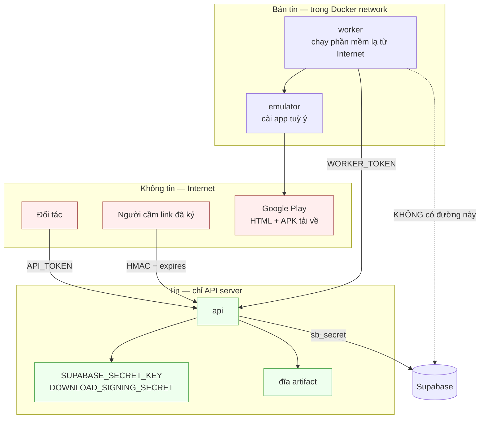
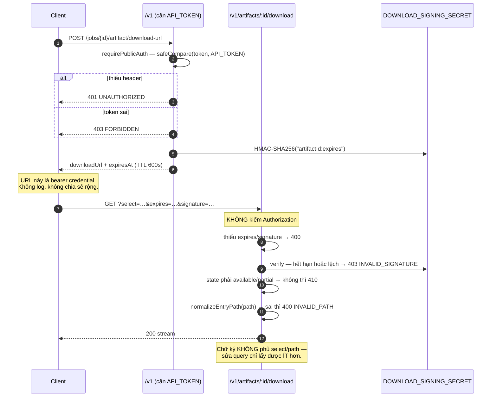

# Security

Mô hình đe doạ, ranh giới tin cậy, và **nợ bảo mật đã biết**.

Phần xác thực đã chốt từ giai đoạn thiết kế chứ không vá sau — nhưng bản `1.0` cố ý chấp nhận một số giới hạn, và chúng được ghi thẳng ở §6 thay vì giấu.

---

## 1. Ranh giới tin cậy



**Worker nằm ở vùng bán tin, có chủ ý.** Nó chạy Android emulator cài phần mềm tải từ Internet và thao tác UI tự động. Đó là thành phần dễ mất kiểm soát nhất, nên nó **không cầm khoá Supabase** — mọi thay đổi trạng thái đi qua API, nơi đã có sẵn các chốt.

---

## 2. Ba mặt phẳng xác thực

| Mặt phẳng | Cơ chế | Phạm vi |
|---|---|---|
| `/v1/*` | `Bearer API_TOKEN` | toàn bộ nghiệp vụ public |
| `/internal/v1/*` | `Bearer WORKER_TOKEN` | chỉ worker, trong Docker network |
| `/v1/artifacts/:id/download` | HMAC-SHA256 trên `artifactId:expires` | đúng một artifact, trong TTL |
| `/v1/health` | không | chỉ trả version |

### So sánh constant-time

```ts
function safeCompare(a: string, b: string): boolean {
  const digestA = crypto.createHash('sha256').update(a).digest();
  const digestB = crypto.createHash('sha256').update(b).digest();
  return crypto.timingSafeEqual(digestA, digestB);
}
```

Hash trước để cả hai vế luôn 32 byte. `timingSafeEqual` ném lỗi khi độ dài lệch, nên nếu so trực tiếp thì phải thêm `if (a.length !== b.length) return false` — mà chính dòng đó rò rỉ độ dài token qua thời gian phản hồi. Hash trước làm biến mất cả hai vấn đề.

### Phân biệt 401 và 403

- `401 UNAUTHORIZED` — không có header `Authorization`, hoặc không bắt đầu bằng `Bearer `.
- `403 FORBIDDEN` — có token nhưng sai.

Phân biệt này là chủ ý: client biết mình cần thêm token (401) hay token đang cầm là sai (403, đừng thử lại).

---

## 3. Chữ ký link tải

```ts
payload   = `${artifactId}:${expires}`
signature = HMAC-SHA256(DOWNLOAD_SIGNING_SECRET, payload)
```

Verify kiểm hạn **trước** rồi mới so chữ ký constant-time.

### Vì sao **không** ký `select` và `path`

Không phải cắt bớt cho tiện. Link mặc định (`select=all`) vốn đã cho **toàn bộ thư mục**. Người cầm link sửa query thành `?path=base.apk` chỉ lấy được **ít hơn** thứ họ đã có quyền lấy. Ký thêm không mua được gì.

Điều này chỉ đúng vì `download-url` luôn cấp quyền ở mức artifact, không bao giờ ở mức file. Nếu sau này có nhu cầu phát link **chỉ cho một file**, thiết kế này phải đổi — và đó là lúc phải ký cả `path`.

### Link đã ký là bearer credential

Ai cầm link cũng tải được, không cần token. Nghĩa là:

- **Không log URL đã ký.** Nó tương đương một token có thời hạn.
- Gửi qua email/chat thì cân nhắc `DOWNLOAD_URL_TTL_SECONDS` — mặc định 600 giây không đủ để người nhận mở mail.
- Nới TTL là đánh đổi: link sống lâu hơn thì cửa sổ lộ cũng dài hơn.

---

## 4. Ma trận quyền

Bản `1.0` gần như phẳng — và đó chính là điều cần nói rõ:

| Chủ thể | Xem job | Tạo job | Huỷ / Retry | Xem app | Xin link | Tải | Ghi artifact | Đổi trạng thái job |
|---|---|---|---|---|---|---|---|---|
| `API_TOKEN` | **mọi job** | ✓ | **mọi job** | ✓ | **mọi job** | **mọi artifact** | ✗ | chỉ cancel/retry |
| `WORKER_TOKEN` | ✗ | ✗ | ✗ | ✗ | ✗ | ✗ | **chỉ job đang giữ** | ✓ (job đang giữ) |
| Link đã ký | ✗ | ✗ | ✗ | ✗ | ✗ | **đúng 1 artifact, trong TTL** | ✗ | ✗ |
| `anon` / `authenticated` (Supabase) | ✗ | ✗ | ✗ | ✗ | ✗ | ✗ | ✗ | ✗ |

**Hệ quả vận hành, không phải bị tấn công**: hai đối tác dùng chung `API_TOKEN` thì gọi nhầm `jobId` của nhau là chuyện **sẽ** xảy ra — huỷ nhầm job, tải nhầm artifact. Không có gì trong hệ thống ngăn được.

Nếu đối tác **chỉ cần nhận file**, không bắt buộc đưa token: link tải tự mang chữ ký. Đó là cách giảm rủi ro rẻ nhất hiện có.

---

## 5. Các chốt đã có

### 5.1. Path traversal

Đường dẫn từ client và từ worker đều đi qua [`normalizeEntryPath()`](../apps/api/src/utils/artifact-path.ts):

| Từ chối | Ví dụ | Vì sao |
|---|---|---|
| `%`-encoding hỏng | `%zz` | từ chối thay vì đoán ý |
| null byte | `a\0b` | cắt chuỗi ở tầng syscall |
| đường dẫn tuyệt đối | `/etc/passwd` | cắt `/` đầu rồi coi là tương đối là kiểu dễ dãi che giấu lỗi |
| thoát ra ngoài | `a/../../b` | **normalize rồi so sánh**, không chỉ tìm chuỗi `..` |
| dotfile ở bất kỳ tầng nào | `.uploads.jsonl`, `a/.git/x` | API dùng dotfile để ghi sổ nội bộ |

Điểm tinh tế: `a/../../b` **không** chứa `..` ở đầu nhưng vẫn thoát ra ngoài; ngược lại `..foo.apk` chứa `..` mà hoàn toàn hợp lệ. Vì thế phải normalize rồi so, không được tìm chuỗi.

`resolveEntry()` còn một chốt cuối: sau khi `path.resolve()`, kết quả vẫn phải nằm trong thư mục artifact.

`jobArtifactDir()` chặn `jobId` ngay từ đầu bằng `/^[A-Za-z0-9._-]+$/` — `jobId` đi thẳng từ URL nên một giá trị kiểu `../../etc` sẽ trỏ ra ngoài `ARTIFACT_DIR`.

### 5.2. Command injection qua adb

`packageId` được ghép vào lệnh `adb shell`. `isValidPackageId()` bắt buộc khớp:

```text
^[a-zA-Z][a-zA-Z0-9_]*(\.[a-zA-Z][a-zA-Z0-9_]*)+$    và độ dài ≤ 255
```

Không có khoảng trắng, dấu chấm phẩy, dấu nháy, `$`, backtick. Kiểm ở cả `POST /jobs`, `POST /jobs/batch`, và `GET /apps/:packageId`.

### 5.3. Tiêm vào filter PostgREST

`GET /v1/apps?search=` đi vào `.or()`. PostgREST tách danh sách `or=(...)` theo dấu phẩy và coi `.` cùng ngoặc là cú pháp — nên giá trị không bọc nháy như `foo,title.eq.bar` sẽ **tiêm thêm một nhánh OR**.

[`escapePostgrestValue()`](../apps/api/src/utils/postgrest.ts) escape hai lượt, **thứ tự quan trọng**:

1. `%` và `_` (metachar của ILIKE) → thêm `\` để `%` trong từ khoá khớp `%` thật.
2. `\` và `"` → escape cho cú pháp chuỗi có nháy của PostgREST. Chạy sau để những `\` sinh ra ở bước 1 cũng được nhân đôi và sống sót vào pattern SQL.

Giá trị **bắt buộc** được bọc nháy kép bởi `ilikeContains()` — chính dấu nháy mới là thứ chứa giá trị lại.

### 5.4. Toàn vẹn khi upload

| Chốt | Mã | Vì sao |
|---|---|---|
| Job phải `running` | `409 JOB_NOT_RUNNING` | không có nó thì worker ghi đè được artifact của job đã giao xong, khiến đĩa lệch với `files`/`sha256` DB đang công bố |
| `workerId` phải khớp `jobs.worker_id` | `409 NOT_JOB_OWNER` | nhận rồi bỏ qua thì worker khác chốt được artifact của job không phải của mình |
| sha256 phải khớp header | `400 SHA256_MISMATCH` + **xoá file** | file 70 MB qua mạng nội bộ vẫn hỏng được |
| Số file phải khớp đĩa | `400 FILE_COUNT_MISMATCH` | phát hiện upload thiếu |
| `Content-Length` phải vừa đĩa | `507` | từ chối trước khi ghi byte nào |

### 5.5. Race condition khi huỷ

`.eq('status', job.status)` ràng update vào chính trạng thái vừa đọc. Thiếu nó thì worker claim đúng khe giữa `SELECT` và `UPDATE` sẽ bị ghi đè thành `cancelled` trong khi **vẫn đang chạy** — job coi như đã huỷ nhưng emulator vẫn cài app và vẫn upload artifact. Lệch thì trả `409 STATUS_CHANGED` để client quyết định.

### 5.6. Cô lập ở tầng database

Cả năm bảng bật RLS và `revoke all from anon, authenticated`, **không có policy nào**. Kể cả khi `anon key` lộ, người cầm nó không đọc được một dòng.

`claim_job()` là `security definer` nên bị khoá riêng: `revoke execute from public, anon, authenticated` rồi `grant execute to service_role`.

### 5.7. Không rò rỉ nội bộ

`formatArtifactResponse()` cố ý **không** trả `locator` và `storage_backend`. `formatJobResponse()` không trả cột nội bộ nào. `listArtifactFiles()` bỏ mọi dotfile nên `.uploads.jsonl` không lọt vào danh sách file lẫn vào ZIP.

---

## 6. Nợ bảo mật đã biết

Ghi ra để quyết định có chấp nhận hay không, chứ không phải để giấu.

| Nợ | Hệ quả | Khi nào phải trả |
|---|---|---|
| **Một `API_TOKEN` chung** | không tách được đối tác, không biết ai gọi gì, lộ thì đổi cho tất cả | khi có đối tác thứ ba |
| **Không rate limit, không hạn ngạch** | một bên chiếm hết hàng đợi của bên kia | khi hàng đợi bắt đầu tranh chấp |
| **Không audit log theo người gọi** | không truy được ai huỷ job nào | cùng lúc với `api_keys` |
| **`cors()` mở toàn bộ** | mọi origin gọi được. Ít nghiêm trọng vì auth bằng Bearer chứ không bằng cookie, nên không có CSRF | khi có frontend trên domain cố định |
| **CI test Node 20, production chạy Node 22** | lỗi chỉ xuất hiện trên một runtime sẽ lọt lưới | càng sớm càng tốt |
| **Không có cảnh báo tự động** | đĩa đầy, mất phiên Play, `database: error` — chỉ biết khi có người nhìn | khi hệ thống có SLA |
| **Không quét dependency** | CVE trong `express`/`archiver`/`supabase-js` không ai biết | thêm `pnpm audit` vào CI |
| **noVNC không đặt mật khẩu** (`x11vnc -nopw`) | ai vào được `127.0.0.1:6080` là điều khiển được emulator và **tài khoản Google trong đó** | ngay khi cổng đó thoát khỏi loopback |

> **Chốt quan trọng nhất của noVNC hiện nay là binding `127.0.0.1:6080`, không phải mật khẩu.** Đổi thành `0.0.0.0:6080` là phơi thẳng tài khoản Google ra Internet. Đừng làm.

---

## 7. Dữ liệu nhạy cảm

### Không được log

| Thứ | Vì sao |
|---|---|
| `API_TOKEN`, `WORKER_TOKEN` | toàn quyền |
| `SUPABASE_SECRET_KEY` | đi vòng qua RLS |
| `DOWNLOAD_SIGNING_SECRET` | ký được link tuỳ ý |
| **URL đã ký** | là bearer credential có hạn |
| Thông tin tài khoản Google | mất là mất cả hệ thống |

Hiện code **không** log thứ nào trong số đó. Giữ nguyên như vậy — đặc biệt cẩn thận với `console.log(req.query)` hay `console.log(err)` khi err chứa URL.

### Mã hoá

Không có gì mã hoá khi lưu (at rest). APK và listing là dữ liệu công khai lấy từ Play Store. Thứ duy nhất nhạy cảm trên đĩa là volume `worker-avd` (phiên Google) — bảo vệ bằng quyền hệ thống, không bằng mã hoá.

TLS trên đường truyền do Caddy hoặc Cloudflare lo. API bản thân nó chạy HTTP trần và **chỉ bind loopback**.

---

## 8. Giới hạn upload

| Loại | Giới hạn | Ở đâu |
|---|---|---|
| JSON body | 10 MB | `express.json({ limit: '10mb' })` |
| File artifact | không giới hạn cứng, chỉ chặn theo đĩa trống | `hasRoomFor()` → `507` |
| Loại file | không lọc theo phần mở rộng | — |
| Đường dẫn | tương đối, không `..`, không dotfile | `normalizeEntryPath()` |

Không lọc loại file là chấp nhận được vì **chỉ worker upload được** (cần `WORKER_TOKEN`), và mọi file đều được phục vụ lại với `Content-Disposition: attachment` chứ không bao giờ render.

`page.html` khai `application/octet-stream` — quyết định vì lý do toàn vẹn dữ liệu (CDN viết lại `text/html`), nhưng cũng loại luôn khả năng XSS nếu ai đó mở link trực tiếp trong trình duyệt.

---

## 9. Luồng cấp và dùng link đã ký



---

## 10. Checklist trước khi mở public

Chạy hết trước khi đưa `BASE_URL` cho bên ngoài.

**Secret**

- [ ] `API_TOKEN`, `WORKER_TOKEN`, `DOWNLOAD_SIGNING_SECRET` đã đổi khỏi giá trị example
- [ ] Ba giá trị đó sinh bằng `openssl rand`, không phải gõ tay
- [ ] `SUPABASE_SECRET_KEY` dùng `sb_secret_...`, không dùng legacy `service_role`
- [ ] `git log -p -- deploy/ new_setup/ | grep -iE 'sb_secret|apr_live|worker_live'` không ra gì
- [ ] `deploy/.env*` nằm trong `.gitignore` và **không** bị theo dõi (`git ls-files deploy/ | grep env`)

**Mạng**

- [ ] `docker compose ps` cho thấy cổng 5500 và 6080 **chỉ** bind `127.0.0.1`
- [ ] noVNC không truy cập được từ ngoài (`curl http://<IP-public>:6080` phải fail)
- [ ] Chỉ một trong ba: Caddy `production`, tunnel `quick`, tunnel `named`
- [ ] Supabase self-host: cổng 54322 chỉ loopback

**Database**

- [ ] RLS bật trên cả năm bảng, **không có policy** cho `anon`
- [ ] `claim_job()` chỉ `service_role` execute được
- [ ] Đã chạy `notify pgrst, 'reload schema'` sau migration cuối

**Vận hành**

- [ ] `/v1/health` không có token vẫn trả được, và **chỉ** trả version
- [ ] Gọi `/v1/jobs` không token → `401`; token sai → `403`
- [ ] Link tải hết hạn → `403`, không phải `200`
- [ ] `?path=../../etc/passwd` → `400`, không phải `200`
- [ ] Đã backup volume `worker-avd` sau khi đăng nhập Google Play
- [ ] Đã báo đối tác: một token dùng chung, họ thấy được job của bên khác

---

## 11. Cố ý không làm

- **Không có bảng `users`/`api_keys`.** Bản `1.0` không có khái niệm tài khoản.
- **Không có refresh token.** Token tĩnh, đổi bằng cách sửa env và restart.
- **Không chống CSRF.** Không dùng cookie nên không có bề mặt CSRF.
- **Không sanitize HTML trong `description`.** Nó là dữ liệu, không phải nội dung render. Client nào hiển thị thì client đó tự escape.
- **Không giới hạn số job đang chờ.** Xem §6.
- **Không mã hoá artifact khi lưu.** Dữ liệu công khai từ Play Store.
