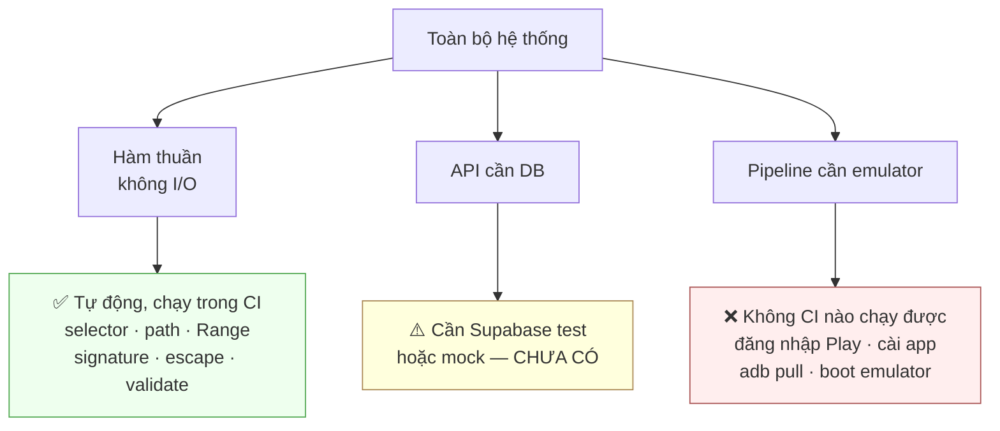

# Test cases

Cái gì được kiểm, cái gì không, và vì sao.

---

## 1. Hiện trạng

Ba file test, đặt **cạnh file nguồn**:

| File | Phạm vi |
|---|---|
| [apps/api/src/api.test.ts](../apps/api/src/api.test.ts) | API |
| [apps/worker/src/worker.test.ts](../apps/worker/src/worker.test.ts) | worker |
| [packages/contracts/src/contracts.test.ts](../packages/contracts/src/contracts.test.ts) | schema + selector |

Chạy bằng `node:test` qua `tsx`, và **typecheck chạy trước**:

```json
"test": "pnpm run typecheck && tsx --test src/**/*.test.ts"
```

```bash
pnpm test              # cả ba package
pnpm --filter api test  # một package
```

### Hai script hỏng

`package.json` khai hai script trỏ vào **`tests/test-endpoints/` — thư mục không tồn tại**:

```json
"test:endpoints": "tsx tests/test-endpoints/run.ts",
"download:artifacts": "tsx tests/test-endpoints/download-all.ts"
```

Chạy là lỗi ngay. Thư mục `tests/` chỉ có 10 thư mục rỗng và một file report. Phải viết bộ test đó hoặc bỏ script — xem [plan.md](plan.md).

---

## 2. Phân loại: tự động được và không



**Phần bắt buộc thủ công ở dự án này lớn hơn bình thường**, và phải nói thẳng: không CI nào đăng nhập Google Play, cài app qua UI automation, hay boot emulator có KVM được. Đừng đặt mục tiêu coverage cho vùng đó.

---

## 3. Hàm thuần — ưu tiên cao nhất

Chúng không cần server, không cần DB, chạy trong mili giây, và là nơi bug gây hậu quả nặng nhất (mất file, lộ đường dẫn, tải nhầm).

### 3.1. `selectorMatches()` — [contracts](../packages/contracts/src/index.ts)

| ID | Input | `select` | Mong đợi |
|---|---|---|---|
| SEL-01 | `base.apk` | `apk.base` | `true` |
| SEL-02 | `base.apk` | `apk` | `true` |
| SEL-03 | `base.apk` | `apk.splits` | `false` |
| SEL-04 | `split_config.arm64_v8a.apk` | `apk.splits` | `true` |
| SEL-05 | `split_config.arm64_v8a.apk` | `apk.base` | `false` |
| SEL-06 | `sub/split_config.x.apk` | `apk.splits` | `false` — regex cấm `/` |
| SEL-07 | `split_config.apk` | `apk.splits` | `false` — thiếu phần giữa |
| SEL-08 | `playstore/screenshots/screenshot_01.png` | `screenshots` | `true` |
| SEL-09 | `playstore/screenshots/` (đúng tiền tố, rỗng) | `screenshots` | `true` — chấp nhận, không có file như vậy |
| SEL-10 | `playstore/icon.png` | `screenshots` | `false` |
| SEL-11 | `playstore/description.md` | `listing` | `true` |
| SEL-12 | `playstore/page.html` | `listing` | `false` |
| SEL-13 | `playstore/page.html` | `listing.full` | `true` |
| SEL-14 | `playstore/icon.png` | `listing.full` | `true` — bao cả `listing` |
| SEL-15 | `PULL_MANIFEST.txt` | `metadata` | `true` |
| SEL-16 | bất kỳ | `all` | `true` |
| SEL-17 | `README.txt` (file lạ) | `metadata` | `false` |

**Bất biến phải giữ**: mọi file trong artifact chuẩn phải khớp `all`, và mỗi file phải khớp **ít nhất một** selector khác `all` — trừ file lạ. Viết thành một test lặp qua danh sách 18 file mẫu.

### 3.2. `selectorFor()`

| ID | Input | Mong đợi |
|---|---|---|
| SFO-01 | `base.apk` | `apk.base` — **không** phải `apk` |
| SFO-02 | `split_config.x.apk` | `apk.splits` |
| SFO-03 | `playstore/page.html` | `listing.full` — **không** phải `listing` |
| SFO-04 | `playstore/icon.png` | `listing` |
| SFO-05 | `README.txt` | `all` |

`selectorFor` **không** là nghịch đảo của `selectorMatches` — SFO-01 và SFO-03 chốt điều đó.

### 3.3. `normalizeEntryPath()` — chốt bảo mật

| ID | Input | Mong đợi |
|---|---|---|
| NEP-01 | `base.apk` | `base.apk` |
| NEP-02 | `playstore/screenshots/a.png` | giữ nguyên |
| NEP-03 | `playstore\screenshots\a.png` | đổi `\` → `/` |
| NEP-04 | `/etc/passwd` | `null` — tuyệt đối |
| NEP-05 | `../../etc/passwd` | `null` |
| NEP-06 | `a/../../b` | `null` — **normalize rồi so**, không tìm chuỗi `..` |
| NEP-07 | `..foo.apk` | `..foo.apk` — chứa `..` mà hợp lệ |
| NEP-08 | `a/./b.png` | `a/b.png` |
| NEP-09 | `.uploads.jsonl` | `null` — dotfile |
| NEP-10 | `a/.git/config` | `null` — dotfile ở tầng con |
| NEP-11 | `%zz` | `null` — `%`-encoding hỏng |
| NEP-12 | `a%00b` | `null` — null byte |
| NEP-13 | `` (rỗng) | `null` |
| NEP-14 | `.` | `null` |
| NEP-15 | `playstore%2Ficon.png` | `playstore/icon.png` — decode rồi mới kiểm |

**NEP-06 và NEP-07 là cặp quan trọng nhất.** Chúng chứng minh vì sao không được `indexOf('..')`.

### 3.4. `resolveEntry()`

| ID | Kịch bản | Mong đợi |
|---|---|---|
| RES-01 | `jobId` hợp lệ + path hợp lệ | đường dẫn tuyệt đối trong `ARTIFACT_DIR` |
| RES-02 | `jobId = "../../etc"` | **throw** — `jobArtifactDir` chặn |
| RES-03 | `jobId` chứa `/` | throw |
| RES-04 | path thoát ra sau khi resolve | `null` — chốt cuối |

### 3.5. `parseRange()` — [artifacts.router.ts](../apps/api/src/modules/artifacts/artifacts.router.ts)

Với `size = 1000`:

| ID | Header | Mong đợi |
|---|---|---|
| RNG-01 | (không có) | `null` |
| RNG-02 | `bytes=0-499` | `{0, 499}` |
| RNG-03 | `bytes=500-` | `{500, 999}` |
| RNG-04 | `bytes=-500` | `{500, 999}` — 500 byte cuối |
| RNG-05 | `bytes=0-9999` | `{0, 999}` — kẹp về cuối file |
| RNG-06 | `bytes=1000-1500` | `null` → **416** |
| RNG-07 | `bytes=500-100` | `null` — start > end |
| RNG-08 | `bytes=abc` | `null` |
| RNG-09 | `bytes=-0` | `null` — suffix 0 vô nghĩa |
| RNG-10 | `bytes=0-0` | `{0, 0}` — 1 byte |

### 3.6. `escapePostgrestValue()` / `ilikeContains()`

| ID | Input | Mong đợi |
|---|---|---|
| PGR-01 | `facemoji` | không đổi |
| PGR-02 | `100%` | `%` được escape thành `\%` |
| PGR-03 | `a_b` | `_` được escape |
| PGR-04 | `a"b` | `"` được escape |
| PGR-05 | `a\b` | `\` được nhân đôi |
| PGR-06 | `foo,title.eq.bar` | kết quả **bọc nháy**, không tách thành nhánh OR mới |
| PGR-07 | `100%\_x` | thứ tự escape đúng: `%`/`_` trước, `\` sau |

**PGR-07 chốt thứ tự.** Escape `\` trước sẽ làm những `\` sinh ra ở bước ILIKE không được nhân đôi và chết trên đường vào SQL.

### 3.7. `verifyDownloadUrlSignature()`

| ID | Kịch bản | Mong đợi |
|---|---|---|
| SIG-01 | chữ ký đúng, chưa hết hạn | `true` |
| SIG-02 | chữ ký đúng, `expires` quá khứ | `false` |
| SIG-03 | chữ ký sai cùng độ dài | `false` |
| SIG-04 | chữ ký khác độ dài | `false` — không throw |
| SIG-05 | chữ ký của artifactId khác | `false` |
| SIG-06 | `signature = ""` | `false` |

SIG-04 quan trọng: `timingSafeEqual` **ném lỗi** khi độ dài lệch. Thiếu kiểm độ dài thì endpoint trả 500 thay vì 403.

### 3.8. `isValidPackageId()`

| ID | Input | Mong đợi |
|---|---|---|
| PKG-01 | `com.zing.zalo` | `true` |
| PKG-02 | `com.a_b.c1` | `true` |
| PKG-03 | `com` | `false` — cần ≥ 1 dấu chấm |
| PKG-04 | `1com.app` | `false` — bắt đầu bằng số |
| PKG-05 | `com..app` | `false` |
| PKG-06 | `com.app;rm -rf /` | `false` — **chống command injection** |
| PKG-07 | `com.app` + 300 ký tự | `false` — quá 255 |
| PKG-08 | `null` / `undefined` / `""` | `false` |

### 3.9. `contentTypeFor()`

| ID | Input | Mong đợi |
|---|---|---|
| CTY-01 | `base.apk` | `application/vnd.android.package-archive` |
| CTY-02 | `icon.png` | `image/png` |
| CTY-03 | `page.html` | **`application/octet-stream`** — không phải `text/html` |
| CTY-04 | `device-dir.listing` | `text/plain; charset=utf-8` |
| CTY-05 | `x.unknown` | `application/octet-stream` |
| CTY-06 | `X.PNG` | `image/png` — không phân biệt hoa thường |

**CTY-03 là hồi quy có bằng chứng.** Xem commit `727a837` và [learn.md](learn.md).

### 3.10. Zod schema

| ID | Kịch bản | Mong đợi |
|---|---|---|
| ZOD-01 | `CreateJobRequest` chỉ có `playUrl` | pass, mặc định `includeListing=true`, `deleteAfterDownload=false` |
| ZOD-02 | `playUrl` không phải URL | fail |
| ZOD-03 | `DownloadUrlRequest` có cả `select` và `path` | fail — `.refine()` |
| ZOD-04 | chỉ `path` | pass (`select` mặc định `all`) |
| ZOD-05 | `select` ngoài 8 giá trị | fail |
| ZOD-06 | `JobQuery` `pageSize=101` | fail — max 100 |
| ZOD-07 | `JobQuery` `page="2"` (chuỗi) | pass → `2` (coerce) |
| ZOD-08 | `JobHeartbeat` `progress=101` | fail |
| ZOD-09 | `FinalizeArtifact` `fileCount=0` | fail — min 1 |
| ZOD-10 | `CreateBatchJobRequest` `urls=[]` | fail — min 1 |

---

## 4. API — cần DB hoặc mock

**Chưa có.** Danh sách dưới đây là thứ nên viết, xếp theo giá trị.

### 4.1. Xác thực

| ID | Request | Mong đợi |
|---|---|---|
| AUT-01 | `GET /v1/jobs` không header | `401 UNAUTHORIZED` |
| AUT-02 | `GET /v1/jobs` với `Basic xxx` | `401` |
| AUT-03 | `GET /v1/jobs` với `Bearer sai` | `403 FORBIDDEN` |
| AUT-04 | `GET /v1/jobs` với `WORKER_TOKEN` | `403` — **token chéo mặt phẳng** |
| AUT-05 | `POST /internal/v1/jobs/claim` với `API_TOKEN` | `403` — chiều ngược lại |
| AUT-06 | `GET /v1/health` không token | `200` |
| AUT-07 | token đúng + thừa khoảng trắng | `403` — không trim |

AUT-04/05 là cặp chốt hai mặt phẳng thật sự tách biệt.

### 4.2. Tạo job

| ID | Kịch bản | Mong đợi |
|---|---|---|
| JOB-01 | `playUrl` hợp lệ | `201`, `status=queued`, có job trong DB |
| JOB-02 | URL không có `?id=` | `400 INVALID_URL`, **không tạo job** |
| JOB-03 | `?id=1invalid` | `400 INVALID_URL` |
| JOB-04 | cùng `Idempotency-Key` gửi hai lần | lần 2 → `200` + **cùng jobId** |
| JOB-05 | `Idempotency-Key` khác nhau, URL giống | 2 job khác nhau |
| JOB-06 | batch có 3 URL, 1 sai | `201` với **2** job, không lỗi |
| JOB-07 | batch `urls: []` | `400` |
| JOB-08 | `deleteAfterDownload: true` | cột DB đúng `true` |

### 4.3. Chuyển trạng thái

| ID | Từ | Hành động | Mong đợi |
|---|---|---|---|
| STA-01 | `queued` | cancel | `cancelled` ngay |
| STA-02 | `running` | cancel | `cancelling` |
| STA-03 | `completed` | cancel | `400 INVALID_STATUS` |
| STA-04 | `cancelled` | cancel | `400` |
| STA-05 | `failed` | retry | `queued`, `attempt_count=0`, `error_*` = null |
| STA-06 | `completed` | retry | `400` |
| STA-07 | `running` → đổi giữa chừng | cancel | `409 STATUS_CHANGED` |
| STA-08 | job không tồn tại | cancel/retry | `404` |

**STA-07 khó test nhưng quan trọng nhất** — nó là chốt chống race condition đã mô tả ở [security.md §5.5](security.md). Mô phỏng bằng cách sửa status ngay giữa `SELECT` và `UPDATE`.

### 4.4. Upload

| ID | Kịch bản | Mong đợi |
|---|---|---|
| UPL-01 | job `running`, sha đúng | `200`, file trên đĩa, 1 dòng trong `.uploads.jsonl` |
| UPL-02 | job `completed` | `409 JOB_NOT_RUNNING` |
| UPL-03 | job không tồn tại | `404 JOB_NOT_FOUND` |
| UPL-04 | `X-Content-SHA256` lệch | `400 SHA256_MISMATCH` **và file bị xoá** |
| UPL-05 | path `../escape.txt` | `400 INVALID_PATH` |
| UPL-06 | path `/abs.txt` | `400` |
| UPL-07 | path `.hidden` | `400` |
| UPL-08 | `Content-Length` > đĩa trống | `507` |
| UPL-09 | stream đứt giữa chừng | `400 UPLOAD_INCOMPLETE` **và file bị xoá** |
| UPL-10 | upload lại cùng path, sha khác | `200`, bản sau thắng trong sổ |

UPL-04 và UPL-09 phải kiểm **cả việc file bị xoá**, không chỉ mã lỗi. Để lại file dở dang làm `fileCount` lúc finalize lệch.

### 4.5. Finalize

| ID | Kịch bản | Mong đợi |
|---|---|---|
| FIN-01 | đúng worker, đúng số file | `200`, `state=available`, `apk_expires_at` và `expires_at` được đặt |
| FIN-02 | `workerId` khác `jobs.worker_id` | `409 NOT_JOB_OWNER` |
| FIN-03 | job không `running` | `409 JOB_NOT_RUNNING` |
| FIN-04 | `fileCount` lệch đĩa | `400 FILE_COUNT_MISMATCH` |
| FIN-05 | có `.uploads.jsonl` trên đĩa | **không** đếm vào `fileCount`, không vào `files` |
| FIN-06 | finalize hai lần | upsert theo `job_id`, không tạo dòng thứ hai |

### 4.6. Tải

| ID | Kịch bản | Mong đợi |
|---|---|---|
| DL-01 | link hợp lệ, `select=all`, nhiều file | `200` ZIP, **không** `Content-Length` |
| DL-02 | `select` khớp đúng 1 file | `200` **file thô**, có `Content-Length`, không bọc ZIP |
| DL-03 | thiếu `expires` hoặc `signature` | `400` |
| DL-04 | chữ ký sai | `403 INVALID_SIGNATURE` |
| DL-05 | link hết hạn | `403` |
| DL-06 | `state=expired` | `410 ARTIFACT_GONE` |
| DL-07 | `state=preparing` | `410` |
| DL-08 | `select` khớp 0 file | `410 NOTHING_TO_SERVE` |
| DL-09 | `select=xyz` | `400 INVALID_SELECT` |
| DL-10 | `?path=a&path=b` | `400` |
| DL-11 | cả `path` và `select` | `400` |
| DL-12 | `Range: bytes=0-99` | `206`, `Content-Range`, đúng 100 byte |
| DL-13 | `Range` vượt kích thước | `416` + `Content-Range: bytes */size` |
| DL-14 | file đã bị xoá khỏi đĩa | `410 FILE_GONE` |
| DL-15 | `path` không có trong `files` | `400 INVALID_PATH` hoặc `410` |
| DL-16 | ZIP trả về | không chứa `.uploads.jsonl` |

### 4.7. `deleteAfterDownload`

| ID | Kịch bản | Mong đợi |
|---|---|---|
| DAD-01 | tải `select=listing` (không APK) | **không** hẹn xoá |
| DAD-02 | tải `select=apk.base`, `200`, đủ byte | hẹn xoá sau ân hạn |
| DAD-03 | tải APK bằng `Range` (`206`) | **không** hẹn xoá |
| DAD-04 | client ngắt giữa chừng | **không** hẹn xoá |
| DAD-05 | `delete_after_download=false` | **không** xoá dù tải đủ |
| DAD-06 | sau khi xoá | `state=partial`, `files` không còn APK, `size_bytes` tính lại |

**DAD-01 và DAD-03 là hai bug đắt nhất có thể xảy ra ở đây** — mất 140 MB APK mà client chưa nhận.

### 4.8. Dọn dẹp

| ID | Kịch bản | Mong đợi |
|---|---|---|
| CLN-01 | `apk_expires_at` quá hạn | APK bị xoá, `state=partial`, phần nhẹ còn |
| CLN-02 | `expires_at` quá hạn | cả thư mục bị xoá, `state=expired`, `files=[]` |
| CLN-03 | thư mục không có dòng DB, nguội > ngưỡng | bị xoá |
| CLN-04 | thư mục không có dòng DB, **còn mới** | **không** bị xoá |
| CLN-05 | thư mục có file con vừa ghi, mtime gốc cũ | **không** bị xoá — lấy mốc file mới nhất bên trong |
| CLN-06 | query DB lỗi | **không xoá gì cả** |
| CLN-07 | đĩa dưới ngưỡng | đuổi APK cũ nhất trước, dừng khi đủ chỗ |
| CLN-08 | mọi artifact đã `partial`, đĩa vẫn thấp | xoá hẳn cái cũ nhất |
| CLN-09 | job `cancelling` im lặng > grace | reaper → `cancelled` |
| CLN-10 | job `running` hết lượt, im lặng > grace | reaper → `failed`, `error_code=LEASE_EXPIRED` |
| CLN-11 | job `running` **còn lượt**, lease hết hạn | reaper **không đụng** — `claim_job` tự lấy lại |
| CLN-12 | job `running` chưa heartbeat lần nào | reaper lần ngược về `started_at`/`queued_at`, vẫn dọn được |
| CLN-13 | job đổi trạng thái giữa lúc reaper chạy | không ghi đè (`.eq('status', …)`) |

**CLN-04, CLN-05, CLN-06 là ba chốt an toàn** — hỏng một cái là xoá mất artifact hợp lệ. **CLN-11** chốt chiều ngược lại: reaper quá hăng thì cướp job còn sống.

### 4.9. `claim_job()` — test ở tầng SQL

| ID | Kịch bản | Mong đợi |
|---|---|---|
| CLM-01 | 1 job queued, 2 worker gọi đồng thời | đúng **một** worker nhận được |
| CLM-02 | job `running` lease hết hạn, còn lượt | claim được, `attempt_count++` |
| CLM-03 | job có `cancel_requested_at` | **không** claim |
| CLM-04 | job `attempt_count >= max_attempts` | **không** claim |
| CLM-05 | nhiều job, khác `priority` | lấy priority cao trước |
| CLM-06 | cùng priority | lấy `created_at` cũ nhất |
| CLM-07 | hàng đợi rỗng | trả rỗng, worker về `online`, `current_job_id=null` |
| CLM-08 | worker chưa tồn tại | tự tạo dòng trong `workers` |
| CLM-09 | claim thành công | có event `job.claimed` |

CLM-03 và CLM-04 chốt **lý do tồn tại** của `reapStuckJobs()`.

---

## 5. Thủ công — không tự động hoá được

Chạy tay khi đổi thứ liên quan hoặc trước khi phát hành.

| ID | Kịch bản | Cách kiểm |
|---|---|---|
| MAN-01 | Đăng nhập Google Play qua noVNC | `dumpsys account \| grep Accounts:` = 1 |
| MAN-02 | Emulator boot với KVM | `getprop sys.boot_completed` = 1 trong ~2 phút |
| MAN-03 | Emulator boot **không** KVM | boot được nhưng chậm; ghi lại thời gian thật |
| MAN-04 | Cài app qua Play UI automation | `pm path <pkg>` có `package:` |
| MAN-05 | App bị gỡ / khoá region | fail có mã lỗi rõ, không treo |
| MAN-06 | Pull đủ base + mọi split | so với `pm path` |
| MAN-07 | `base.apk` là ZIP hợp lệ | `unzip -l` thấy `AndroidManifest.xml` |
| MAN-08 | sha256 trong `PULL_MANIFEST.txt` khớp `/artifact/files` | so tay |
| MAN-09 | Job end-to-end | `POST /jobs` → `completed` trong ~60s |
| MAN-10 | Restart container giữa job | job được claim lại, hoàn thành |
| MAN-11 | Khôi phục lock AVD | xoá lock, emulator boot lại |
| MAN-12 | `page.html` tải về nguyên byte | sha256 khớp — **hồi quy CDN** |
| MAN-13 | Tunnel đổi URL sau restart | lấy URL mới bằng lệnh trong runbook |
| MAN-14 | Backup/restore volume `worker-avd` | restore xong `Accounts:` vẫn = 1 |

MAN-12 phải chạy **qua đường public thật** (Cloudflare/Caddy), không phải qua `127.0.0.1` — bug gốc chỉ xuất hiện khi có CDN ở giữa.

---

## 6. Mục tiêu coverage

Theo vùng, không đặt một con số toàn cục:

| Vùng | Mục tiêu | Vì sao |
|---|---|---|
| `packages/contracts` | **100% nhánh** | thuần, nhỏ, và là hợp đồng chung của cả hai bên |
| `utils/artifact-path.ts` | **100% nhánh** | chốt path traversal |
| `utils/signature.ts` | **100%** | chốt xác thực |
| `utils/postgrest.ts` | **100%** | chốt tiêm SQL |
| `utils/validation.ts` | **100%** | chốt command injection |
| `parseRange()` | 100% | dễ sai, dễ test |
| Router | nhánh lỗi chính | cần DB |
| `background/cleanup.ts` | ba chốt an toàn (CLN-04/05/06) + CLN-11 | hậu quả nặng nhất |
| `apps/worker/pipeline` | **không đặt mục tiêu** | cần emulator thật |

---

## 7. Bốn nhóm dễ bị bỏ sót

Dự án này có bốn vùng mà bug **im lặng** — không exception, không log, chỉ là kết quả sai:

**1. Xoá nhầm.** DAD-01, DAD-03, CLN-04, CLN-05, CLN-06. Hậu quả: mất dữ liệu vĩnh viễn, không có thông báo.

**2. Race condition.** STA-07, CLM-01, CLN-13. Chỉ xuất hiện dưới tải, và biểu hiện là "job báo đã huỷ nhưng emulator vẫn chạy".

**3. Phục vụ nhiều hơn thứ được hỏi.** DL-10 (`?path=a&path=b`), DL-16 (dotfile lọt vào ZIP). Im lặng đưa nhiều hơn thứ được hỏi là hành vi tệ nhất có thể.

**4. Toàn vẹn byte.** CTY-03, MAN-12. File tới nơi "thành công" nhưng nội dung đã bị sửa trên đường.
