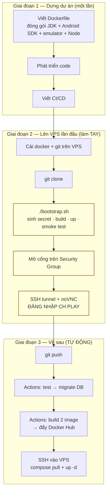

# Quy trình tổng quan — từ dựng dự án tới demo cho đối tác

Tài liệu định hướng. Trả lời câu hỏi *"toàn bộ việc này diễn ra theo thứ tự nào"*
chứ không đi vào chi tiết từng lệnh — chi tiết nằm ở
[deploy-vps.md](deploy-vps.md) và [CI-CD.md](CI-CD.md).

Viết ra vì bốn chỗ dưới đây rất dễ hiểu nhầm, và hiểu nhầm chỗ nào cũng làm mất
vài tiếng.

---

## 1. Bốn hiểu nhầm thường gặp

### 1.1. "CI/CD sẽ build trên VPS"

**Không.** Có **hai đường build khác nhau**, dùng ở hai thời điểm khác nhau:

| | Build ở đâu | Dùng khi | Mất bao lâu |
|---|---|---|---|
| `deploy/bootstrap.sh` | **trên VPS** | dựng máy lần đầu | 30–40 phút |
| GitHub Actions | **trên runner của GitHub** | mọi lần `git push` sau đó | VPS chỉ mất ~1 phút |

CI build image xong thì đẩy lên Docker Hub, rồi SSH vào VPS chỉ để
`docker compose pull` + `up -d`. **VPS không build lại.**

Lý do: image worker nặng ~9 GB (JDK + Android SDK + system image). Bắt VPS build
lại mỗi lần push thì mỗi lần deploy mất 30–40 phút và ăn hết CPU của chính máy
đang chạy emulator.

### 1.2. "Viết CI/CD xong là deploy được luôn"

**Không.** CI **không** sinh secret. Nó cần `deploy/.env`, `deploy/.env.api`,
`deploy/.env.worker` **đã có sẵn trên VPS** — mà ba file đó nằm trong
`.gitignore`, chỉ `bootstrap.sh` sinh ra.

Thứ tự bắt buộc: **chạy `bootstrap.sh` tay một lần trước → CI mới tiếp quản được.**

Job `deploy-to-vps` cũng dựa vào `COMPOSE_FILE` trong `deploy/.env` để biết máy
đích có KVM hay không, có chạy Supabase self-host hay không. Chưa bootstrap thì
biến đó không tồn tại và CI sẽ chạy sai cấu hình.

### 1.3. "Chạy `docker run` để khởi động chương trình"

**Không.** `./bootstrap.sh` lo trọn gói: kiểm tra máy → sinh secret → build 2
image → `docker compose up -d` → chờ healthy → smoke test → in `API_TOKEN`.

Từ đó về sau, mọi thao tác là `docker compose ...`, không bao giờ `docker run`.

### 1.4. "Deploy xong là cổng API mở sẵn"

**Không.** `bootstrap.sh` chỉ **kiểm tra** cổng còn trống, nó không mở firewall —
mở cổng là quyết định của người quản trị máy.

Đây là bước hay quên nhất: stack chạy hoàn hảo, `curl` **bên trong** VPS ra kết
quả, mà gọi từ ngoài thì im lặng. Phải vào **FPT Cloud console → VM → Security
Group** mở cổng, và kiểm tra `ufw status` trên host.

---

## 2. Quy trình đầy đủ



Ba ô vàng là việc phải làm tay. Mọi thứ còn lại tự động.

### Giai đoạn 1 — dựng dự án

| Bước | Nội dung |
|---|---|
| 1 | Viết `apps/api/Dockerfile` và `apps/worker/Dockerfile`. Worker image gói sẵn JDK 17, Android SDK, emulator, system image `android-35;google_apis_playstore;x86_64`, Xvfb, noVNC, supervisor |
| 2 | Phát triển code |
| 3 | Viết `.github/workflows/ci.yml` |

### Giai đoạn 2 — lên VPS lần đầu, làm tay

| Bước | Lệnh / thao tác |
|---|---|
| 4 | `curl -fsSL https://get.docker.com \| sh` rồi `apt-get install -y git` |
| 5 | `git clone <repo> /root/app-relay` — repo private thì cần deploy key SSH hoặc token, xem [deploy-vps.md §2](deploy-vps.md) |
| 6 | `cd /root/app-relay/deploy && ./bootstrap.sh --http-only` |
| 7 | Mở cổng trên FPT Cloud Security Group (3000 nếu HTTP trần, hoặc 80+443 nếu dùng domain) |
| 8 | `ssh -N -L 6080:127.0.0.1:6080 root@<IP>` rồi mở noVNC, **đăng nhập Google Play** |

### Giai đoạn 3 — từ đó về sau

Chỉ còn `git push`. Pipeline làm phần còn lại: test → migrate database → build 2
image → đẩy Docker Hub → SSH vào VPS → `pull` + `up -d`.

Chi tiết 4 job và các khoảng trống đã biết: [CI-CD.md](CI-CD.md).

---

## 3. Cái gì nằm trong image, cái gì nằm ngoài

Chỗ này hay nhầm nhất khi nói "đóng gói emulator vào Docker".

| Thứ | Nằm ở đâu | Mất khi nào |
|---|---|---|
| JDK, Android SDK, emulator, system image | **trong image** | không bao giờ — build lại là có |
| Node, pnpm, code đã compile | **trong image** | không bao giờ |
| AVD `chpay` (máy ảo cụ thể) | volume `worker-avd` | `docker compose down -v` |
| **Phiên đăng nhập Google Play** | volume `worker-avd` | `docker compose down -v` |
| APK worker đang xử lý | volume `worker-work` | `down -v` |
| ZIP chờ tải về | volume `api-artifacts` | `down -v` |
| Database (Postgres self-host) | volume `supabase-db` | `down -v` |
| File compose, Caddyfile, migration | **trên đĩa VPS**, bind-mount | `rm -rf` thư mục repo |
| Secret (`.env*`) | **trên đĩa VPS**, gitignore | xoá file |

Ba hệ quả:

**a.** Đăng nhập CH Play chỉ làm **một lần**. Restart container, build lại image,
deploy phiên bản mới — đều không mất.

**b.** `docker compose down -v` xoá sạch volume: mất phiên CH Play, mất database,
mất artifact. **Không bao giờ chạy lệnh này.** `down` không có `-v` thì an toàn.

**c.** File cấu hình **không** nằm trong image là cố ý. Sửa một dòng `Caddyfile`
mà phải build lại 9 GB thì không ai chịu nổi.

---

## 4. Vì sao phải `git clone` chứ không chỉ pull image

Câu hỏi hợp lý: đã có image trên Docker Hub rồi, sao VPS còn cần code?

Vì những thứ này **cố ý không nằm trong image**, chúng được bind-mount từ đĩa VPS:

| File | Ai đọc |
|---|---|
| `deploy/compose*.yaml` | chính `docker compose` |
| `deploy/caddy/Caddyfile` | container caddy |
| `deploy/supabase-local/*.sh`, `*.sql` | container db lúc khởi tạo |
| `supabase/migrations/*.sql` | container db lúc khởi tạo |
| `deploy/bootstrap.sh` | chính bạn |

Không có repo trên VPS thì không có gì để `docker compose` đọc, và database dựng
lên sẽ rỗng — không role, không bảng.

---

## 5. Kết quả cuối cùng

Sau bước 8:

```
API         http://<IP-VPS>:3000        (chế độ --http-only)
            https://api.tenmien.com     (chế độ có domain)
API_TOKEN   apr_live_xxxxx...
```

Gọi thử:

```bash
curl http://<IP-VPS>:3000/v1/health

curl -H "Authorization: Bearer $API_TOKEN" \
  http://<IP-VPS>:3000/v1/system/status

curl -X POST -H "Authorization: Bearer $API_TOKEN" -H "Content-Type: application/json" \
  -d '{"playUrl":"https://play.google.com/store/apps/details?id=com.google.android.calculator"}' \
  http://<IP-VPS>:3000/v1/jobs
```

Đặc tả 23 endpoint: [api-design.md](api-design.md). Kịch bản dùng thật:
[api-prototype.md](api-prototype.md).

### Trước khi đưa cho đối tác dùng thật

Chế độ `--http-only` chấp nhận được để **tự kiểm tra** và demo nội bộ. Nhưng
`API_TOKEN` đi qua Internet dưới dạng chữ đọc được — ai chen được vào đường
truyền đều lấy được token và gọi API thay bạn.

Trước khi giao địa chỉ cho bên ngoài, làm [deploy-vps.md §8](deploy-vps.md):

1. Trỏ domain về IP VPS
2. Sửa ba dòng trong `deploy/.env`
3. Bỏ `compose.http.yaml` khỏi `COMPOSE_FILE`
4. `docker compose up -d` — Caddy tự xin cert Let's Encrypt
5. Đóng cổng 3000 trên firewall
6. **Đổi `API_TOKEN`** — token cũ đã đi qua HTTP trần thì coi như đã lộ

Không build lại, không mất dữ liệu, không phải đăng nhập CH Play lại.

Checklist đầy đủ trước khi mở public: [security.md §10](security.md).

---

## 6. Quy trình này chuyên nghiệp tới đâu

Đánh giá thẳng, để sau này đọc lại còn biết mình đang đứng ở đâu.

**Kết luận: đúng chuẩn ở tầm một VPS, thiếu ở tầm production thật.**

Đây là cách một team nhỏ hoặc solo dev làm, và nó hợp lệ — không phải làm ẩu.
Nhưng nó chưa phải thứ một công ty có người trực 24/7 sẽ chạy.

### 6.1. Đang làm đúng chuẩn

| Thứ | Vì sao là chuẩn |
|---|---|
| CI build image → đẩy registry → máy đích chỉ pull | Pattern chủ đạo của cả ngành. Không ai build trên máy production |
| Multi-stage build, prune devDeps, chạy non-root | Chuẩn Docker cơ bản |
| Tag image theo `github.sha` | **Toàn bộ cơ chế rollback nằm ở đây.** Nhiều nơi chỉ dùng `latest` rồi không lùi được |
| Secret không nằm trong image, không nằm trong git | Chuẩn |
| Reverse proxy tự cấp TLS (Caddy) | Cách hiện đại, thay cho nginx + certbot cron |
| Healthcheck + `depends_on: service_healthy` | Ops cơ bản mà rất hay bị bỏ |
| Xoay log, `stop_grace_period` | Thứ chỉ người từng bị đầy đĩa lúc 2 giờ sáng mới nhớ thêm |
| Migration có sổ + checksum | Tốt hơn mức trung bình |

### 6.2. Thiếu so với production thật

| Thiếu | Hậu quả | Chuẩn ngành |
|---|---|---|
| **Không có staging** | Push lên `main` là vào thẳng production. Sai là người dùng chịu | staging → duyệt → production |
| **Không có monitoring / alert** | Container chết lúc 3 giờ sáng, sáng mai mới biết | uptime check + Sentry + Grafana |
| **Không backup tự động** | Tài liệu có hướng dẫn, nhưng không ai chạy thì vẫn bằng không | cron + lưu ra ngoài máy |
| **Không có branch protection** | Push thẳng `main`, không cần review | bắt buộc PR + status check |
| **Không smoke test sau deploy** | `up -d` xong là báo "✅ deployed" kể cả khi container crash-loop | curl `/health` sau deploy |
| **Không quét secret / CVE** | Dựa hoàn toàn vào `.gitignore` | gitleaks + Dependabot |
| **Provision bằng shell script** | `bootstrap.sh` chạy tay, không tái lập máy thứ hai một cách chắc chắn | Ansible / Terraform |
| **Secret sinh trên máy** | Mất VPS là mất secret | Vault / SOPS / Doppler |

Phần lớn đã ghi sẵn ở [CI-CD.md §5–6](CI-CD.md) — nhưng ghi trong tài liệu khác
với đã làm.

### 6.3. Ba chỗ là đánh đổi CHỦ ĐỘNG, không phải lỗi thiết kế

**a. Postgres self-host cùng máy.** Chọn vì muốn "đóng gói đầy đủ, VPS clean".
Đổi lại: mất VPS là mất database, backup là việc của mình, không có HA. Chuẩn
ngành cho production là DB managed (Supabase Cloud, Neon, RDS) — họ lo backup và
replica.

**b. HTTP trần (`--http-only`).** Chọn để test trước khi có domain. Đây là
**downgrade có ý thức**, đường quay lại HTTPS nằm ở [deploy-vps.md §8](deploy-vps.md).

**c. Đăng nhập CH Play bằng tay qua VNC.** Không phải chuẩn ngành, nhưng cũng
không có cách chuẩn nào — Google Play bắt buộc phiên đăng nhập thật. Đây là ràng
buộc của **bài toán**, không phải của quy trình.

### 6.4. Điểm yếu lớn nhất: emulator không scale ngang

Nói thẳng: chạy Android emulator trên VPS là chỗ mong manh nhất của kiến trúc
này. Một emulator = một job tại một thời điểm. Muốn tăng công suất phải thêm VPS,
mà **mỗi VPS lại cần đăng nhập CH Play riêng bằng tay**.

Đây là giới hạn thật, không sửa được bằng quy trình tốt hơn. Ai định mở rộng phải
tính từ đầu.

### 6.5. Nâng cấp tiếp thì làm 3 thứ này trước

Xếp theo tỉ lệ *giá trị / công sức*:

| # | Việc | Công sức | Chặn được gì |
|---|---|---|---|
| 1 | **Smoke test sau deploy** | 3 dòng vào `ci.yml` | Loại lỗi tệ nhất: "báo xanh nhưng chết" |
| 2 | **Backup database tự động** | cron `pg_dump` + đẩy ra ngoài máy | Rủi ro mất trắng dữ liệu |
| 3 | **Uptime check** | UptimeRobot miễn phí, gọi `/v1/health` mỗi 5 phút | Chết mà không ai biết |

Ba cái này khoảng một buổi. **Staging và Ansible đắt hơn nhiều** — để sau khi có
người dùng thật rồi tính, làm sớm là tối ưu hoá non.

---

## 7. Đọc tiếp gì

| Cần gì | File |
|---|---|
| Từng lệnh cụ thể để deploy | [deploy-vps.md](deploy-vps.md) |
| Pipeline 4 job hoạt động ra sao | [CI-CD.md](CI-CD.md) |
| Bảng đầy đủ biến môi trường | [environment.md](environment.md) |
| Hệ thống chia thành gì, vì sao | [architecture.md](architecture.md) |
| Khi có sự cố | [runbook.md](runbook.md) |
| Checklist trước khi mở public | [security.md](security.md) |
