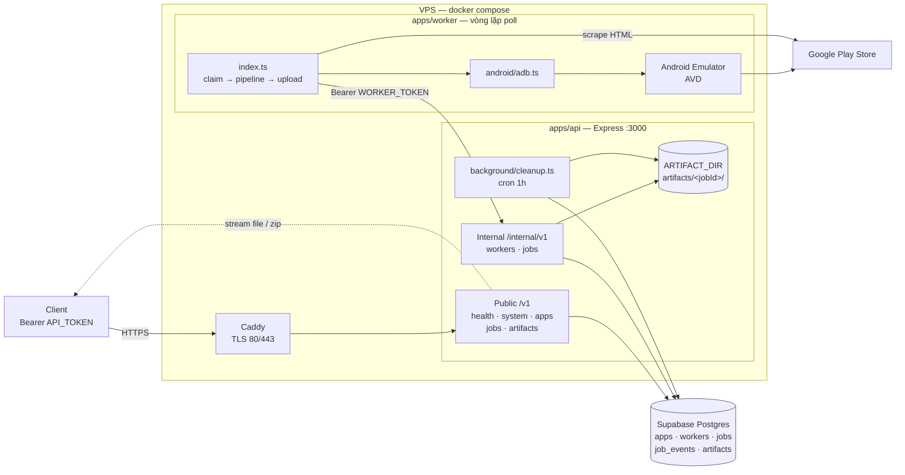
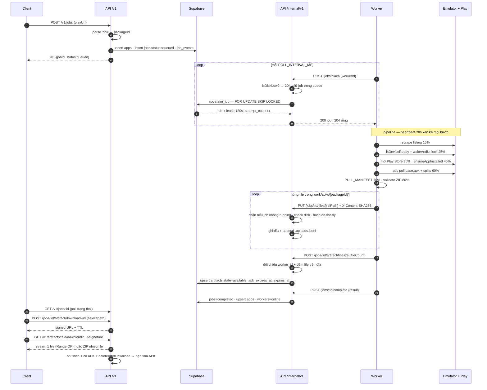
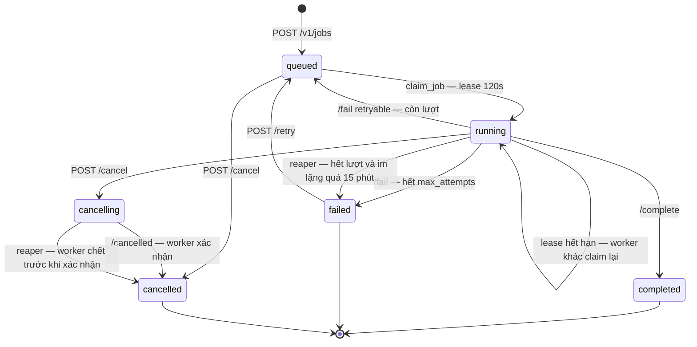
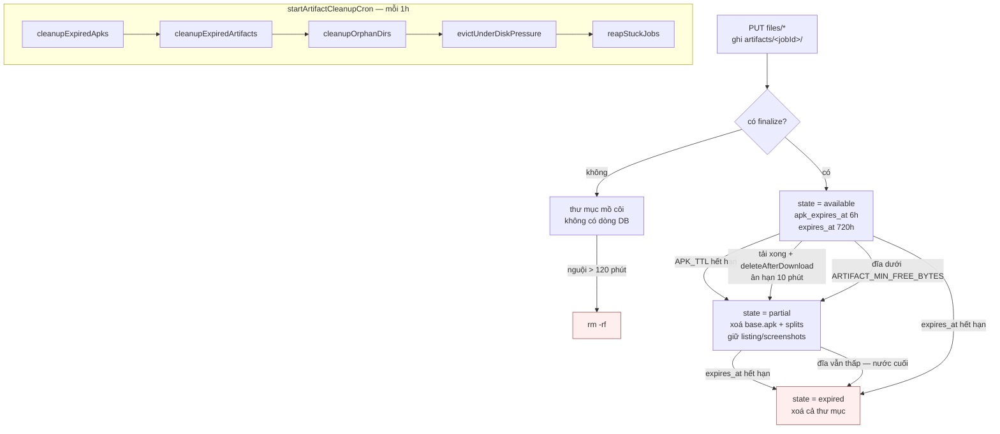
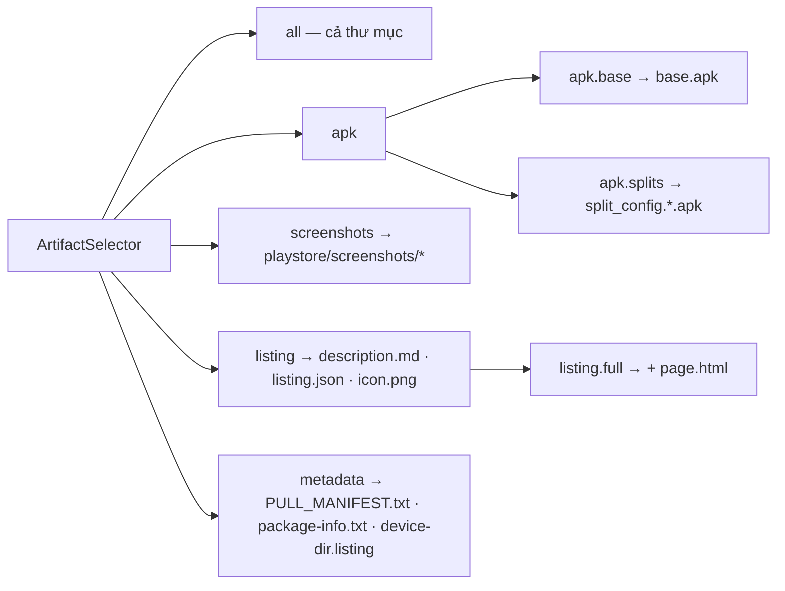

# Kiến trúc app-relay — sơ đồ tổng quan

Monorepo pnpm: `apps/api` (Express + Supabase), `apps/worker` (Android emulator + adb),
`packages/contracts` (zod schema dùng chung cả hai phía).

---

## 1. Tổng quan hệ thống

**Hai mặt phẳng token tách biệt** ([auth.ts](../apps/api/src/middleware/auth.ts)):
`API_TOKEN` cho `/v1`, `WORKER_TOKEN` cho `/internal/v1`, so sánh constant-time.
Riêng `GET /v1/artifacts/:id/download` **không cần token** — link đã mang
`expires` + `signature` HMAC.

---

## 2. Luồng chạy end-to-end của một job

**Heartbeat 2 tầng**: worker-level (`/workers/heartbeat`, 20s) báo emulator sống;
job-level (`/jobs/:id/heartbeat`) gia hạn lease + nhận cờ `cancelRequested` —
worker kiểm tra cờ này giữa các bước để dừng sớm.

---

## 3. State machine của job

`reapStuckJobs()` tồn tại vì `claim_job` bỏ qua job có `cancel_requested_at`
hoặc đã hết `max_attempts` — hai loại đó sẽ nằm lại vĩnh viễn nếu không có reaper.

---

## 4. Vòng đời artifact & dọn đĩa

APK chiếm ~98% dung lượng nên có TTL riêng, ngắn hơn hẳn phần còn lại —
xoá APK trước, giữ metadata để client vẫn tra được.

---

## 5. Selector — client hỏi theo ý nghĩa, không theo tên file

Định nghĩa ở [contracts/src/index.ts](../packages/contracts/src/index.ts) —
`selectorMatches()` dùng chung cho cả `download-url` (lọc trước, báo 404 sớm)
và `/download` (lọc lại lúc stream). Đúng 1 file khớp thì trả thô, nhiều file thì
zip stream, không có `Content-Length`.
