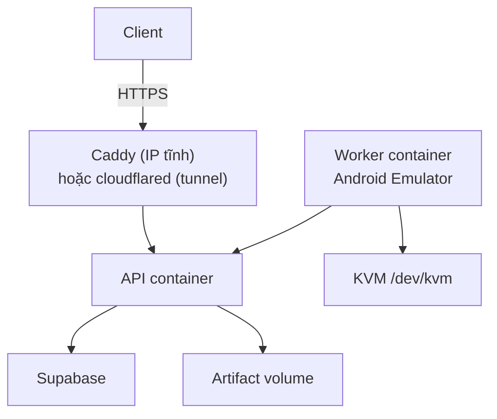

Vậy JDK và Android SDK không cài trực tiếp trên VPS theo kiểu thủ công nữa. Chúng được đóng sẵn vào Docker image của worker.

API, worker và reverse proxy chạy thành container riêng.

## Kiến trúc deploy



* Client chỉ truy cập API.
* Worker giao tiếp nội bộ với API.
* Chỉ worker chứa JDK, Android SDK, emulator và system image.
* API container không chứa Android SDK.
* Supabase chạy bên ngoài VPS.

## Cấu trúc dự án cập nhật

```text
app-relay/
├── apps/
│   ├── api/
│   │   ├── src/
│   │   │   ├── server.ts
│   │   │   ├── app.ts
│   │   │   ├── modules/
│   │   │   ├── internal/
│   │   │   ├── database/
│   │   │   └── background/
│   │   ├── Dockerfile
│   │   └── package.json
│   │
│   └── worker/
│       ├── src/
│       │   ├── index.ts
│       │   ├── pipeline/
│       │   ├── android/
│       │   └── relay-api/
│       │
│       ├── docker/
│       │   ├── entrypoint.sh
│       │   ├── create-avd.sh
│       │   └── wait-for-emulator.sh
│       │
│       ├── work/
│       │   └── apks/
│       ├── Dockerfile
│       └── package.json
│
├── packages/
│   └── contracts/
│
├── supabase/
│   └── migrations/
│
├── deploy/
│   ├── compose.yml
│   ├── compose.kvm.yaml          # thêm /dev/kvm cho worker
│   ├── compose.supabase.yaml     # Supabase self-host local
│   ├── compose.tunnel.yaml       # Cloudflare Tunnel
│   ├── .env.example
│   ├── supabase-local/
│   └── caddy/
│       └── Caddyfile
│
├── pnpm-workspace.yaml
└── package.json
```

Các file `compose.*.yaml` là lớp phủ, chồng lên `compose.yml` bằng nhiều cờ `-f`. Chỉ bật đúng thứ môi trường đó cần.

## JDK và Android SDK nằm ở đâu?

Bên trong worker Docker image:

```text
Worker container
├── /opt/java/openjdk/             # JDK 17
├── /opt/android-sdk/              # Android SDK
│   ├── platform-tools/
│   │   └── adb
│   ├── emulator/
│   │   └── emulator
│   ├── cmdline-tools/
│   ├── platforms/
│   └── system-images/
│
├── /home/worker/.android/
│   └── avd/
│       ├── chpay.ini
│       └── chpay.avd/             # Nằm trên Docker volume
│
└── /app/
    └── apps/worker/               # Source worker
```

Phân biệt:

| Thành phần           | Nơi lưu                         |
| -------------------- | ------------------------------- |
| JDK                  | Worker Docker image             |
| Android SDK          | Worker Docker image             |
| Emulator binary      | Worker Docker image             |
| Android system image | Worker Docker image             |
| AVD `chpay`          | Docker volume                   |
| Google Play login    | Nằm trong AVD volume            |
| APK đang xử lý       | Worker work volume              |
| Thư mục artifact     | Upload sang API artifact volume |

JDK và SDK không cần volume. Khi muốn nâng phiên bản, rebuild image.

AVD bắt buộc dùng volume, nếu không mỗi lần recreate container sẽ mất emulator và tài khoản Google Play.

## Docker Compose

`deploy/compose.yml`:

```yaml
services:
  api:
    build:
      context: ..
      dockerfile: apps/api/Dockerfile

    restart: unless-stopped

    env_file:
      - .env.api

    expose:
      - "3000"

    volumes:
      - api-artifacts:/data/artifacts

    networks:
      - app-relay

  worker:
    build:
      context: ..
      dockerfile: apps/worker/Dockerfile

    restart: unless-stopped

    env_file:
      - .env.worker

    depends_on:
      - api

    devices:
      - /dev/kvm:/dev/kvm

    group_add:
      - "${KVM_GID}"

    shm_size: "2gb"

    volumes:
      - worker-avd:/home/worker/.android
      - worker-work:/app/apps/worker/work

    networks:
      - app-relay

  caddy:
    image: caddy:2

    restart: unless-stopped

    ports:
      - "80:80"
      - "443:443"

    volumes:
      - ./caddy/Caddyfile:/etc/caddy/Caddyfile:ro
      - caddy-data:/data
      - caddy-config:/config

    depends_on:
      - api

    networks:
      - app-relay

volumes:
  api-artifacts:
  worker-avd:
  worker-work:
  caddy-data:
  caddy-config:

networks:
  app-relay:
```

## Biến môi trường API

`deploy/.env.api`:

```env
NODE_ENV=production
PORT=3000

API_TOKEN=apr_live_xxxxx
WORKER_TOKEN=worker_live_xxxxx

SUPABASE_URL=https://xxxxx.supabase.co
SUPABASE_SECRET_KEY=sb_secret_xxxxx

ARTIFACT_DIR=/data/artifacts

# APK chiếm 98% dung lượng nên hết hạn sớm hơn hẳn phần còn lại.
APK_TTL_HOURS=6
ARTIFACT_TTL_HOURS=720

# Dưới ngưỡng này thì đuổi artifact cũ và ngừng giao job mới cho worker.
ARTIFACT_MIN_FREE_BYTES=10737418240
ORPHAN_DIR_MIN_AGE_MINUTES=120
DELETE_AFTER_DOWNLOAD_GRACE_MINUTES=10

DOWNLOAD_SIGNING_SECRET=xxxxx
DOWNLOAD_URL_TTL_SECONDS=600
```

## Biến môi trường dùng chung

`deploy/.env` — compose đọc để thay biến, không phải biến của ứng dụng:

```env
# Lấy bằng: getent group kvm | cut -d: -f3
KVM_GID=993

# Chỉ khi dùng Supabase self-host local
POSTGRES_PASSWORD=xxxxx
AUTHENTICATOR_PASSWORD=xxxxx
JWT_SECRET=xxxxx

# Chỉ khi dùng named tunnel (xem public_access.md)
CLOUDFLARE_TUNNEL_TOKEN=eyJhIjoi...

# Chỉ khi dùng Caddy trên VPS có IP tĩnh
DOMAIN=api.tenmiencuamay.com
CADDY_EMAIL=admin@tenmiencuamay.com
```

## Biến môi trường worker

`deploy/.env.worker`:

```env
NODE_ENV=production

WORKER_ID=worker_vps_01
WORKER_NAME=VPS Worker 01

RELAY_API_URL=http://api:3000/internal/v1
WORKER_TOKEN=worker_live_xxxxx

JAVA_HOME=/opt/java/openjdk
ANDROID_SDK_ROOT=/opt/android-sdk
ANDROID_AVD_HOME=/home/worker/.android/avd

ADB_PATH=/opt/android-sdk/platform-tools/adb
EMULATOR_PATH=/opt/android-sdk/emulator/emulator

ANDROID_AVD=chpay
WORK_DIR=/app/apps/worker/work

POLL_INTERVAL_MS=5000
HEARTBEAT_INTERVAL_MS=20000
```

Worker gọi API qua Docker network:

```text
http://api:3000/internal/v1
```

Không gọi qua domain public nên nhanh hơn và không đi ra Internet.

## Worker Dockerfile

Ý tưởng chính của `apps/worker/Dockerfile`:

```dockerfile
FROM eclipse-temurin:17-jdk-jammy

ENV ANDROID_SDK_ROOT=/opt/android-sdk
ENV JAVA_HOME=/opt/java/openjdk

ENV PATH="${JAVA_HOME}/bin:${ANDROID_SDK_ROOT}/cmdline-tools/latest/bin:${ANDROID_SDK_ROOT}/platform-tools:${ANDROID_SDK_ROOT}/emulator:${PATH}"

# Cài:
# - Node.js
# - Android command-line tools
# - platform-tools
# - emulator
# - system image x86_64 có Google Play
# - thư viện Linux mà emulator cần

WORKDIR /app

COPY . .

RUN corepack enable
RUN pnpm install --frozen-lockfile
RUN pnpm --filter worker build

ENTRYPOINT ["/app/apps/worker/docker/entrypoint.sh"]
```

Nên pin phiên bản Android system image trong Dockerfile:

```text
system-images;android-35;google_apis_playstore;x86_64
```

Không dùng `latest`, vì một lần rebuild có thể làm emulator thay đổi ngoài ý muốn.

## Entrypoint của worker

Khi container khởi động:

```text
1. Kiểm tra /home/worker/.android/avd/chpay.avd
2. Nếu chưa có → chạy create-avd.sh
3. Khởi động emulator
4. Chờ sys.boot_completed=1
5. Kiểm tra Play Store
6. Khởi động Node worker
7. Worker bắt đầu claim task
```

Emulator có thể chạy headless:

```bash
emulator \
  -avd chpay \
  -no-window \
  -no-audio \
  -no-boot-anim \
  -gpu swiftshader_indirect \
  -no-snapshot-save
```

## Điều kiện cực kỳ quan trọng của VPS

VPS phải có KVM và expose `/dev/kvm` cho Docker. Android Emulator x86/x86_64 trên Linux dựa vào KVM để tăng tốc. [Android Emulator acceleration](https://developer.android.com/studio/run/emulator-acceleration)

Kiểm tra trước khi deploy:

```bash
egrep -c '(vmx|svm)' /proc/cpuinfo
ls -la /dev/kvm
```

Kết quả cần có:

```text
/dev/kvm
```

Có thể kiểm tra tiếp:

```bash
sudo apt-get install -y cpu-checker
sudo kvm-ok
```

Kết quả mong muốn:

```text
INFO: /dev/kvm exists
KVM acceleration can be used
```

Nếu VPS không có `/dev/kvm`:

* Emulator có thể không chạy.
* Hoặc chạy cực kỳ chậm với software emulation.
* Dockerfile đúng cũng không giải quyết được.
* Phải đổi VPS hỗ trợ nested virtualization/KVM hoặc dùng dedicated server.

Android cũng xác nhận accelerated emulation trên Linux dựa vào KVM. [Emulator command line](https://developer.android.com/studio/run/emulator-commandline)

## Đăng nhập Google Play lần đầu

Đây là phần cần xử lý riêng:

1. Tạo AVD có image `google_apis_playstore`.
2. Khởi động worker container ở chế độ có VNC/noVNC.
3. Mở trình duyệt và đăng nhập Google Play một lần.
4. Dừng container.
5. Giữ nguyên volume `worker-avd`.
6. Những lần sau chạy headless.

Không chạy:

```bash
docker compose down -v
```

Lệnh đó xóa volume và có thể làm mất AVD cùng tài khoản Play Store.

Dùng:

```bash
docker compose down
docker compose up -d
```

Kết luận: JDK và Android SDK nằm trong worker image; AVD và đăng nhập Play Store nằm trong volume; API chạy container riêng; VPS bắt buộc hỗ trợ KVM.
