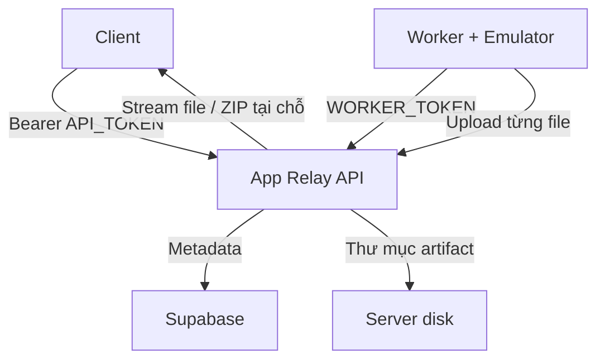

Chốt thiết kế phù hợp nhất:

* Supabase chỉ lưu trạng thái job, metadata app, worker và timeline.
* Không lưu APK, ZIP, icon hoặc screenshot trong Supabase.
* Worker gửi ZIP về ổ đĩa của API server.
* API server stream ZIP cho người gọi qua link có hạn.
* Không cần Supabase Auth hay bảng tài khoản.
* Worker không cần cầm khóa Supabase; mọi thứ đi qua API server.

## 1. URL và KEY là gì?

Hai biến client sử dụng:

```env
BASE=https://api.tenmiencuamay.com/v1
TOKEN=apr_live_mot_chuoi_ngau_nhien_dai
```

Khi chạy local:

```env
BASE=http://localhost:3000/v1
TOKEN=apr_dev_123456
```

Đây không phải URL và key của Supabase.

API server mới giữ:

```env
SUPABASE_URL=https://<project-ref>.supabase.co
SUPABASE_SECRET_KEY=sb_secret_xxxxxxxxx
API_TOKEN=apr_live_xxxxxxxxx
WORKER_TOKEN=worker_live_xxxxxxxxx
ARTIFACT_DIR=/data/app-relay/artifacts
DOWNLOAD_SIGNING_SECRET=xxxxxxxxx
```

Hiện tại nên dùng `sb_secret_...`, không nên bắt đầu dự án mới bằng legacy `service_role`; Supabase dự kiến ngừng legacy key vào cuối năm 2026. Secret key chỉ nằm trên API server. [Supabase API keys](https://supabase.com/docs/guides/getting-started/api-keys)

Luồng hệ thống:



## 2. Database nên có 5 bảng

### `jobs`

Nguồn dữ liệu chính của hệ thống task:

* URL Play Store.
* Package ID.
* Trạng thái.
* Worker đang chạy.
* Lease và heartbeat.
* Tiến độ.
* Lỗi.
* Kết quả tóm tắt.

### `job_events`

Timeline chi tiết:

* `job.queued`
* `job.claimed`
* `listing.scraped`
* `emulator.started`
* `play.installing`
* `apk.pulled`
* `artifact.ready`
* `job.failed`
* `job.cancelled`

Không ghi APK, HTML lớn hoặc ảnh vào `data`.

### `workers`

Theo dõi fleet:

* Worker nào online.
* Worker đang chạy job nào.
* Phiên bản worker.
* Heartbeat gần nhất.
* Emulator/device/capabilities.

### `apps`

Danh sách app đã kéo thành công:

* Package ID.
* Title, developer, version.
* Rating, installs.
* Description/listing metadata.
* Kích thước APK, số split, số screenshot.
* Job thành công gần nhất.

Có thể lưu URL ảnh gốc trên Google Play, nhưng không lưu binary ảnh.

### `artifacts`

Chỉ lưu metadata của thư mục artifact:

* Tên gọi (dùng để đặt tên file ZIP khi client tải cả cục).
* Tổng dung lượng.
* Danh sách file kèm SHA-256 từng file.
* File nằm ở server nào.
* Mã locator nội bộ.
* Thời điểm hết hạn của APK và của cả thư mục.

Không có SHA-256 cho "cả cục", vì ZIP sinh tại chỗ nên mỗi lần một khác. Tính toàn vẹn kiểm theo từng file.

## 3. SQL schema

Chạy trong Supabase SQL Editor:

```sql
create extension if not exists pgcrypto;

create table public.apps (
  package_id text primary key,
  play_url text not null,

  title text,
  developer text,
  version_name text,
  version_code bigint,
  rating numeric(3, 2),
  installs_text text,
  description text,
  listing_metadata jsonb not null default '{}'::jsonb,

  screenshot_count integer not null default 0,
  split_count integer not null default 0,
  base_apk_size_bytes bigint,
  artifact_size_bytes bigint,

  last_successful_job_id text,
  first_seen_at timestamptz not null default now(),
  last_pulled_at timestamptz,
  updated_at timestamptz not null default now()
);

create table public.workers (
  id text primary key,
  name text,

  status text not null default 'online'
    check (status in ('online', 'busy', 'draining')),

  current_job_id text,
  version text,
  capabilities jsonb not null default '{}'::jsonb,
  host_info jsonb not null default '{}'::jsonb,
  stats jsonb not null default '{}'::jsonb,

  last_heartbeat_at timestamptz not null default now(),
  created_at timestamptz not null default now(),
  updated_at timestamptz not null default now()
);

create table public.jobs (
  id text primary key,
  batch_id uuid,

  package_id text not null,
  play_url text not null,

  include_listing boolean not null default true,
  include_screenshots boolean not null default true,

  -- Xoá APK ngay sau khi client tải xong trọn vẹn (xem artifact_storage.md §7).
  delete_after_download boolean not null default false,

  options jsonb not null default '{}'::jsonb,

  status text not null default 'queued'
    check (
      status in (
        'queued',
        'running',
        'cancelling',
        'completed',
        'failed',
        'cancelled'
      )
    ),

  current_step text,
  progress smallint not null default 0
    check (progress between 0 and 100),

  priority smallint not null default 0,
  attempt_count integer not null default 0,
  max_attempts integer not null default 3,

  worker_id text references public.workers(id) on delete set null,
  lease_expires_at timestamptz,
  last_heartbeat_at timestamptz,

  cancel_requested_at timestamptz,
  cancel_reason text,

  error_code text,
  error_message text,
  error_retryable boolean,

  result_summary jsonb not null default '{}'::jsonb,
  idempotency_key text unique,

  queued_at timestamptz not null default now(),
  started_at timestamptz,
  completed_at timestamptz,
  created_at timestamptz not null default now(),
  updated_at timestamptz not null default now()
);

create table public.job_events (
  id bigint generated always as identity primary key,
  job_id text not null
    references public.jobs(id) on delete cascade,

  event_type text not null,
  level text not null default 'info'
    check (level in ('debug', 'info', 'warning', 'error')),

  message text,
  data jsonb not null default '{}'::jsonb,
  created_at timestamptz not null default now()
);

create table public.artifacts (
  id uuid primary key default gen_random_uuid(),
  job_id text not null unique
    references public.jobs(id) on delete cascade,

  kind text not null default 'bundle_dir',
  state text not null default 'preparing'
    check (state in ('preparing', 'available', 'partial', 'expired', 'deleted')),

  -- Tên gọi artifact (không có đuôi). Dùng để đặt tên ZIP khi client tải nhiều file.
  file_name text not null,
  size_bytes bigint,

  -- Danh sách file: [{path, sizeBytes, sha256, contentType}]
  -- Không có sha256 cho "cả cục" vì ZIP sinh tại chỗ, mỗi lần một khác.
  files jsonb not null default '[]'::jsonb,

  storage_backend text not null default 'api_disk',
  locator text,

  -- APK hết hạn sớm hơn phần còn lại: nó chiếm 98% dung lượng.
  apk_expires_at timestamptz,
  expires_at timestamptz,

  created_at timestamptz not null default now(),
  updated_at timestamptz not null default now()
);

create index jobs_queue_idx
  on public.jobs(priority desc, created_at asc)
  where status = 'queued';

create index jobs_status_created_idx
  on public.jobs(status, created_at desc);

create index jobs_worker_idx
  on public.jobs(worker_id, status);

create index jobs_batch_idx
  on public.jobs(batch_id)
  where batch_id is not null;

create index job_events_timeline_idx
  on public.job_events(job_id, created_at asc);

create index workers_heartbeat_idx
  on public.workers(last_heartbeat_at desc);
```

Không cần tạo bảng `screenshots`, `apk_files`, `users` hoặc `api_requests`.

## 4. Worker phải nhận job nguyên tử

Không được làm kiểu:

```text
SELECT job queued
UPDATE job running
```

Hai worker có thể lấy cùng một job.

Tạo PostgreSQL function:

```sql
create or replace function public.claim_job(
  p_worker_id text,
  p_lease_seconds integer default 120
)
returns setof public.jobs
language plpgsql
security definer
set search_path = public
as $$
declare
  v_job public.jobs%rowtype;
begin
  insert into public.workers (
    id,
    status,
    last_heartbeat_at
  )
  values (
    p_worker_id,
    'online',
    now()
  )
  on conflict (id) do update
  set last_heartbeat_at = now(),
      updated_at = now();

  with candidate as (
    select id
    from public.jobs
    where (
      status = 'queued'
      or (
        status = 'running'
        and lease_expires_at < now()
      )
    )
      and cancel_requested_at is null
      and attempt_count < max_attempts
    order by priority desc, created_at asc
    for update skip locked
    limit 1
  )
  update public.jobs j
  set status = 'running',
      worker_id = p_worker_id,
      attempt_count = j.attempt_count + 1,
      started_at = coalesce(j.started_at, now()),
      lease_expires_at =
        now() + make_interval(secs => p_lease_seconds),
      last_heartbeat_at = now(),
      updated_at = now()
  from candidate c
  where j.id = c.id
  returning j.* into v_job;

  if not found then
    update public.workers
    set status = 'online',
        current_job_id = null,
        updated_at = now()
    where id = p_worker_id;

    return;
  end if;

  update public.workers
  set status = 'busy',
      current_job_id = v_job.id,
      last_heartbeat_at = now(),
      updated_at = now()
  where id = p_worker_id;

  insert into public.job_events (
    job_id,
    event_type,
    message,
    data
  )
  values (
    v_job.id,
    'job.claimed',
    'Job claimed by worker',
    jsonb_build_object(
      'workerId', p_worker_id,
      'attempt', v_job.attempt_count
    )
  );

  return next v_job;
end;
$$;
```

PostgreSQL functions có thể được gọi qua Supabase RPC. [Supabase Database Functions](https://supabase.com/docs/guides/database/functions)

### Sau khi chạy migration

PostgREST cache schema lúc khởi động. Thêm cột xong mà không báo cho nó thì mọi ghi vào cột mới đều lỗi:

```text
Could not find the 'delete_after_download' column of 'jobs' in the schema cache
```

Supabase Cloud tự reload. Với bản self-host thì phải gọi:

```sql
notify pgrst, 'reload schema';
```

Hoặc restart container `rest`. Đây là bước bắt buộc sau mỗi migration đổi cấu trúc bảng.

Worker heartbeat khoảng 20–30 giây một lần và gia hạn lease thêm 120 giây. Nếu worker chết, lease hết hạn và worker khác có thể lấy lại task.

## 5. Endpoint nội bộ dành cho worker

Ngoài endpoint public đã liệt kê, thêm:

```text
POST /internal/workers/heartbeat
POST /internal/jobs/claim
POST /internal/jobs/{jobId}/heartbeat
POST /internal/jobs/{jobId}/events
PUT  /internal/jobs/{jobId}/files/{path}
POST /internal/jobs/{jobId}/artifact/finalize
POST /internal/jobs/{jobId}/complete
POST /internal/jobs/{jobId}/fail
POST /internal/jobs/{jobId}/cancelled
```

Tất cả dùng:

```http
Authorization: Bearer worker_live_xxx
```

Ví dụ worker claim task:

```json
{
  "workerId": "worker_macmini_01",
  "version": "1.0.0",
  "capabilities": {
    "avd": "chpay",
    "maxConcurrentJobs": 1
  }
}
```

API gọi:

```sql
select * from claim_job('worker_macmini_01', 120);
```

## 6. Luồng artifact

Vì job chạy bất đồng bộ, API không thể trả APK ngay trong request `POST /jobs`. File phải được giữ tạm ở đâu đó.

Artifact được lưu dưới dạng **thư mục**, không phải file ZIP. Chi tiết đầy đủ nằm trong `artifact_storage.md`.

1. Worker dựng `work/apks/<packageId>/` đúng layout `README.md`.
2. Worker gửi từng file qua `PUT /internal/jobs/{jobId}/files/{path}`, rồi `POST .../artifact/finalize`.
3. API lưu tại:

```text
/data/app-relay/artifacts/{jobId}/
├── base.apk
├── split_config.*.apk
├── PULL_MANIFEST.txt
├── package-info.txt
├── device-dir.listing
└── playstore/…
```

4. API ghi metadata vào bảng `artifacts`.
5. `POST /jobs/{jobId}/artifact/download-url` tạo URL, kèm `select` hoặc `path` nếu client chỉ cần một phần:

```text
https://api.example.com/v1/artifacts/{artifactId}/download?select=screenshots&exp=...&sig=...
```

6. API kiểm tra chữ ký rồi stream. Một file thì trả thô; nhiều file thì nén ZIP **khi đang stream**, không lưu lại.
7. Cron xóa APK sau `APK_TTL_HOURS` (mặc định 6), xóa cả thư mục sau `ARTIFACT_TTL_HOURS` rồi đổi `state = expired`.

Worker không nén gì cả. Nén là việc của API và chỉ xảy ra khi client xin nhiều file.

Không trả trường `locator` hoặc đường dẫn thật cho client.

Không nên đặt phần stream APK/ZIP trong Supabase Edge Functions vì Edge Functions có giới hạn tài nguyên/thời gian và dung lượng đĩa tạm. [Edge Functions limits](https://supabase.com/docs/guides/functions/limits), [ephemeral storage](https://supabase.com/docs/guides/functions/ephemeral-storage)

## 7. Mapping endpoint vào database

| Endpoint                    | Xử lý                                               |
| --------------------------- | --------------------------------------------------- |
| `GET /system/status`        | Count jobs theo status, workers online/busy/offline |
| `GET /apps`                 | Đọc bảng `apps`                                     |
| `POST /jobs`                | Upsert `apps`, insert `jobs`, insert event          |
| `POST /jobs/batch`          | Tạo `batch_id`, insert nhiều jobs trong transaction |
| `GET /jobs`                 | Query `jobs`, filter status, phân trang             |
| `GET /jobs/{id}`            | Job + artifact metadata                             |
| `GET /jobs/{id}/events`     | Query `job_events`                                  |
| `GET /jobs/{id}/artifact/files` | Đọc `artifacts.files`                           |
| `POST /cancel`              | Queued → cancelled; running → cancelling            |
| `POST /retry`               | Failed → queued, giữ nguyên job ID                  |
| `POST /download-url`        | Ký URL tải từ API server                            |

`/overview` và `/workers/fleet-status` đã bị bỏ, thay bằng `/system/status` (xem `api-endpoint.md`).

## 8. Có cần Supabase Queues không?

Chưa cần. Với vài worker, bảng `jobs` + `claim_job()` + lease là đủ, dễ xem và dễ debug.

Khi có hàng chục worker hoặc lượng task lớn, có thể chuyển phần dispatch sang Supabase Queues/PGMQ. Nó đã có visibility timeout và cơ chế message queue, nhưng vẫn phải giữ bảng `jobs` để phục vụ status, timeline và API. [Supabase Queues/PGMQ](https://supabase.com/docs/guides/queues/pgmq)

Thiết kế này đủ cho phiên bản `1.0`: đơn giản, không có tài khoản, không lưu binary trong Supabase nhưng vẫn tránh lấy trùng task và phục hồi được khi worker chết.
