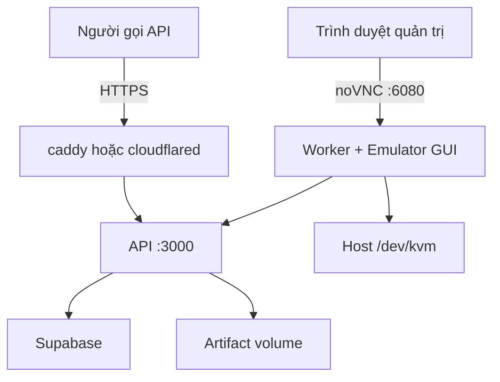

Chốt kiến trúc deploy gọn nhất:

* `caddy`: HTTPS và domain (dành cho VPS có IP tĩnh — profile production).
* `cloudflared`: mở API ra ngoài khi **không** có IP public, thay cho `caddy`. Xem `public_access.md`.
* `api`: endpoint public/internal, Supabase và artifact (chạy trực tiếp port 3000 trên WSL 2).
* `worker`: Node worker + JDK + Android SDK + emulator có GUI + noVNC.
* Không cần cài Android Studio trên server.
* GUI emulator mở bằng trình duyệt (port 6080) để đăng nhập CH Play.

`caddy` và `cloudflared` là hai cách thay thế nhau, không bật cùng lúc.

## 1. Cấu trúc repository

```text
app-relay/
├── apps/
│   ├── api/
│   │   ├── src/
│   │   ├── Dockerfile
│   │   └── package.json
│   │
│   └── worker/
│       ├── src/
│       ├── work/
│       ├── docker/
│       │   ├── entrypoint.sh
│       │   ├── create-avd.sh
│       │   ├── wait-for-emulator.sh
│       │   └── supervisord.conf
│       ├── Dockerfile
│       └── package.json
│
├── packages/
│   └── contracts/
│
├── deploy/
│   ├── compose.yml
│   ├── compose.kvm.yaml
│   ├── .env.api.example
│   ├── .env.worker.example
│   └── caddy/
│       └── Caddyfile
│
├── supabase/
│   └── migrations/
│
├── pnpm-workspace.yaml
└── package.json
```

## 2. Các container

| Container     | Chức năng                                               | Khi nào bật |
| ------------- | ------------------------------------------------------- | ----------- |
| `api`         | Endpoint, Supabase, stream artifact (Port 3000)          | luôn luôn   |
| `worker`      | Emulator GUI, CH Play, adb và pipeline kéo APK           | luôn luôn   |
| `caddy`       | Nhận HTTPS, chuyển request vào API                       | VPS có IP tĩnh (`--profile production`) |
| `cloudflared` | Tunnel ra Cloudflare, không cần IP public                | máy cá nhân / WSL / VPS sau NAT |

Hai container cuối thay thế nhau. Chi tiết tunnel nằm trong `public_access.md`.



## 3. Worker Docker image có những gì?

Worker image dùng nền JDK 17 và chứa:

```text
eclipse-temurin:17-jdk-jammy
├── Node.js
├── pnpm
├── JDK 17
├── Android Command-line Tools
├── adb / platform-tools
├── Android Emulator
├── Android platform
├── Google Play system image x86_64
├── Xvfb
├── Openbox
├── x11vnc
├── noVNC
├── websockify
└── Supervisor
```

Các đường dẫn bên trong container:

```env
JAVA_HOME=/opt/java/openjdk
ANDROID_SDK_ROOT=/opt/android-sdk
ANDROID_AVD_HOME=/home/worker/.android/avd

ADB_PATH=/opt/android-sdk/platform-tools/adb
EMULATOR_PATH=/opt/android-sdk/emulator/emulator
```

System image phải là:

```text
system-images;android-35;google_apis_playstore;x86_64
```

## 4. Docker Compose chính

`deploy/compose.yml`:

```yaml
services:
  caddy:
    image: caddy:2
    restart: unless-stopped
    profiles:
      - production
    ports:
      - "80:80"
      - "443:443"
    volumes:
      - ./caddy/Caddyfile:/etc/caddy/Caddyfile:ro
      - caddy-data:/data
      - caddy-config:/config
    depends_on:
      api:
        condition: service_healthy
    networks:
      - app-relay

  api:
    build:
      context: ..
      dockerfile: apps/api/Dockerfile
    restart: unless-stopped
    init: true
    env_file:
      - path: .env.api
        required: false
      - path: .env
        required: false
    ports:
      # Loopback thôi: cloudflared/caddy gọi api:3000 qua mạng nội bộ Docker.
      - "127.0.0.1:3000:3000"
    volumes:
      - api-artifacts:/data/artifacts
    healthcheck:
      # 127.0.0.1 chứ không phải localhost: trong container localhost phân giải
      # ra ::1 trước, mà server chỉ bind IPv4 nên probe hỏng và container không
      # bao giờ healthy — worker sẽ đứng mãi ở depends_on.
      test: ["CMD", "wget", "-q", "--spider", "http://127.0.0.1:3000/v1/health"]
      interval: 15s
      timeout: 5s
      retries: 5
    networks:
      - app-relay

  worker:
    build:
      context: ..
      dockerfile: apps/worker/Dockerfile
    restart: unless-stopped
    init: true
    env_file:
      - path: .env.worker
        required: false
      - path: .env
        required: false
    depends_on:
      api:
        condition: service_healthy
    shm_size: "2gb"
    ports:
      - "127.0.0.1:6080:6080"
    volumes:
      - worker-avd:/home/worker/.android
      - worker-work:/app/apps/worker/work
    networks:
      - app-relay

volumes:
  caddy-data:
  caddy-config:
  api-artifacts:
  worker-avd:
  worker-work:

networks:
  app-relay:
```


Port noVNC chỉ bind vào `127.0.0.1`, không mở công khai trên Internet.

## 5. Cấu hình KVM riêng

`compose.kvm.yaml`:

```yaml
services:
  worker:
    devices:
      - /dev/kvm:/dev/kvm

    group_add:
      - "${KVM_GID}"

    environment:
      EMULATOR_ACCEL: auto
```

Trên VPS có KVM, chạy:

```bash
docker compose \
  -f compose.yml \
  -f compose.kvm.yaml \
  up -d
```

Tách file như vậy giúp `compose.yml` vẫn có thể chạy trên WSL hoặc môi trường không có `/dev/kvm`.

## 6. Emulator có GUI hoạt động thế nào?

Bên trong worker:

```text
Xvfb :0
  ↓
Openbox desktop
  ↓
Android Emulator window
  ↓
x11vnc :5900
  ↓
noVNC :6080
  ↓
Trình duyệt
```

Emulator khởi động như sau:

```bash
emulator \
  -avd chpay \
  -gpu swiftshader_indirect \
  -accel "${EMULATOR_ACCEL:-auto}" \
  -no-audio \
  -no-boot-anim \
  -no-snapshot-save
```

Không sử dụng `-no-window`, vì yêu cầu của dự án là phải nhìn và điều khiển được emulator.

## 7. Mở GUI trên VPS

Từ máy cá nhân, tạo SSH tunnel:

```bash
ssh -L 6080:127.0.0.1:6080 ubuntu@IP_VPS
```

Sau đó mở:

```text
http://localhost:6080/vnc.html
```

Màn hình Ubuntu ảo sẽ hiện trong trình duyệt, bên trong có Android Emulator. Đăng nhập CH Play một lần tại đây.

Sau khi đăng nhập:

* Có thể đóng trình duyệt.
* Có thể ngắt SSH tunnel.
* Emulator và worker tiếp tục chạy.
* Tài khoản Google được giữ trong volume `worker-avd`.

## 8. Trên WSL

### WSL tự tắt distro — phải có keepalive

Đây là khác biệt lớn nhất giữa WSL và VPS thật, và nó sẽ cắn bất kỳ ai bỏ qua.

WSL2 thu hồi distro khi không còn tiến trình nào từ phía Windows giữ nó sống. Lúc đó systemd trong distro nhận lệnh tắt máy thật sự:

```text
systemd[1]: Reached target poweroff.target - System Power Off
systemd[1]: Shutting down
```

Docker daemon tắt theo, mọi container dừng. Lần sau gõ lệnh vào distro thì nó boot lại, container bật lại (`restart: unless-stopped`) và **emulator boot lại từ đầu**. Hậu quả thực tế: đang đăng nhập CH Play thì mất phiên, job đang chạy đứt giữa chừng.

Dấu hiệu nhận biết — mọi thứ đều "sạch", không có gì crash:

```text
RestartCount=0   OOMKilled=false   NRestarts=0
```

Giữ distro sống bằng một tiến trình chạy nền trên Windows:

```powershell
Start-Process -FilePath "wsl.exe" `
  -ArgumentList '-d','Ubuntu-24.04','-u','root','--','sleep','infinity' `
  -WindowStyle Hidden
```

Muốn dùng WSL làm server thật thì đăng ký lệnh trên vào Task Scheduler chạy lúc boot Windows. Không có nó thì mỗi lúc máy rảnh là cả stack chết.

### Các distro WSL2 dùng chung network namespace

Không chạy song song được stack dev (Docker Desktop) và stack server (Docker Engine trong WSL): hai bên tranh nhau cổng `3000`, `6080`, `54322`. Dừng bên kia trước:

```bash
docker compose -f compose.yml -f compose.kvm.yaml -f compose.supabase.yaml stop
```

Dùng `stop`, không dùng `down -v` — volume và phiên đăng nhập CH Play nằm nguyên đó.

### noVNC

Nếu Docker chạy trong WSL, mở trực tiếp:

```text
http://localhost:6080/vnc.html
```

Nhưng phải kiểm tra:

```bash
ls -la /dev/kvm
```

Nếu WSL không có `/dev/kvm`, chạy Compose không dùng file `compose.kvm.yaml`:

```bash
docker compose up -d
```

Và đặt:

```env
EMULATOR_ACCEL=off
```

Emulator có thể chạy bằng software emulation nhưng sẽ rất chậm. WSL phù hợp để phát triển API; worker Android ổn định hơn trên VPS hoặc máy Linux có KVM. Nested virtualization cũng phụ thuộc máy Windows/Hyper-V có expose virtualization extension hay không. [Microsoft nested virtualization](https://learn.microsoft.com/en-us/windows-server/virtualization/hyper-v/enable-nested-virtualization)

## 9. VPS cần cấu hình gì?

Khuyến nghị cho một emulator:

```text
CPU: x86_64, 4 vCPU trở lên
RAM: 16 GB
Disk: 80 GB SSD trở lên
OS: Ubuntu 22.04 hoặc 24.04
KVM: bắt buộc nếu muốn chạy nhanh
Docker: Docker Engine + Compose plugin
```

Android khuyến nghị 16 GB RAM cho emulator. [Android Emulator requirements](https://developer.android.com/studio/run/emulator)

Kiểm tra VPS:

```bash
uname -m
egrep -c '(vmx|svm)' /proc/cpuinfo
ls -la /dev/kvm
```

Mong muốn:

```text
x86_64
/dev/kvm
```

Cài công cụ kiểm tra:

```bash
sudo apt-get update
sudo apt-get install -y cpu-checker
sudo kvm-ok
```

Kết quả cần có:

```text
INFO: /dev/kvm exists
KVM acceleration can be used
```

Android Emulator x86/x86_64 trên Linux dựa vào KVM để tăng tốc. [Android hardware acceleration](https://developer.android.com/studio/run/emulator-acceleration)

## 10. Dữ liệu được lưu ở đâu?

| Dữ liệu                 | Vị trí                 |
| ----------------------- | ---------------------- |
| JDK                     | Worker Docker image    |
| Android SDK             | Worker Docker image    |
| Play Store system image | Worker Docker image    |
| AVD `chpay`             | Volume `worker-avd`  |
| Tài khoản Google Play   | Volume `worker-avd`  |
| APK worker đang xử lý   | Volume `worker-work`   |
| Thư mục artifact chờ tải | Volume `api-artifacts` |
| Job metadata            | Supabase               |

Không chạy:

```bash
docker compose down -v
```

Vì `-v` sẽ xóa AVD và phiên đăng nhập CH Play.

## 11. Quy trình deploy

```bash
sudo mkdir -p /opt/app-relay
sudo chown "$USER":"$USER" /opt/app-relay

cd /opt/app-relay
git clone <repository-url> .

cp deploy/.env.api.example .env.api
cp deploy/.env.worker.example .env.worker
```

Nếu repo **private** thì `git clone` qua HTTPS sẽ **treo vô hạn** chờ nhập mật khẩu — không báo lỗi, không timeout, chỉ đứng im. Chạy trong script tự động là treo luôn. Dùng một trong hai:

```bash
# deploy key (SSH) — khuyến nghị
git clone git@github.com:<owner>/<repo>.git .

# hoặc token, và tắt hẳn prompt để lỗi xác thực fail ngay thay vì treo
GIT_TERMINAL_PROMPT=0 git clone https://<token>@github.com/<owner>/<repo>.git .
```

### Migration

Init script của Postgres **chỉ chạy khi thư mục dữ liệu còn trống**. Nghĩa là:

* Deploy mới: mọi migration trong `supabase/migrations/` được áp tự động theo thứ tự tên.
* Deploy đã tồn tại: thêm migration mới thì phải chạy tay.

```bash
SUPABASE_DB_URL=postgres://postgres:<pass>@127.0.0.1:54322/postgres \
  pnpm exec tsx scripts/db-migrate.ts --apply
```

Sau đó bắt PostgREST nạp lại schema, nếu không mọi ghi vào cột mới đều lỗi:

```sql
notify pgrst, 'reload schema';
```

Lấy KVM group ID:

```bash
getent group kvm | cut -d: -f3
```

Ghi vào `.env`:

```env
KVM_GID=108
```

Build và chạy:

```bash
docker compose \
  -f compose.yml \
  -f compose.kvm.yaml \
  build

docker compose \
  -f compose.yml \
  -f compose.kvm.yaml \
  up -d
```

Đăng nhập CH Play qua noVNC, sau đó worker có thể tự mở Play Store, cài app, pull APK và upload artifact về API server.
