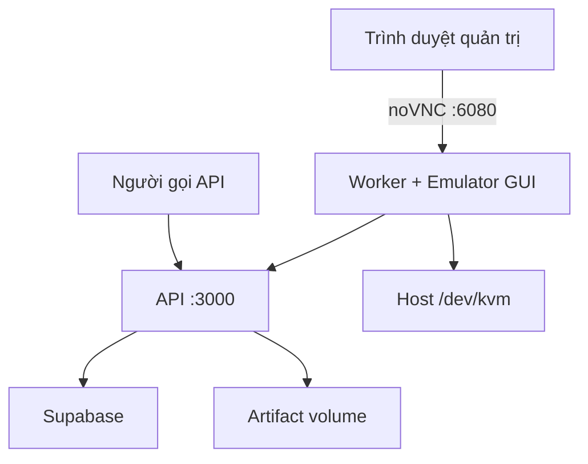

Chốt kiến trúc deploy gọn nhất:

* `caddy`: HTTPS và domain (dành cho VPS production profile).
* `api`: endpoint public/internal, Supabase và artifact (chạy trực tiếp port 3000 trên WSL 2).
* `worker`: Node worker + JDK + Android SDK + emulator có GUI + noVNC.
* Không cần cài Android Studio trên server.
* GUI emulator mở bằng trình duyệt (port 6080) để đăng nhập CH Play.

## 1. Cấu trúc repository

```text
app-relay/
├── apps/
│   ├── api/
│   │   ├── src/
│   │   ├── Dockerfile
│   │   └── package.json
│   │
│   └── worker/
│       ├── src/
│       ├── work/
│       ├── docker/
│       │   ├── entrypoint.sh
│       │   ├── create-avd.sh
│       │   ├── wait-for-emulator.sh
│       │   └── supervisord.conf
│       ├── Dockerfile
│       └── package.json
│
├── packages/
│   └── contracts/
│
├── deploy/
│   ├── compose.yml
│   ├── compose.kvm.yaml
│   ├── .env.api.example
│   ├── .env.worker.example
│   └── caddy/
│       └── Caddyfile
│
├── supabase/
│   └── migrations/
│
├── pnpm-workspace.yaml
└── package.json
```

## 2. Ba container

| Container | Chức năng                                      |
| --------- | ---------------------------------------------- |
| `caddy`   | Nhận HTTPS, chuyển request vào API (production profile) |
| `api`     | Endpoint, Supabase, stream artifact (Port 3000) |
| `worker`  | Emulator GUI, CH Play, adb và pipeline kéo APK |



## 3. Worker Docker image có những gì?

Worker image dùng nền JDK 17 và chứa:

```text
eclipse-temurin:17-jdk-jammy
├── Node.js
├── pnpm
├── JDK 17
├── Android Command-line Tools
├── adb / platform-tools
├── Android Emulator
├── Android platform
├── Google Play system image x86_64
├── Xvfb
├── Openbox
├── x11vnc
├── noVNC
├── websockify
└── Supervisor
```

Các đường dẫn bên trong container:

```env
JAVA_HOME=/opt/java/openjdk
ANDROID_SDK_ROOT=/opt/android-sdk
ANDROID_AVD_HOME=/home/worker/.android/avd

ADB_PATH=/opt/android-sdk/platform-tools/adb
EMULATOR_PATH=/opt/android-sdk/emulator/emulator
```

System image phải là:

```text
system-images;android-35;google_apis_playstore;x86_64
```

## 4. Docker Compose chính

`deploy/compose.yml`:

```yaml
services:
  caddy:
    image: caddy:2
    restart: unless-stopped
    profiles:
      - production
    ports:
      - "80:80"
      - "443:443"
    volumes:
      - ./caddy/Caddyfile:/etc/caddy/Caddyfile:ro
      - caddy-data:/data
      - caddy-config:/config
    depends_on:
      api:
        condition: service_healthy
    networks:
      - app-relay

  api:
    build:
      context: ..
      dockerfile: apps/api/Dockerfile
    restart: unless-stopped
    init: true
    env_file:
      - path: .env.api
        required: false
      - path: .env
        required: false
    ports:
      - "3000:3000"
    volumes:
      - api-artifacts:/data/artifacts
    healthcheck:
      test: ["CMD", "wget", "-q", "--spider", "http://localhost:3000/v1/health"]
      interval: 15s
      timeout: 5s
      retries: 5
    networks:
      - app-relay

  worker:
    build:
      context: ..
      dockerfile: apps/worker/Dockerfile
    restart: unless-stopped
    init: true
    env_file:
      - path: .env.worker
        required: false
      - path: .env
        required: false
    depends_on:
      api:
        condition: service_healthy
    shm_size: "2gb"
    ports:
      - "127.0.0.1:6080:6080"
    volumes:
      - worker-avd:/home/worker/.android
      - worker-work:/app/apps/worker/work
    networks:
      - app-relay

volumes:
  caddy-data:
  caddy-config:
  api-artifacts:
  worker-avd:
  worker-work:

networks:
  app-relay:
```


Port noVNC chỉ bind vào `127.0.0.1`, không mở công khai trên Internet.

## 5. Cấu hình KVM riêng

`compose.kvm.yaml`:

```yaml
services:
  worker:
    devices:
      - /dev/kvm:/dev/kvm

    group_add:
      - "${KVM_GID}"

    environment:
      EMULATOR_ACCEL: auto
```

Trên VPS có KVM, chạy:

```bash
docker compose \
  -f compose.yaml \
  -f compose.kvm.yaml \
  up -d
```

Tách file như vậy giúp `compose.yaml` vẫn có thể chạy trên WSL hoặc môi trường không có `/dev/kvm`.

## 6. Emulator có GUI hoạt động thế nào?

Bên trong worker:

```text
Xvfb :0
  ↓
Openbox desktop
  ↓
Android Emulator window
  ↓
x11vnc :5900
  ↓
noVNC :6080
  ↓
Trình duyệt
```

Emulator khởi động như sau:

```bash
emulator \
  -avd chpay \
  -gpu swiftshader_indirect \
  -accel "${EMULATOR_ACCEL:-auto}" \
  -no-audio \
  -no-boot-anim \
  -no-snapshot-save
```

Không sử dụng `-no-window`, vì yêu cầu của dự án là phải nhìn và điều khiển được emulator.

## 7. Mở GUI trên VPS

Từ máy cá nhân, tạo SSH tunnel:

```bash
ssh -L 6080:127.0.0.1:6080 ubuntu@IP_VPS
```

Sau đó mở:

```text
http://localhost:6080/vnc.html
```

Màn hình Ubuntu ảo sẽ hiện trong trình duyệt, bên trong có Android Emulator. Đăng nhập CH Play một lần tại đây.

Sau khi đăng nhập:

* Có thể đóng trình duyệt.
* Có thể ngắt SSH tunnel.
* Emulator và worker tiếp tục chạy.
* Tài khoản Google được giữ trong volume `android-home`.

## 8. Trên WSL

Nếu Docker chạy trong WSL, mở trực tiếp:

```text
http://localhost:6080/vnc.html
```

Nhưng phải kiểm tra:

```bash
ls -la /dev/kvm
```

Nếu WSL không có `/dev/kvm`, chạy Compose không dùng file `compose.kvm.yaml`:

```bash
docker compose up -d
```

Và đặt:

```env
EMULATOR_ACCEL=off
```

Emulator có thể chạy bằng software emulation nhưng sẽ rất chậm. WSL phù hợp để phát triển API; worker Android ổn định hơn trên VPS hoặc máy Linux có KVM. Nested virtualization cũng phụ thuộc máy Windows/Hyper-V có expose virtualization extension hay không. [Microsoft nested virtualization](https://learn.microsoft.com/en-us/windows-server/virtualization/hyper-v/enable-nested-virtualization)

## 9. VPS cần cấu hình gì?

Khuyến nghị cho một emulator:

```text
CPU: x86_64, 4 vCPU trở lên
RAM: 16 GB
Disk: 80 GB SSD trở lên
OS: Ubuntu 22.04 hoặc 24.04
KVM: bắt buộc nếu muốn chạy nhanh
Docker: Docker Engine + Compose plugin
```

Android khuyến nghị 16 GB RAM cho emulator. [Android Emulator requirements](https://developer.android.com/studio/run/emulator)

Kiểm tra VPS:

```bash
uname -m
egrep -c '(vmx|svm)' /proc/cpuinfo
ls -la /dev/kvm
```

Mong muốn:

```text
x86_64
/dev/kvm
```

Cài công cụ kiểm tra:

```bash
sudo apt-get update
sudo apt-get install -y cpu-checker
sudo kvm-ok
```

Kết quả cần có:

```text
INFO: /dev/kvm exists
KVM acceleration can be used
```

Android Emulator x86/x86_64 trên Linux dựa vào KVM để tăng tốc. [Android hardware acceleration](https://developer.android.com/studio/run/emulator-acceleration)

## 10. Dữ liệu được lưu ở đâu?

| Dữ liệu                 | Vị trí                 |
| ----------------------- | ---------------------- |
| JDK                     | Worker Docker image    |
| Android SDK             | Worker Docker image    |
| Play Store system image | Worker Docker image    |
| AVD `chpay`             | Volume `android-home`  |
| Tài khoản Google Play   | Volume `android-home`  |
| APK worker đang xử lý   | Volume `worker-work`   |
| ZIP chờ người gọi tải   | Volume `api-artifacts` |
| Job metadata            | Supabase               |

Không chạy:

```bash
docker compose down -v
```

Vì `-v` sẽ xóa AVD và phiên đăng nhập CH Play.

## 11. Quy trình deploy

```bash
sudo mkdir -p /opt/app-relay
sudo chown "$USER":"$USER" /opt/app-relay

cd /opt/app-relay
git clone <repository-url> .

cp deploy/.env.api.example .env.api
cp deploy/.env.worker.example .env.worker
```

Lấy KVM group ID:

```bash
getent group kvm | cut -d: -f3
```

Ghi vào `.env`:

```env
KVM_GID=108
```

Build và chạy:

```bash
docker compose \
  -f compose.yaml \
  -f compose.kvm.yaml \
  build

docker compose \
  -f compose.yaml \
  -f compose.kvm.yaml \
  up -d
```

Đăng nhập CH Play qua noVNC, sau đó worker có thể tự mở Play Store, cài app, pull APK và upload artifact về API server.
