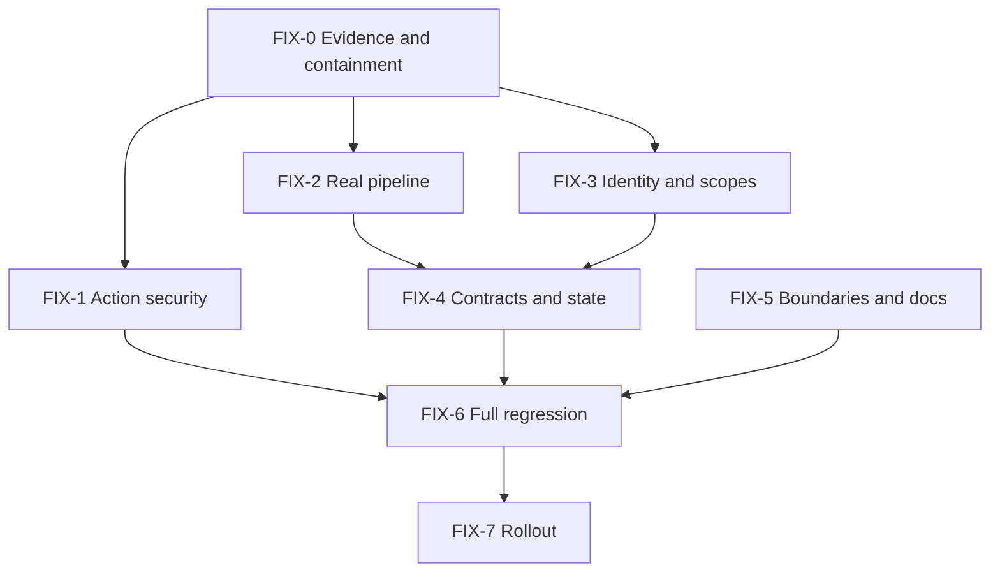

# AppRelay — Corrected Architecture Review and Fix Plan

> **Review target:** `analysis_results(1).md` đối chiếu với `ARCHITECTURE_APP_REPLAY_V1.md`, `ARCHITECTURE_MASTER(1).md` và kế hoạch triển khai AppRelay Phase 0–12.  
> **Mục tiêu:** hiệu chỉnh verdict/severity, loại false positive, bổ sung các kiểm tra còn thiếu và đưa ra thứ tự remediation an toàn.  
> **Giới hạn bằng chứng:** chưa có toàn bộ repository trong phiên review này. Các kết luận về code được dựa trên path/snippet mà report cung cấp và phải được xác nhận ở FIX-0 trước khi sửa production.

## 1. Kết luận điều hành

Review ban đầu **đúng về việc phát hiện chênh lệch**, nhưng **chưa chuẩn về cách kết luận và xếp severity**.

Các điều chỉnh quan trọng:

1. `apk-pull` → `AppRelay` không phải lỗ hổng. Đây là quyết định naming đã được chốt trong implementation plan mới hơn.
2. Số lượng thư mục adapter không chứng minh Ports and Adapters bị vi phạm. Phải kiểm tra dependency direction và interface boundary.
3. Tách `app-relay.actions.ts` không phải lỗi nếu guard và service boundary vẫn đúng.
4. Các bảng Release Ops bổ sung không phải schema drift của AppRelay; chúng thuộc Master Release Ops.
5. Token table đổi tên không tự động làm token guard hỏng nếu migration, issuance và lookup cùng dùng một table.
6. Guard thiếu ở callable Server Actions có thể là **Critical**, nhưng phải chứng minh file là public server-action boundary và không có guarded wrapper phía trước.
7. `runFakePullApkPipeline()` trong production worker path mới là **Critical production blocker**, nghiêm trọng hơn mức Medium của report.
8. `ON CONFLICT (id)` với UUID luôn được tạo mới là finding kỹ thuật hợp lý và cần sửa sớm.
9. Scope gộp là security architecture drift thật, nhưng impact phụ thuộc thêm vào lease/worker/attempt checks trên từng endpoint.
10. Con số “70–75% architecture” không có phương pháp đo và nên bỏ khỏi báo cáo chính thức.

### Revised priority

| Priority | Hạng mục | Lý do |
| --- | --- | --- |
| P0 | Xác minh và khóa callable actions thiếu auth/CSRF | Có khả năng cho phép mutation không được phép |
| P0 | Loại fake pipeline khỏi production execution path | Hệ thống có thể báo hoạt động nhưng không thực thi APK thật |
| P0 | Sửa stable worker registration/upsert | Duplicate worker identity phá heartbeat, capacity và lease ownership |
| P1 | Khôi phục exact endpoint scopes + ownership/lease checks | Giảm blast radius của worker credential |
| P1 | Chốt một token source of truth | Tránh issuance/rotation/revocation lệch table |
| P1 | Bổ sung error-code/retry contract và tests | Retry/operator guidance có thể phân loại sai |
| P2 | Chuẩn hóa retry state và device-profile contract | Quan sát/state contract chưa hoàn chỉnh |
| P2 | Kiểm tra adapter isolation bằng dependency tests | Maintainability, không phải lỗi theo tên folder |
| P3 | Đồng bộ tài liệu theo tên AppRelay và modular actions | Documentation debt |

## 2. Verdict từng finding

### Finding 1 — Đổi tên `apk-pull` thành `app-relay`

**Verdict:** Observation đúng, kết luận sai. **Accepted evolution / documentation drift**, không phải lỗi runtime.

**Lý do:** Implementation plan mới hơn đã chốt:

- feature name: `AppRelay`;
- route: `/dash/release-ops/app-relay`;
- worker package: `workers/app-relay-worker`;
- Docker service: `app-relay-worker`;
- job type vẫn là `pull_apk`;
- capability là `app_artifact_acquisition`.

**Severity hiệu chỉnh:** Informational / P3.

**Hướng xử lý:** Không rename code về `apk-pull`. Cập nhật architecture bằng ADR/name mapping và giữ `pull_apk` làm stable machine contract.

---

### Finding 2 — Worker thiếu ba adapter directories

**Verdict:** Observation về layout đúng; vi phạm kiến trúc **chưa được chứng minh**.

Ports and Adapters yêu cầu boundary rõ và dependency đi đúng chiều, không bắt buộc mỗi port phải là một folder. `android/play-ui-automator.ts` có thể vẫn được isolate tốt nếu runtime chỉ phụ thuộc interface.

**Severity hiệu chỉnh:** Low / P2 verification.

**Chỉ nâng lên Medium khi có một trong các bằng chứng:**

- pipeline import trực tiếp ADB/process implementation;
- Play UI parser phụ thuộc runtime/emulator state;
- emulator lifecycle không mock/test độc lập được;
- uploader tự chọn Storage path hoặc dùng service-role client;
- artifact cleanup có thể xóa path ngoài work root;
- thay Play UI parser buộc sửa worker engine.

**Hướng xử lý:** Không refactor folder chỉ để “khớp sơ đồ”. Tạo port interfaces, dependency tests và fixture tests trước; chỉ tách folder khi coupling thật tồn tại.

---

### Finding 3 — Scope granularity bị giảm

**Verdict:** **Valid architecture/security drift**, nhưng report đang diễn giải blast radius hơi tuyệt đối.

`release_ops:job:write` cho nhiều endpoint làm mất khả năng cấp/revoke quyền theo operation. Tuy nhiên cùng một APK worker thường cần heartbeat, event và completion trong vòng đời job; rủi ro thực tế còn phụ thuộc việc mọi mutation có kiểm tra worker ID, job ownership, attempt và lease hay không.

**Severity hiệu chỉnh:** High / P1 nếu endpoint scope map thực sự dùng scope gộp; Medium nếu token chỉ cấp cho một worker class và lease checks đầy đủ.

**Hướng xử lý:** Khôi phục exact scopes:

- `release_ops:worker:register`;
- `release_ops:worker:heartbeat`;
- `release_ops:job:claim`;
- `release_ops:job:heartbeat`;
- `release_ops:job:event`;
- `release_ops:job:complete`;
- `release_ops:artifact:write`.

Không chỉ rename string: phải test route → required scope và scope → permitted operations.

---

### Finding 4 — Server Actions thiếu `verifyCSRF()` và `requireAdmin()`

**Verdict:** **Potentially Critical; cần xác minh callable boundary ngay.**

Report chưa chứng minh các điều kiện sau:

1. File có `'use server'` hoặc function được export như Server Action.
2. Client component import/call trực tiếp các function này.
3. Không có guarded wrapper/middleware trước chúng.
4. `db: any` và `userId` thực sự nhận từ caller, không chỉ là test helper.

Nếu cả bốn đúng, finding Critical của report là chuẩn. Nếu file chỉ chứa server-only helper được gọi từ guarded action khác, kết luận “ai cũng gọi được” là false positive dù naming vẫn gây hiểu nhầm.

**Severity hiệu chỉnh:** Conditional Critical / P0 verification.

**Required target shape:**

```text
callable action
→ verifyCSRF() cho mutation
→ requireAdmin() cho mọi read/write
→ derive actorId từ session
→ validate input
→ service
→ repository/RPC
```

Không nhận database client hoặc authoritative `userId` từ browser caller.

---

### Finding 5 — Actions bị tách file

**Verdict:** **Acceptable deviation / false positive về chức năng.**

Một file duy nhất không phải security hoặc domain invariant. `app-relay.actions.ts` có thể tốt hơn cho module ownership nếu vẫn reuse guard, service, repositories và error contract.

**Severity hiệu chỉnh:** None / P3 documentation.

**Hướng xử lý:** Giữ file tách. Chuẩn hóa convention: mọi callable action file phải có guard tests và không chứa repository logic trực tiếp.

---

### Finding 6 — Worker engine dùng fake pipeline

**Verdict:** **Valid và nghiêm trọng hơn report. Critical production blocker.**

Fake pipeline là bước hợp lệ của Phase 5, nhưng Phase 6–8 chỉ hoàn thành khi real listing/Android/artifact pipeline được wire vào dispatcher. Nếu production engine vẫn gọi trực tiếp `runFakePullApkPipeline()`, acceptance của Phase 6–8 và Phase 12 chưa đạt dù các module/test riêng lẻ đã tồn tại.

**Severity hiệu chỉnh:** Critical / P0.

**Hướng xử lý:**

- dispatch bằng discriminated `job_type`;
- `pull_apk` phải gọi real pipeline;
- unknown type fail closed;
- fake handler chỉ nằm trong test/dev harness;
- production build hoặc startup phải fail nếu fake mode được bật;
- chạy real E2E từ dashboard → worker → Storage → download.

---

### Finding 7 — Schema có thêm Release Ops tables

**Verdict:** **False positive.**

`release_ops_play_accounts`, `release_ops_releases` và `release_ops_aso_metrics` thuộc Master Release Ops. AppRelay reuse cùng control plane/database; architecture AppRelay chỉ liệt kê các table nó trực tiếp sử dụng, không tuyên bố database chỉ được chứa các table đó.

**Severity hiệu chỉnh:** None.

**Hướng xử lý:** Không xóa table. Cập nhật diagram/context để phân biệt “Master-owned tables” và “AppRelay-used tables”.

---

### Finding 8 — Token guard dùng `release_ops_worker_tokens` thay `api_tokens`

**Verdict:** **Valid architecture deviation, nhưng chưa phải functional bug.**

Nếu migration, token issuance, hashing, lookup, rotation và revocation đều dùng `release_ops_worker_tokens`, guard vẫn hoạt động. Câu “guard sẽ không tìm thấy token” chỉ đúng khi issuance ghi vào `api_tokens` còn lookup đọc table mới.

**Severity hiệu chỉnh:** Medium / P1 decision.

**Rủi ro thật:**

- hai token sources of truth;
- revoke/rotate một table nhưng token ở table khác vẫn active;
- tooling vận hành và audit không thống nhất;
- shared gateway pattern của Master bị phân mảnh.

**Hướng xử lý:** Chọn một canonical table bằng ADR. Ưu tiên reuse `api_tokens` nếu Master đã có issuance/rotation/audit ổn định; nếu giữ table riêng, phải document ownership và chứng minh không có dual lookup/issuance.

---

### Finding 9 — Worker register RPC `ON CONFLICT (id)` sai

**Verdict:** **Likely valid, High.**

Nếu mỗi call insert `id = gen_random_uuid()`, `ON CONFLICT (id)` không thể phục vụ re-registration. Hậu quả là duplicate worker rows, heartbeat gắn sai identity, capacity sai và job lease khó reconcile.

**Severity hiệu chỉnh:** High / P0–P1.

**Hướng xử lý khuyến nghị:**

- worker có stable `RELEASE_OPS_WORKER_ID`;
- RPC nhận `p_worker_id`;
- `INSERT id = p_worker_id ... ON CONFLICT (id) DO UPDATE`;
- validate token được phép bind đúng worker ID;
- không dùng mutable display name làm identity duy nhất;
- migration reconcile duplicate rows trước khi thêm constraint.

---

### Finding 10 — Retry bỏ qua `retrying`

**Verdict:** **Valid state-contract drift, không phải security issue.**

Chuyển trực tiếp về `queued` vẫn có thể chạy được, nhưng UI/audit không quan sát được trạng thái retry và khó thể hiện backoff. Nếu `retrying` chỉ tồn tại vài microsecond trong cùng transaction thì thêm nó cũng không có giá trị.

**Severity hiệu chỉnh:** Low–Medium / P2.

**Hướng xử lý:** Chốt semantic rõ:

- `retrying` nghĩa là đang cleanup/backoff/chờ lần thử kế tiếp;
- sau cleanup và `nextAttemptAt`, reconciliation chuyển sang `queued`;
- manual retry ghi audit và có thể chuyển thẳng `queued` nếu product muốn;
- state diagram, RPC và UI phải thống nhất.

---

### Finding 11 — Thiếu `requestedDeviceProfile`

**Verdict:** **Valid contract drift nhưng field là optional/future-facing.**

Implementation plan payload tối thiểu không bắt buộc field này. Với MVP một device, việc thiếu field không phá execution.

**Severity hiệu chỉnh:** Low / P2.

**Hướng xử lý:** Thêm optional nullable field vào shared type/schema để forward compatibility; worker phải reject profile không hỗ trợ thay vì silently ignore khi routing được bật.

## 3. Finding còn thiếu trong report

### 3.1 Error-code contract bị thu hẹp

Report có nhắc 17 → 11 codes ở bảng đầu nhưng không phân tích thành finding/action riêng. Đây là **Medium/P1** vì error code điều khiển retry policy và operator guidance.

Phải xác minh đủ các nhóm:

- permanent: invalid URL, not found, region, payment/approval;
- operator repair: Play login, UI changed;
- transient: device, emulator, install, APK pull, upload;
- terminal integrity: APK validation;
- ownership/control: stale lease, cancelled;
- capacity: insufficient disk.

### 3.2 Capability mapping có hai tên

Architecture V1 dùng capability `pull_apk`; implementation plan mới dùng `app_artifact_acquisition`, còn job type vẫn `pull_apk`.

Đây không phải lỗi nếu có explicit mapping:

```text
job_type pull_apk → required capability app_artifact_acquisition
```

Nếu claim RPC so sánh trực tiếp hai string khác nhau, worker sẽ không claim được job. Cần contract test.

### 3.3 Lease/ownership enforcement chưa được audit

Có endpoint đủ không đồng nghĩa authorization đúng. Phải kiểm tra tất cả `start`, `heartbeat`, `events`, `upload-init`, `upload-complete`, `succeed`, `fail` đều validate:

- token status/expiry/scope;
- bound worker ID;
- job worker ownership;
- attempt/version;
- unexpired lease;
- allowed current status.

### 3.4 Artifact verification boundary chưa được audit

Phải xác minh:

- worker không tự chọn object path;
- worker không có service-role key;
- upload trực tiếp bằng signed contract;
- `upload-complete` verify object existence, size và checksum policy;
- job không `succeeded` trước artifact verification;
- signed URL không xuất hiện trong logs/events.

### 3.5 Cleanup và pre-existing app invariant chưa được audit

Phải có test chứng minh:

- app tồn tại trước job không bị uninstall;
- cancel/failure/lease loss đều chạy cleanup;
- path cleanup không thoát `APK_WORK_DIR`;
- stale workspace được reconcile lúc startup;
- một device chỉ chạy một active job.

### 3.6 Realtime/RLS chưa được audit

Phải xác minh publication và RLS không cho non-admin đọc toàn bộ jobs/events; frontend subscribe theo job ID, deduplicate event và fallback poll khi disconnect.

### 3.7 Production phase completion đang bị nghi ngờ

Nếu fake pipeline vẫn là production call path, Phase 6–8 và Phase 12 không thể coi là Done chỉ vì module/test tồn tại. Nhật ký phase phải chuyển về `In review` cho đến khi real E2E pass.

## 4. Fix strategy

### Nguyên tắc

- Không rename AppRelay về APK Pull.
- Không viết lại backend hoặc tạo control plane thứ hai.
- Master vẫn sở hữu Supabase/Auth/queue/artifacts/audits.
- Worker chỉ gọi Worker Gateway và signed Storage endpoint.
- Không refactor folder trước khi đóng P0 security/execution issues.
- Mỗi fix có contract test, negative test và rollback/kill switch.
- Không đánh dấu Phase 12 Done trước real production-like E2E.

## 5. FIX-0 — Evidence freeze và containment

**Priority:** P0  
**Mục tiêu:** xác nhận exploit/execution path trước khi thay đổi code.

### Tasks

- [ ] Tạo branch/hotfix checkpoint và lưu commit SHA đang review.
- [ ] Xác minh `app-relay.actions.ts` có `'use server'` và call sites từ client.
- [ ] Vẽ call graph create/cancel/retry/download/delete đến service/RPC.
- [ ] Chạy negative test anonymous và authenticated non-admin cho từng action.
- [ ] Xác minh production worker engine có gọi trực tiếp fake pipeline không.
- [ ] Kiểm tra env/feature flag có thể bật fake mode ở production.
- [ ] Query duplicate `release_ops_workers` theo stable identity/name/token binding.
- [ ] Export route → scope map hiện tại.
- [ ] Export token issuance/lookup/revoke table map.
- [ ] Đánh dấu lại Phase 6–8, 9, 12 thành `In review` nếu gate không chứng minh được.

### Immediate containment

- [ ] Nếu mutation không guard: tắt AppRelay submit/actions bằng feature flag cho tới khi FIX-1 pass.
- [ ] Nếu production chạy fake: dừng claim `pull_apk` hoặc đặt worker maintenance; không để fake job trả success.
- [ ] Nếu duplicate worker identity: tạm dừng register loop tạo row mới, nhưng giữ heartbeat cho worker row đang được lease sử dụng.

### Acceptance gate

Có reproducible evidence cho từng P0, biết chính xác production path và không còn job mới đi vào đường chạy không an toàn/giả lập.

## 6. FIX-1 — Khóa dashboard action boundary

**Priority:** P0  
**Phụ thuộc:** FIX-0.

### Target implementation

- [ ] Mọi read action gọi `requireAdmin()`.
- [ ] Mọi mutation gọi `verifyCSRF()` trước business mutation và `requireAdmin()`.
- [ ] Actor ID lấy từ authenticated session.
- [ ] Không nhận `db`, repository, service client hoặc authoritative `userId` từ browser.
- [ ] Action chỉ validate DTO, gọi service và trả stable result/error.
- [ ] Service/repository modules được đánh dấu server-only.
- [ ] Download action kiểm tra admin, artifact expiry/deletion và trả short-lived URL.
- [ ] Delete/cancel/retry ghi audit actor đúng session user.
- [ ] REST facade trong `openapi.yaml` reuse cùng guard/service, không tạo đường bypass thứ hai.

### Tests

- [ ] Anonymous read/write → denied.
- [ ] Non-admin read/write → denied.
- [ ] Admin read → allowed.
- [ ] Admin mutation thiếu/sai CSRF → denied.
- [ ] Caller-supplied user ID không thay đổi audit actor.
- [ ] Caller không inject database client/object path.
- [ ] Duplicate idempotency key không duplicate mutation.

### Acceptance gate

Không có callable browser path nào tạo/cancel/retry/delete/download artifact mà bỏ qua guard và audit.

### Rollback

Giữ feature flag off. Rollback action adapter được phép, nhưng không rollback guard/schema security migration.

## 7. FIX-2 — Wire real worker pipeline

**Priority:** P0  
**Có thể triển khai song song code-wise với FIX-1, nhưng cả hai phải pass trước rollout.**

### Target dispatcher

```text
claimed typed job
→ validate job_type + schemaVersion
→ map required capability
→ run real pull_apk pipeline
→ listing → device preflight → install → pull → validate → package
→ signed upload → artifact verification → succeed
→ cleanup in every terminal path
```

### Tasks

- [ ] Tạo/chuẩn hóa `JobDispatcher` với exhaustive switch trên `job_type`.
- [ ] `pull_apk` gọi real pipeline đã xây ở Phase 6–8.
- [ ] Unknown job type/schema version fail closed với stable code.
- [ ] Xóa direct production import của `runFakePullApkPipeline`.
- [ ] Fake pipeline chỉ import được trong tests/dev harness.
- [ ] Production startup fail khi fake mode được cấu hình.
- [ ] Heartbeat chạy độc lập trong toàn bộ real pipeline.
- [ ] Cancellation checkpoint trước/sau external/irreversible steps.
- [ ] Lease loss dừng upload/complete và chạy cleanup.
- [ ] Success chỉ sau `upload-complete` verification.

### Tests

- [ ] Dispatcher unit: recognized/unknown/version mismatch.
- [ ] Fake Gateway + fake ADB integration.
- [ ] Real staging E2E với app miễn phí có split APK.
- [ ] App đã cài trước không bị uninstall.
- [ ] Cancel giữa install/pull/upload.
- [ ] Worker crash → lease expiry → reconcile.
- [ ] Artifact ZIP/checksum/manifest/download pass.

### Acceptance gate

Một job thật chạy từ dashboard đến private Storage và tải được ZIP hợp lệ; không code production nào có thể đánh dấu fake result là succeeded.

### Rollback

Dừng claim qua kill switch hoặc maintenance mode. Không fallback production về fake pipeline.

## 8. FIX-3 — Stable worker identity, token source và exact scopes

**Priority:** P0/P1  
**Phụ thuộc:** evidence từ FIX-0.

### 8.1 Worker registration

- [ ] Chọn immutable `worker_id` từ config/registration bootstrap.
- [ ] RPC nhận `p_worker_id` và upsert trên `id`, hoặc thêm immutable `worker_key UNIQUE`.
- [ ] Token được bind/validate với worker identity.
- [ ] Re-register update name/version/capabilities/devices/heartbeat, không insert row mới.
- [ ] Reconcile duplicate worker rows và jobs tham chiếu trước unique constraint.
- [ ] Migration là forward-fix, không destructive rollback.

### 8.2 Token source of truth

- [ ] Map tất cả token create/read/revoke/rotate paths.
- [ ] Chọn `api_tokens` hoặc `release_ops_worker_tokens` làm canonical.
- [ ] Không dual-read vô thời hạn.
- [ ] Hash raw token bằng SHA-256; raw token chỉ hiển thị lúc issuance.
- [ ] Enforce active/expiry/revocation/binding.
- [ ] Migrate token metadata/audits nếu đổi table.

### 8.3 Exact route scopes

- [ ] Route map dùng bảy scopes canonical.
- [ ] Không dùng `job:write` làm wildcard.
- [ ] Mọi job mutation đồng thời kiểm tra ownership/attempt/lease/status.
- [ ] Artifact write không cho worker đọc artifact tùy ý.
- [ ] Token/signed URL không xuất hiện trong log/event.

### Tests

- [ ] Register hai lần → một worker row.
- [ ] Hai worker cùng tên nhưng ID khác xử lý theo policy đã chốt.
- [ ] Wrong worker/token binding → denied.
- [ ] Missing scope trên từng endpoint → denied.
- [ ] Correct scope nhưng wrong lease/attempt → denied.
- [ ] Revoked/expired token → denied.

### Acceptance gate

Worker restart/re-register giữ cùng identity; route-scope matrix và lease ownership negative tests đều pass.

## 9. FIX-4 — Contract/state/error normalization

**Priority:** P1/P2.

### 9.1 Canonical names

Giữ mapping:

| Concern | Canonical value |
| --- | --- |
| Product/module | `AppRelay` |
| Route/package prefix | `app-relay` |
| Job type | `pull_apk` |
| Capability | `app_artifact_acquisition` |
| Storage bucket | `release-ops-artifacts` |

- [ ] Claim RPC/gateway map `pull_apk` → `app_artifact_acquisition` rõ ràng.
- [ ] Shared DTO và OpenAPI dùng cùng mapping.
- [ ] Contract test worker đúng capability claim được; capability sai không claim được.

### 9.2 Error codes

- [ ] Khôi phục/chuẩn hóa toàn bộ stable domain codes.
- [ ] Mỗi code có `retryable`, HTTP/gateway mapping và operator guidance.
- [ ] Worker không collapse lỗi permanent thành generic transient error.
- [ ] Dashboard không dựa vào message text để quyết định Retry button.

### 9.3 Retry state

- [ ] Chốt `retrying` có durable meaning hay xóa khỏi canonical state machine.
- [ ] Nếu giữ: lưu next-attempt/backoff, emit event, reconciliation chuyển queued.
- [ ] Cleanup hoàn thành trước khi job có thể được claim lại.
- [ ] Manual retry có audit và idempotency.

### 9.4 Device profile

- [ ] Thêm `requestedDeviceProfile?: RequestedDeviceProfile | null` vào payload V1 compatible type.
- [ ] Default `null` khi caller không gửi.
- [ ] Worker capability matching chỉ enforce khi request có constraint.
- [ ] Unsupported profile không bị silently ignored.

### Acceptance gate

Types, validation schemas, RPC payload, worker DTO, dashboard DTO và `openapi.yaml` vượt contract tests cùng một fixture set.

## 10. FIX-5 — Adapter boundaries và documentation

**Priority:** P2/P3. Chỉ làm sau P0/P1.

### Adapter boundary work

- [ ] Định nghĩa ports cho ADB, emulator, Play listing, Play UI, archive và signed upload.
- [ ] Pipeline phụ thuộc ports, không phụ thuộc child process/HTTP/Storage implementation.
- [ ] Play listing và Play UI có fixtures riêng.
- [ ] Emulator lifecycle test độc lập.
- [ ] Storage adapter chỉ dùng server-issued object key/contract.
- [ ] Cleanup adapter enforce work-root containment.
- [ ] Chỉ tách directory nếu giúp enforce dependency hoặc ownership.

### Documentation work

- [ ] Thêm ADR: rename product thành AppRelay.
- [ ] Cập nhật `ARCHITECTURE_APP_REPLAY_V1.md` thành current-state/target-state rõ ràng.
- [ ] Ghi nhận modular action files là convention mới.
- [ ] Phân biệt Master-owned tables và AppRelay-used tables.
- [ ] Ghi canonical token table và scope map.
- [ ] Ghi mapping job type/capability.
- [ ] Thay `file:///d:/...` citations bằng repo-relative paths.
- [ ] Không ghi % architecture completion nếu không có checklist đo được.

### Acceptance gate

Một developer mới có thể trace dashboard → service → queue → worker → Storage từ docs mà không gặp naming/table/scope contradiction.

## 11. FIX-6 — Full security and reliability regression

**Priority:** P0 trước production re-enable.

### Security matrix

- [ ] Admin/CSRF action matrix.
- [ ] Token active/expiry/revoke/scope/binding matrix.
- [ ] Worker ownership/lease/attempt/status matrix.
- [ ] SSRF allowlist.
- [ ] Shell injection và argument-array execution.
- [ ] Path traversal/work-root containment.
- [ ] Private Storage và signed URL TTL.
- [ ] Service-role key absent from worker/client bundles.
- [ ] ADB không exposed public.
- [ ] Secret/signed URL log redaction.

### Reliability matrix

- [ ] Concurrent claim: một job chỉ một worker.
- [ ] Re-register/restart không duplicate worker.
- [ ] Heartbeat stale và lease expiry.
- [ ] Realtime disconnect/dedupe/fallback.
- [ ] Cancel ở mọi checkpoint.
- [ ] Retry transient; no retry permanent.
- [ ] Dead-letter/manual retry.
- [ ] Low disk/device offline/Play login expired.
- [ ] Upload retry và object verification.
- [ ] Artifact expiry/delete idempotent.
- [ ] Pre-existing app preservation.
- [ ] Worker workspace không tăng vô hạn.

### Acceptance gate

Toàn bộ mandatory test matrix pass trên staging với real pipeline; security review không còn Critical/High mở.

## 12. FIX-7 — Staged rollout và đóng finding

### Rollout

- [ ] Apply forward-fix migrations staging.
- [ ] Rotate/reissue scoped worker token theo canonical table.
- [ ] Deploy guarded dashboard/API boundary nhưng giữ submit flag off.
- [ ] Deploy real worker ở maintenance, chạy smoke diagnostic.
- [ ] Bật một admin/operator và một worker/device.
- [ ] Theo dõi 5–10 controlled jobs.
- [ ] Soak tối thiểu 24 giờ.
- [ ] Mở cho toàn bộ admin khi error/lease/disk/artifact metrics ổn định.

### Rollback

- Dashboard/API: rollback deployment hoặc tắt submit flag.
- Worker: maintenance/dừng claim và rollback image digest.
- Không rollback sang fake pipeline.
- Database: forward-fix; không destructive rollback khi còn jobs/artifacts.
- Token: revoke compromised/legacy token, không khôi phục broad token để chữa cháy.

### Finding closure evidence

Mỗi finding chỉ đóng khi có:

- commit/migration reference;
- test name và kết quả;
- staging evidence;
- owner/reviewer;
- rollback/kill switch;
- docs/ADR update nếu là accepted deviation.

## 13. Dependency order



## 14. Suggested issue breakdown

| Issue | Priority | Depends on | Deliverable |
| --- | --- | --- | --- |
| Prove/contain unguarded actions | P0 | — | Call graph, negative tests, flag containment |
| Wire real `pull_apk` dispatcher | P0 | — | Production-safe dispatcher + E2E |
| Repair worker registration identity | P0 | Duplicate-row analysis | Forward migration + RPC tests |
| Add admin/CSRF guards | P0 | Call graph | Guarded actions/API adapter |
| Split exact worker scopes | P1 | Route map | Scope constants + contract tests |
| Canonicalize token table | P1 | Issuance map | ADR + migration/cleanup |
| Normalize error/retry mapping | P1 | Real pipeline | Shared error registry |
| Map job type to capability | P1 | Claim contract | RPC/gateway contract test |
| Define durable retry semantics | P2 | Error registry | RPC/reconciliation/UI tests |
| Add optional requested profile | P2 | Shared types | Backward-compatible DTO |
| Enforce adapter ports | P2 | Real pipeline | Interfaces + dependency tests |
| Update AppRelay architecture docs | P3 | Decisions above | ADR/current architecture |

## 15. Definition of Done

- [ ] Không browser-callable mutation nào bỏ qua admin/CSRF guard.
- [ ] Production worker không import/call fake pipeline.
- [ ] Worker restart/re-register không tạo duplicate identity.
- [ ] Endpoint scopes, token binding, lease và attempt checks pass negative tests.
- [ ] Worker không có Supabase service-role key.
- [ ] Job chỉ succeed sau verified private artifact.
- [ ] Pre-existing app không bị uninstall.
- [ ] Error/retry/state contracts thống nhất toàn stack.
- [ ] Realtime/RLS/fallback pass.
- [ ] Real staging E2E và controlled production soak pass.
- [ ] Architecture docs phản ánh AppRelay naming và current implementation.
- [ ] Phase 6–8/9/12 chỉ trở lại `Done` sau evidence tương ứng.

## 16. Tracking table

| Phase | Status | Owner | Evidence | Blocker |
| --- | --- | --- | --- | --- |
| FIX-0 Evidence/containment | Not started |  |  |  |
| FIX-1 Action security | Not started |  |  |  |
| FIX-2 Real pipeline | Not started |  |  |  |
| FIX-3 Identity/token/scopes | Not started |  |  |  |
| FIX-4 Contracts/state/errors | Not started |  |  |  |
| FIX-5 Boundaries/docs | Not started |  |  |  |
| FIX-6 Regression | Not started |  |  |  |
| FIX-7 Rollout | Not started |  |  |  |

Trạng thái dùng: `Not started`, `In progress`, `Blocked`, `In review`, `Done`.
