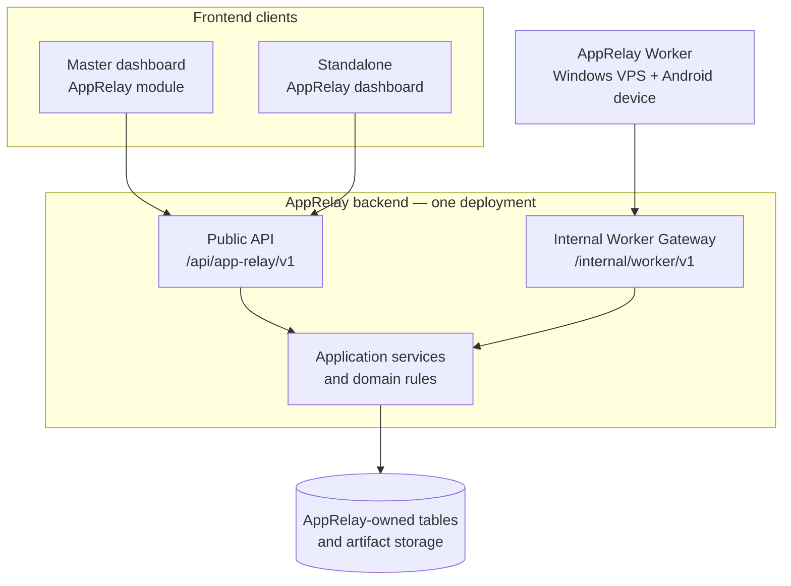

# AppRelay Dual-Dashboard Deployment Plan

> **Document status:** Proposed  
> **Change type:** Architecture evolution — deployable module with dual clients  
> **Product relationship:** AppRelay remains a Release Ops capability of the SinoMedia Master  
> **Deployment objective:** One AppRelay backend serves both the standalone AppRelay dashboard and the Master dashboard  
> **Contract policy:** `API_SPEC.md` guides implementation; the frontend receives only a validated `openapi.yaml` generated from completed runtime code

---

## 1. Executive decision

AppRelay will remain part of the Master product and navigation model, but it will become a **self-contained, independently deployable capability**.

The target is not two AppRelay backends. The target is:

- one AppRelay backend deployment;
- one AppRelay data and job ownership boundary;
- one public API contract for both dashboards;
- one internal Worker Gateway for AppRelay workers;
- two interchangeable frontend clients:
  - the standalone AppRelay dashboard;
  - the AppRelay module inside the Master dashboard.

This approach changes the technical deployment boundary without splitting the business domain. AppRelay is still a Release Ops module, but the Master no longer needs to contain its entire backend implementation.

---

## 2. Why this change is reasonable

The current Master architecture already separates the Windows worker runtime from the Next.js dashboard and expects workers to communicate through a Worker Gateway. Making the AppRelay API independently deployable extends that boundary in a controlled way.

The change is reasonable if all of the following remain true:

1. Both dashboards call the same public AppRelay API.
2. The standalone dashboard does not introduce a second business-logic implementation.
3. Master does not query AppRelay tables directly.
4. Workers call only the internal Worker Gateway.
5. AppRelay workers never receive a Supabase service-role credential.
6. AppRelay owns its migrations, job state, artifact metadata and API contract.
7. Authentication between Master, standalone dashboard and AppRelay API is explicitly designed.

The change becomes harmful if the two dashboards use different APIs, if Master and AppRelay both write the same tables directly, or if the standalone dashboard becomes a second backend hidden inside the UI application.

---

## 3. Target architecture



### 3.1 Logical relationship with Master

```text
SinoMedia Master
└── Release Ops
    └── AppRelay capability
        ├── Master dashboard module
        └── Integration with AppRelay public API

AppRelay deployable unit
├── Standalone dashboard
├── Public API
├── Application/domain services
├── Persistence adapters and migrations
├── Internal Worker Gateway
└── AppRelay Worker runtime
```

AppRelay is therefore:

- **embedded at the product level**;
- **integrated at the API level**;
- **independent at the deployment level**.

---

## 4. Ownership model

| Concern | Owner | Rule |
|---|---|---|
| AppRelay domain behavior | AppRelay backend | Both dashboards reuse it through the public API |
| Standalone AppRelay UI | AppRelay project | Contains presentation logic only |
| Master AppRelay UI | SinoMedia Master | Contains presentation and Master navigation integration only |
| Public API | AppRelay backend | Single frontend contract for both dashboards |
| Worker Gateway | AppRelay backend | Internal contract; never exposed as dashboard API |
| AppRelay tables | AppRelay backend | Master must not write these tables directly |
| Supabase infrastructure | Shared or dedicated deployment | Selected by environment; ownership remains AppRelay at schema/table level |
| Authentication identity | Prefer shared Supabase Auth | Both dashboards obtain compatible user tokens |
| Authorization policy | AppRelay backend | Enforced again at the API boundary; never trust UI-only checks |
| Job state and leases | AppRelay backend | Atomic claim, heartbeat, retry and terminal transitions |
| Artifact metadata/storage | AppRelay backend | Worker uploads through controlled API or signed upload flow |
| Android/ADB execution | AppRelay Worker | Runs outside Vercel and outside browser-facing applications |
| `API_SPEC.md` | AppRelay engineering | Design and decision source before implementation |
| `openapi.yaml` | Generated artifact | Produced from runtime routes and schemas after implementation |

---

## 5. Supported deployment profiles

### Profile A — Standalone AppRelay

```text
Standalone AppRelay Dashboard
        ↓
AppRelay Public API
        ↓
AppRelay data/storage
        ↑
AppRelay Worker Gateway ← AppRelay Worker
```

Use when AppRelay must be operated without loading the Master dashboard.

Required components:

- AppRelay dashboard deployment;
- AppRelay backend deployment;
- configured Supabase project or compatible AppRelay data environment;
- artifact storage;
- at least one Worker;
- authentication provider and admin user.

### Profile B — Master-integrated AppRelay

```text
Master Dashboard / Release Ops / AppRelay
        ↓
AppRelay Public API
        ↓
Same AppRelay backend and data used by standalone mode
```

Use for normal SinoMedia production operation.

The Master dashboard must not import AppRelay repositories or use AppRelay's Supabase service role. It consumes the public API exactly like any other authorized client.

### Profile C — Dual-dashboard transition and operation

Both dashboards run simultaneously against the same backend.

Use during migration, testing, support or when the standalone dashboard is intentionally retained as an operational fallback.

The two dashboards may have different visual designs, but they must share:

- endpoint semantics;
- permissions;
- status and error definitions;
- pagination and filtering behavior;
- job lifecycle;
- audit records.

---

## 6. API boundaries

### 6.1 Public dashboard API

Recommended canonical namespace:

```text
/api/app-relay/v1/*
```

If Master routing policy requires a Release Ops prefix, expose an alias or proxy:

```text
/api/release-ops/app-relay/v1/*
```

Do not maintain two separate implementations. The Master-prefixed path must proxy or map to the same contract version.

Typical public resource groups:

- jobs;
- job events and progress;
- artifacts and download authorization;
- worker availability summaries safe for operators;
- capability and health summaries;
- audit history where authorized.

Public API authentication:

- prefer `Authorization: Bearer <Supabase access token>`;
- validate issuer, audience, signature and expiry in AppRelay backend;
- map identity to AppRelay roles or Master permissions;
- enforce tenant/project scope when applicable;
- never authorize solely from a dashboard-provided role field.

### 6.2 Internal Worker Gateway

Recommended namespace:

```text
/api/internal/worker/v1/*
```

Existing `/api/release-ops/worker/v1/*` may be retained for compatibility during migration.

Internal operations include:

- worker registration;
- worker heartbeat;
- atomic job claim;
- job lease extension;
- progress events;
- success/failure completion;
- artifact upload coordination;
- cancellation observation.

Worker authentication:

- hashed bearer token or signed worker credential;
- explicit scopes;
- token rotation and revocation;
- stable worker identity;
- rate and replay protection where appropriate.

### 6.3 Contract separation

Generate separate artifacts if the internal Worker Gateway also needs OpenAPI:

```text
openapi.public.yaml    → standalone dashboard + Master dashboard
openapi.internal.yaml  → Worker client only
```

Never give `openapi.internal.yaml` to the dashboard frontend as its working contract.

---

## 7. Authentication and cross-origin strategy

### Recommended model

Use one Supabase Auth project for both dashboards in the first production version.

1. User signs in through Master or standalone dashboard.
2. Dashboard obtains a Supabase access token.
3. Dashboard sends the token to AppRelay public API.
4. AppRelay validates the token server-side.
5. AppRelay applies its own authorization policy.

This avoids cross-domain cookie coupling and allows both dashboards to call one backend.

### CORS policy

Configure an explicit allowlist:

```text
APPRELAY_ALLOWED_ORIGINS=
  https://master.example.com,
  https://apprelay.example.com
```

Rules:

- never use wildcard origin with credentials;
- allow only required methods and headers;
- include local development origins only outside production;
- log rejected origins without logging tokens;
- test browser preflight behavior in CI or integration tests.

### Optional Master proxy

If Master cannot safely send bearer tokens directly, add a thin Master-side proxy/BFF. The proxy must not contain AppRelay business logic. It only forwards identity and requests to the AppRelay public API.

---

## 8. Data and Supabase strategy

### Recommended first version: shared infrastructure, isolated ownership

AppRelay may initially use the same physical Supabase project as Master, provided that:

- AppRelay owns named tables or a dedicated schema;
- migrations live with AppRelay backend code;
- only AppRelay backend performs privileged AppRelay writes;
- Master UI and standalone UI never receive service-role credentials;
- Worker never receives a service-role credential;
- Master modules do not bypass the AppRelay API to update its tables.

This offers operational simplicity without giving up the service boundary.

### Future dedicated Supabase deployment

The backend must use environment configuration rather than hardcoded Master database assumptions. This permits moving AppRelay to a dedicated Supabase project later without changing either dashboard contract.

### Required data ownership records

At minimum, AppRelay should own:

- jobs;
- job events;
- workers and capabilities;
- artifacts;
- audit records for AppRelay operations;
- idempotency records where not embedded in jobs;
- API token metadata for workers;
- module configuration and rollout flags where required.

---

## 9. Target repository structure

```text
app-relay/
├── apps/
│   ├── dashboard/                 # Standalone AppRelay dashboard
│   └── api/                       # Independently deployable backend
│       ├── src/public-api/
│       ├── src/worker-gateway/
│       ├── src/application/
│       ├── src/domain/
│       ├── src/repositories/
│       ├── src/auth/
│       └── src/observability/
├── workers/
│   └── app-relay-worker/
├── packages/
│   ├── public-contract/           # Runtime schemas + route registry
│   ├── worker-contract/           # Internal worker schemas/client
│   └── shared-domain/             # Only genuinely shared domain types
├── supabase/
│   └── migrations/
├── docs/
│   └── 04-detailed-design/cdd-lld/api-spec/
│       ├── API_SPEC.md
│       ├── openapi.public.yaml
│       └── openapi.internal.yaml  # Optional/internal
├── scripts/
│   ├── generate-openapi.ts
│   └── run-all-tests.ts
├── package.json
└── workspace configuration
```

If the existing Next.js standalone dashboard continues to host the API route handlers, it can be retained as one deployment initially. However, business logic and contracts must still live outside page components and Server Actions so the backend can later be deployed independently.

---

## 10. Implementation campaign

## Phase 0 — Record the architecture decision

### Goal

Replace the earlier assumption “Master owns the entire AppRelay backend” with “AppRelay is a Master capability with an independent deployment boundary.”

### Actions

- Create an ADR for dual-dashboard and deployable-module architecture.
- Record the three supported deployment profiles.
- Define the canonical AppRelay name, namespace and versioning policy.
- Mark the existing standalone dashboard as supported, temporary or permanent.
- Confirm whether the first release uses shared or dedicated Supabase infrastructure.

### Deliverables

- `ADR-APPRELAY-DEPLOYABLE-MODULE.md`;
- updated architecture ownership table;
- confirmed public and internal API namespaces.

### Exit criteria

- Master and AppRelay teams agree that both dashboards use one backend.
- No component is left with ambiguous data ownership.

---

## Phase 1 — Audit the actual codebase

### Goal

Establish evidence before changing API design.

### Actions

- Inventory Server Actions, REST routes, schemas, services and repositories.
- Determine whether public dashboard routes actually exist.
- Trace the current `openapi.yaml` generator to its runtime source.
- Find duplicated generator scripts and select one canonical command.
- Confirm whether Worker accesses Supabase directly.
- Map environment variables and deployment assumptions.
- Identify business logic located in dashboard pages or actions.

### Deliverables

- current-state evidence matrix;
- route and schema inventory;
- implementation mismatch list;
- dependency and deployment map.

### Exit criteria

- Every claimed endpoint has a code path and test/evidence location.
- Proposed behavior is clearly separated from existing behavior.

---

## Phase 2 — Redesign `API_SPEC.md`

### Goal

Define one public contract that works for both dashboards.

### Actions

- Run `$design-apprelay-api-spec` in Design mode.
- Define actors: Master operator, standalone operator and Worker.
- Label every endpoint `Existing`, `Changed`, `New` or `Removed`.
- Mark the document `Proposed` until approved.
- Define JWT authentication and authorization rules.
- Define CORS behavior and allowed clients.
- Define stable error envelope, pagination and filtering.
- Define job lifecycle, idempotency and artifact flows.
- Separate public dashboard operations from internal Worker operations.
- Map every operation to route, schema, service, repository and tests.

### Deliverables

- revised `API_SPEC.md`;
- endpoint change matrix;
- authorization matrix;
- implementation mapping;
- acceptance-test plan.

### Exit criteria

- `API_SPEC.md` reaches `Approved for implementation`.
- Neither dashboard requires private repository or database access.

---

## Phase 3 — Extract the AppRelay backend core

### Goal

Create one reusable business and persistence layer independent of both dashboards.

### Actions

- Move business behavior out of UI components and Server Actions.
- Split oversized services into focused application use cases.
- Create explicit repositories for jobs, job events, workers, artifacts and audits.
- Add runtime validation at every API boundary.
- Add transactions or atomic RPCs for claim and state transitions.
- Centralize status mapping and stable domain errors.
- Introduce configuration abstraction for Supabase and storage endpoints.

### Deliverables

- application/domain layer;
- persistence adapters;
- runtime schemas;
- unit tests for state transitions and authorization.

### Exit criteria

- Core use cases run without importing dashboard code.
- Repositories cannot be called from browser code.

---

## Phase 4 — Implement the public AppRelay API

### Goal

Provide a deployable frontend contract for both dashboards.

### Actions

- Implement versioned public routes.
- Validate Supabase JWTs and map permissions.
- Add CORS allowlist configuration.
- Implement consistent response and error envelopes.
- Add request correlation IDs and audit context.
- Add idempotency for job creation and other unsafe retries.
- Add rate limiting or platform protection for expensive operations.
- Add public API integration and contract tests.

### Deliverables

- public route implementation;
- authentication and authorization middleware;
- public API tests;
- health/readiness endpoints that expose no secrets.

### Exit criteria

- Both dashboard test clients can execute the same contract suite.
- Public API contains no Worker-only endpoint.

---

## Phase 5 — Complete the internal Worker Gateway

### Goal

Connect the AppRelay Worker without direct database access.

### Actions

- Implement register and heartbeat.
- Implement atomic job claim and lease extension.
- Implement append-only progress events.
- Implement idempotent success/failure completion.
- Implement cancellation observation and retry policy.
- Implement artifact upload coordination and checksum validation.
- Add scoped worker tokens, rotation and revocation.
- Remove any Worker Supabase service-role dependency.

### Deliverables

- internal Worker Gateway;
- Worker API client;
- internal contract tests;
- operational worker-token runbook.

### Exit criteria

- Worker can execute `pull_apk` using only gateway credentials.
- Job and artifact state remain correct during retries and network interruption.

---

## Phase 6 — Convert the standalone dashboard into an API client

### Goal

Preserve the standalone experience without preserving a second backend.

### Actions

- Replace direct repository/Supabase calls with the public API client.
- Replace business-heavy Server Actions with thin adapters or remove them.
- Keep only presentation-specific state in the dashboard.
- Add authentication token forwarding.
- Apply the selected Lutech visual system without changing contract semantics.
- Add E2E tests against a real or controlled AppRelay API environment.

### Deliverables

- standalone dashboard using generated or typed API client;
- zero privileged database credentials in dashboard runtime;
- standalone deployment configuration.

### Exit criteria

- Standalone dashboard can run against a configured remote AppRelay backend.
- Changing visual style does not require changing backend logic.

---

## Phase 7 — Integrate the Master dashboard

### Goal

Make AppRelay appear as a native Release Ops module while remaining API-backed.

### Actions

- Add AppRelay navigation and pages to Master.
- Configure the AppRelay API base URL per environment.
- Choose direct bearer-token calls or a thin Master BFF proxy.
- Generate or import the public API client and types.
- Map Master loading, error, permission and feature-flag behavior.
- Add Master integration and E2E tests.
- Prevent Master repositories from querying AppRelay-owned tables.

### Deliverables

- Master AppRelay module;
- environment configuration;
- API client integration;
- permission and failure-state tests.

### Exit criteria

- Master and standalone dashboards produce equivalent backend outcomes.
- AppRelay backend can be upgraded without redeploying both dashboards when the contract remains compatible.

---

## Phase 8 — Reconcile implementation and generate OpenAPI

### Goal

Create the actual machine-readable contract from completed code.

### Actions

- Run `$design-apprelay-api-spec` in Reconcile mode.
- Compare runtime routes and schemas with approved `API_SPEC.md`.
- Resolve security, path, schema, status-code and error mismatches.
- Generate `openapi.public.yaml` from runtime route/schema sources.
- Generate `openapi.internal.yaml` separately if required.
- Lint both artifacts.
- Run contract tests and generate-and-diff CI checks.
- Mark generated files as not manually editable.

### Deliverables

- validated `openapi.public.yaml`;
- optional validated `openapi.internal.yaml`;
- reconciliation report;
- generator and validation commands in CI.

### Exit criteria

- `API_SPEC.md` is marked `Reconciled with implementation`.
- `openapi.public.yaml` contains no internal Worker routes.
- Regenerating the artifact produces no uncommitted difference.

---

## Phase 9 — Deployment, observability and handoff

### Goal

Operate one backend safely for two dashboards and a Worker fleet.

### Actions

- Create separate staging and production environments.
- Configure allowed origins and JWT validation per environment.
- Configure artifact retention and cleanup.
- Add structured request, job and worker logs.
- Add metrics for API latency, error rate, queue age, claim conflicts, worker heartbeat and artifact failures.
- Add kill switch and feature flags.
- Test backup, rollback and credential rotation.
- Publish frontend integration instructions only after OpenAPI validation.

### Deliverables

- deployment manifests/configuration;
- operational runbook;
- monitoring and alert definitions;
- frontend handoff package;
- `APPRELAY_API_CONTRACT_AND_FRONTEND_INTEGRATION_PLAN.md` if required.

### Exit criteria

- One backend deployment serves both approved dashboard origins.
- Worker outage does not compromise dashboard or database security.
- Rollback and token revocation have been tested.

---

## 11. Configuration matrix

| Variable | AppRelay API | Standalone dashboard | Master dashboard | Worker |
|---|---:|---:|---:|---:|
| `APPRELAY_API_BASE_URL` | — | Required | Required | Required/internal base |
| `SUPABASE_URL` | Required | Public auth config only | Existing Master auth config | Not required |
| `SUPABASE_SERVICE_ROLE_KEY` | Server only if needed | Forbidden | Forbidden for AppRelay access | Forbidden |
| `APPRELAY_JWT_ISSUER` | Required | — | — | — |
| `APPRELAY_JWT_AUDIENCE` | Required | — | — | — |
| `APPRELAY_ALLOWED_ORIGINS` | Required | — | — | — |
| `APPRELAY_WORKER_TOKEN` | Token verifier/metadata | Forbidden | Forbidden | Required |
| `APPRELAY_ARTIFACT_BUCKET` | Required | — | — | Upload through gateway/signed flow |
| `APPRELAY_FEATURE_FLAGS` | Required as applicable | Read through API | Read through API | Read through gateway if needed |

---

## 12. CI quality gates

The change is not complete unless CI performs at least:

1. Type checking for API, dashboard and Worker.
2. Unit tests for domain and application services.
3. Integration tests for repositories and authorization.
4. Public API contract tests.
5. Worker Gateway state-transition tests.
6. OpenAPI generation.
7. OpenAPI linting.
8. Generate-and-diff verification.
9. Standalone dashboard E2E smoke test.
10. Master dashboard integration smoke test.
11. Secret scanning and dependency audit.

---

## 13. Migration and rollback strategy

### Migration order

1. Deploy the new AppRelay backend alongside the existing implementation.
2. Mirror or migrate required AppRelay data with a verified rollback path.
3. Connect the standalone dashboard first and run acceptance tests.
4. Connect the Master dashboard behind a feature flag.
5. Run both dashboards against the same backend.
6. Compare job, artifact and audit outcomes.
7. Remove old direct database paths after the observation period.

### Rollback

- Keep the old dashboard/API path available during the controlled migration window.
- Use feature flags to return Master to the previous integration.
- Do not roll back database migrations without tested down/forward recovery.
- Preserve idempotency keys so repeated requests do not duplicate jobs.
- Do not run two active Workers against the same queue unless claim semantics are proven atomic.

---

## 14. Key risks and mitigations

| Risk | Consequence | Mitigation |
|---|---|---|
| Two dashboards implement different rules | Inconsistent jobs and permissions | Put all behavior in one backend and run shared contract tests |
| Master directly writes AppRelay tables | Distributed-monolith coupling | Enforce API-only ownership and review imports/credentials |
| Shared Supabase becomes ambiguous ownership | Migration and security problems | Dedicated schema/tables, AppRelay-owned migrations and least privilege |
| Cross-origin authentication is improvised | Login failures or token exposure | Bearer JWT validation, explicit CORS and tested preflight flow |
| Public and Worker APIs are mixed | Internal operations leak to frontend | Separate namespaces, guards and OpenAPI artifacts |
| YAML is authored before implementation | Contract drift | Generate from runtime schemas after reconciliation |
| Worker has service-role credential | Full database compromise on VPS breach | Gateway-only access and scoped rotating worker tokens |
| Duplicate OpenAPI generators | Different contracts for each frontend | One canonical generator and CI diff gate |
| Standalone dashboard keeps direct Supabase access | Hidden second backend | Convert it into a pure API client |

---

## 15. Final acceptance checklist

### Architecture

- [x] AppRelay is documented as a Master capability with independent deployment.
- [x] Both dashboards use one public API.
- [x] Worker Gateway is internal and separately authenticated.
- [x] Data ownership is explicit.

### Security

- [x] Both dashboard origins are explicitly allowed.
- [x] User JWTs are validated by the AppRelay API.
- [x] Worker credentials are scoped and revocable.
- [x] No dashboard or Worker contains a Supabase service-role key.

### Contract

- [x] `API_SPEC.md` was approved before implementation.
- [x] Runtime routes and schemas were reconciled with the approved design.
- [x] `openapi.public.yaml` was generated from actual code and linted.
- [x] Internal Worker operations are absent from the frontend contract.

### Operation

- [x] Standalone deployment succeeds without the Master UI.
- [x] Master integration succeeds without direct AppRelay database access.
- [x] Both dashboards can operate against the same backend simultaneously.
- [x] Queue, retry, artifact and audit behavior pass integration tests.
- [x] Monitoring, rollback and credential rotation are documented and tested.

---

## 16. Recommended immediate next action

Start with Phase 0 and Phase 1 only. Do not move files or regenerate OpenAPI until the audit proves the current route, schema, service and deployment boundaries.

Suggested invocation:

```text
Use $design-apprelay-api-spec in Design mode.

AppRelay is a Release Ops capability of SinoMedia Master, but its backend must be independently deployable and serve both the standalone AppRelay dashboard and the Master dashboard.

Audit the current codebase, then update API_SPEC.md for one shared public API and a separate internal Worker Gateway. Mark all proposed endpoints honestly. Do not generate openapi.yaml yet.
```
