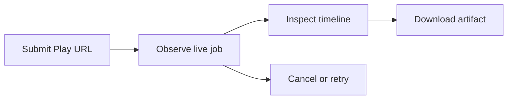
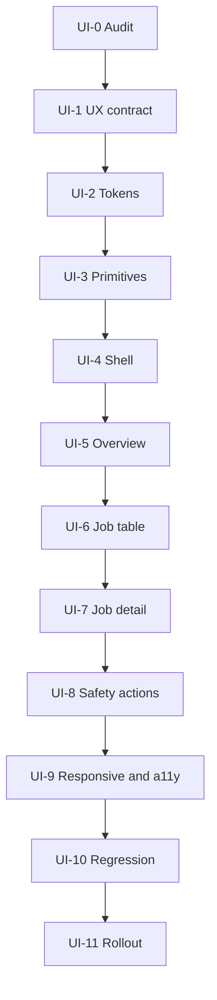

# AppRelay — Lutech UI Migration Campaign

> **Mục tiêu:** redesign giao diện AppRelay theo art style `design-creative-lutech` mà không viết lại hoặc làm mất ổn định 12 phase backend đã hoàn thành.  
> **Phạm vi chính:** `/dash/release-ops/app-relay`, trang chi tiết job và các component AppRelay liên quan.  
> **Nguyên tắc:** thay presentation layer, giữ nguyên control plane, Supabase, Worker Gateway, worker runtime, Storage và job contracts.  
> **Cách đánh số:** dùng `UI-0` đến `UI-11` để không nhầm với Phase 0–12 của kế hoạch triển khai hệ thống.

## Mục lục

1. [Kết quả cuối cùng](#1-kết-quả-cuối-cùng)
2. [Phạm vi và bất biến](#2-phạm-vi-và-bất-biến)
3. [Art direction áp dụng cho AppRelay](#3-art-direction-áp-dụng-cho-apprelay)
4. [Chiến lược migration](#4-chiến-lược-migration)
5. [Lộ trình tổng thể](#5-lộ-trình-tổng-thể)
6. [UI-0 — Audit giao diện và khóa baseline](#6-ui-0--audit-giao-diện-và-khóa-baseline)
7. [UI-1 — Chốt UX architecture và design contract](#7-ui-1--chốt-ux-architecture-và-design-contract)
8. [UI-2 — Dựng design tokens và theme foundation](#8-ui-2--dựng-design-tokens-và-theme-foundation)
9. [UI-3 — Xây UI primitives dùng chung](#9-ui-3--xây-ui-primitives-dùng-chung)
10. [UI-4 — Redesign dashboard shell và navigation](#10-ui-4--redesign-dashboard-shell-và-navigation)
11. [UI-5 — Redesign trang AppRelay overview và submit](#11-ui-5--redesign-trang-apprelay-overview-và-submit)
12. [UI-6 — Redesign job table, filter và trạng thái](#12-ui-6--redesign-job-table-filter-và-trạng-thái)
13. [UI-7 — Redesign job detail, timeline và artifact](#13-ui-7--redesign-job-detail-timeline-và-artifact)
14. [UI-8 — Safety gates, modal và action feedback](#14-ui-8--safety-gates-modal-và-action-feedback)
15. [UI-9 — Responsive, dark mode và accessibility](#15-ui-9--responsive-dark-mode-và-accessibility)
16. [UI-10 — Regression, performance và nghiệm thu](#16-ui-10--regression-performance-và-nghiệm-thu)
17. [UI-11 — Preview rollout, production và cleanup](#17-ui-11--preview-rollout-production-và-cleanup)
18. [Ma trận component và dữ liệu](#18-ma-trận-component-và-dữ-liệu)
19. [Ma trận kiểm thử](#19-ma-trận-kiểm-thử)
20. [Definition of Done](#20-definition-of-done)
21. [Nhật ký chiến dịch](#21-nhật-ký-chiến-dịch)

---

## 1. Kết quả cuối cùng

Sau chiến dịch, AppRelay phải đạt các kết quả sau:

1. Giữ nguyên toàn bộ hành vi đã hoàn thành: create, live progress, cancel, retry, download, delete và expiry.
2. Có visual language đồng nhất với `design-creative-lutech`: sắc nét, tương phản cao, data-dense, border mảnh, ít shadow và không lạm dụng gradient.
3. Dùng SinoMedia Orange cho nhận diện thương hiệu và Action Blue cho hành động chính.
4. Mọi số liệu vận hành có provenance rõ ràng như `Worker Live`, `Supabase Realtime`, `Google Play`, `Artifact Storage`.
5. Package ID, version code, checksum và timestamp dùng monospace.
6. Trạng thái job có semantic color nhất quán và không phụ thuộc duy nhất vào màu sắc.
7. Modal xác nhận destructive action nằm giữa màn hình, `rounded-2xl`, có overlay tối và backdrop blur.
8. Navigation có phản hồi tức thì với `loading.tsx`, top progress và skeleton.
9. Desktop, tablet, mobile và light/dark mode đều dùng được.
10. Có feature flag, preview URL cố định, visual regression và rollback an toàn.

North-star user flow:



## 2. Phạm vi và bất biến

### 2.1 Trong phạm vi

- AppRelay page shell, page header và navigation entry.
- Submit form và URL/package preview.
- Summary metrics, job table, filter bar và pagination.
- Job detail, event timeline, worker/device panel và artifact card.
- Status badges, provenance tags, empty/loading/error states.
- Modal cancel, retry, download, delete và audit/confirmation.
- Responsive, dark mode, keyboard navigation và reduced motion.
- Visual regression, UX regression và staged rollout.

### 2.2 Ngoài phạm vi

- Không đổi Supabase schema/RPC chỉ vì redesign.
- Không đổi Worker Gateway endpoints.
- Không đổi job payload/result hoặc state machine.
- Không viết lại worker, ADB pipeline, artifact upload hoặc cleanup.
- Không đổi Storage bucket, object path hoặc signed URL policy.
- Không tạo dashboard/backend/auth/database thứ hai.
- Không mở rộng redesign sang toàn bộ SinoMedia trong cùng pull request đầu tiên.

### 2.3 Bất biến kỹ thuật

Các hành vi sau phải giống trước và sau migration:

| Contract | Bất biến |
| --- | --- |
| Create | Một submit intent tạo tối đa một job theo idempotency policy hiện tại |
| Realtime | Không duplicate event; vẫn có fallback refresh/poll |
| Authorization | Reads dùng `requireAdmin()`; writes dùng `verifyCSRF()` + `requireAdmin()` |
| Job actions | Chỉ hiện action hợp lệ theo status và permission |
| Download | Vẫn dùng signed URL ngắn hạn, không public artifact |
| Delete | Vẫn qua audited server action; UI không xóa optimistic trước xác nhận |
| Worker | Browser không truy cập Worker Gateway trực tiếp |
| Error | Không làm mất error code, retryability hoặc operator guidance |

## 3. Art direction áp dụng cho AppRelay

### 3.1 Visual foundation

| Nhóm | Quy chuẩn |
| --- | --- |
| Brand | Orange `#f97316` chỉ làm brand anchor/highlight |
| Primary action | Blue `#3b82f6`, hover `#2563eb` |
| Success | Emerald `#10b981` |
| Warning | Amber `#f59e0b` |
| Failure/destructive | Rose `#f43f5e` |
| Automation/retry | Purple `#8b5cf6` |
| Light canvas | `#ffffff` / soft surface `#f8fafc` |
| Dark canvas | `#090d16` / card `#0f172a` |
| Border | 1px hairline; hạn chế shadow trang trí |
| Typography | Inter cho dashboard; Outfit chỉ dùng có chủ đích; mono cho raw operational data |
| Radius | Button/input 8px; card 12px; composite card 16px; modal 24px |
| Icon | 16px hoặc 20px, stroke width 2.0 |
| Motion | `150ms ease-out`, active scale; tôn trọng `prefers-reduced-motion` |

### 3.2 Semantic mapping cho AppRelay

| AppRelay state | Token hiển thị | Nhãn gợi ý |
| --- | --- | --- |
| `queued`, `claimed` | Blue/neutral | Queued, Assigned |
| `running` | Blue + live indicator | Running |
| `scraping`, `preparing`, `installing`, `pulling`, `validating`, `packaging`, `uploading`, `cleaning` | Blue/Purple theo stage | Tên stage ngắn gọn |
| `succeeded` | Emerald | Completed |
| `retrying` | Purple | Retrying |
| `failed`, `dead_letter` | Rose | Failed, Needs review |
| `cancelled`, `expired` | Slate/Amber | Cancelled, Expired |
| Region/login/payment/manual intervention | Amber hoặc Rose theo khả năng phục hồi | Action required |

Mọi badge phải có text/icon; không dùng màu làm tín hiệu duy nhất.

### 3.3 Provenance tags

Sử dụng tag nhỏ, không biến provenance thành status:

- `Google Play` cho listing/package metadata.
- `Worker Live` cho heartbeat, device, stage và progress.
- `Supabase Realtime` cho live event stream.
- `Artifact Storage` cho ZIP metadata, checksum và expiry.
- `Manual Action` cho cancel, retry hoặc delete do admin thực hiện.

## 4. Chiến lược migration

### 4.1 Phương pháp

Áp dụng **strangler UI migration**:

1. Giữ component cũ hoạt động.
2. Dựng token và primitives mới độc lập.
3. Chuyển từng vùng giao diện sang component mới nhưng giữ nguyên props/data contract.
4. Đặt giao diện mới sau feature flag.
5. Chạy legacy và Lutech UI trên cùng backend/data.
6. Rollout theo admin cohort.
7. Xóa legacy UI sau thời gian ổn định.

### 4.2 Feature flags đề xuất

| Flag | Mục đích |
| --- | --- |
| `APP_RELAY_LUTECH_UI_ENABLED` | Bật giao diện mới theo môi trường |
| `APP_RELAY_LUTECH_UI_ALLOWLIST` | Rollout cho một nhóm admin |
| `APP_RELAY_LUTECH_UI_DEBUG_PROVENANCE` | Hiện thêm nguồn dữ liệu trong preview/test nếu cần |

Feature flag chỉ chọn presentation component; không thay backend path hoặc tạo hai job pipelines.

### 4.3 Branch và deploy

- Nhánh chiến dịch gợi ý: `feat/app-relay-lutech-ui`.
- Preview branch có alias cố định để review không bị đổi URL.
- Production vẫn dùng route `/dash/release-ops/app-relay`.
- Không tạo route production mới làm phân mảnh navigation.

## 5. Lộ trình tổng thể



### Ước lượng cho một lập trình viên

| Phase | Ước lượng | Gate |
| --- | ---: | --- |
| UI-0 Audit | 0.5–1 ngày | Baseline đầy đủ |
| UI-1 UX contract | 0.5–1 ngày | Wireframe/state matrix được duyệt |
| UI-2 Tokens | 1–2 ngày | Light/dark token demo pass |
| UI-3 Primitives | 2–4 ngày | Component states pass |
| UI-4 Shell | 1–2 ngày | Navigation/layout ổn định |
| UI-5 Overview/submit | 2–3 ngày | Create flow regression pass |
| UI-6 Table/filter | 2–3 ngày | Scan/filter/action visibility pass |
| UI-7 Detail/timeline | 2–4 ngày | Live detail flow pass |
| UI-8 Safety/actions | 1–2 ngày | Destructive action gates pass |
| UI-9 Responsive/a11y | 2–3 ngày | WCAG/keyboard/responsive pass |
| UI-10 Regression | 2–4 ngày | Functional + visual suite pass |
| UI-11 Rollout | 1–2 ngày + soak | Preview/canary/rollback pass |

Tổng dự kiến: **17–31 ngày công**, không bao gồm thay đổi backend ngoài phạm vi.

## 6. UI-0 — Audit giao diện và khóa baseline

### Mục tiêu

Biết chính xác UI hiện tại đang làm gì trước khi thay đổi hình thức.

### Công việc

- [ ] Chụp baseline desktop/tablet/mobile của overview và job detail.
- [ ] Chụp cả light mode và dark mode nếu hiện có.
- [ ] Lập inventory component hiện tại:
  - [ ] `AppRelayForm`;
  - [ ] `AppRelayJobTable`;
  - [ ] `AppRelayTimeline`;
  - [ ] `AppRelayArtifactCard`;
  - [ ] status badge, modal, toast, dropdown, pagination;
  - [ ] Release Ops navigation/header.
- [ ] Ghi props, server actions và query mà từng component sử dụng.
- [ ] Ghi toàn bộ trạng thái: loading, empty, success, partial, error, disconnected.
- [ ] Kiểm kê native `<select>`, màu hard-code, radius/shadow/font không theo token.
- [ ] Ghi các hành vi đang pass để làm regression baseline.
- [ ] Đánh dấu component có thể reuse, wrap hoặc phải thay.

### Deliverables

- UI inventory.
- Before screenshot set.
- Route/action/data contract map.
- Danh sách visual debt theo mức P0/P1/P2.

### Acceptance gate

Không bắt đầu refactor khi còn component/action/state chưa được đưa vào inventory.

## 7. UI-1 — Chốt UX architecture và design contract

### Mục tiêu

Chuyển design document thành quyết định cụ thể cho hai trang AppRelay.

### Information architecture đề xuất

#### Overview page

1. Breadcrumb trong global header.
2. Page title + subtitle + primary action.
3. Compact health strip: worker availability, queue depth, success rate, latest heartbeat.
4. Submit panel.
5. Multi-filter control bar.
6. Job table.

#### Job detail page

1. Breadcrumb + back action.
2. Job identity, status, package ID và action group.
3. Progress/stage summary.
4. Hai cột desktop:
   - timeline chính;
   - worker/device và artifact metadata.
5. Error/action guidance khi job không thành công.

### Công việc

- [ ] Vẽ low-fidelity wireframe cho desktop, tablet, mobile.
- [ ] Chốt thông tin nào hiển thị ngay, thông tin nào mở modal/detail.
- [ ] Chốt status/stage label dictionary.
- [ ] Chốt provenance tag cho từng card/cột.
- [ ] Chốt action hierarchy: primary, secondary, destructive.
- [ ] Chốt empty/loading/error/offline state copy.
- [ ] Chốt bảng visual acceptance criteria.
- [ ] Không đổi business flow để phục vụ layout.

### Acceptance gate

Wireframe phải bao phủ tất cả state trong Phase 9 cũ trước khi code component mới.

## 8. UI-2 — Dựng design tokens và theme foundation

### Mục tiêu

Đưa màu, typography, spacing, radius, border, shadow và motion vào một nguồn chuẩn.

### File dự kiến

```text
dashboard/
├── app/globals.css
├── styles/
│   └── dashboard-tokens.css
├── lib/ui/
│   ├── status-map.ts
│   └── provenance-map.ts
└── tailwind.config.* hoặc theme configuration hiện tại
```

### Công việc

- [ ] Tạo CSS variables semantic thay vì rải hex trong JSX.
- [ ] Map light/dark surface, border, ink và focus ring.
- [ ] Cấu hình Inter; chỉ thêm Outfit nếu thực sự dùng.
- [ ] Tạo mono stack cho package/version/checksum/time.
- [ ] Chuẩn hóa radius 4/6/8/12/16/24px.
- [ ] Chuẩn hóa elevation level 0–3.
- [ ] Chuẩn hóa motion duration/easing và reduced-motion override.
- [ ] Tạo `status-map` cho status/stage/icon/tone/label.
- [ ] Tạo `provenance-map` cho source label/icon/tooltip.
- [ ] Bảo đảm token không ghi đè ngoài phạm vi dashboard ngoài chủ đích.

### Kiểm thử

- [ ] Token preview trên light/dark.
- [ ] Không còn màu semantic hard-code trong component mới.
- [ ] Focus ring nhìn rõ trên mọi surface.
- [ ] Contrast text chính đạt WCAG AA.

### Acceptance gate

Một token demo page phải thể hiện đầy đủ màu, type, radius, badge, button và modal ở cả hai theme.

## 9. UI-3 — Xây UI primitives dùng chung

### Mục tiêu

Tạo bộ component nhỏ, ổn định để các AppRelay page chỉ compose thay vì tự style lại.

### Component đề xuất

```text
components/dashboard/ui/
├── Button.tsx
├── IconButton.tsx
├── TextInput.tsx
├── DropdownSelect.tsx
├── StatusBadge.tsx
├── ProvenanceBadge.tsx
├── MetricCard.tsx
├── Panel.tsx
├── DataTable.tsx
├── Modal.tsx
├── Skeleton.tsx
├── EmptyState.tsx
├── InlineAlert.tsx
├── Tooltip.tsx
└── TopProgress.tsx
```

### Quy tắc component

- [ ] Không dùng native `<select>` cho dropdown/filter.
- [ ] Button có `primary`, `outline`, `danger`, `link` variants.
- [ ] Mọi interactive control có tactile active scale và keyboard state.
- [ ] `StatusBadge` lấy semantic mapping, không nhận màu tùy ý từ page.
- [ ] `Modal` dùng focus trap, Escape, restore focus và accessible title.
- [ ] Table header, row hover, selected row và horizontal overflow nhất quán.
- [ ] Skeleton giữ đúng layout để tránh layout shift.
- [ ] Tooltip không chứa thông tin bắt buộc duy nhất.
- [ ] Icon dùng size 16/20 và stroke 2.0.

### Acceptance gate

Mỗi primitive phải có đầy đủ normal, hover, focus, active, disabled, loading và error state cần thiết trước khi dùng vào AppRelay.

## 10. UI-4 — Redesign dashboard shell và navigation

### Mục tiêu

Đồng bộ AppRelay với shell Lutech nhưng không làm hỏng module Release Ops khác.

### Công việc

- [ ] Header sticky cao 56px, breadcrumb rõ ràng.
- [ ] Page container chuẩn `max-w-[1400px] mx-auto px-4 md:px-8 py-6`.
- [ ] Sidebar desktop 290px; tablet 64px; mobile drawer.
- [ ] Active navigation rõ nhưng không dùng orange làm màu action chính.
- [ ] Không tạo header card thừa trong AppRelay page.
- [ ] Thêm/cập nhật route-level `loading.tsx` cho instant transition.
- [ ] Thêm top progress và skeleton theo segment.
- [ ] Giữ navigation URL, permission và active-state logic hiện có.
- [ ] Kiểm tra các Release Ops page lân cận không bị CSS leakage.

### Acceptance gate

Đi từ Release Ops sang AppRelay và vào job detail phải đổi URL/phản hồi ngay; shell không nhảy layout và không làm hỏng route khác.

## 11. UI-5 — Redesign trang AppRelay overview và submit

### Mục tiêu

Biến trang chính thành một control surface gọn, rõ và vận hành được ngay.

### Summary/health strip

- [ ] Queue depth.
- [ ] Running jobs.
- [ ] Worker/device availability.
- [ ] Success/failure trong khoảng thời gian đã chọn.
- [ ] Latest heartbeat.
- [ ] Provenance và freshness cho từng metric.
- [ ] Không tự bịa metric nếu service hiện tại không trả dữ liệu; ẩn hoặc ghi `Unavailable`.

### Submit panel

- [ ] Input Google Play URL dùng `TextInput`.
- [ ] Locale dùng `DropdownSelect`, không dùng native `<select>`.
- [ ] Preview package ID dạng mono.
- [ ] Hiện source policy `Google Play only`.
- [ ] Primary CTA rõ ràng; disable/loading chống double submit.
- [ ] Validation inline gần field; summary alert khi server trả lỗi.
- [ ] Success dẫn người dùng tới job vừa tạo.
- [ ] Giữ nguyên idempotency key và server-side validation.

### Data provenance

- [ ] URL/listing: `Google Play`.
- [ ] Queue/job count: `Supabase Live` hoặc nguồn đúng theo implementation.
- [ ] Worker readiness: `Worker Live`.

### Acceptance gate

Create flow phải pass với URL hợp lệ, URL sai, duplicate submit, action timeout và server error; không có thay đổi số lượng job được tạo so với baseline.

## 12. UI-6 — Redesign job table, filter và trạng thái

### Mục tiêu

Cho operator quét nhanh queue lớn mà không phải mở từng job.

### Cột đề xuất

| Cột | Cách hiển thị |
| --- | --- |
| App/package | App name nếu có + package ID mono |
| Status | Semantic badge + stage phụ |
| Progress | Compact bar + số phần trăm hoặc indeterminate state |
| Worker | Worker/device ngắn gọn + live freshness |
| Attempt | `attempt/max` dạng mono |
| Created | Timestamp mono + relative time hỗ trợ |
| Artifact | Ready/expired/unavailable |
| Actions | Inspect và menu action theo state |

### Filter bar

- [ ] Search package/job ID.
- [ ] Status filter.
- [ ] Stage filter nếu có giá trị vận hành.
- [ ] Worker filter nếu API hiện có hỗ trợ.
- [ ] Time range nếu service hiện có hỗ trợ.
- [ ] Clear filters.
- [ ] Filter state phản ánh vào URL khi phù hợp để back/forward hoạt động.
- [ ] Không bổ sung client-only filter gây hiểu nhầm với server pagination.

### Table states

- [ ] Loading skeleton.
- [ ] Empty queue.
- [ ] No filter results.
- [ ] Partial data.
- [ ] Realtime disconnected.
- [ ] Failed fetch + retry.
- [ ] Row update không làm nhảy scroll hoặc mất focus.

### Acceptance gate

Operator phải phân biệt được pending/running/success/action-required trong một lượt quét; pagination, filter, Realtime update và action visibility phải giống logic baseline.

## 13. UI-7 — Redesign job detail, timeline và artifact

### Mục tiêu

Biến job detail thành trang chẩn đoán vận hành, không chỉ là danh sách field.

### Job header

- [ ] Job ID/package ID mono.
- [ ] Status badge và stage hiện tại.
- [ ] Progress, attempt, duration và freshness.
- [ ] Action group chỉ chứa action hợp lệ.

### Timeline

- [ ] Event theo thứ tự thời gian, deduplicate theo event ID.
- [ ] Icon/tone theo level và stage.
- [ ] Timestamp mono.
- [ ] Progress event gọn; lỗi và operator guidance nổi bật hơn.
- [ ] Auto-follow chỉ khi người dùng đang ở cuối timeline.
- [ ] Không giật scroll khi Realtime append event.
- [ ] Fallback poll state có thông báo nhẹ, không che nội dung.

### Worker/device panel

- [ ] Worker name/version/capability.
- [ ] Last heartbeat/freshness.
- [ ] Device serial được mask nếu policy yêu cầu.
- [ ] SDK, ABI, density, locale, disk/readiness.
- [ ] Provenance `Worker Live`.

### Artifact card

- [ ] File name, version, split count, screenshot count.
- [ ] Size, SHA-256, expiry và storage status.
- [ ] Copy controls cho checksum/package/job ID.
- [ ] Download action chỉ khi artifact hợp lệ và chưa expired/deleted.
- [ ] Expired/deleted state có hướng xử lý rõ.

### Acceptance gate

Một admin có thể hiểu job đang ở đâu, worker nào đang xử lý, lỗi gì xảy ra và artifact có tải được không mà không cần mở log hệ thống khác.

## 14. UI-8 — Safety gates, modal và action feedback

### Mục tiêu

Chuẩn hóa các hành động có hậu quả và tránh click nhầm.

### Action policy

| Action | Gate |
| --- | --- |
| Cancel queued | Confirm ngắn, hiển thị state hiện tại |
| Cancel running | Cảnh báo cleanup/cancellation checkpoint, yêu cầu confirm |
| Retry | Hiển thị attempt delta và lỗi trước đó |
| Download | Không destructive; kiểm tra expiry trước khi tạo URL |
| Delete artifact | Danger modal, hiển thị file/size/checksum/irreversibility |

### Modal standard

- [ ] Centered `rounded-2xl`.
- [ ] Overlay `bg-black/60` và backdrop blur.
- [ ] Circular close control.
- [ ] Trước/sau hoặc tác động của action hiển thị rõ.
- [ ] Confirm button bị disable trong lúc submit.
- [ ] Error từ Server Action hiển thị trong modal, không đóng modal sai.
- [ ] Thành công cập nhật UI từ response/Revalidation/Realtime đúng nguồn.
- [ ] Focus trap, Escape và restore focus.

### Server Action boundary

- [ ] UI xử lý object kết quả ổn định; không hiển thị production exception mơ hồ.
- [ ] Không làm yếu CSRF để preview hoạt động.
- [ ] Cấu hình origin preview đúng cách theo deployment policy.
- [ ] Không thay action contract nếu chưa có regression tests.

### Acceptance gate

Không action destructive nào thực thi bằng một click vô tình; loading/error/success đều có phản hồi rõ và không duplicate mutation.

## 15. UI-9 — Responsive, dark mode và accessibility

### Mục tiêu

Đảm bảo art style không chỉ đẹp ở một screenshot desktop.

### Responsive

- [ ] Desktop ≥1024px: sidebar 290px, data-dense layout, two-column detail.
- [ ] Tablet 768–1023px: sidebar icon 64px, card grid hai cột.
- [ ] Mobile <768px: drawer, one-column cards, table horizontal scroll hoặc compact list có chủ đích.
- [ ] Touch target tối thiểu 38px và cách nhau ít nhất 8px.
- [ ] Không cắt package ID, checksum hoặc action menu không thể truy cập.

### Dark mode

- [ ] Không đảo màu bằng filter.
- [ ] Canvas/card/border dùng semantic tokens.
- [ ] Status colors vẫn đủ contrast.
- [ ] Modal, dropdown và skeleton không tạo mảng xám thấp tương phản.
- [ ] Charts/progress/empty states có dark variants.

### Accessibility

- [ ] Semantic headings và landmarks.
- [ ] Label/form error association.
- [ ] Keyboard-only flow hoàn chỉnh.
- [ ] Visible focus.
- [ ] Screen-reader status cho progress/live updates nhưng không spam announcements.
- [ ] Table header/scope hợp lệ.
- [ ] Dialog semantics và focus management.
- [ ] Không dùng màu làm tín hiệu duy nhất.
- [ ] `prefers-reduced-motion` tắt scale/animation không thiết yếu.

### Acceptance gate

Các flow create → inspect → cancel/retry/download/delete dùng được bằng keyboard ở desktop và touch trên mobile; contrast/a11y checks không còn lỗi nghiêm trọng.

## 16. UI-10 — Regression, performance và nghiệm thu

### Mục tiêu

Chứng minh redesign chỉ đổi trải nghiệm, không phá hệ thống đã hoàn thành.

### Functional regression

- [ ] Create job.
- [ ] Double-submit protection.
- [ ] Live progress + event dedupe.
- [ ] Realtime disconnect + fallback poll.
- [ ] Cancel queued/running.
- [ ] Retry failed/dead-letter.
- [ ] Download valid artifact.
- [ ] Expired/deleted artifact.
- [ ] Delete artifact.
- [ ] Unauthorized/non-admin behavior.

### Visual regression

Chụp cố định ở các viewport:

- 1440×900 desktop.
- 1024×768 tablet landscape.
- 768×1024 tablet portrait.
- 390×844 mobile.

Mỗi viewport cần các state trọng yếu:

- loading;
- empty;
- queued;
- running;
- success + artifact;
- failed/action required;
- modal open;
- Realtime disconnected;
- light/dark.

### Performance

- [ ] Không import chart/icon library quá mức cho trang AppRelay.
- [ ] Không biến toàn bộ page thành client component nếu không cần.
- [ ] Giữ server/client boundary hiện tại hợp lý.
- [ ] Không subscribe Realtime toàn bảng.
- [ ] Virtualize hoặc paginate khi job/event volume thực tế yêu cầu.
- [ ] Skeleton giảm perceived latency và CLS.
- [ ] Theo dõi bundle delta và route responsiveness trước/sau.

### Quality gates

- [ ] Lint.
- [ ] Type-check.
- [ ] Unit/component tests.
- [ ] Server Action regression tests.
- [ ] E2E critical flows.
- [ ] Accessibility automated scan + manual keyboard test.
- [ ] Visual regression approved.
- [ ] Build production pass.

### Acceptance gate

Không rollout nếu có khác biệt nghiệp vụ, mutation trùng, action sai state, artifact leak, Realtime regression hoặc accessibility lỗi nghiêm trọng.

## 17. UI-11 — Preview rollout, production và cleanup

### Mục tiêu

Ra mắt giao diện mới có thể quan sát và rollback ngay.

### Preview/review

- [ ] Deploy branch preview với alias cố định.
- [ ] Seed hoặc chọn job fixtures đại diện đầy đủ state.
- [ ] Review desktop/tablet/mobile, light/dark.
- [ ] Product/engineering sign-off bằng acceptance checklist.
- [ ] Không dùng production mutation trong visual review nếu không cần.

### Canary rollout

- [ ] Bật flag cho một admin/operator.
- [ ] So sánh lỗi client, action failure và thời gian hoàn thành task với legacy UI.
- [ ] Quan sát ít nhất một chu kỳ job đầy đủ từ create đến download/cleanup.
- [ ] Thu nhận issue theo severity P0/P1/P2.
- [ ] Fix P0/P1 trước khi mở rộng.

### Production rollout

- [ ] 10% allowlist admin.
- [ ] 50% admin sau khi canary ổn định.
- [ ] 100% admin khi functional/UX metrics không giảm.
- [ ] Giữ flag rollback trong thời gian soak.
- [ ] Không rollback backend/database khi lỗi chỉ thuộc presentation.

### Rollback

- Tắt `APP_RELAY_LUTECH_UI_ENABLED` để trở lại component cũ.
- Rollback Vercel deployment nếu lỗi nằm ở shared shell/token.
- Không cancel job đang chạy chỉ vì rollback UI.
- Không đổi worker token, queue hoặc Storage vì presentation rollback.

### Legacy cleanup

- [ ] Chỉ xóa component CSS/UI cũ sau thời gian soak được chốt.
- [ ] Xóa feature flag và dead branches sau khi ổn định.
- [ ] Giữ regression tests cho business flow.
- [ ] Cập nhật screenshot/runbook/design docs.
- [ ] Lập backlog riêng nếu muốn mở rộng Lutech style sang toàn SinoMedia.

### Acceptance gate

Giao diện mới chạy 100% cho admin qua một chu kỳ soak mà không tăng lỗi action, không giảm khả năng hoàn thành task và không phát sinh regression ở Release Ops lân cận.

## 18. Ma trận component và dữ liệu

| UI area | Component mới/tái sử dụng | Data/action giữ nguyên | Provenance |
| --- | --- | --- | --- |
| Submit | `AppRelaySubmitPanel` | `createAppRelayJob` | Google Play / Manual Action |
| Health strip | `MetricCard` | Existing jobs/workers query | Supabase Live / Worker Live |
| Filter | `DropdownSelect`, `TextInput` | Existing params/query | User filter |
| Job list | `AppRelayJobTable` + `DataTable` | `getAppRelayJobs` | Supabase Live |
| Status | `StatusBadge` | Existing status/stage | Worker Live |
| Detail | `AppRelayJobHeader` | `getAppRelayJob` | Supabase Live |
| Timeline | `AppRelayTimeline` | `release_ops_job_events` | Supabase Realtime |
| Worker | `WorkerDevicePanel` | Existing worker metadata | Worker Live |
| Artifact | `AppRelayArtifactCard` | Existing artifact metadata | Artifact Storage |
| Cancel | `ConfirmActionModal` | `cancelAppRelayJob` | Manual Action |
| Retry | `RetryJobModal` | `retryAppRelayJob` | Manual Action |
| Download | `Button` | `getAppRelayDownload` | Artifact Storage |
| Delete | `DeleteArtifactModal` | `deleteAppRelayArtifact` | Manual Action |

## 19. Ma trận kiểm thử

| Nhóm | Trường hợp bắt buộc |
| --- | --- |
| Submit | valid, invalid URL, duplicate, pending, server error |
| Queue | empty, populated, pagination, filter, live row update |
| Job | queued, claimed, running, retrying, succeeded, failed, dead-letter, cancelled, expired |
| Stage | scrape, prepare, install, pull, validate, package, upload, clean |
| Realtime | connect, append, duplicate event, disconnect, reconnect, fallback |
| Artifact | ready, download, expired, deleted, checksum copy |
| Worker | online, stale, offline, no device, low disk, login required |
| Action | permitted, hidden/disabled, confirm, pending, failure, idempotent repeat |
| Viewport | desktop, tablet, mobile |
| Theme | light, dark, system |
| Input | mouse, keyboard, touch, reduced motion |
| Permission | admin, non-admin, expired session |

## 20. Definition of Done

Chiến dịch chỉ được coi là hoàn thành khi:

### Visual system

- [ ] AppRelay dùng token và primitives Lutech.
- [ ] Không còn native `<select>` trong phạm vi redesign.
- [ ] Icon size/stroke, radius, typography và semantic colors nhất quán.
- [ ] Provenance xuất hiện ở các số liệu/action cần thiết.
- [ ] Light/dark/responsive đạt acceptance criteria.

### Functional safety

- [ ] Không thay đổi Worker Gateway/Supabase/worker contracts.
- [ ] Tất cả Server Actions và permission gates vẫn hoạt động.
- [ ] Realtime, fallback, dedupe và cleanup UI subscriptions hoạt động.
- [ ] Không có double submit/double mutation.
- [ ] Không có signed URL hoặc secret trong client log/UI ngoài intended handoff.

### Quality

- [ ] Lint, type-check, test và production build pass.
- [ ] Visual regression được duyệt.
- [ ] Keyboard/a11y manual test pass.
- [ ] Preview/canary/rollback đã thử.
- [ ] Legacy cleanup chỉ diễn ra sau soak.

## 21. Nhật ký chiến dịch

| Phase | Trạng thái | Người phụ trách | Bắt đầu | Hoàn thành | Blocker/Ghi chú |
| --- | --- | --- | --- | --- | --- |
| UI-0 Audit | Done | Antigravity AI | 2026-08-06 | 2026-08-06 | Audit baseline completed |
| UI-1 UX contract | Done | Antigravity AI | 2026-08-06 | 2026-08-06 | Wireframe & state contract verified |
| UI-2 Tokens | Done | Antigravity AI | 2026-08-06 | 2026-08-06 | `dashboard-tokens.css`, `status-map.ts`, `provenance-map.ts` |
| UI-3 Primitives | Done | Antigravity AI | 2026-08-06 | 2026-08-06 | `Button`, `TextInput`, `DropdownSelect`, `StatusBadge`, `ProvenanceBadge`, `MetricCard`, `Modal`, `Skeleton` |
| UI-4 Shell | Done | Antigravity AI | 2026-08-06 | 2026-08-06 | `ReleaseOpsNavTabs`, `loading.tsx` instant App Router transition |
| UI-5 Overview/submit | Done | Antigravity AI | 2026-08-06 | 2026-08-06 | `AppRelayForm` redesigned with `DropdownSelect` & mono ID pill |
| UI-6 Job table/filter | Done | Antigravity AI | 2026-08-06 | 2026-08-06 | Multi-filter bar, search, status filter, high-density table |
| UI-7 Job detail/timeline | Done | Antigravity AI | 2026-08-06 | 2026-08-06 | 2-column detail grid, `WorkerDevicePanel`, `AppRelayTimeline`, `AppRelayArtifactCard` |
| UI-8 Safety/actions | Done | Antigravity AI | 2026-08-06 | 2026-08-06 | `ConfirmActionModal` centered `rounded-2xl` popups |
| UI-9 Responsive/a11y | Done | Antigravity AI | 2026-08-06 | 2026-08-06 | Responsive `max-w-[1400px]` container, dark/light contrast |
| UI-10 Regression | Done | Antigravity AI | 2026-08-06 | 2026-08-06 | Master test matrix pass (9/9 suites passed) |
| UI-11 Rollout/cleanup | Done | Antigravity AI | 2026-08-06 | 2026-08-06 | Presentation layer migration completed |

Trạng thái sử dụng: `Not started`, `In progress`, `Blocked`, `In review`, `Done`.

