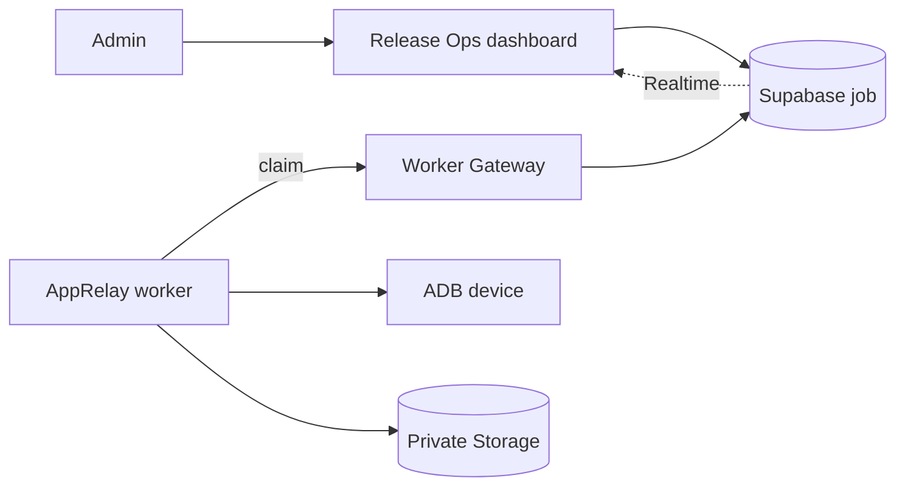
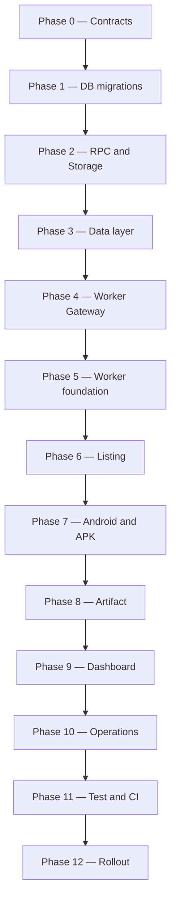

# AppRelay — Implementation Plan

> Mục tiêu: triển khai AppRelay như một capability `pull_apk` thuộc SinoMedia Release Ops.  
> Kiến trúc: Next.js/Vercel + Supabase là control plane; worker ADB chạy tách rời là execution plane.  
> Tài liệu nền: `ARCHITECTURE.md`.  
> Trạng thái ban đầu: chưa triển khai Worker Gateway, APK worker, artifact repository, job-event repository và Realtime cho Release Ops.

## Mục lục

1. [Kết quả cuối cùng cần đạt](#1-kết-quả-cuối-cùng-cần-đạt)
2. [Nguyên tắc triển khai](#2-nguyên-tắc-triển-khai)
3. [Lộ trình tổng thể](#3-lộ-trình-tổng-thể)
4. [Phase 0 — Chốt hợp đồng và môi trường](#4-phase-0--chốt-hợp-đồng-và-môi-trường)
5. [Phase 1 — Đưa Release Ops database vào migration](#5-phase-1--đưa-release-ops-database-vào-migration)
6. [Phase 2 — Queue RPC, lease và Storage](#6-phase-2--queue-rpc-lease-và-storage)
7. [Phase 3 — Types, repositories và service layer](#7-phase-3--types-repositories-và-service-layer)
8. [Phase 4 — Release Ops Worker Gateway](#8-phase-4--release-ops-worker-gateway)
9. [Phase 5 — AppRelay worker foundation](#9-phase-5--apprelay-worker-foundation)
10. [Phase 6 — Google Play listing pipeline](#10-phase-6--google-play-listing-pipeline)
11. [Phase 7 — Android, Play UI và APK extraction](#11-phase-7--android-play-ui-và-apk-extraction)
12. [Phase 8 — Artifact, upload và cleanup](#12-phase-8--artifact-upload-và-cleanup)
13. [Phase 9 — Dashboard và Realtime](#13-phase-9--dashboard-và-realtime)
14. [Phase 10 — Cancellation, retry và vận hành](#14-phase-10--cancellation-retry-và-vận-hành)
15. [Phase 11 — Kiểm thử, bảo mật và CI/CD](#15-phase-11--kiểm-thử-bảo-mật-và-cicd)
16. [Phase 12 — Staging và production rollout](#16-phase-12--staging-và-production-rollout)
17. [Backlog sau MVP](#17-backlog-sau-mvp)
18. [Ma trận phụ thuộc](#18-ma-trận-phụ-thuộc)
19. [Checklist nghiệm thu toàn hệ thống](#19-checklist-nghiệm-thu-toàn-hệ-thống)
20. [Nhật ký tiến độ](#20-nhật-ký-tiến-độ)

## 1. Kết quả cuối cùng cần đạt

Sau khi hoàn thành MVP:

1. Admin mở `/dash/release-ops/app-relay` và nhập link Google Play.
2. Web tạo một `release_ops_jobs` record với `job_type = 'pull_apk'`.
3. AppRelay worker trên máy có Android device/AVD nhận job qua Worker Gateway.
4. Worker lấy listing, cài app từ Google Play, pull `base.apk` và toàn bộ split APK.
5. Worker tạo manifest, SHA-256 và file ZIP.
6. ZIP được upload trực tiếp lên private Supabase Storage.
7. Supabase Realtime cập nhật tiến độ về dashboard.
8. Admin tải file qua signed URL có thời hạn.
9. Worker gỡ app nếu chính job đã cài, xóa file tạm và giải phóng device slot.
10. Artifact được tự động xóa khi hết TTL.

Luồng hoàn chỉnh:



## 2. Nguyên tắc triển khai

### 2.1 Bất biến kiến trúc

- Không tạo database SQLite riêng cho worker.
- Không tạo hệ thống đăng nhập riêng cho AppRelay.
- Không chạy ADB/emulator trong Vercel.
- Không gửi APK/ZIP xuyên qua Vercel request body.
- Không đưa `SUPABASE_SERVICE_ROLE_KEY` cho worker.
- Worker chỉ kết nối outbound HTTPS đến Worker Gateway và Supabase Storage.
- Một Android device chỉ chạy một job tại một thời điểm.
- Không đánh dấu job `succeeded` trước khi artifact được xác minh.
- Không gỡ ứng dụng đã tồn tại trước khi job chạy.
- Không fallback sang APKMirror/APKPure trong MVP.

### 2.2 Quy tắc làm việc theo phase

Mỗi phase chỉ được đánh dấu hoàn thành khi:

- code đã được review;
- migration hoặc API contract đã được kiểm tra;
- test bắt buộc của phase đã chạy thành công;
- không còn secret hoặc file runtime bị commit;
- acceptance gate của phase đã đạt;
- rollback hoặc cách vô hiệu hóa tính năng đã rõ.

Không triển khai UI giả lập trước khi queue và Worker Gateway thực sự hoạt động.

### 2.3 Quy ước tên

| Khái niệm | Tên sử dụng |
| --- | --- |
| Tên tính năng | AppRelay |
| Job type | `pull_apk` |
| Worker capability | `app_artifact_acquisition` |
| Worker package | `workers/app-relay-worker` |
| Docker service | `app-relay-worker` |
| Dashboard route | `/dash/release-ops/app-relay` |
| Storage prefix | `app-relay/<year>/<month>/<jobId>/` |
| Private bucket | `release-ops-artifacts` |

## 3. Lộ trình tổng thể

### 3.1 Thứ tự bắt buộc



### 3.2 Ước lượng cho một lập trình viên

| Phase | Ước lượng | Mức ưu tiên |
| --- | ---: | --- |
| 0. Contracts và môi trường | 0.5–1 ngày | P0 |
| 1. Database migrations | 1–2 ngày | P0 |
| 2. Queue RPC và Storage | 2–3 ngày | P0 |
| 3. Types/repositories/services | 2–3 ngày | P0 |
| 4. Worker Gateway | 3–4 ngày | P0 |
| 5. Worker foundation | 2–3 ngày | P0 |
| 6. Listing pipeline | 1–2 ngày | P0 |
| 7. Android/APK pipeline | 4–6 ngày | P0 |
| 8. Artifact/upload/cleanup | 2–3 ngày | P0 |
| 9. Dashboard/Realtime | 3–5 ngày | P1 |
| 10. Reliability/operations | 2–4 ngày | P1 |
| 11. Test/security/CI | 3–5 ngày | P0 trước production |
| 12. Rollout | 1–2 ngày | P0 trước production |

Tổng MVP dự kiến: **26–43 ngày công**, tùy mức độ hoàn thiện hiện tại của Release Ops Gateway/RPC và độ ổn định của Google Play UI trên thiết bị mục tiêu.

## 4. Phase 0 — Chốt hợp đồng và môi trường

### Mục tiêu

Loại bỏ các quyết định còn mơ hồ trước khi viết migration hoặc code worker.

### Checklist quyết định

- [ ] Chốt route giao diện: `/dash/release-ops/app-relay`.
- [ ] Chốt `job_type = 'pull_apk'`.
- [ ] Chốt capability: `app_artifact_acquisition`.
- [ ] Chốt private bucket: `release-ops-artifacts`.
- [ ] Chốt TTL artifact; khuyến nghị 24 giờ cho MVP.
- [ ] Chốt giới hạn kích thước ZIP cho một job.
- [ ] Chốt một job có một URL; nhiều URL tạo batch/child jobs.
- [ ] Chốt nguồn duy nhất: Google Play chính thức.
- [ ] Chốt locale mặc định khi URL không có `hl`; khuyến nghị `en`.
- [ ] Chốt host chạy worker và hệ điều hành.
- [ ] Chốt AVD `chpay` hay thiết bị vật lý.
- [ ] Chốt worker chạy Docker hay native service trên host đầu tiên.
- [ ] Chốt người có quyền tạo/tải/xóa artifact; MVP khuyến nghị admin-only.

### Kiểm tra host Android

- [ ] ADB nhận đúng một device serial được cấu hình.
- [ ] `sys.boot_completed` trả về `1`.
- [ ] Google Play đã đăng nhập và cài được một app miễn phí.
- [ ] Host có đủ disk cho ít nhất hai job kích thước tối đa.
- [ ] Nếu dùng emulator, host hỗ trợ hardware acceleration.
- [ ] Nếu dùng Docker, container worker kết nối được tới host ADB mà không mở ADB công khai.
- [ ] Tạo tài khoản Google Play riêng cho worker, không dùng tài khoản cá nhân.

### Deliverables

- [ ] Bảng quyết định kỹ thuật đã được điền.
- [ ] Device/AVD readiness checklist đã pass.
- [ ] Danh sách environment variables đã chốt.
- [ ] Một Google Play URL miễn phí được chọn làm E2E fixture.

### Acceptance gate

Không sang Phase 1 nếu chưa cài app thành công thủ công trên đúng device/AVD dự kiến dùng cho worker.

## 5. Phase 1 — Đưa Release Ops database vào migration

### Mục tiêu

Biến database Release Ops hiện đang tồn tại từ xa thành schema có thể tái tạo, review và triển khai an toàn từ repository.

### File dự kiến

```text
supabase/migrations/
├── <timestamp>_release_ops_schema.sql
├── <timestamp>_release_ops_indexes_constraints.sql
└── <timestamp>_release_ops_rls.sql
```

### Công việc

- [ ] Xuất/đối chiếu schema thật của toàn bộ `release_ops_*` tables.
- [ ] Không viết migration dựa trên giả định từ type file nếu remote schema có thể khác.
- [ ] Tạo migration cho các table hiện có:
  - [ ] `release_ops_apps`;
  - [ ] `release_ops_play_accounts`;
  - [ ] `release_ops_releases`;
  - [ ] `release_ops_jobs`;
  - [ ] `release_ops_job_events`;
  - [ ] `release_ops_workers`;
  - [ ] `release_ops_artifacts`;
  - [ ] `release_ops_batch_operations`;
  - [ ] `release_ops_aso_metrics`;
  - [ ] `release_ops_audits`.
- [ ] Bổ sung/kiểm tra foreign keys và hành vi xóa.
- [ ] Bổ sung `pull_apk` vào constraint/enum của `job_type` nếu có.
- [ ] Bổ sung/kiểm tra các trạng thái:
  - [ ] `queued`;
  - [ ] `claimed`;
  - [ ] `running`;
  - [ ] `succeeded`;
  - [ ] `failed`;
  - [ ] `retrying`;
  - [ ] `dead_letter`;
  - [ ] `cancelled`;
  - [ ] `expired`.
- [ ] Bổ sung các field cần thiết cho artifact:
  - [ ] `artifact_type`;
  - [ ] `content_type`;
  - [ ] `size_bytes`;
  - [ ] `expires_at`;
  - [ ] `deleted_at`;
  - [ ] unique/index cho `storage_path`.
- [ ] Tạo index cho queue claim: status, priority, created_at.
- [ ] Tạo index cho `release_ops_job_events(job_id, created_at)`.
- [ ] Tạo index cho artifact expiry.
- [ ] Bảo đảm `idempotency_key` có unique policy phù hợp.
- [ ] Tạo/kiểm tra RLS cho dashboard user.
- [ ] Chỉ cho service-role/RPC thực hiện worker mutations.
- [ ] Regenerate `dashboard/types/supabase.ts` từ schema mới.

### Kiểm thử

- [ ] Apply migration lên database local/test trống.
- [ ] Chạy migration lần thứ hai không tạo trạng thái sai.
- [ ] So sánh schema test với remote schema dự kiến.
- [ ] Kiểm tra admin dashboard hiện tại không bị lỗi query.
- [ ] Kiểm tra non-admin không đọc/ghi dữ liệu Release Ops trái phép.
- [ ] Kiểm tra insert `pull_apk` job hợp lệ.

### Deliverables

- Migration đầy đủ và có version control.
- Supabase types được regenerate.
- Tài liệu ghi rõ field nào là existing, field nào được bổ sung.

### Acceptance gate

Một Supabase test project mới phải dựng được toàn bộ Release Ops schema chỉ bằng migration trong repository.

## 6. Phase 2 — Queue RPC, lease và Storage

### Mục tiêu

Xây phần nền concurrency và artifact storage trước khi triển khai API Gateway.

### File dự kiến

```text
supabase/migrations/
├── <timestamp>_release_ops_worker_rpcs.sql
├── <timestamp>_release_ops_storage.sql
└── <timestamp>_release_ops_realtime.sql
```

### RPC cần triển khai

| RPC đề xuất | Trách nhiệm |
| --- | --- |
| `release_ops_register_worker` | Tạo/cập nhật worker và capability metadata |
| `release_ops_worker_heartbeat` | Cập nhật health, device slots và version |
| `release_ops_claim_job` | Claim atomic theo capability, priority và FIFO |
| `release_ops_start_job` | Chuyển `claimed` → `running` |
| `release_ops_job_heartbeat` | Gia hạn lease và trả cancellation flag |
| `release_ops_append_job_event` | Ghi event append-only có giới hạn |
| `release_ops_complete_job` | Complete khi lease và artifact hợp lệ |
| `release_ops_fail_job` | Retry/dead-letter theo error code và attempts |
| `release_ops_cancel_job` | Cancel queued hoặc request cancel running |

### Quy tắc claim bắt buộc

- [ ] Chỉ claim `status = 'queued'`.
- [ ] Chỉ claim job mà worker có capability tương ứng.
- [ ] Worker có `availableSlots > 0`.
- [ ] Sắp xếp theo priority giảm dần, sau đó created_at tăng dần.
- [ ] Sử dụng transaction và row locking phù hợp để tránh double claim.
- [ ] Ghi `worker_id`, `lease_until`, `heartbeat_at` atomically.
- [ ] Không trả secret hoặc trường nội bộ không cần thiết cho worker.
- [ ] Một job không thể được hai worker claim thành công.

### Quy tắc lease

- [ ] Mọi event/heartbeat/success/failure kiểm tra đúng worker.
- [ ] Mọi mutation kiểm tra lease chưa hết hạn.
- [ ] Mọi mutation kiểm tra đúng attempt/version của job.
- [ ] Heartbeat gia hạn lease theo server time.
- [ ] Worker chết sẽ để lease hết hạn và job được reconciliation xử lý.
- [ ] Completion lặp lại với cùng artifact/checksum phải idempotent.

### Supabase Storage

- [ ] Tạo private bucket `release-ops-artifacts`.
- [ ] Không cho browser public-read.
- [ ] Không cho worker tự chọn object key tùy ý.
- [ ] Object key do server tạo theo:

```text
app-relay/<yyyy>/<mm>/<jobId>/<packageId>-<versionCode>.zip
```

- [ ] Thiết kế signed upload contract có TTL ngắn.
- [ ] Thiết kế signed download URL có TTL ngắn.
- [ ] Lưu metadata DB sau khi object được xác minh.
- [ ] Định nghĩa quy trình delete/expire idempotent.

### Realtime

- [ ] Bật publication cho `release_ops_jobs`.
- [ ] Bật publication cho `release_ops_job_events`.
- [ ] Kiểm tra payload không lộ dữ liệu nhạy cảm.
- [ ] Xác định subscription filter theo job hoặc module.

### Kiểm thử bắt buộc

- [ ] Chạy 20 claim requests đồng thời cho một job: chỉ một request thành công.
- [ ] Worker sai capability không claim được `pull_apk`.
- [ ] Worker sai ID không heartbeat/complete được job.
- [ ] Lease hết hạn không complete được job.
- [ ] Job cancelled không claim lại được.
- [ ] Event insert không sửa/xóa event cũ.
- [ ] Private object không tải được bằng anonymous URL.
- [ ] Signed URL hết hạn không sử dụng lại được.

### Acceptance gate

Queue concurrency test, lease test và private Storage test đều pass trước khi viết Worker Gateway.

## 7. Phase 3 — Types, repositories và service layer

### Mục tiêu

Hoàn thiện data contract trong dashboard để Gateway và UI dùng chung một ngôn ngữ kiểu dữ liệu.

### File cần sửa/tạo

```text
dashboard/
├── types/release-ops.ts
├── types/supabase.ts
├── lib/repositories/release-ops-job.repo.ts
├── lib/repositories/release-ops-worker.repo.ts
├── lib/repositories/release-ops-artifact.repo.ts
├── lib/repositories/release-ops-job-event.repo.ts
├── lib/repositories/release-ops-audit.repo.ts
└── lib/services/release-ops.service.ts
```

### Domain types

- [ ] `ReleaseOpsJobType` có `pull_apk`.
- [ ] `PullApkJobPayloadV1`.
- [ ] `PullApkJobResultV1`.
- [ ] `AppRelayDeviceProfile`.
- [ ] `AppRelayArtifact`.
- [ ] `AppRelayJobEvent`.
- [ ] `AppRelayErrorCode`.
- [ ] Worker capability metadata.
- [ ] Discriminated union theo `job_type` và `schemaVersion`.
- [ ] Không dùng `any` ở API/RPC boundary.

### Payload tối thiểu

```json
{
  "schemaVersion": 1,
  "playUrl": "https://play.google.com/store/apps/details?id=com.example.app&hl=en",
  "packageId": "com.example.app",
  "locale": "en",
  "includeListing": true,
  "includeScreenshots": true,
  "sourcePolicy": "google_play_only"
}
```

### Repository work

- [ ] Implement `ReleaseOpsArtifactRepository`.
- [ ] Implement `ReleaseOpsJobEventRepository`.
- [ ] Bổ sung method query jobs theo `job_type = pull_apk`.
- [ ] Bổ sung query job detail gồm worker, events và artifact.
- [ ] Bổ sung pagination theo cursor hoặc convention hiện tại.
- [ ] Bổ sung artifact expiry/delete methods.
- [ ] Giữ mọi Supabase table access trong repository.

### Service work

- [ ] Parse và canonicalize Google Play URL.
- [ ] Chỉ chấp nhận HTTPS + exact host/path.
- [ ] Validate Android package ID.
- [ ] Tạo idempotency key policy.
- [ ] Resolve `release_ops_apps.id` theo `package_name` nếu app đã đăng ký.
- [ ] Cho phép `app_id = null` nếu URL chưa có trong app registry, nếu product quyết định như vậy.
- [ ] Tạo job và audit atomically qua RPC hoặc transaction boundary phù hợp.
- [ ] Map database row sang AppRelay UI DTO.
- [ ] Tạo signed download handoff sau khi kiểm tra admin và expiry.
- [ ] Implement cancel/retry/delete service methods.

### Kiểm thử

- [ ] URL hợp lệ và URL chứa query thừa được canonicalize đúng.
- [ ] URL host giả, protocol sai, path sai bị từ chối.
- [ ] Package ID injection/path traversal bị từ chối.
- [ ] Duplicate idempotency key trả cùng kết quả hoặc conflict theo policy.
- [ ] Repository errors được map thành lỗi ổn định.
- [ ] Service-role client không xuất hiện trong client bundle.

### Acceptance gate

Service có thể tạo/read/cancel/retry một `pull_apk` job trên Supabase test mà chưa cần worker hoặc UI.

## 8. Phase 4 — Release Ops Worker Gateway

### Mục tiêu

Tạo API duy nhất để mọi Release Ops worker tương tác với queue, không cho worker truy cập Supabase đặc quyền trực tiếp.

### File dự kiến

```text
dashboard/app/api/release-ops/worker/v1/[...path]/route.ts
dashboard/lib/release-ops-worker-api/
├── router.ts
├── schemas.ts
├── scopes.ts
├── errors.ts
└── handlers/
    ├── workers.ts
    ├── jobs.ts
    └── artifacts.ts
```

### Endpoint checklist

- [ ] `POST /workers/register`.
- [ ] `POST /workers/heartbeat`.
- [ ] `POST /jobs/claim`.
- [ ] `POST /jobs/:id/start`.
- [ ] `POST /jobs/:id/heartbeat`.
- [ ] `POST /jobs/:id/events`.
- [ ] `POST /jobs/:id/artifacts/upload-init`.
- [ ] `POST /jobs/:id/artifacts/upload-complete`.
- [ ] `POST /jobs/:id/succeed`.
- [ ] `POST /jobs/:id/fail`.

### Authentication và scopes

- [ ] Reuse/harden `dashboard/lib/guards/token.guard.ts`.
- [ ] Hash raw token bằng SHA-256 trước khi lookup.
- [ ] Kiểm tra token active, chưa expired, chưa revoked.
- [ ] Kiểm tra exact required scope cho từng endpoint.
- [ ] Thêm scope `release_ops:artifact:write`.
- [ ] Không log raw token.
- [ ] Không cho wildcard token truy cập nếu policy yêu cầu strict worker isolation.

### API safeguards

- [ ] Validate body bằng schema.
- [ ] Giới hạn body size.
- [ ] Gắn request ID.
- [ ] Chuẩn hóa error envelope.
- [ ] Rate limit theo token/worker.
- [ ] Event message/metadata có size cap.
- [ ] Không nhận table name/filter/SQL/object path tùy ý.
- [ ] Không proxy arbitrary Supabase query.
- [ ] Artifact key do Gateway tạo.
- [ ] Success chỉ được ghi sau upload-complete đã xác minh object.

### Contract tests

- [ ] Missing/invalid/expired/revoked token → reject.
- [ ] Missing scope → reject.
- [ ] Wrong worker/lease/attempt → reject.
- [ ] Malformed payload → 400 ổn định.
- [ ] Empty queue → response có `job: null` và `pollAfterMs`.
- [ ] Same completion request → idempotent.
- [ ] Large event/body → reject.
- [ ] Signed URL không xuất hiện trong log/event.

### Acceptance gate

Một fake worker chỉ dùng HTTP có thể register, claim, heartbeat, event, fail/succeed một test job mà không cần Supabase key.

## 9. Phase 5 — AppRelay worker foundation

### Mục tiêu

Xây runtime worker ổn định trước khi thêm logic Google Play/ADB.

### Cấu trúc package

```text
workers/app-relay-worker/
├── src/
│   ├── api/
│   ├── config/
│   ├── domain/
│   ├── runtime/
│   ├── pipeline/
│   ├── adapters/
│   └── main.ts
├── tests/
├── Dockerfile
├── docker-compose.yml
└── .env.example
```

### Runtime checklist

- [ ] Validate environment variables khi start.
- [ ] Register stable worker ID.
- [ ] Advertise capability `app_artifact_acquisition`.
- [ ] Advertise worker version và device slots.
- [ ] Poll `/jobs/claim` với jitter.
- [ ] Không claim khi available slot bằng 0.
- [ ] Heartbeat worker độc lập với heartbeat job.
- [ ] Heartbeat job theo khoảng ngắn hơn lease duration.
- [ ] Nhận cancellation flag từ heartbeat.
- [ ] Dispatch theo discriminated `job_type`.
- [ ] Reject payload schema version không hỗ trợ.
- [ ] Structured JSON logging.
- [ ] Graceful shutdown: dừng claim mới, xử lý/cleanup job đang chạy.
- [ ] Startup reconciliation cho workspace cũ.

### Device slot model

MVP:

```text
1 worker process
1 configured ADB device
1 app_artifact_acquisition slot
max_parallel_jobs = 1
```

Không dùng `max_parallel_jobs > 1` cho một device.

### Fake pipeline

Trước khi viết ADB:

- [ ] Tạo fake `pull_apk` handler chạy 10–20 giây.
- [ ] Emit stage/progress events.
- [ ] Test heartbeat trong khi handler chạy.
- [ ] Test cancellation giữa handler.
- [ ] Test process restart và lease expiry.
- [ ] Test graceful shutdown.

### Acceptance gate

Fake worker chạy liên tục 2 giờ, xử lý tuần tự nhiều fake jobs, không double claim, không mất heartbeat và cleanup đúng khi bị dừng.

## 10. Phase 6 — Google Play listing pipeline

### Mục tiêu

Hoàn thiện phần không phụ thuộc Android trước để giảm độ phức tạp khi debug device.

### Adapter cần tạo

```text
workers/app-relay-worker/src/adapters/play-listing/
├── client.ts
├── parser.ts
├── downloader.ts
├── mapper.ts
└── errors.ts
```

### Checklist

- [ ] Nhận canonical URL từ job payload.
- [ ] Bounded timeout, redirects và response size.
- [ ] Desktop User-Agent cố định/cấu hình rõ.
- [ ] Lưu raw `page.html`.
- [ ] Parse title.
- [ ] Parse developer.
- [ ] Parse rating.
- [ ] Parse installs.
- [ ] Parse full description, không truncate.
- [ ] Parse icon URL.
- [ ] Parse toàn bộ screenshot URL theo thứ tự.
- [ ] Download icon/screenshots theo streaming.
- [ ] Kiểm tra content type và giới hạn kích thước.
- [ ] Ghi `description.md` và `listing.json`.
- [ ] Phân biệt `APP_NOT_FOUND` với `LISTING_PARSE_FAILED`.
- [ ] Emit progress stage `scraping_listing`.

### Fixtures và tests

- [ ] Lưu HTML fixture hợp lệ.
- [ ] Fixture app không có screenshot.
- [ ] Fixture app không tồn tại hoặc listing lỗi.
- [ ] Fixture có HTML description nhiều dòng.
- [ ] Parser test không gọi mạng.
- [ ] Downloader test timeout, redirect, MIME sai và file quá lớn.
- [ ] Snapshot/contract test cho `listing.json`.

### Output gate

Với URL E2E đã chọn, worker tạo được:

```text
playstore/
├── description.md
├── listing.json
├── icon.png
├── page.html
└── screenshots/
```

### Acceptance gate

Listing pipeline chạy độc lập, deterministic trên fixture và trả error code ổn định khi parser drift.

## 11. Phase 7 — Android, Play UI và APK extraction

### Mục tiêu

Triển khai phần cốt lõi điều khiển device và pull toàn bộ APK split.

### 7.1 Safe process adapter

- [ ] Dùng `spawn(executable, args)`.
- [ ] Không ghép shell string từ package ID hoặc path.
- [ ] Capture bounded stdout/stderr.
- [ ] Timeout và kill child process đúng cách.
- [ ] Kiểm tra exit code.
- [ ] Redact thông tin nhạy cảm.
- [ ] Có fake adapter cho unit/integration test.

### 7.2 Device preflight

- [ ] Dùng đúng `ADB_DEVICE_SERIAL` trong mọi command.
- [ ] Phát hiện zero/multiple/unauthorized/offline devices.
- [ ] Boot AVD `chpay` nếu được cấu hình và chưa có device.
- [ ] Chờ `sys.boot_completed=1`.
- [ ] Wake/unlock screen.
- [ ] Đặt screen timeout.
- [ ] Kiểm tra package `com.android.vending`.
- [ ] Kiểm tra free disk trên host và device.
- [ ] Thu thập SDK, ABI, density, locale.
- [ ] Worker chỉ advertise slot khi preflight pass.

### 7.3 Pre-install state

- [ ] Chạy `pm path <packageId>` trước install.
- [ ] Lưu `wasInstalledBefore` trước mọi tác động.
- [ ] Nếu app đã cài, ghi version/path hiện tại.
- [ ] Chốt policy reuse app đã cài hay reinstall trên dedicated AVD.
- [ ] Dù policy nào, cleanup không được uninstall app đã có trước.

### 7.4 Play Store UI automation

- [ ] Force-stop `com.android.vending` trước khi mở target.
- [ ] Mở exact `market://details?id=<packageId>`.
- [ ] Chờ UI ổn định trước dump.
- [ ] Parse UIAutomator XML.
- [ ] Match chính xác nút `Install` của app mục tiêu.
- [ ] Xử lý `Accept`/`Continue` theo allowlist state.
- [ ] Nhận biết `Cancel`/progress để không click lặp.
- [ ] Poll `pm path` đến khi cài xong.
- [ ] Timeout tổng mặc định theo cấu hình.
- [ ] Không click vào “Suggested for you”.
- [ ] Xác minh package đã cài đúng package yêu cầu.
- [ ] Phân loại region/login/payment/approval/UI changed.
- [ ] Lưu UI XML và device screenshot khi fail, theo TTL ngắn.

### 7.5 Pull APK

- [ ] Chạy `pm path <packageId>` sau install.
- [ ] Parse mọi dòng `package:<path>`.
- [ ] Yêu cầu có `base.apk`.
- [ ] Pull từng path vào job workspace.
- [ ] Giữ tên split an toàn.
- [ ] Chống path traversal/collision.
- [ ] Ghi `package-info.txt` từ `dumpsys package`.
- [ ] Ghi `device-dir.listing`.
- [ ] Emit tiến độ `pulling_apks` theo số file.

### Error codes bắt buộc

- [ ] `DEVICE_UNAVAILABLE`.
- [ ] `EMULATOR_BOOT_TIMEOUT`.
- [ ] `PLAY_LOGIN_REQUIRED`.
- [ ] `UNSUPPORTED_REGION`.
- [ ] `PAYMENT_OR_APPROVAL_REQUIRED`.
- [ ] `PLAY_UI_CHANGED`.
- [ ] `INSTALL_TIMEOUT`.
- [ ] `APK_PATHS_MISSING`.
- [ ] `APK_PULL_FAILED`.

### Tests bắt buộc

- [ ] Fake ADB: một base APK.
- [ ] Fake ADB: base + nhiều split.
- [ ] Fake ADB: malformed `pm path`.
- [ ] Fake ADB: timeout/offline.
- [ ] UI XML fixture: Install.
- [ ] UI XML fixture: progress/Cancel.
- [ ] UI XML fixture: Open vì đã cài.
- [ ] UI XML fixture: Accept/Continue.
- [ ] UI XML fixture: không tìm thấy CTA.
- [ ] E2E trên AVD với app miễn phí.
- [ ] E2E app đã có sẵn không bị uninstall.

### Acceptance gate

Trên AVD thật, pipeline lấy được `base.apk` và toàn bộ split do `pm path` trả về, đồng thời không gỡ nhầm app có trước.

## 12. Phase 8 — Artifact, upload và cleanup

### Mục tiêu

Biến output tạm thành artifact có thể xác minh, lưu trữ và tải an toàn.

### Validation

- [ ] Tất cả file APK có kích thước lớn hơn 0.
- [ ] `base.apk` là ZIP hợp lệ.
- [ ] `base.apk` chứa `AndroidManifest.xml`.
- [ ] Có `description.md`.
- [ ] Screenshot có thể bằng 0 nếu listing thật sự không có.
- [ ] Tính SHA-256 cho từng APK.
- [ ] Tính SHA-256 cho ZIP cuối.
- [ ] Ghi device profile vào manifest.
- [ ] Ghi versionName/versionCode.
- [ ] Không publish khi validation fail.

### Packaging

- [ ] Tạo `PULL_MANIFEST.txt`.
- [ ] ZIP bằng streaming.
- [ ] Không load toàn bộ APK vào RAM.
- [ ] Tạo file `.partial` trước.
- [ ] Atomic rename sau khi ZIP thành công.
- [ ] Tên ZIP an toàn và deterministic theo job/version.

### Upload

- [ ] Gọi `upload-init` với job metadata.
- [ ] Gateway kiểm tra lease và reserve object key.
- [ ] Worker upload trực tiếp lên Supabase Storage.
- [ ] Worker gửi checksum/size qua `upload-complete`.
- [ ] Gateway xác minh object tồn tại.
- [ ] Insert `release_ops_artifacts`.
- [ ] Job `succeeded` tham chiếu artifact ID.
- [ ] Retry upload không tạo object/record trùng.

### Device/local cleanup

- [ ] Cleanup nằm trong `finally`/compensation path.
- [ ] Uninstall chỉ khi `wasInstalledBefore = false` và job đã cài app.
- [ ] Không uninstall nếu không chắc pre-install state.
- [ ] Xóa workspace sau success.
- [ ] Xóa partial workspace sau terminal failure/cancel.
- [ ] Startup reconciliation xóa `.partial` và job dir stale.
- [ ] Không xóa path ngoài `APK_WORK_DIR`.
- [ ] Emit cleanup warning nếu cleanup thất bại.

### Durable artifact cleanup

- [ ] Artifact có `expires_at`.
- [ ] Explicit delete xóa object trước, sau đó cập nhật metadata.
- [ ] Expiry delete idempotent.
- [ ] Artifact đã deleted không phát signed download URL.

### Acceptance gate

Job chỉ chuyển `succeeded` sau khi ZIP hợp lệ đã tồn tại trong private Storage và metadata/checksum đã được ghi.

## 13. Phase 9 — Dashboard và Realtime

### Mục tiêu

Đưa AppRelay vào dashboard chính, dùng data thật và không tạo control plane thứ hai.

### File dự kiến

```text
dashboard/
├── app/(main)/dash/release-ops/app-relay/
│   ├── page.tsx
│   └── [jobId]/page.tsx
├── components/dashboard/release-ops/app-relay/
│   ├── AppRelayForm.tsx
│   ├── AppRelayJobTable.tsx
│   ├── AppRelayTimeline.tsx
│   └── AppRelayArtifactCard.tsx
└── components/dashboard/release-ops/ReleaseOpsNavTabs.tsx
```

### Server Actions

- [ ] `createAppRelayJob(input)`.
- [ ] `getAppRelayJobs(params)`.
- [ ] `getAppRelayJob(jobId)`.
- [ ] `cancelAppRelayJob(jobId)`.
- [ ] `retryAppRelayJob(jobId)`.
- [ ] `getAppRelayDownload(jobId)`.
- [ ] `deleteAppRelayArtifact(jobId)`.

Tất cả reads dùng `requireAdmin()`. Tất cả writes dùng `verifyCSRF()` + `requireAdmin()`.

### Submit form

- [ ] Input một Google Play URL.
- [ ] Parse/preview package ID phía client chỉ để UX; server vẫn validate lại.
- [ ] Locale optional.
- [ ] Hiển thị source policy `Google Play only`.
- [ ] Tạo idempotency key cho mỗi submit intent.
- [ ] Disable double submit.
- [ ] Hiển thị lỗi validation rõ ràng.

### Job table/detail

- [ ] Status tổng quát.
- [ ] Stage hiện tại.
- [ ] Progress.
- [ ] Package ID và URL nguồn.
- [ ] Worker/device profile.
- [ ] Attempt/max attempts.
- [ ] Created/started/finished time.
- [ ] Error code và retryability.
- [ ] Event timeline.
- [ ] Version và split count.
- [ ] Screenshot count.
- [ ] Artifact size/checksum/expiry.
- [ ] Cancel/retry/download/delete buttons theo state.

### Realtime

- [ ] Subscribe job row theo job ID.
- [ ] Subscribe append-only events theo job ID.
- [ ] Unsubscribe khi component unmount.
- [ ] Deduplicate events theo event ID.
- [ ] Fallback refresh/poll nếu Realtime ngắt.
- [ ] Không subscribe toàn bộ events nếu không cần.

### UX states

- [ ] Queued, claimed, running.
- [ ] Scraping, preparing, installing, pulling, validating, packaging, uploading, cleaning.
- [ ] Succeeded, failed, retrying, dead-letter, cancelled, expired.
- [ ] Region unsupported.
- [ ] Play login required.
- [ ] Artifact expired/deleted.

### Acceptance gate

Admin có thể tạo job, xem tiến độ live, tải ZIP, cancel/retry/delete mà không truy cập Worker Gateway trực tiếp.

## 14. Phase 10 — Cancellation, retry và vận hành

### Mục tiêu

Đảm bảo hệ thống chịu được worker chết, device lỗi, job treo và disk đầy.

### Cancellation checkpoints

Worker kiểm tra cancellation:

- [ ] trước listing fetch;
- [ ] trước boot/install;
- [ ] trong vòng poll install;
- [ ] giữa các lần pull APK;
- [ ] trước packaging;
- [ ] trước upload-init;
- [ ] sau upload nhưng trước completion;
- [ ] trước khi release device slot.

### Retry/dead-letter

- [ ] Lập bảng error code → retryable.
- [ ] Chỉ retry lỗi transient.
- [ ] Bounded exponential backoff + jitter.
- [ ] Whole-job retry tăng attempt.
- [ ] Cleanup xong mới requeue.
- [ ] Hết attempts → `dead_letter`.
- [ ] Manual retry tạo audit record.
- [ ] Không auto-retry region/not-found/payment/integrity errors.

### Reconciliation jobs

- [ ] Phát hiện worker heartbeat stale.
- [ ] Phát hiện job lease expired.
- [ ] Requeue/dead-letter theo attempt policy.
- [ ] Phát hiện artifact metadata không có object.
- [ ] Phát hiện object orphan không có metadata.
- [ ] Phát hiện workspace local stale khi worker start.

### Vercel Cron artifact expiry

- [ ] Protected route với `CRON_SECRET`.
- [ ] Query theo batch nhỏ.
- [ ] Xóa Storage object idempotently.
- [ ] Mark artifact expired/deleted.
- [ ] Không chạy quá thời gian function cho phép; tiếp tục batch ở lần sau.
- [ ] Log số object xóa/fail.

### Health và readiness

Dashboard `/workers` nên hiển thị:

- [ ] worker online/offline;
- [ ] version;
- [ ] capabilities;
- [ ] last heartbeat;
- [ ] configured device;
- [ ] ADB status;
- [ ] Play readiness;
- [ ] free disk;
- [ ] current job;
- [ ] available slots.

### Acceptance gate

Mô phỏng kill worker, disconnect ADB, low disk, lease expiry và cancel giữa job; hệ thống phải về trạng thái có thể giải thích và phục hồi.

## 15. Phase 11 — Kiểm thử, bảo mật và CI/CD

### Mục tiêu

Đưa hệ thống từ “chạy được” sang “có thể triển khai an toàn”.

### Test pyramid tối thiểu

| Nhóm | Nội dung |
| --- | --- |
| Unit | URL, parser, UI XML, state/error mapping, manifest, cleanup decision |
| Repository/RPC | Claim concurrency, lease, events, artifacts, expiry |
| Gateway contract | Auth, scopes, validation, idempotency, stale lease |
| Worker integration | Fake Gateway + fake ADB + temp filesystem |
| Storage integration | Signed upload/download, private policy, verification |
| E2E | Dashboard → worker → device → Storage → download |

### Security review

- [ ] SSRF allowlist test.
- [ ] Shell injection test.
- [ ] Path traversal test.
- [ ] Wrong worker/lease authorization test.
- [ ] RLS test cho admin/non-admin/anonymous.
- [ ] Token status/expiry/scope test.
- [ ] Signed URL TTL test.
- [ ] Secret scan.
- [ ] Dependency scan.
- [ ] Container image scan.
- [ ] ADB network exposure check.
- [ ] Client bundle không chứa service-role/token.
- [ ] Log/event redaction test.

### CI workflow

- [ ] Lint.
- [ ] Type-check.
- [ ] Unit tests.
- [ ] RPC/repository integration tests trên test Supabase.
- [ ] Gateway contract tests.
- [ ] Build dashboard.
- [ ] Build worker image.
- [ ] Dependency/image scan.
- [ ] Publish immutable image tag/digest.
- [ ] Không chạy AVD E2E trên mọi dashboard-only commit.

### E2E matrix trước production

- [ ] App miễn phí, chưa cài.
- [ ] App đã cài trước.
- [ ] App có nhiều split.
- [ ] App không có screenshot.
- [ ] App không tồn tại.
- [ ] App region unsupported nếu có môi trường test an toàn.
- [ ] Play login expired.
- [ ] Install timeout.
- [ ] ADB disconnect.
- [ ] Cancel giữa install.
- [ ] Cancel giữa pull.
- [ ] Upload retry.
- [ ] Worker crash và lease expiry.
- [ ] Artifact expiry/delete.

### Acceptance gate

Không production nếu còn fail ở claim concurrency, lease authorization, pre-existing app cleanup, private Storage hoặc end-to-end artifact verification.

## 16. Phase 12 — Staging và production rollout

### Mục tiêu

Ra mắt theo từng bước nhỏ, có khả năng tắt nhanh mà không phá Release Ops hiện tại.

### Staging rollout

- [ ] Apply migration lên staging.
- [ ] Tạo staging worker token với exact scopes.
- [ ] Deploy Worker Gateway.
- [ ] Deploy một AppRelay worker.
- [ ] Chạy fake job trước.
- [ ] Chạy một app E2E thật.
- [ ] Kiểm tra Realtime, signed download và cleanup.
- [ ] Soak test tối thiểu 24 giờ với queue nhỏ.
- [ ] Theo dõi worker heartbeat, job duration, error codes, disk và Storage.

### Production rollout

- [ ] Backup/restore plan cho migration.
- [ ] Apply migration production.
- [ ] Deploy Gateway nhưng chưa bật UI submit.
- [ ] Register production worker.
- [ ] Chạy operator-only smoke job.
- [ ] Bật feature flag cho một admin.
- [ ] Theo dõi 5–10 jobs đầu.
- [ ] Bật cho toàn bộ admin sau khi ổn định.
- [ ] Giữ third-party mirror disabled.

### Kill switches

- [ ] Tắt submit AppRelay bằng feature flag.
- [ ] Revoke worker token.
- [ ] Set worker status maintenance/offline.
- [ ] Dừng claim `pull_apk` trong RPC/Gateway.
- [ ] Disable Realtime subscription nếu gây tải.
- [ ] Dừng Cron riêng mà không ảnh hưởng job execution, nếu cần điều tra.

### Rollback

- Dashboard/Gateway rollback bằng Vercel deployment trước.
- Worker rollback bằng image digest trước.
- Không rollback destructive migration khi còn data; dùng forward-fix migration.
- Job đang running phải được cancel/lease-expire và cleanup trước khi thu hồi worker.
- Artifact đã upload vẫn được quản lý bằng metadata/TTL dù UI bị tắt.

### Production acceptance gate

Hệ thống xử lý liên tục ít nhất 20 production jobs có kiểm soát mà không double claim, không gỡ nhầm app, không leak artifact và không để worker disk tăng vô hạn.

## 17. Backlog sau MVP

Chỉ thực hiện khi MVP ổn định và có nhu cầu đo được:

- [ ] Nhiều worker/device.
- [ ] Device-profile routing theo ABI/density/locale/region.
- [ ] Batch nhiều URL.
- [ ] Priority queue theo tenant/team.
- [ ] Artifact retention theo policy khác nhau.
- [ ] Webhook khi job hoàn thành.
- [ ] Tự động phân tích `base.apk` bằng job type riêng.
- [ ] Dashboard worker fleet nâng cao.
- [ ] Metrics/OpenTelemetry/Prometheus khi hệ thống vận hành đủ lớn.
- [ ] Dedicated Gateway service nếu Vercel thực sự trở thành bottleneck.
- [ ] Third-party source adapter chỉ sau security/legal review và explicit opt-in.

## 18. Ma trận phụ thuộc

| Hạng mục | Phụ thuộc | Block phase |
| --- | --- | --- |
| Dashboard submit | Types + service + DB schema | Phase 9 |
| Worker claim | Queue RPC + Gateway | Phase 5 trở đi |
| APK execution | Worker foundation + device readiness | Phase 7 |
| Artifact completion | Storage policy + Gateway upload endpoints | Phase 8 |
| Realtime UI | DB publication + event repository | Phase 9 |
| Cancel/retry | Heartbeat contract + state/RPC policy | Phase 10 |
| Production | Security tests + E2E + cleanup | Phase 12 |

### Critical path

```text
Release Ops migrations
→ atomic queue RPC
→ Worker Gateway
→ worker runtime
→ Android/APK pipeline
→ direct Storage artifact
→ dashboard/Realtime
→ reliability tests
→ production
```

## 19. Checklist nghiệm thu toàn hệ thống

### Kiến trúc

- [ ] AppRelay dùng chung Release Ops control plane.
- [ ] Không có database/auth/public backend thứ hai.
- [ ] Android work không chạy trong Vercel.
- [ ] Worker outbound-only.
- [ ] Worker không có Supabase service-role key.

### Queue

- [ ] Atomic capability-aware claim.
- [ ] Lease/heartbeat đúng worker và attempt.
- [ ] Một device chỉ một job.
- [ ] Retry/dead-letter/cancel có state rõ ràng.
- [ ] Job events append-only.

### APK pipeline

- [ ] Parse đúng package ID.
- [ ] Listing, icon, screenshots được thu thập.
- [ ] Cài từ Google Play chính thức.
- [ ] Pull `base.apk` và mọi split.
- [ ] APK validation và SHA-256 pass.
- [ ] Manifest chứa version và device profile.

### Artifact

- [ ] ZIP upload trực tiếp lên private Storage.
- [ ] Gateway xác minh object trước success.
- [ ] Signed download yêu cầu admin.
- [ ] TTL/delete hoạt động.
- [ ] Không có public permanent URL.

### Cleanup và safety

- [ ] Không uninstall app có trước.
- [ ] Workspace được xóa sau mọi terminal path.
- [ ] Stale workspace được reconcile.
- [ ] Low disk làm worker unavailable.
- [ ] ADB không public.

### Dashboard

- [ ] Submit, job list, detail và timeline dùng data thật.
- [ ] Realtime cập nhật tiến độ.
- [ ] Cancel/retry/download/delete đúng quyền và đúng state.
- [ ] Error code hiển thị thành hướng xử lý rõ ràng.

### Production

- [ ] Migration reproducible.
- [ ] CI pass.
- [ ] Security review pass.
- [ ] E2E matrix pass.
- [ ] Kill switch và rollback đã thử.
- [ ] Runbook vận hành đã hoàn thiện.

## 20. Nhật ký tiến độ

Cập nhật bảng này trong quá trình triển khai:

| Phase | Trạng thái | Người phụ trách | Ngày bắt đầu | Ngày hoàn thành | Blocker/Ghi chú |
| --- | --- | --- | --- | --- | --- |
| 0. Contracts và môi trường | Not started |  |  |  |  |
| 1. Database migrations | Not started |  |  |  |  |
| 2. Queue RPC và Storage | Not started |  |  |  |  |
| 3. Types/repositories/services | Not started |  |  |  |  |
| 4. Worker Gateway | Not started |  |  |  |  |
| 5. Worker foundation | Not started |  |  |  |  |
| 6. Listing pipeline | Not started |  |  |  |  |
| 7. Android/APK pipeline | Not started |  |  |  |  |
| 8. Artifact/upload/cleanup | Not started |  |  |  |  |
| 9. Dashboard/Realtime | Not started |  |  |  |  |
| 10. Reliability/operations | Not started |  |  |  |  |
| 11. Test/security/CI | Not started |  |  |  |  |
| 12. Staging/production | Not started |  |  |  |  |

Trạng thái sử dụng: `Not started`, `In progress`, `Blocked`, `In review`, `Done`.

